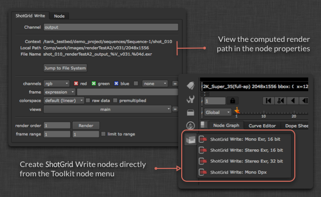

# Nuke Write Node

The Nuke Write Node App provides a custom  Write node which makes it easy to standardise the location where images are rendered to.  It can be configured for each environment.  In addition to the path, the configuration will also determine the render format to be used.

## General Use

In order to use the  Write Node, save your script as a Toolkit work file first and then create a new node via the Nuke menu. This will create a node which looks similar to a normal write node:



Rather than entering a path by hand, you just specify an output name and Toolkit will then compute the rest of the path automatically. You can see the computed path in the UI and open up the location on disk by clicking the *Show in File System* button. The location where the renders are written to depends on the Toolkit configuration.

The renders will be versioned and the version number will always follow the current nuke script version which will be incremented automatically when you publish using Multi Publish.

## Resetting the render path

The Write Node will cache the current path so that it is still valid if the file is opened outside a Toolkit Work Area.  Occasionally, this can mean that the path becomes out of sync and 'locked'.  If the render path is locked then renders created with this Write Node cannot be published.

To reset a render path, either version-up the scene using the Work-files app's 'Version Up Scene' command or select the Write node individually and in the properties, click **Reset Path**:


## Adding Another Write Node Profile

The  Write Node wraps Nuke's built-in write node, so any format supported by Nuke can be used with the app and additional nodes can be added via configuration.  The simplest way to start is to set up a simple Nuke write node with the parameters you want. For the example, let's imagine you are doing 16-bit tifs with LZW compression. If you look at your Nuke script in a text editor, the write node will look something like this:

```
Write {
    file /Users/ryanmayeda/Desktop/test.%04d.tif
    file_type tiff
    datatype "16 bit"
    compression LZW
    checkHashOnRead false
    name Write1
    xpos -145
    ypos -61
}
```

The text will tell you what the parameter names and values you need are. In this case it's `datatype` and `compression`. Next, go into your environment configuration (for example: `/path/to/pipeline/config/env/shot_step.yml`) and find the area where the `tk-nuke-writenode` app is configured.  Add another Write Node, with these two parameters in the `settings`:

```yaml
tk-nuke-writenode:
  location: {name: tk-nuke-writenode, type: app_store, version: v0.1.6}
  template_script_work: nuke_shot_work
  ...
  write_nodes:
  - file_type: exr
    ...
  - file_type: dpx
    ...
  - file_type: tiff
    name: Mono Tif
    publish_template: nuke_shot_render_pub_mono_tif
    render_template: nuke_shot_render_mono_tif
    proxy_publish_template: null
    proxy_render_template: null
    settings: {datatype: 16 bit, compression: LZW}
    tank_type: Rendered Image
    tile_color: []
    promote_write_knobs: []
```

The updated configuration will then result in the additional  Write Node appearing in Nuke:


__Note:__ Be sure to add any new templates (e.g. nuke_shot_render_mono_tif) to your `templates.yml` file which can be found in your project's configuration (`<configuration root>/config/core/templates.yml`).

Another example, showing how to add a  Write Node that outputs to JPEG with 0.5 compression and a 4:2:2 sub-sampling is shown below. This profile also makes use of the "promote_write_knobs" option to promote the jpeg quality knob to the gizmo's user interface. This allows the profile to set the default value for quality, but also provide the user the slider to alter that setting themselves:

```yaml
tk-nuke-writenode:
  write_nodes:
    - file_type: jpeg
      name: Compressed JPEG
      publish_template: nuke_shot_render_pub_jpeg
      render_template: nuke_shot_render_jpeg
      proxy_publish_template: null
      proxy_render_template: null
      settings: {_jpeg_quality: 0.5, _jpeg_sub_sampling: "4:2:2"}
      tank_type: Rendered Image
      tile_color: []
      promote_write_knobs: [_jpeg_quality]
```

### Promoting Write Knobs

As shown in the profile example above, knobs from the encapsulated write node can be promoted to become visible in the  Write Node's properties panel. The promoted write knobs are defined as part of a profile and are identified by knob name. Multiple knobs may be promoted.

## Render Farm Integration

It's common for studios to use a render farm that runs job management tools such as [Deadline](https://deadline.thinkboxsoftware.com/),  which typically launch Nuke directly when rendering. Because these tools do not launch Nuke in a -aware way (e.g., via Desktop or the `tank` command), the  write node does not have the information it needs to run. We offer a couple options to get around this limitation.

### Convert  write nodes to standard Nuke write nodes

A simple solution is to convert the  write nodes to regular Nuke write nodes before sending the script to be rendered. There are two options 1. you can enable and use the convert menu options, 2. you can use the API convert methods on the app.

#### Enabling the convert menu options

There is a configuration option called `show_convert_actions` that can be added to the app's settings in the environment yml files. When you add the setting `show_convert_actions: True`, the *Convert SG Write Nodes to Write Nodes...* and *Convert Write Nodes back to SG format...* menu options become available.


However if you have any  Write node profiles defined that promote write knobs, then these menu options will be hidden even if the `show_convert_actions` is set to `True`. This is because at present the convert back functionality does not support promoted knobs.

#### Using the API to Convert

There is a `convert_to_write_nodes()` method that performs this conversion available on the `tk-nuke-writenode` app.

To convert all  write nodes in a script to regular Nuke write nodes, run the following code inside Nuke:

```python
import sgtk
eng = sgtk.platform.current_engine()
app = eng.apps["tk-nuke-writenode"]
if app:
    app.convert_to_write_nodes() 
```

This will remove the  write nodes from the scene, so our suggested workflow is that you make a copy of the script to be rendered, perform the conversions on the copy, and submit the copy to the farm. The scene no longer has any Toolkit references and thus Toolkit is not required when the nuke script opened on the render farm.

**Note:** There is a corresponding `convert_from_write_nodes()` method available, but to ensure data integrity, we recommend that it only be used for debugging and not as part of your pipeline. 

### Bootstrap the  Pipeline Toolkit engine using init.py

Nuke will run any `init.py` scripts found in its plugin path. This option consists of adding code to `init.py` that will perform a minimal bootstrap of the `tk-nuke` engine, so that  write nodes behave as expected on the render farm.

There are a few steps to this workflow: First, a “pre-flight” submission script that runs in a -aware Nuke session gets data that will be used to set the environment for your farm job. Next, additional environment variables used to authenticate the  session on the render farm are set by render farm administrators. Finally, an `init.py` with the  bootstrap code is placed in a location where the Nuke session on the render farm will detect and run it, bootstrapping the `tk-nuke` engine within the session, and allowing the  write nodes to function properly.

#### 1. Pre-flight submission script

This approach assumes that artists are submitting farm jobs within a -aware session of Nuke. At submission time, the following code should run. It pulls environment information like Toolkit context, Pipeline Configuration URI, Toolkit Core API location, etc. from the current Nuke session to populate a dictionary that will be passed to the render job, where it will be used to set environment variables.

```python
# Populating environment variables from running Nuke:
# http://developer.shotgridsoftware.com/tk-core/platform.html#sgtk.platform.create_engine_launcher
current_engine = sgtk.platform.current_engine()
launcher = sgtk.platform.create_engine_launcher(
     current_engine.sgtk,
     current_engine.context,
     current_engine.name
)

# Get a dictionary with the following keys:
# SHOTGUN_SITE: The  site url
# SHOTGUN_ENTITY_TYPE: The  Entity type, e.g. Shot
# SHOTGUN_ENTITY_ID: The  Entity id, e.g. 1234
environment = launcher.get_standard_plugin_environment()

# Get the current pipeline config descriptor
environment["SHOTGUN_CONFIG_URI"] = os.path.join(current_engine.sgtk.configuration_descriptor.get_uri(),"config")

# Get the current tk-core installation path
environment["SHOTGUN_SGTK_MODULE_PATH"] = sgtk.get_sgtk_module_path()
```

Once you’ve gathered this information, you can pass it to your render submission tool. This process will vary depending on the render farm management system you’re using. Consult your farm management system documentation for more information on how to write render submission scripts.

#### 2.  authentication

The bootstrap API’s ToolkitManager requires a script user in order to initialize. In our example, we’re assuming that your site name, script user, and script key exist as environment variables on the farm machine. Typically this is managed by the render farm administrator. Here are the environment variable names our code is expecting, with sample values:

```
SHOTGUN_SITE = “https://mysitename.shotgunstudio.com”
SHOTGUN_FARM_SCRIPT_USER = “sg_api_user”
SHOTGUN_FARM_SCRIPT_KEY = “xxxxxxxxxxxxxxxxxxxxxxxxxxxxxxxxxxxxxxxxxxxxxxxxxxxxxxx”
```

For more information on authentication, see our [developer documentation](http://developer.shotgridsoftware.com/tk-core/authentication.html).

**A note on securing your script user:** It’s good practice to lock down the script user you use on the farm so that it doesn’t have admin-level permissions. [You can learn more about API user permissions here.](https://support.shotgunsoftware.com/hc/en-us/articles/219376228-API-user-permission-groups)

#### 3. The init.py script

At this point, Toolkit environment data is being passed from the render submission tool, and authentication data is in environment variables on the render farm machine. The final piece to bootstrapping Toolkit within your render job is to place the following example `init.py` code in Nuke’s plugin path, so that Nuke will launch it at startup time. (See [the Foundry’s documentation on startup scripts](http://docs.thefoundry.co.uk/nuke/63/pythondevguide/startup.html) for more details.)

```python
# This script shows how a Toolkit as a plugin approach could be used to bootstrap
# Toolkit in Nuke on the render farm.
# http://developer.shotgridsoftware.com/tk-core/bootstrap.html#bootstrapping-toolkit

import sys
import os

# If your render nodes can access the same tk-core install location as
# artist workstations, retrieve its path from the environment and ensure
# it is in the PYTHONPATH
TK_CORE_PATH = os.environ["SHOTGUN_SGTK_MODULE_PATH"]
if TK_CORE_PATH not in sys.path:
    sys.path.append(TK_CORE_PATH)

# If your render nodes don’t have access to the Toolkit Core API in the same filesystem location as artist workstations, you have to make sure that it is available in the PYTHONPATH, so that render nodes can import it. An easy way 
# to install tk-core in a centralized location is with pip. You can read more 
# about it here:
# http://developer.shotgridsoftware.com/tk-core/bootstrap.html#installing-the-sgtk-module-using-pip

import sgtk

# Authenticate using a pre-defined script user.
sa = sgtk.authentication.ShotgunAuthenticator()

# Here we retrieve credentials from environment variables, assuming a script user
# will be used when rendering. This should be typically be handled by your render
# farm administrators.
SG_SITE_URL = os.environ["SHOTGUN_SITE"]
SG_SCRIPT_USER = os.environ["SHOTGUN_FARM_SCRIPT_USER"]
SG_SCRIPT_KEY = os.environ["SHOTGUN_FARM_SCRIPT_KEY"]
user = sa.create_script_user(
    api_script=SG_SCRIPT_USER,
    api_key=SG_SCRIPT_KEY,
    host=SG_SITE_URL
)

# Start up a Toolkit Manager with our script user
mgr = sgtk.bootstrap.ToolkitManager(sg_user=user)

# Set the base pipeline configuration from the environment variable:
mgr.base_configuration = os.environ["SHOTGUN_CONFIG_URI"]

# Disable  lookup to ensure that we are getting the Pipeline 
# Configuration defined in SHOTGUN_CONFIG_URI, and not a dev or override
# Pipeline Configuration defined in .
mgr.do_shotgun_config_lookup = False

# Set a plugin id to indicate to the bootstrap that we are starting
# up a standard Nuke integration
mgr.plugin_id = "basic.nuke"

# Retrieve the Toolkit context from environment variables:
# SHOTGUN_SITE: The  site url
# SHOTGUN_ENTITY_TYPE: The  Entity type, e.g. Shot
# SHOTGUN_ENTITY_ID: The  Entity id, e.g. 1234
sg_entity = mgr.get_entity_from_environment()

# Now start up the Nuke engine for a given  Entity
nuke_engine = mgr.bootstrap_engine("tk-nuke", entity=sg_entity)
```

You may need to extend this if your configuration is more complex than this example or if you are passing a Python script to the command line using the `-t` flag instead of a nuke (`.nk`) script.

#### Deadline-specific steps

Deadline can copy Nuke scripts to a temporary location when rendering. This will cause problems with Toolkit as the files will no longer be in a disk location that it recognizes. To disable this behavior and load the scripts from their original location:

1. In Deadline, navigate to Tools > Configure Plugin (In the super user mode) 
2. Disable the 'Enable Path Mapping' option

## Technical Details

The following API methods are available on the App:

### get_write_nodes()

Return a list of all  Write Nodes in the current scene.

`list` app.get_write_nodes()

**Parameters & Return Value** 

* **Returns:** `list` - a list of Toolkit Write nodes found in the scene

**Example**

```python
>>> import sgtk
>>> eng = sgtk.platform.current_engine()
>>> app = eng.apps["tk-nuke-writenode"]
>>> nodes = app.get_write_nodes()
```

### get_node_name()

Return the name of the specified Write Node.

`string` get_node_name(`node` node)

**Parameters & Return Value** 

* `node` **node** - the Write Node to query
* **Returns:** `string` - the name of the node.

**Example**
```python
>>> import sgtk
>>> eng = sgtk.platform.current_engine()
>>> app = eng.apps["tk-nuke-writenode"]
>>> nodes = app.get_write_nodes()
>>> app.get_node_name(nodes[0])
```

### get_node_profile_name()

Get the name of the configuration profile used by the specified Write node.

`string` get_node_profile_name(`node` node)

**Parameters & Return Value** 

* `node` **node** - the Write Node to query
* **Returns:** `string` - the profile name for this Write Node as defined by the configuration

**Example**
```python
>>> import sgtk
>>> eng = sgtk.platform.current_engine()
>>> app = eng.apps["tk-nuke-writenode"]
>>> nodes = app.get_write_nodes()
>>> app.get_node_profile_name(nodes[0])
```

### get_node_render_path()

Get the path that the specified Write node will render images to.

`string` get_node_render_path(`node` node)

**Parameters & Return Value** 

* `node` **node** - the Write Node to query
* **Returns:** `string` - the render path for this node

**Example**
```python
>>> import sgtk
>>> eng = sgtk.platform.current_engine()
>>> app = eng.apps["tk-nuke-writenode"]
>>> nodes = app.get_write_nodes()
>>> app.get_node_render_path(nodes[0]) 
```

### get_node_render_files()

Get a list of all image files that have been rendered for the specified Write Node.

`list` get_node_render_files(`node` node)

**Parameters & Return Value** 

* `node` **node** - the Write Node to query
* **Returns:** `list` - a list of the image files rendered by this Write node.

**Example**
```python
>>> import sgtk
>>> eng = sgtk.platform.current_engine()
>>> app = eng.apps["tk-nuke-writenode"]
>>> nodes = app.get_write_nodes()
>>> app.get_node_render_files(nodes[0])
```

### get_node_render_template()

Get the template that determines where rendered images will be written to for the specified Write Node as defined in the configuration.

`template` get_node_render_template(`node` node)

**Parameters & Return Value** 

* `node` **node** - the Write Node to query
* **Returns:** `template` - the render template this node is configured to use.

**Example**
```python
>>> import sgtk
>>> eng = sgtk.platform.current_engine()
>>> app = eng.apps["tk-nuke-writenode"]
>>> nodes = app.get_write_nodes()
>>> app.get_node_render_template(nodes[0]) 
```

### get_node_publish_template()

Get the template that determines where rendered images will be published to for the specified Write Node as defined in the configuration.

`template` get_node_publish_template(`node` node)

**Parameters & Return Value** 

* `node` **node** - the Write Node to query
* **Returns:** `template` - the publish template this node is configured to use.

**Example**
```python
>>> import sgtk
>>> eng = sgtk.platform.current_engine()
>>> app = eng.apps["tk-nuke-writenode"]
>>> nodes = app.get_write_nodes()
>>> app.get_node_publish_template(nodes[0]) 
```

### get_node_proxy_render_path()

Get the path that the specified Write node will render proxy images to.

`string` get_node_proxy_render_path(`node` node)

**Parameters & Return Value** 

* `node` **node** - the Write Node to query
* **Returns:** `string` - the proxy render path for this node

**Example**
```python
>>> import sgtk
>>> eng = sgtk.platform.current_engine()
>>> app = eng.apps["tk-nuke-writenode"]
>>> nodes = app.get_write_nodes()
>>> app.get_node_proxy_render_path(nodes[0]) 
```

### get_node_proxy_render_files()

Get a list of all proxy image files that have been rendered for the specified Write Node.

`list` get_node_proxy_render_files(`node` node)

**Parameters & Return Value** 

* `node` **node** - the Write Node to query
* **Returns:** `list` - a list of the proxy image files rendered by this Write node.

**Example**
```python
>>> import sgtk
>>> eng = sgtk.platform.current_engine()
>>> app = eng.apps["tk-nuke-writenode"]
>>> nodes = app.get_write_nodes()
>>> app.get_node_proxy_render_files(nodes[0])
```

### get_node_proxy_render_template()

Get the template that determines where proxy rendered images will be written to for the specified Write Node as defined in the configuration.

If there is no proxy render template configured for the specified node then this will return the regular render template instead.

`template` get_node_proxy_render_template(`node` node)

**Parameters & Return Value** 

* `node` **node** - the Write Node to query
* **Returns:** `template` - the proxy render template this node is configured to use.

**Example**
```python
>>> import sgtk
>>> eng = sgtk.platform.current_engine()
>>> app = eng.apps["tk-nuke-writenode"]
>>> nodes = app.get_write_nodes()
>>> app.get_node_proxy_render_template(nodes[0]) 
```

### get_node_proxy_publish_template()

Get the template that determines where proxy rendered images will be published to for the specified Write Node as defined in the configuration.

If there is no proxy publish template configured for the specified node then this will return the regular publish template instead.

`template` get_node_proxy_publish_template(`node` node)

**Parameters & Return Value** 

* `node` **node** - the Write Node to query
* **Returns:** `template` - the proxy publish template this node is configured to use.

**Example**
```python
>>> import sgtk
>>> eng = sgtk.platform.current_engine()
>>> app = eng.apps["tk-nuke-writenode"]
>>> nodes = app.get_write_nodes()
>>> app.get_node_proxy_publish_template(nodes[0]) 
```

### get_node_published_file_type()

Get the Published File Type to be used when Published files are created for images rendered by the specified Write node as defined in the configuration.

`string` get_node_published_file_type(`node` node)

**Parameters & Return Value** 

* `node` **node** - the Write Node to query
* **Returns:** `string` - the Published File Type this node is configured to use

**Example**
```python
>>> import sgtk
>>> eng = sgtk.platform.current_engine()
>>> app = eng.apps["tk-nuke-writenode"]
>>> nodes = app.get_write_nodes()
>>> app.get_node_published_file_type(nodes[0]) 
```

### generate_node_thumbnail()

Generate a thumbnail for the specified Write Node.  This will render a frame from the middle of the sequence with a maximum size of 800x800px to a temp file (.png).  It is the responsibility of the caller to clean up this file when it is no longer needed.

`string` generate_node_thumbnail(`node` node)

**Parameters & Return Value** 

* `node` **node** - the Write Node to query
* **Returns:** `string` - the path to the rendered thumbnail image on disk

**Example**
```python
>>> import sgtk
>>> eng = sgtk.platform.current_engine()
>>> app = eng.apps["tk-nuke-writenode"]
>>> nodes = app.get_write_nodes()
>>> app.generate_node_thumbnail(nodes[0]) 
```

### reset_node_render_path()

Reset the render path for the specified Write Node to match the current script.

`None` reset_node_render_path(`node` node)

**Parameters & Return Value** 

* `node` **node** - the Write Node to query
* **Returns:** `None` - no value is returned

**Example**
```python
>>> import sgtk
>>> eng = sgtk.platform.current_engine()
>>> app = eng.apps["tk-nuke-writenode"]
>>> nodes = app.get_write_nodes()
>>> app.reset_node_render_path(nodes[0]) 
```

### is_node_render_path_locked()

Determine if the render path for the specified Write node is locked or not.

`bool` is_node_render_path_locked(`node` node)

**Parameters & Return Value** 

* `node` **node** - the Write Node to query
* **Returns:** `bool` - True if the render path is locked, otherwise False

**Example**
```python
>>> import sgtk
>>> eng = sgtk.platform.current_engine()
>>> app = eng.apps["tk-nuke-writenode"]
>>> nodes = app.get_write_nodes()
>>> app.is_node_render_path_locked(nodes[0]) 
```

### convert_to_write_nodes()

Convert all  write nodes found in the current Script to regular Nuke Write nodes.  Additional toolkit information will be stored on user knobs named 'tk_*'

`None` convert_to_write_nodes()

**Example**
```python
>>> import sgtk
>>> eng = sgtk.platform.current_engine()
>>> app = eng.apps["tk-nuke-writenode"]
>>> app.convert_to_write_nodes() 
```

### convert_from_write_nodes()

Convert all regular Nuke Write nodes that have previously been converted from  Write nodes, back into  Write nodes.

`None` convert_from_write_nodes()

**Example**
```python
>>> import sgtk
>>> eng = sgtk.platform.current_engine()
>>> app = eng.apps["tk-nuke-writenode"]
>>> app.convert_from_write_nodes() 
```

### process_placeholder_nodes()

Convert any placeholder nodes into full  Write Nodes.  This is primarily used to convert placeholder nodes created by the Hiero Toolkit script exporter when a script is first opened in Nuke.

`None` process_placeholder_nodes()

**Example**
```python
>>> import sgtk
>>> eng = sgtk.platform.current_engine()
>>> app = eng.apps["tk-nuke-writenode"]
>>> app.process_placeholder_nodes() 
```
