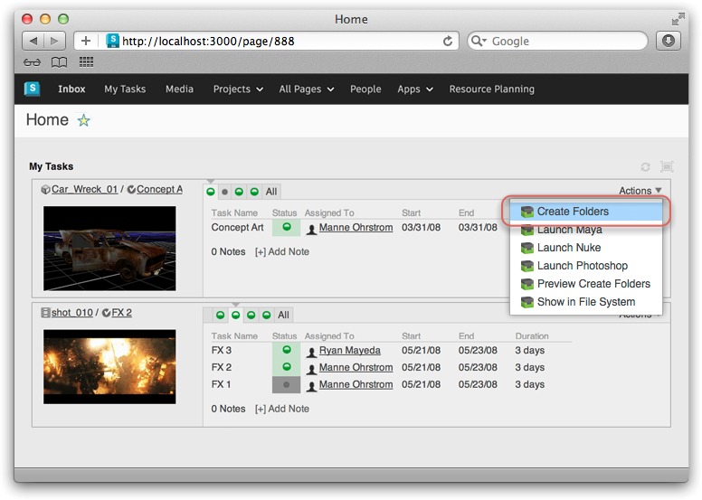
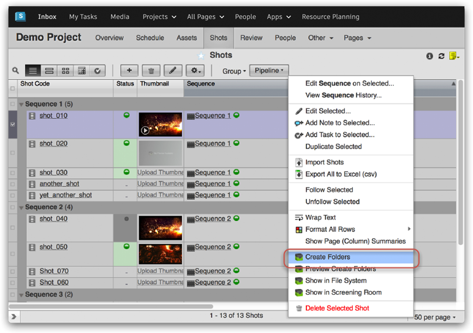

# ShotGrid Folders

 Toolkit has a built in system that handles the creation of standardized directory structures based on a configuration. This makes it easy to quickly produce consistent file system layouts for multiple shots.

This App hooks up the file system creation API methods in the Sgtk Core API with . This makes folder creation an easy task; just select a collection of Shots or assets and click the Create Folders action.

## How it works

Simply select one or more Tasks, Shots or other entities (depending on the configuration). Now select create folders from the action menu. Once the process has completed, you will get a report of how many folders were created.

