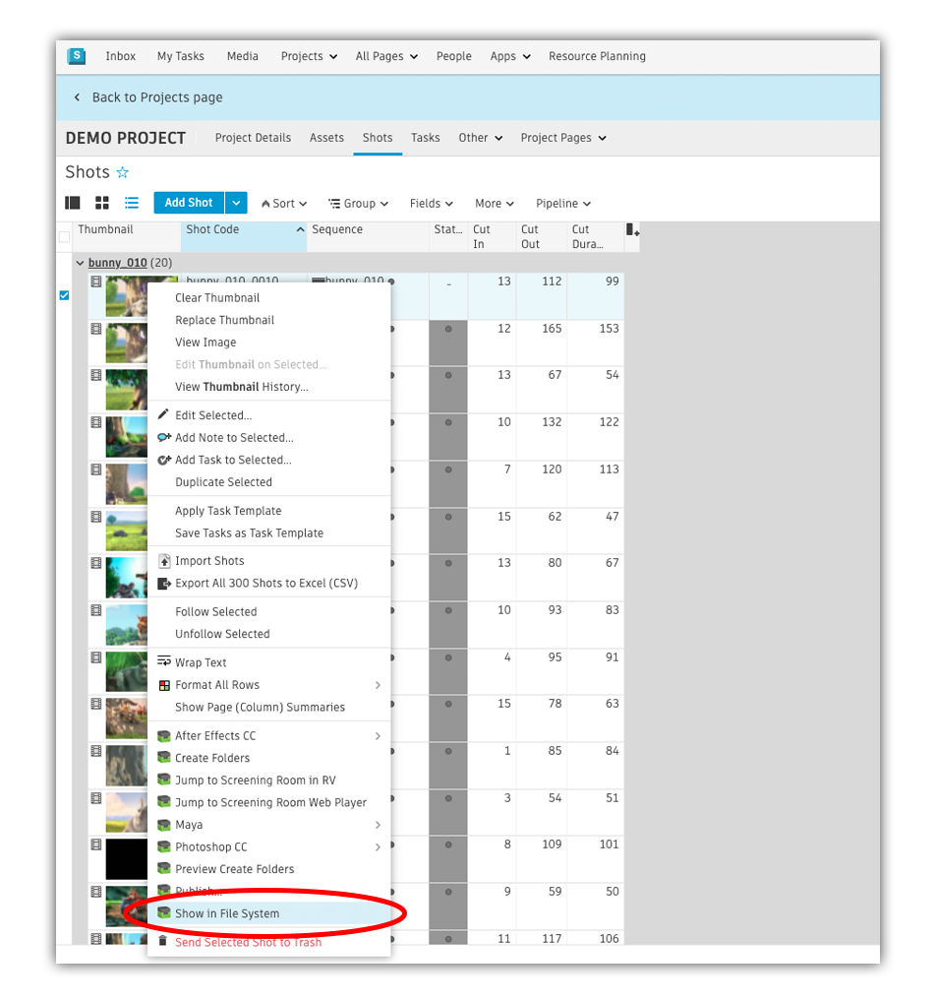

The Launch Folder App is a  utility which allows you to jump from  into the File System.

# How it works
The Launch Folder App allows you to jump from  into the File System. You can register it for  entity types such as Shots, Assets and Sequences. Once activated, it will appear on the Action menu:

You can select a single or multiple entries in  and when you click the menu action a standard file browser will be launched (Explorer on Windows, Finder on Mac etc.)

    
