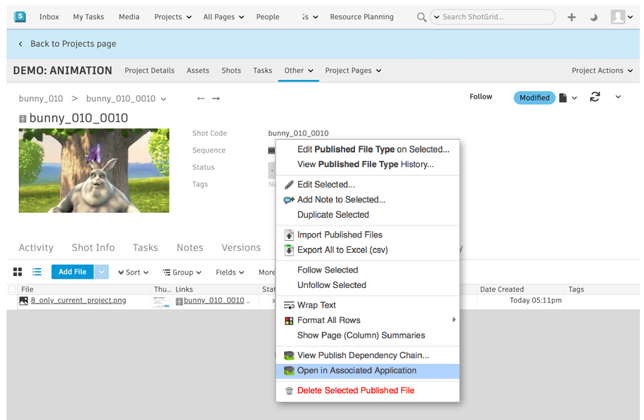

This app adds an "Open in Associated Application" action to the Published File entity in .
This makes it easy to open up an already published file: Just navigate to that file, right click on 
it and select the action.

The app makes it easy to configure different app launch sequences for different files -- all this
is done inside a hook. It also dispatches image sequences to a viewer (such as RV). Files not 
recognized by the hook will be dispatched to the os-level app.