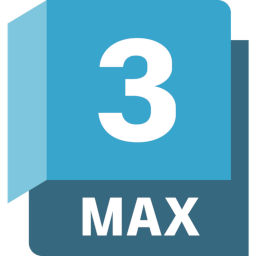
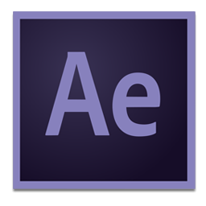
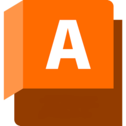
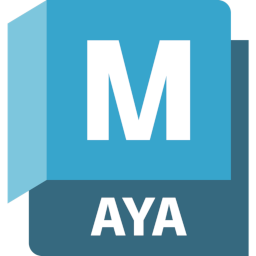

# Toolkit Engine Supported Versions

Here is a list of the minimum supported application versions on engines available for the Toolkit platform.

----------

| Integration | Engine | Supported Versions |
|:-----------:|:------:| ----------- |
| |  **tk-3dsmax**  |    |
| | **tk-aftereffects** |   |
| | **tk-alias** |   |
| | **tk-flame** |   |
| | **tk-houdini** |   |
| | **tk-mari** |   |
| | **tk-maya** |   |
| | **tk-motionbuilder** |   |
| | **tk-nuke** |   |
| | **tk-photoshopcc** |   |
| | **tk-vred** |   |