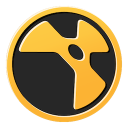

# Toolkit Engines Supported Versions

Here is a list of the minimum supported application versions on engines available for the Toolkit platform.

----------

| Integration | Engine | Minimum Supported Version |
|:-----------:|:------:| ----------- |
| |  **tk-3dsmax**  | 2017+   |
| | **tk-aftereffects** |  2017-2020 |
| | **tk-alias** |  2019 - 2022 |
| | **tk-flame** |  2016+ |
| | **tk-houdini** |  14.0 - 18.5 |
| | **tk-mari** |  2.6 - 4.6 |
| | **tk-maya** |   |
| | **tk-motionbuilder** |  2016-2022 |
| | **tk-nuke** |  7.0 - 13.0 |
| | **tk-photoshopcc** |  2015.5 - 2020 |
| | **tk-shell** | - |
| | **tk-shotgun** | - |
| | **tk-vred** |  2020.3-2022 |