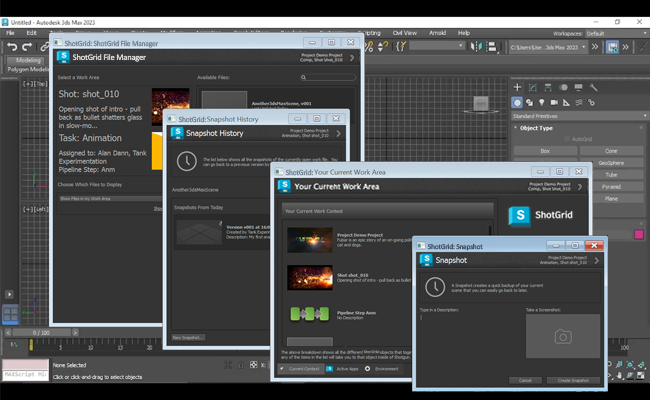

# 3dsMax Plus

The  engine for 3ds Max Plus provides a bridge between the 3ds Max application and the  Pipeline Toolkit. The engine supports PySide and all Multi apps, meaning that you can run our standard apps inside of 3ds Max - the same apps that also work in Maya, Nuke etc. This engine uses the 3ds Max Plus python API.




## Supported Application Versions

This item has been tested and is known to be working on the following application versions: 



## Documenation

This engine connects  Pipeline Toolkit (Sgtk) and 3D studio Max via Max Plus' Python support.


## Installation and Updates

### Adding this Engine to the  Pipeline Toolkit

f you want to add this engine to Project XYZ, and an environment named asset, execute the following command:

```
> tank Project XYZ install_engine asset tk-3dsmaxplus
```

### Updating to the latest version

If you already have this item installed in a project and you want to get the latest version, you can run the update command. You can either navigate to the tank command that comes with that specific project, and run it there:

```
> cd /my_tank_configs/project_xyz
> ./tank updates
```

Alternatively, you can run your studio tank command and specify the project name to tell it which project to run the update check for:

```
> tank Project XYZ updates
```


## Collaboration and Evolution

If you have access to the  Pipeline Toolkit, you also have access to the source code for all apps, engines and frameworks in Github where we store and manage them. Feel free to evolve these items; use them as a base for further independent development, make changes (and submit pull requests back to us!) or simply tinker with them to see how they have been built and how the toolkit works. You can access this code repository at https://github.com/shotgunsoftware/tk-3dsmaxplus.

## Special Requirements

You need  Pipeline Toolkit Core API version v0.19.18 or higher to use this.
