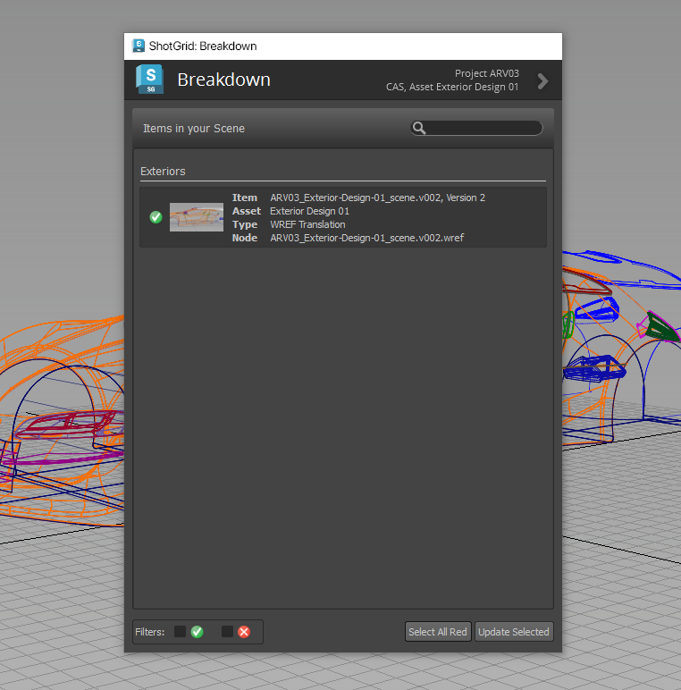

# Alias

The  engine for Alias contains a standard platform for integrating  Apps into Alias. It is lightweight and straight forward and adds a  menu to the Alias menu.

## Supported Application Versions

This item has been tested and is known to be working on the following application versions: 



Please note that it is perfectly possible, even likely, that it will work with more recent releases, however it has not yet been formally tested with these versions.

## Python Version Support

> **Important:** With the release of v2.1.5 of the Alias ShotGrid toolkit engine, we will stop supporting Python v2.7.x. [Please download v1.7.3 (or newer) of ShotGrid Desktop to ensure Python 3 is used as the default](https://community.shotgridsoftware.com/t/a-new-version-of-shotgrid-desktop-has-been-released/13877/14).

## Older Versions

The Alias toolkit engine uses the Python interpreter shipped with ShotGrid Desktop, or a _locally installed interpreter (see note.)_

|tk-alias Engine Version | ShotGrid Desktop Application Version | ShotGrid Desktop Engine Version | Python Interpreter Version |
| ---------------------- |--------------------------------------|---------------------------------| -------------------------- |
|  v2.0.5 or older       | v1.5.8 or older                      | v2.4.14 or older                | v3.7.x                     |
|  v2.0.6 to v2.1.4      | v1.6.0 to v1.7.2                     | v2.5.0 to v2.6.2                | v3.7.x            |
|  v2.1.5 or newer       | v1.7.3 or newer                      | v2.6.3 or newer                 | v3.7.x                     |

Tested locally installed Python Interpreters: v3.7.4

***
### Notes

A locally installed interpreter may lead to unexpected behaviour. Please [contact support](https://knowledge.autodesk.com/contact-support) if you would like to use this in your studio environment.

## Information for App Developers
    
### PySide

The  engine for Alias uses a PySide installation shipped with the  Desktop and will activate this whenever this is necessary. 

### Alias Project Management

Whenever the  engine for Alias starts, it will set the Alias Project to point at a location defined in the settings for this engine. This means that the Project may also change when a new file is opened. The details relating to how the Alias project is set based on a file can be configured in the configuration file, using the template system.

***

## Working with tk-alias

This  integration supports the Alias application family (Concept, Surface, and AutoStudio).

When Alias opens, a  menu (the Alias engine) is added to the menu bar.

### File Open and Save

Use the My Tasks and Assets tabs to see all your assigned tasks and browse for assets. To the right, use these tabs to view all files, working or published files associated with what is selected to the left.

### Publish

Opens the Publish dialog for publishing the file to , which can then be used by artists downstream. For more information, see [Publishing in Alias](https://github.com/shotgunsoftware/tk-alias/wiki/Publishing). 

### Loader

Opens the Content Loader app, allowing you to load data into Alias. For more information see [Loading in Alias](https://github.com/shotgunsoftware/tk-alias/wiki/Loading)

### Scene Breakdown

Opens the Breakdown dialog, which displays a list of referenced (WREF References) content, along with what in the scene is out-of-date or using an alternate version of the PublishedFile. For more information see [Scene Breakdown in Alias](https://github.com/shotgunsoftware/tk-alias/wiki/Scene-Breakdown)

