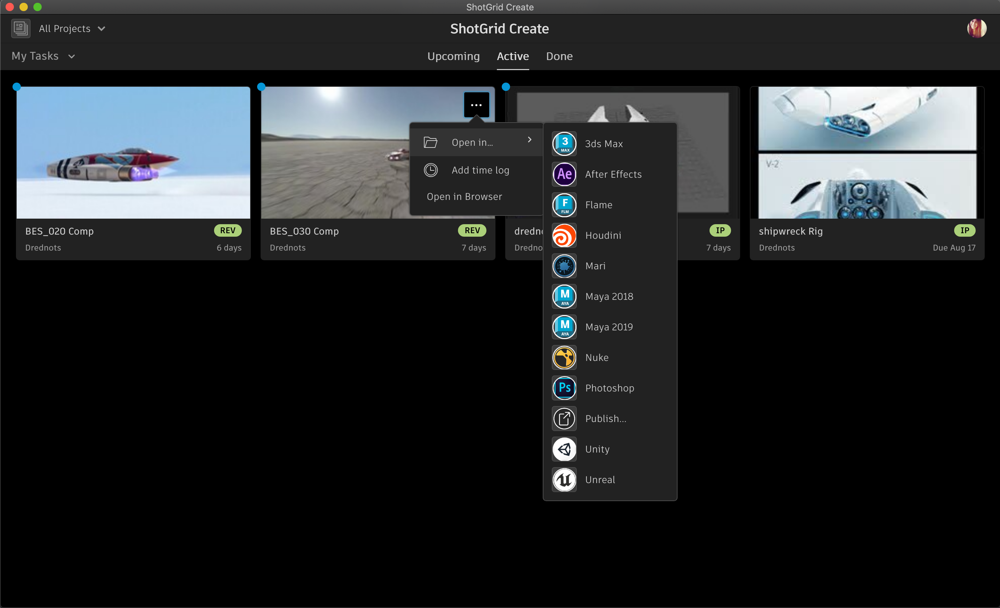
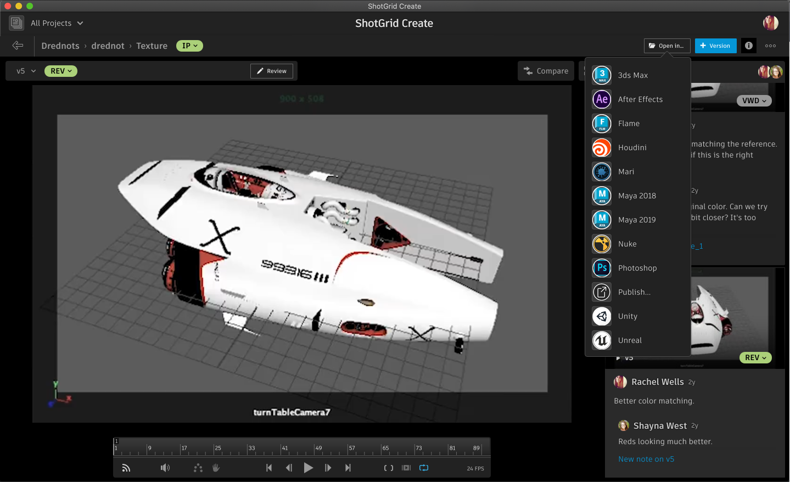

#  Create

The Desktop2 Engine is the engine which runs inside of the [ Create](https://help.autodesk.com/view/SGSUB/ENU/?guid=SG_Supervisor_Artist_sa_create_sa_intro_create_html) Application. It handles DCC launching from  Create, as well as from the  web application via browser integration.

The tk-desktop2 engine powers Toolkit's integration with  Create. The  Create provides support for features that users of Toolkit are familiar with, including [DCC launching](https://help.autodesk.com/view/SGSUB/ENU/?guid=SG_Supervisor_Artist_sa_create_sa_create_artists_html#launching-your-creative-apps).





## Installation and Updates

### Adding this Engine to the  Pipeline Toolkit

If you want to add this engine to Project XYZ, and an environment named asset, execute the following command:

```
> tank Project XYZ install_engine asset tk-desktop2
Updating to the latest version
```

If you already have this item installed in a project and you want to get the latest version, you can run the `update` command. You can either navigate to the tank command that comes with that specific project, and run it there:

```
> cd /my_tank_configs/project_xyz
> ./tank updates
```

Alternatively, you can run your studio `tank` command and specify the project name to tell it which project to run the update check for:

```
> tank Project XYZ updates
```

## Collaboration and Evolution
	
If you have access to the  Pipeline Toolkit, you also have access to the source code for all apps, engines and frameworks in Github where we store and manage them. Feel free to evolve these items; use them as a base for further independent development, make changes (and submit pull requests back to us!) or simply tinker with them to see how they have been built and how the toolkit works. You can access this code repository at https://github.com/shotgunsoftware/tk-desktop2.

## Special Requirements

You need  Pipeline Toolkit Core API version v0.19.1 or higher to use this.