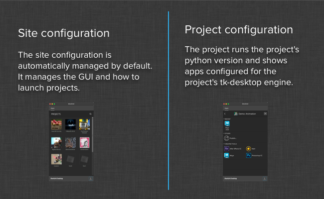

# Desktop

The tk-desktop engine is an application to let you easily run your Toolkit apps. It is a system tray based window that makes it easy to get started with Toolkit, setup Projects for Toolkit, and access your Projects' pipeline.

## Site configuration and Project configuration



When you launch the desktop application, it will startup the tk-desktop engine for your site configuration.  This configuration is usually automatically managed, although it is possible to disable that behavior and take control over what is in that environment.

One of the fundamental principles of Toolkit is that projects can be completely isolated from each other.  This is usually done to make sure that changes made to one project cannot adversely effect another project (possibly nearing delivery). In order to offer this project isolation, the desktop engine makes sure that whenever you are looking at the commands for a particular project, you will run them in a separate python interpreter that has been initialized just for that project.

When you click on a project, a python interpreter is launched in the background. This python interpreter is the one the project has been configured to use and on startup will initialize the tk-desktop for that project.  That instance of the engine will communicate back to the GUI what commands it can launch.

When you click on a command, that background python process is responsible for launching the command.  This makes it possible (for example) to have one project running python 2.6 while testing python 2.7 on another project.

## Registering custom panels

Toolkit apps which have [panel based UI](http://developer.shotgridsoftware.com/tk-core/platform.html#sgtk.platform.Engine.show_panel) will be automatically docked in tabs inside of Desktop when they execute. 

If you have a panel based app such as the  Panel, and want it to appear as a tab in  Desktop, just configure it to run at startup. When Desktop starts up in its site context mode (where it displays all projects), it will launch all items registered to auto start. If any of these items are panels, these will get docked. Items will be processed in the order they are defined in the configuration and this will dictate the tab order.

For example, if you wanted the  Panel to show as a tab in  Desktop, add the following configuration for your site level environment:

```yaml
tk-desktop:
  apps:
    tk-multi-shotgunpanel:
      actions_hook: ...
      action_mappings: ...
      location: ...
  location: ...
  run_at_startup:
  - {app_instance: '', name: Apps}
  - {app_instance: tk-multi-shotgunpanel, name: ''}
```

Please note that the special `Apps` entry controls where (in the tab order) the default `Apps` tab should appear.

