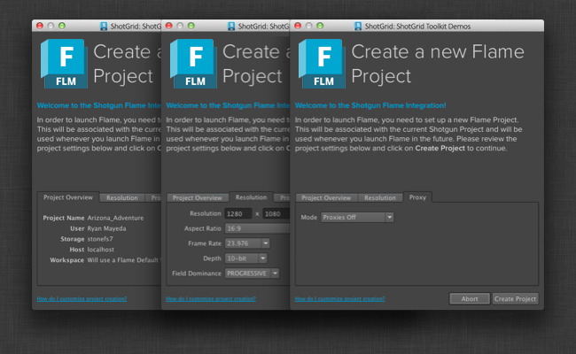

# Flame

## Installation

The  engine for Flame relies on new integration hooks that were added in Flame 2015 Extension 2. This version of Flame _must_ be used in order for the engine to function. For more info on Flame 2015 Extension 2 (including how to get it), reach out to [Flame Support](http://knowledge.autodesk.com/search-result/caas/sfdcarticles/sfdcarticles/Contacting-Autodesk-Flame-or-Smoke-Customer-Support.html).

The simplest way to get started with the  engine for Flame is to set up a new test project with our example pipeline configuration. You can do this by launching the  Desktop, running the Project Setup for a new project and choosing the default Flame configuration (in the default configurations section).

## Flame Project Setup

The  engine for Flame also helps associate the  project with a Flame project, and creates it if need be. This is key to the integration, as it ensures data from Flame gets associated with the right things in . As an added feature, the engine provides functionality for managing the naming conventions of Flame projects as well as the other various settings for the project.

When Flame is launched via  for the first time, a Flame project creation UI will appear that lets the artist edit the usual settings from the standard Flame project creation screen:

But with the  integration, the settings can be pre-populated with pipeline-friendly values, helping artists quickly get the right thing without having to think about it. The defaults can be customized via the `project_setup_hook`, which supports the following options:

`use_project_settings_ui`
If set to `True`, the project creation UI will appear. If `False`, the Flame project will automatically be created based on the rest of the defaults in the hook.

`get_server_hostname`
By default this is set to 'localhost', but it can be overridden if desired.

`get_project_name`
By default this is set to the same value as the  project, but it can be overridden if desired.

`get_volume`
By default this is set to the first available storage, but it can be overridden if desired.

`get_workspace`
By default Flame will create a default workspace according to its standard workspace creation logic, but it can be overridden if desired.

`get_user`
This will try to associate the user logged into the Flame machine with a user in .

`get_project_settings`
This is where the main Flame settings are configured and the hook helps build the Flame project XML stream. The following parameters _must_ be supplied:

- FrameWidth (e.g. `1280`)
- FrameHeight (e.g. `1080`)
- FrameDepth (`16-bit fp`, `12-bit`, `12-bit u`, `10-bit`, `8-bit`)
- FieldDominance (`PROGRESSIVE`, `FIELD_1`, `FIELD_2`)
- AspectRatio (`4:3`, `16:9`, or floating point value as string)

Proxy settings can also be supplied. For more info, see the [Autodesk Wiretap SDK docs](http://usa.autodesk.com/adsk/servlet/index?siteID=123112&id=7478536)!

To view the entire codebase for the project_setup hook, please see our [Github repo for the engine](https://github.com/shotgunsoftware/tk-flame/blob/master/hooks/project_startup.py).
