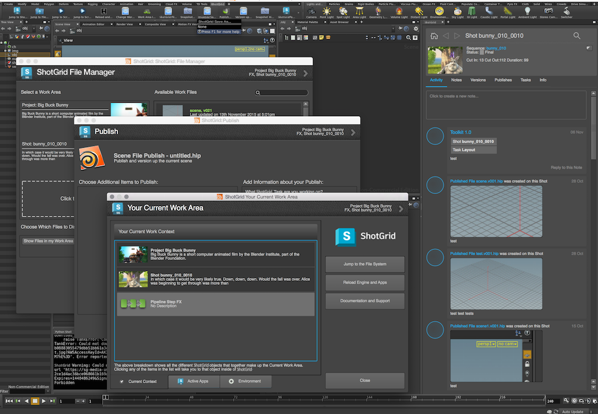
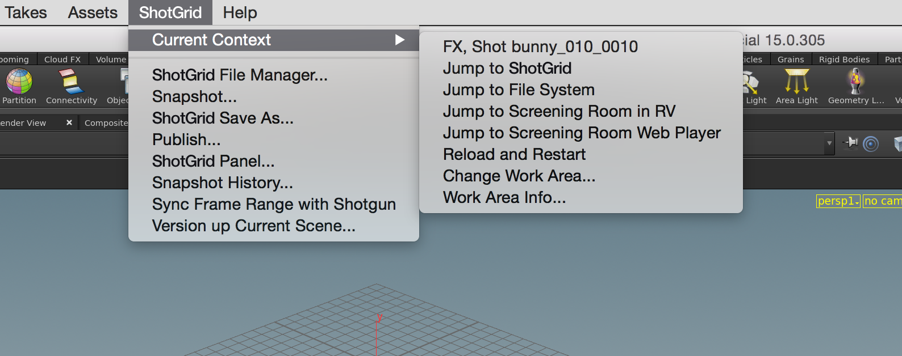

# Houdini

The  Engine for Houdini contains a standard platform for integrating  Apps into Houdini.




# Information for App Developers

## Supported Platforms

The  Engine for Houdini is currently supported on Windows, Linux, and OSX

## Supported Application Versions

This item has been tested and is known to be working on the following application versions: 



## PySide

For older versions of Houdini (13 and older) an external build of PySide is required. On Windows, we have bundled a compatible PySide build that will work with the python that Houdini runs. On Linux, Houdini uses the system python (per http://www.sidefx.com/docs/houdini12.0/hom/) which needs to have PySide or PyQt support.

## Menu loading



A dynamic menu system was introduced by Side Effects as of Houdini 15, so the engine now supports rebuilding of the  menu on context switches. 

In Houdini 14 and older, the  menu in Houdini is generated before Houdini starts and is static throughout the session. Due to this, the toolkit commands registered in the menu will not update on context changes.

##  shelf


Release **v0.2.4** introduced a dynamic  shelf to the engine. The shelf displays any registered app commands as tool buttons. The buttons will be displayed in roughly the same order as the menu commands.

Use the `enable_sg_shelf` setting to turn on the shelf within an environment. If using a version of Houdini (14 or older) that does not support dynamic menus, you may also want to turn off the  menu when using the shelf. This can be done by setting the `enable_sg_menu` setting to `false`.

To enable context switching via the shelf, you'll also need to add entity types to the `sg_entity_types` setting of the `tk-multi-workfiles` app in your engine configuration.

Here's a look at the settings related to the  shelf:

```yaml
tk-houdini:
  apps:
    # ... other app definitions
    tk-multi-workfiles:
       # ... other app settings
       sg_entity_types: [Shot, Asset] # allow context switching to Shots or Assets
       # ... other app settings
  enable_sg_shelf: true
  enable_sg_menu: false
  # ... other engine settings
```

Once you've enabled the  shelf, you need to manually add it to a shelf set inside houdini. 


Once added to a shelf set the  shelf will remain there between houdini sessions and will update dynamically as your  context changes. 

## Panels

As of **v0.2.8** the engine adds support for embedded toolkit panels.

The panel support currently requires Houdini version **15.0.272** or later for proper embedded panels. Registered panels will show up as panes in the pane  menu for supported versions of Houdini.

Older versions of Houdini will display the registered panels as dialogs. SESI may backport some bug fixes to newer builds of Houdini 14. If and when that happens, we will make embedded panels work for those versions as well. 

## Apps with OTLs

The  Engine for Houdini makes it easy to load application supplied OTLs. If you are writing an app which uses OTLs, you can just drop them into a folder called **otls** and the engine will automatically load them into your session:


You can then easily access your nodes via the usual Houdini methods.

**Warning!!** Please note that while the use of OTLs may be convenient, it is typically NOT the right solution if you want to create nodes that persist in a scene. The reason for this is because as soon as you have put an OTL in the scene, you have introduced a dependency between that scene and the OTL code. Not only will you need to load the  Toolkit every time you load the scene, but you also need to carefully manage your code so that any updates to the code does not break old OTLs being used in scenes.

## Startup Debugging via Terminal on OSX

Turning on `debug_logging` for the `tk-houdini` engine on OS X will not send all debug messages to the Terminal. This is because, by default, the [`tk-multi-launchapp`](https://github.com/shotgunsoftware/tk-multi-launchapp) app uses the `open` command to launch executables. This does not spawn a new subprocess from the Terminal, but rather uses OS X's Launch Services to create a new process elsewhere. As a result, the log statements are not shown. Even having a python shell saved in the user's default desktop in houdini does not seem to show debugging statements during startup. After startup, and embedded Python shell will show debug logging statements, but there is a gap in available output during startup. If you need access to debug logging statements during engine startup, you can make 2 changes.

First, change your `houdini_mac` path (temporarily) in your test configuration to point to the executable inside the Houdini app bundle. For example:

```yaml
#houdini_mac: /Applications/Houdini 15.0.272/Houdini Apprentice.app
houdini_mac: /Applications/Houdini\ 15.0.272/Houdini\ Apprentice.app/Contents/MacOS/happrentice
```

Next, you can make a copy of the `tk-multi-launchapp` app's `app_launch` hook in your test configuration's `config/hooks` directory and point to it in your `config/env/includes/app_launchers.yml` file:

```yaml
launch_houdini:
  defer_keyword: ''
  engine: tk-houdini
  extra: {}
  hook_app_launch: app_launch    # <----- use a custom app_launch hook
  hook_before_app_launch: default
  icon: '{target_engine}/icon_256.png'
  linux_args: ''
  linux_path: '@houdini_linux'
  location: {name: tk-multi-launchapp, type: app_store, version: v0.6.6}
  mac_args: ''
  mac_path: '@houdini_mac'
  menu_name: Launch Houdini
  versions: []
  windows_args: ''
  windows_path: '@houdini_windows'
```

Then all you have to do is modify the launch logic to launch the executable directly. As an example, you could keep the old behavior for directories (application bundles) and otherwise execute the command directly. Here's an example: 

```python
        elif system == "darwin":
            # on the mac, the executable paths are normally pointing
            # to the application bundle and not to the binary file
            # embedded in the bundle, meaning that we should use the
            # built-in mac open command to execute it
            if os.path.isdir(app_path):
                cmd = "open -n \"%s\"" % (app_path)
                if app_args:
                    cmd += " --args \"%s\"" % app_args.replace("\"", "\\\"")

            # not a directory, execute directly
            else:
                cmd = "%s %s" % (app_path, app_args.replace("\"", "\\\""))
```

The next time you run `launch_houdini` via `tank` in the Terminal, you should get all the debug output. Once you're done testing, don't forget to revert your path and undo your app launch changes. Happy debugging!
