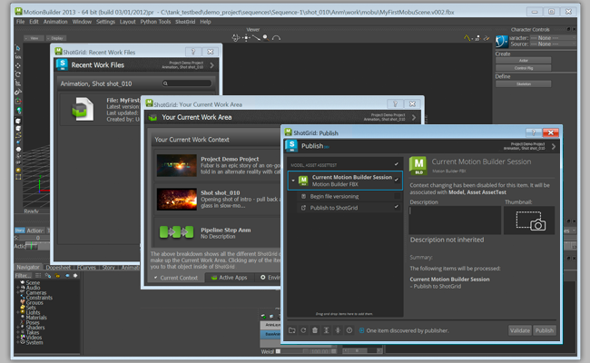

# Motion Builder



The  engine for Motion Builder contains a standard platform for integrating  Toolkit Apps into Motion Builder. It is light weight and straight forward and adds a  menu to the main menu.


## Supported Application Versions

This item has been tested and is known to be working on the following application versions: 



Please note that it is perfectly possible, even likely, that it will work with more recent releases, however it has not yet been formally tested with these versions.

## Installation and Updates

### Adding this Engine to the  Pipeline Toolkit

If you want to add this engine to Project XYZ, and an environment named asset, execute the following command:

```
> tank Project XYZ install_engine asset tk-motionbuilder
```

### Updating to the latest version

If you already have this item installed in a project and you want to get the latest version, you can run the `update` command. You can either navigate to the tank command that comes with that specific project, and run it there:

```
> cd /my_tank_configs/project_xyz
> ./tank updates
```

Alternatively, you can run your studio tank command and specify the project name to tell it which project to run the update check for:

```
> tank Project XYZ updates
```

## Configuring software launches

Newer versions of MotionBuilder need an additional configuration within the [`software_paths.yml`](https://github.com/shotgunsoftware/tk-config-default2/blob/master/env/includes/software_paths.yml) file. The `software_paths.yml` file is available when you have taken over your configuration. Ensure that your reflects the following paths for MotionBuilder to launch, with your specific path, version, and application information added:

```yml
# Motionbuilder
path.windows.motionbuilder: C:\Program Files\Autodesk\MotionBuilder 2020\bin\x64\motionbuilder.exe
```

[See this `software_paths.yml`](https://github.com/shotgunsoftware/tk-config-default2/blob/master/env/includes/software_paths.yml) file for reference.

## Collaboration and Evolution

If you have access to the  Pipeline Toolkit, you also have access to the source code for all apps, engines and frameworks in Github where we store and manage them. Feel free to evolve these items; use them as a base for further independent development, make changes (and submit pull requests back to us!) or simply tinker with them to see how they have been built and how the toolkit works. You can access this code repository at https://github.com/shotgunsoftware/tk-motionbuilder.


