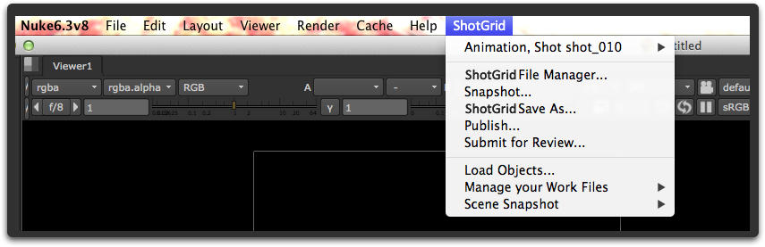
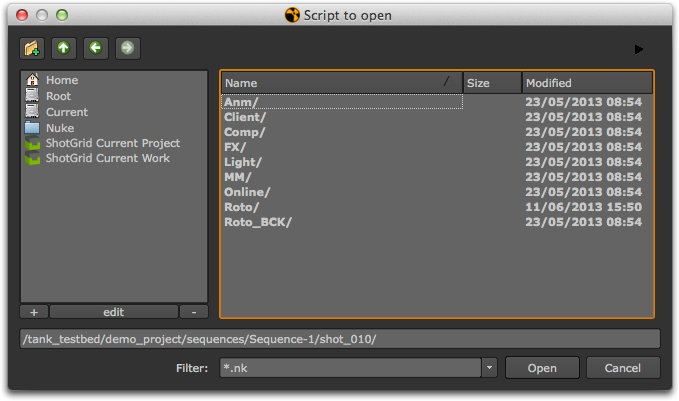
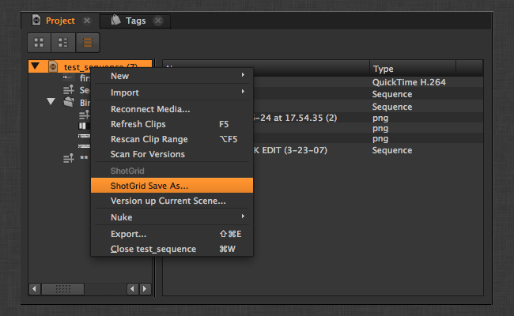
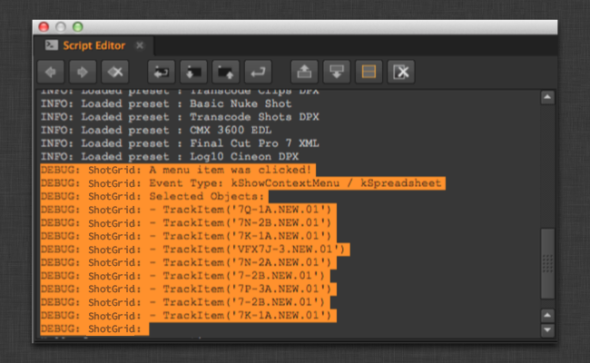

# Nuke

The  engine for Nuke contains a standard platform for integrating  Apps into Nuke, Nuke Studio, and Hiero. It is light weight and straight forward and adds a bunch of new things to Nuke.

It creates a ** Menu** in Nuke on which various items are displayed:



It creates a ** Node Menu** in Nuke on which various items are displayed:


It adds  shortcuts to the file dialogs which makes it easy to jump to various file system locations:



You can add your own shortcuts based on template paths in your current environment with the `favourite_directories` setting. The setting expects a list of dictionaries, with each item in the list representing a new favourite directory. Here is an example of the format you would use: (the icon can also be left unspecified by providing "" as the value.)

``` yaml
  favourite_directories:
  - display_name: "Shot Publish Path"
    template_directory: "shot_publish_area_nuke"
    icon: "icons/custom_publish_icon.png"
  - display_name: "Shot Work Path"
    template_directory: "shot_work_area_nuke"
    icon: "icons/custom_work_icon.png"
```

The " Current Project" favourite is added automatically for each root defined. You can customize the name with the `project_favourite_name` setting, or disable these favourites by setting the value to an empty string `''`


***

_Note: There is currently a bug in Nuke 8.0 running specifically on CentOS 6.5 that causes Nuke to crash when running Toolkit. Other versions of CentOS are unaffected. The Foundry is aware of this issue (bug 43766). If you are running into this, please contact us so we can try and help you workaround it until it is resolved in a future update of Nuke._


## Information for App Developers
    
### Context Tracking

The  engine for Nuke will switch context automatically when files are loaded. Whenever a file is loaded, the engine will look at the file, try and resolve a context from it. 

### Apps with custom gizmos

The  engine for Nuke makes it easy to handle custom gizmos. If you are writing an app which uses custom gizmos, you can just drop them into a folder called **gizmos** and the engine will automatically add that location to the nuke path:


You can then easily access your gizmo via the create node functionality:

* `nuke.createNode("WriteTank")`

{% include info title="Warning" content="Please note that while the use of gizmos may be convenient, it is typically NOT the right solution if you want to create nodes that persist in a scene. The reason for this is because as soon as you have put a gizmo in the scene, you have introduced a dependency between that scene and the gizmo code. Not only will you need to load the Shotgun Toolkit every time you load the scene, but you also need to carefully manage your code so that any updates to the code does not break old gizmos being used in scenes." %}

### Apps Creating Nodes

Apps that create custom nuke nodes need to be carefully crafted. We recommend not using gizmos since these require a dependency between the scene and the gizmo code. Instead, save your custom nodes as a nuke file and import them into the scene:

```python
    group_node_script = os.path.join(self.disk_location, "resources", "my_group_node.nk")
    group_node = nuke.nodePaste(group_node_script)
```

Any code calling the node from within the app can just use the instance returned.

Any code needing to call the app from inside the group should do so carefully so that the code is backwards compatible. We recommend the following approach:

At app startup, register app handle as part of the nuke namespace:

```python
    def init_app(self):

        nuke.tk_nuke_nameofmyapp = self
```

If you for example have a button on your group node and want to call some  app code, try to gracefully fail if the  Toolkit cannot be found. The below code is code that is associated with a python button knob that belongs to the group node that the app can create:

```python
# have to gracefully support the case when 
# sgtk is not in the system at all!
import nuke
try:
  app = nuke.tk_nuke_nameofmyapp
  app.do_something_v1(nuke.thisNode())
except:
  nuke.warning("Could not do XYZ! Most likely Sgtk is not currently active.")
```

If you make changes to the app behaviour, just keep versioning up the version number on the app callback and that way your app code can support both the new and the old behaviour.

## Using the  Engine for Nuke within Hiero

The  engine for Nuke is also used for -aware integrations running within Hiero.

It allows you to place  App actions in several places in the application, both in a specific  menu on the main menu bar and in the various right click context menus that you find in the different Hiero panels.


### How to Configure Hiero Menus

Because Hiero has several different menus, there are more options to configure where menu items go than in Maya or Nuke, for example. The  engine for Nuke's Hiero workflow configuration may look like this:

```yaml

  tk-hiero:
    location: {name: tk-nuke, type: app_store, version: v0.6.9}
    debug_logging: false

    timeline_context_menu:
    - {app_instance: tk-hiero-openinshotgun, keep_in_menu: false, name: Open in Shotgun, requires_selection: true}

    spreadsheet_context_menu:
    - {app_instance: tk-hiero-openinshotgun, keep_in_menu: false, name: Open in Shotgun, requires_selection: true}

    bin_context_menu:
    - {app_instance: tk-multi-workfiles, keep_in_menu: false, name: " Save As...", requires_selection: true}
    - {app_instance: tk-multi-workfiles, keep_in_menu: false, name: "Version up Current Scene...", requires_selection: true}
    - {app_instance: tk-multi-snapshot, keep_in_menu: false, name: "Snapshot...", requires_selection: true}
    - {app_instance: tk-multi-snapshot, keep_in_menu: false, name: "Snapshot History...", requires_selection: true}
    - {app_instance: tk-multi-publish, keep_in_menu: false, name: "Publish Project...", requires_selection: true}

    menu_favourites:
    - {app_instance: tk-multi-workfiles, name: Shotgun File Manager...}
```

Most engines have a `menu_favourites` option, a list where you can specify "shortcuts" which are put on the main  menu. In addition to this, the Hiero-specific configuration has three special sections:

- `timeline_context_menu` represents the menu you get when you right click on a clip in the
  time line editor.
- `spreadsheet_context_menu` represents the menu you get when you right click on a selection of
  items in the spreadsheet editor.
- `bin_context_menu` represents the menu you get when you right click on a selection in of items
  in the bin editor, where you see all the different projects and media.

In order to add items to these menus, just make sure that the `name` field you define in the config matches what the App is displaying on its menus.

#### Apps which require the concept of a current scene

Some Toolkit Apps requires a notion of a default scene or default project. For example, the snapshot app knows how to snapshot the current scene. However, unlike Maya or Nuke, Hiero does not have a concept of a current scene. Several projects can be opened in Hiero at the same time. Therefore, you often need to add special logic in your hooks to help an app (like the snapshot app) to find out which project is being clicked on. We show how this works in the following doc sections.

### Information for App Developers

Because Hiero does not have the notion of a current project, we have added more powerful tools so that Apps can easily find out what is being clicked on inside of Hiero. Therefore, two methods have been added to the  engine for Hiero:


#### get_menu_selection()

Returns the list of Hiero objects selected in the most recent menu click.
This list may contain items of various types. To see exactly what is being
returned by which methods, turn on debug logging - this will print out details
of what is going on.

Examples of objects that are being returned are:

- Selecting a project in the bin view: [hiero.core.Bin](https://learn.foundry.com/hiero/developers/2.0/hieropythondevguide/api/api_core.html#hiero.core.Bin)
- Selecting an item in a bin view: [hiero.core.BinItem](https://learn.foundry.com/hiero/developers/2.0/hieropythondevguide/api/api_core.html#hiero.core.BinItem)
- Selecting a track: [hiero.core.TrackItem](https://learn.foundry.com/hiero/developers/2.0/hieropythondevguide/api/api_core.html#hiero.core.TrackItem)

`list` engine_object.get_menu_selection()

**Parameters & Return Value**

* **Returns:** List of Hiero Objects

**Example**

Get the objects selected in the most recent click,
ensure that a single object was selected and that this
object is a valid Hiero project. This can be useful for example if you want to trigger
save, load or publish operations for a project in Hiero.

```python
# get the menu selection from the engine
selection = engine_obj.get_menu_selection()

if len(selection) != 1:
    raise TankError("Please select a single Project!")

if not isinstance(selection[0] , hiero.core.Bin):
    raise TankError("Please select a Hiero Project!")

project = selection[0].project()
if project is None:
    # apparently bins can be without projects (child bins I think)
    raise TankError("Please select a Hiero Project!")
```

#### HieroEngine.get_menu_category()

Returns the UI area where the last menu click took place. This command is less
likely to be used - you may need it in cases where you have an app command that you want
to behave differently depending on which menu it was called from.

`area_enum` engine_object.get_menu_category()

**Parameters & Return Value**

Returns one of the following constants:

- `HieroEngine.HIERO_BIN_AREA`
- `HieroEngine.HIERO_SPREADSHEET_AREA`
- `HieroEngine.HIERO_TIMELINE_AREA`
- `None` for unknown or undefined

#### How to configure your hooks to work with Hiero

Multi Apps configured for Hiero will typically need to find out which project was being clicked on. For example, the `tk-multi-workfiles` App needs to do a " Save As" of a project. We therefore add the Tank Save As command to the bin menu in Hiero so that a user can right click a project in the bin view and select the *Save As* option.



The engine configuration would look like this:

```yaml
bin_context_menu:
- {app_instance: tk-multi-workfiles, keep_in_menu: false, name: " Save As...", requires_selection: true}
```

Now, in the app itself, each engine needs to configure a hook which handles scene events such as
save and load. For an application like Maya or Nuke, this is normally just doing a save, a load etc.
But for Hiero, we need to start by finding out which project was actually clicked. The hook code
in our example above would look like this:

```python
class SceneOperation(Hook):
    """
    Hook called to perform an operation with the
    current scene
    """

    def execute(self, operation, file_path, context, **kwargs):
        """
        Main hook entry point

        :operation: String
                    Scene operation to perform

        :file_path: String
                    File path to use if the operation
                    requires it (e.g. open)

        :context:   Context
                    The context the file operation is being
                    performed in.

        :returns:   Depends on operation:
                    'current_path' - Return the current scene
                                     file path as a String
                    'reset'        - True if scene was reset to an empty
                                     state, otherwise False
                    all others     - None
        """

        if operation == "current_path":
            # return the current script path
            project = self._get_current_project()
            curr_path = project.path().replace("/", os.path.sep)
            return curr_path

        elif operation == "open":
            # open the specified script
            hiero.core.openProject(file_path.replace(os.path.sep, "/"))

        elif operation == "save":
            # save the current script:
            project = self._get_current_project()
            project.save()

        elif operation == "save_as":
            project = self._get_current_project()
            project.saveAs(file_path.replace(os.path.sep, "/"))

        elif operation == "reset":
            # do nothing and indicate scene was reset to empty
            return True

        elif operation == "prepare_new":
            # add a new project to hiero
            hiero.core.newProject()


    def _get_current_project(self):
        """
        Returns the current project based on where in the UI the user clicked
        """

        # get the menu selection from the engine
        selection = self.parent.engine.get_menu_selection()

        if len(selection) != 1:
            raise TankError("Please select a single Project!")

        if not isinstance(selection[0] , hiero.core.Bin):
            raise TankError("Please select a Hiero Project!")

        project = selection[0].project()
        if project is None:
            # apparently bins can be without projects (child bins I think)
            raise TankError("Please select a Hiero Project!")

        return project
```

#### Using debug logging to see menu events

If you want to see which objects are returned by Hiero when a certain selection is clicked on,
just turn on the engine debug mode. In the script editor you get a summary of the objects
that are selected with each click:



