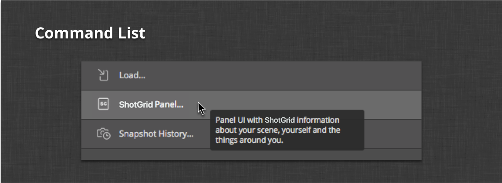

# Photoshop

The  engine for Photoshop CC provides a platform for integrating  into your Photoshop CC workflow. It consists of a standard  Pipeline Toolkit engine and relies on the [tk-framework-adobe](https://github.com/shotgunsoftware/tk-framework-adobe) (CEP).

Once enabled, a ** Adobe Panel** becomes available in Photoshop CC. It displays information about the current  context as well as the commands that are registered for the apps installed in that context.


## Supported Application Versions

This item has been tested and is known to be working on the following application versions:



Please note that it is perfectly possible, even likely, that it will work with more recent releases, however it has not yet been formally tested with these versions.

## Interface Overview

The  extension panel uses the same color palette and basic layout as native Photoshop CC panels. It is comprised of five components:


1. **Context Header** - Thumbnail and fields for the current context.
2. **Favorites Shelf** - Designed to show the most commonly-used apps for the current context.
3. **Command List** - All non-favorited commands for the current context.
4. **Context Menu** - Additional context-related commands and debugging tools.
5. **Logging Console** - A console overlay that displays logging output for debugging.

## Installation

Installation of the  Engine for Photoshop CC follows the same protocol as the other  integrations. For information on installing engines and apps, see the [Administering Toolkit](https://developer.shotgridsoftware.com/425b1da4/) article. In addition, you can reference the [default toolkit config](https://github.com/shotgunsoftware/tk-config-default2) as an example of how to configure the integration.

## Enabling the extension

Once the extension is installed, it will need to be launched via the extensions menu in Photoshop CC.


This will only need to be done once and the  extension panel can remain in the Photoshop CC layout without having to be enabled on subsequent launches.

Once enabled, and on future launches, the extension panel will display a loading screen while the  integration is bootstrapping.

This screen typically displays for a few seconds before the current context is determined and the commands are displayed.

## Interface components

The following sections outline the components of the  Photoshop CC integration.

### Context header

The context header is a customizable area which can display information about the current  context.


The context is determined by the currently-active document. Once the context is determined by the engine, the header will update to display the context's thumbnail field detail. The field information is controlled by a hook. For information on how to customize the field display, see the **Context Fields Display Hook** section below.

It should also be noted that since Photoshop CC is a multi-document interface, the context, and therefore the  extension, will update as you change the active document. It is important that artists understand this behavior, especially when working in multiple  contexts simultaneously.

### Favorites shelf

The favorites shelf is similar to the menu favorites available in other  DCC integrations such as Maya and Houdini. This section of the interface makes the most commonly used Toolkit apps readily available and easy to find just under the context header.


The shelf displays the favorited commands as buttons that, when moused over, transition from grayscale to color and display their name in the label at the top. Tooltips for the buttons will show by hovering the mouse above them.

Clicking one of the buttons will trigger the callback for the registered command to execute.

For details on how to specify command favorites, see the **Shelf Favorites** section below.

### Command list

The command list shows the other "regular" commands that are registered for the current context.



Typically, apps installed within a pipeline configuration will register one or more commands that are displayed here. If the commands are not identified as favorites, and are not identified as context-menu commands, they will display here.

The command list buttons behave in a manner similar to those in the favorites shelf. The only real difference is that they display as a list with the full name to the right of their icon.

### Context menu

Any commands registered as context menu commands will show in the  extension panel's context menu.


Like the other command areas, these commands will change along with the context. Commands such as **Jump to ** and **Jump to Filesystem** will always be available here.

### Logging console

The logging console shows all of the logging output from both the CEP Javascript interpreter and Toolkit's Python process.


If there are any issues with the extension that require support, the logging console output is extremely useful for helping the  support team debug the problem.

## Configuration and technical details

The following sections outline some of the more technical aspects of the integration to help configure the integration to the specific needs of your studio pipeline.

### PySide

The  engine for Photoshop CC relies on PySide. Please see the official instructions for [Installing Pyside](https://pyside.readthedocs.io/en/latest/installing/index.html).

### CEP extension

The extension itself is bundled with the engine and the engine handles installation automatically on the first launch of Photoshop CC. The extension is installed on the artist's local machine in the standard, OS-specific CEP extension directories:

```shell
# Windows
> C:\Users\[user name]\AppData\Roaming\Adobe\CEP\extensions\

# OS X
> ~/Library/Application Support/Adobe/CEP/extensions/
```

Each time Photoshop CC is launched, the engine bootstrap code will check the version of the extension that is bundled with the engine against the version that is installed on the machine. This means that after an engine update, assuming a new version of the extension came with it, the installed extension will be automatically updated to the newly-bundled version.

### Configuring favorites

The **Favorites Shelf** can be configured to display any of the registered commands for your installed apps. To do this, simply add the `shelf_favorites` setting to the `tk-photoshopcc` section of your environment configuration. Here's an example:

```yaml
shelf_favorites:
    - {app_instance: tk-multi-workfiles2, name: File Save...}
    - {app_instance: tk-multi-workfiles2, name: File Open...}
    - {app_instance: tk-multi-publish, name: Publish...}
    - {app_instance: tk-multi-snapshot, name: Snapshot...}
```

The value of the setting is a list of dictionaries identifying a registered command provided by one of the installed apps in the configuration. The `app_instance` key identifies a particular installed app and the `name` key matches the command's display name registered by that app. In the example above, you can see four favorited commands: the file open and save dialogs from the `tk-multi-workfiles2` app as well as the standard Toolkit publish and snapshot dialogs. These four commands will now show in the favorites shelf.

### Context fields display hook

The engine comes with a hook to control the fields displayed in the **Context Header** section of the panel. There are two methods in the hook that can be overridden to customize what is displayed.

The first method is the `get_entity_fields()` method. This method accepts an entity type representing the current  context. The expected return value is a list of fields for that entity that should be queried for display. The engine itself handles querying the data asynchronously.

Once the data has been queried from , the second method in the hook is called. This method, `get_context_html()`, receives the context entity dictionary populated with the queried fields specified by the `get_entity_fields()` method. The expected return value is a string containing formatted HTML to display the queried entity fields.

The [default hook implementation](https://github.com/shotgunsoftware/tk-photoshopcc/blob/master/hooks/context_fields_display.py) is a good reference as to what is required by these methods.

It should be noted that the engine will always display the entity thumbnail if one is available.

### Photoshop API

The engine exposes the Javascript API for Photoshop CC to Python.

The Photoshop API object is exposed as `engine.adobe`. The examples below show how it is possible to directly manipulate the Photoshop DOM from within Toolkit apps and hooks. The standard Toolkit apps also contain working examples of how to interact with Photoshop documents.

#### Examples
Load a file:

```python
f = adobe.File('/Path/To/File.jpeg')
adobe.app.load(f)
```

Set the ruler units to PIXELS:

```python
pixels = adobe.Units.PIXELS
adobe.app.preferences.rulerUnits = pixels
```

Export the current doc for the web with default options:

```python
temp_thumb_file = adobe.File(out_path)
save_for_web = adobe.ExportType.SAVEFORWEB
export_options = adobe.ExportOptionsSaveForWeb()
adobe.app.activeDocument.exportDocument(temp_thumb_file, save_for_web, export_options)
```

Export each layer as a separate file:

```python
doc = adobe.app.activeDocument
layers = doc.artLayers
layers = [layers[i] for i in xrange(layers.length)]
original_visibility = [layer.visible for layer in layers]

save_for_web = adobe.ExportType.SAVEFORWEB
export_options = adobe.ExportOptionsSaveForWeb()

for layer in layers:
    layer.visible = False

for layer in layers:
    layer.visible = True
    out_file = adobe.File("c:/layer.%s.jpg" % str(layer.name))
    doc.exportDocument(
        out_file,
        save_for_web,
        export_options,
    )
    layer.visible = False

for (i, layer) in enumerate(layers):
    layer.visible = original_visibility[i]
```

### Environment variables

To aid in debugging, there are a set of environment variables that change some of the engine's default values:

`SHOTGUN_ADOBE_HEARTBEAT_INTERVAL` - The Python heartbeat interval in seconds (default is 1 second). The legacy environment variable `SGTK_PHOTOSHOP_HEARTBEAT_INTERVAL` is also respected if set.

`SHOTGUN_ADOBE_HEARTBEAT_TOLERANCE` - The number of heartbeat errors before quitting (default is 2). The legacy environment variable `SGTK_PHOTOSHOP_HEARTBEAT_TOLERANCE` is also respected if set.

`SHOTGUN_ADOBE_NETWORK_DEBUG` - Include additional networking debug messages when logging output. The legacy environment variable `SGTK_PHOTOSHOP_NETWORK_DEBUG` is also respected if set.

`SHOTGUN_ADOBE_PYTHON` - The path to the Python executable to use when launching the engine. If not set, the system Python is used. If Photoshop is launched from a Python process, like  Desktop or via the tk-shell engine, the Python used by that process will be used by the Photoshop integration.

Note: Additional environment variables exist in the Adobe Framework. For details, please see the
[developer documentation](https://developer.shotgridsoftware.com/tk-framework-adobe/).

### App Developer notes

* Because the python process is separate from the Photoshop CC process, there is some work done within the engine to try to make the app windows show above the Photoshop window in as clean a manner as possible. One gotcha with this setup is the default option to use native OS windows for `QFileDialog`. If you are developing an app for use with this engine, be sure
to set the option to not use the native dialog. [See an example of this in the tk-multi-pythonconsole app](https://github.com/shotgunsoftware/tk-multi-pythonconsole/blob/master/python/app/console.py#L218).
