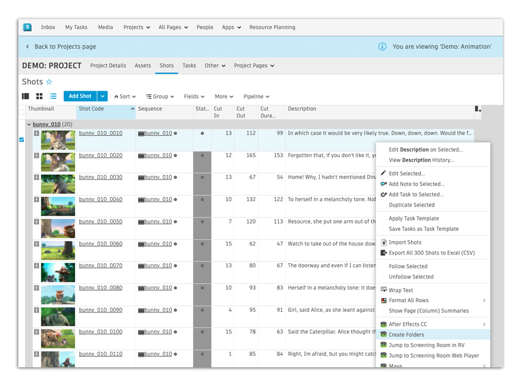

# 

The  engine manages apps that can be launched from within . Sometimes we refer to these Toolkit Apps as *Actions*. They typically appear as items on menus inside of .

## Using  Pipeline Toolkit Actions

Actions are visible on the  Home page:


They can also be found on the standard  context menu, which can be shown by right clicking
on an object or a selection:



When you click on an action, processing will immediately start. Once the app has completed, a message is typically displayed with some status information, or an error message if things didn't work.

## Developing Apps for 

Developing apps that run inside of  is easy! If you are not familiar with how app development works in general, head over to the Platform documentation and read the introductory material over there. In this section we will just cover the  specific aspects of the app development process!

As of Core v0.13, you can use all the multi apps with the  Engine. Technically speaking there is little difference between the  engine and other engines. There are, however, some subtle differences:

* You will need to manually install PySide or PyQt into your standard python environment if you want to 
  execute QT based apps in the  Engine.
* It is possible in the  engine to make an action visible to a user depending on which 
  permissions group they belong to. This is useful if you want example want to add a command to 
  the  Action menu and you only want admins to see it.

A hello-world style  App, only visible to admins, would look something like this:

```python
from tank.platform import Application

class LaunchPublish(Application):
    
    def init_app(self):
        """
        Register menu items with 
        """        
        params = {
            "title": "Hello, World!",
            "deny_permissions": ["Artist"],
        }
        
        self.engine.register_command("hello_world_cmd", self.do_stuff, params)
        

    def do_stuff(self, entity_type, entity_ids):
        # this message will be displayed to the user
        self.engine.log_info("Hello, World!")    
```

