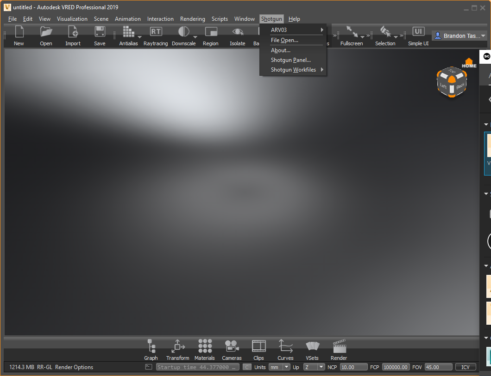
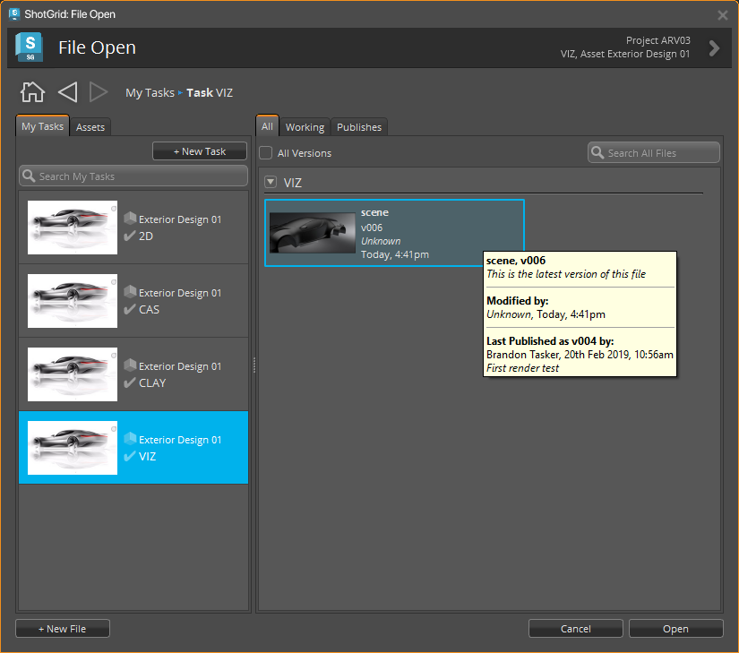
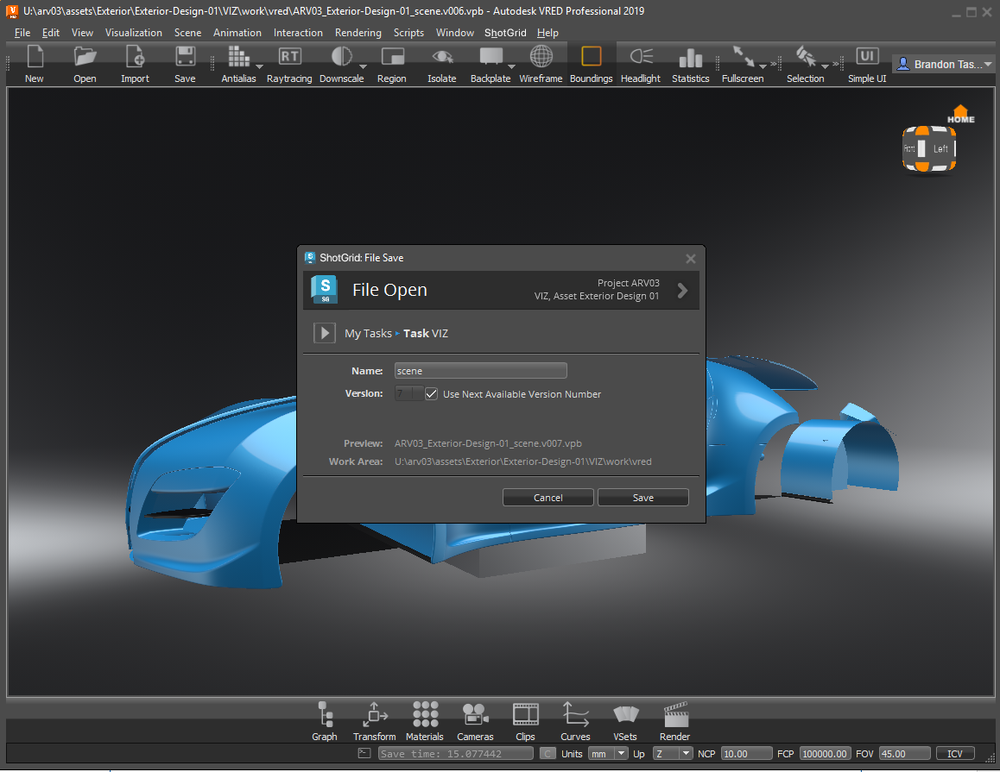
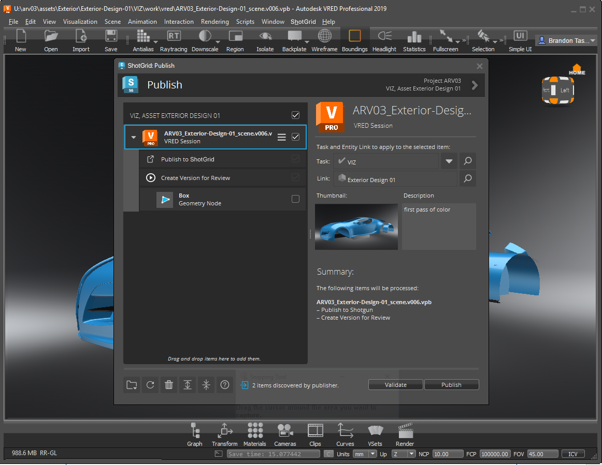
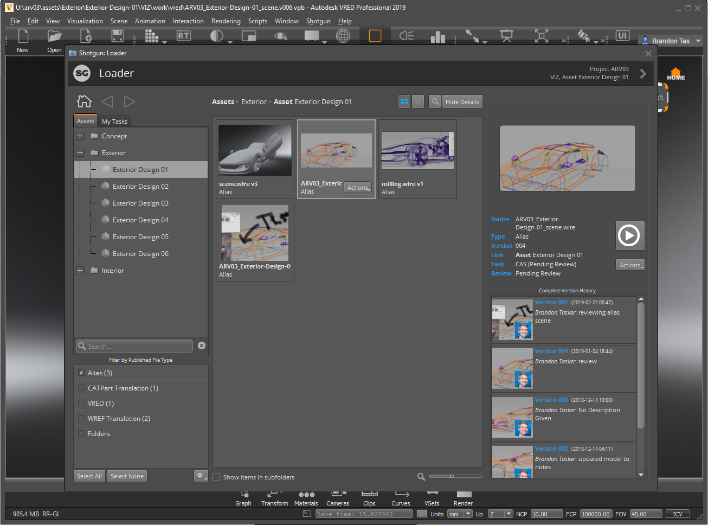
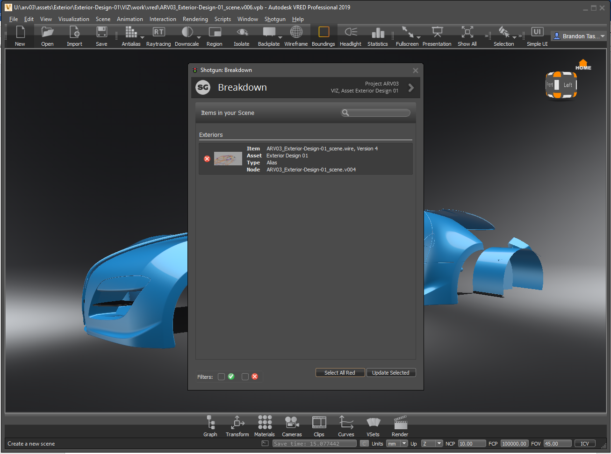

# VRED

The  engine for VRED contains a standard platform for integrating  Apps into VRED. It is lightweight and straight forward and adds a  menu to the VRED menu.

## Supported Application Versions

This item has been tested and is known to be working on the following application versions: 



Please note that it is perfectly possible, even likely, that it will work with more recent releases, however it has not yet been formally tested with these versions.

## Information for App Developers

### VRED Project Management

Whenever the  engine for VRED starts, it will set the VRED Project to point at a location defined in the settings for this engine. This means that the Project may also change when a new file is opened. The details relating to how the VRED project is set based on a file can be configured in the configuration file, using the template system.

## Working with tk-vred

This  integration supports the VRED product family (Pro & Design).

When VRED opens, a  menu (the VRED engine) is added to the menu bar.

### File Open and Save

Use the My Tasks and Assets tabs to see all your assigned tasks and browse for assets. To the right, use these tabs to view all files, working or published files associated with what is selected to the left.

### Publish 
Publish: Opens the Publish dialog for publishing the file to , which can then be used by artists downstream. For more information on VRED Publishing, [see here](https://github.com/shotgunsoftware/tk-vred/wiki/Publishing)

### Loader 
Load: Opens the Content Loader app, along with instructional slides explaining how it works.
To see more info about VRED loading [see here](https://github.com/shotgunsoftware/tk-vred/wiki/Loading)

### Scene Breakdown 
Scene Breakdown: Opens the Breakdown dialog, which displays a list of "referenced" files (and their links), along with what in the scene is out-of-date or using an alternate version of the PublishedFile.

