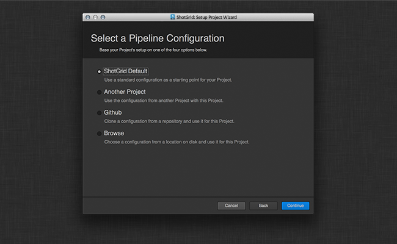

# Toolkit Admin UI Framework

The Admin UI Framework implements a place that holds standard user interfaces that wrap Toolkit
administrative commands.

Currently the only interface is for the setup_project command.

## SetupProjectWizard API Reference



This is a QWizard implementation that walks somebody through setting up a Project
from their  instance for Toolkit. To use the wizard, simply create an
instance of the class, passing in the project to setup (as a standard  API
entity dictionary) and the window to parent to.

```python
adminui = sgtk.platform.import_framework("tk-framework-adminui", "setup_project")
setup = adminui.SetupProjectWizard(project, parent)
dialog_result = setup.exec_()
```

This will run the wizard and return a standard QDialog Accepted or Rejected value.

### SetupProjectWizard Constructor

Initialize a SetupProjectWizard. This is a subclass of QtGui.QWizard.

```python
SetupProjectWizard()
```
