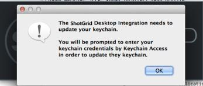
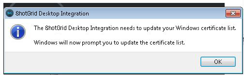

# Toolkit Desktop Server Framework

The desktopserver framework provides the functionality behind 's local file linking
and Toolkit integration.  It provides a local websocket server that securely listens for
requests from  websites for an action that requires desktop access.

For local file linking, these requests allow  access to local file paths from the 
web interface and the ability to open those files directly from  pages when requested. 
For Toolkit, they allow  to determine what pipeline actions have been registered for a 
given entity and to execute them.

## How to get desktop integration running

For these  features to work, some supported desktop integration must be running.
[This page](https://developer.shotgridsoftware.com/c79f1656/) covers the various options for how
 can integrate with your desktop.  The Websocket Server section covers the functionality that this framework provides.

###  Desktop

This framework is bundled with  Desktop, which can be downloaded [following these steps](https://developer.shotgridsoftware.com/d587be80/?title=Integrations+User+Guide#installation-of-desktop). When  Desktop is run it will automatically start up the websocket server.  If you 
are already running  Desktop then your setup process is complete.

### Configuring the server

You can store the browser integration settings in a configuration file. This configuration file can be specified by setting the environment variable `SGTK_BROWSER_INTEGRATION_CONFIG_LOCATION`. More details on how you can configure the local server can be found in our [sample file](https://github.com/shotgunsoftware/tk-framework-desktopserver/blob/master/app/config.ini.example).

### Removing a certificate

If you wish to remove a certificate you have created, you can run the `python certificates.py --remove` command.

## Launching via a wrapper

By default, the server will use the operating-system default to launch a command (the equivalent of
"xdg-open" on Linux, "open" on OS X, and "run" on Windows). If you wish to provide your own wrapper for
launching files you can set the **SHOTGUN_PLUGIN_LAUNCHER** environment variable to point to your
custom wrapper. If that is set, the wrapper will be called with the path as its only argument.

## Certificates

The first time you run the server it will generate the certificate required to establish a secure 
connection. These certificates are stored local to your machine and are never shared with the public.
They allow the encrypted connection that websockets requires, which is necessary despite all traffic 
remaining local (from your browser to the server); 's websocket traffic is never made available 
over the Internet.

When the certificates are registered with the system you will see dialogs appear like the following.
Click "Ok" to allow the registration to proceed.





When using the  Desktop, the generated certificates will be stored in the following locations:

**OS X**: ~/Library/Caches/Shotgun/desktop/config/certificates<br/>
**Windows**: %AppData%\Shotgun\desktop\config\certificates<br/>
**Linux**: ~/.shotgun/desktop/config/certificates<br/>

## Security Setup - Local  Installs

By default, the websocket server is setup to listen to hosted  sites on port 9000.
If you run a local  server, you will need to update the configuration for the  server 
to allow connections from your websocket server.

When running  Desktop, you will need to setup a ```config.ini``` file that lives with the  binary. 

Within that file there is a section that controls the functionality of the websocket server.
A typical configuration would look like this:

```ini
[BrowserIntegration]
low_level_debug=0
port=9000
enabled=1
whitelist=*.shotgunstudio.com
```

## Troubleshooting

On Linux the server introduces a dependency on libffi.  If Desktop crashes on startup and you see a message about libffi not found in your logs, then you need to install this package.

Visit our [support site](https://knowledge.autodesk.com/contact-support) if you have any issues or questions during setup.  If there is a problem
running the server, please set **debug** to **1** in the **config.ini** file and include Desktop's log
file.

The log file can be found in the following locations:

**OS X**: ~/Library/Logs/Shotgun/tk-desktop.log<br/>
**Windows**: ~\%APPDATA%\Shotgun\tk-desktop.log<br/>
**Linux**: ~/.shotgun/tk-desktop.log<br/>
