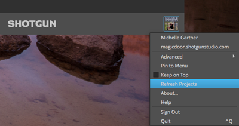

# Getting started with configurations

After completing this guide, you will have the knowledge fundamental to adding your project information to a configuration, associating that configuration with your project, and preparing your pipeline configuration to be customized.

## About the guide
 
This guide describes how to use the **Advanced Project Setup Wizard** in Shotgun Desktop to create a configuration for a digital content creation pipeline. You will quickly become acquainted with the configuration tools, learn how to use the Wizard, and be presented with opportunities to learn more. Using the Wizard creates a pipeline configuration for your project and prepares it to be edited and extended to support each step in the pipeline. The configuration controls aspects of the UI, Shotgun Apps, and various tools necessary to support a production pipeline. Using the Wizard is just one way to extend a configuration. Along with adding specific settings for each step in a pipeline, it will add integrations with software applications. In this guide, we'll be basing our project's configuration on Toolkit's Default Configuration.  

This guide assumes the user: 

1. Has never used the Advanced Project Setup Wizard
2. Has some basic knowledge of how to use Shotgun
3. Is new to Shotgun Toolkit

### Using this document
 
To use this guide and create a customizable configuration for your project, the following is required:

1. An active Shotgun site. You can [register for Shotgun here](https://www.shotgunsoftware.com/signup/?utm_source=autodesk.com&utm_medium=referral&utm_campaign=creative-project-management) and get a 30-day trial to begin exploring. 
2. Shotgun Desktop. If Desktop is not installed, you can [begin by following this link.]( https://support.shotgunsoftware.com/hc/en-us/articles/115000068574-Integrations-user-guide#Installation%20of%20Desktop) 
3. Access to a filesystem where you can store project files and a pipeline configuration. On the filesystem, create a folder called `Shotgun`, with two folders, `projects` and `configs`, within it.

## About the Advanced Project Setup Wizard

The Advanced Project Setup Wizard in Shotgun Desktop generates a pipeline configuration based on the Default Configuration. The Default Configuration provides a solid base to build on, complete with customizable settings, apps, and UI elements that support the pipeline process. It creates a configuration you can edit and extend to meet your project’s pipeline needs.

The Default Configuration includes: 
* A basic filesystem schema and templates that determine where files live on disk 
* All of the supported [software integrations](https://support.shotgunsoftware.com/hc/en-us/articles/219039798-Integrations-Apps-and-Engines) allowing interaction with Shotgun and pipeline functions from directly inside the user’s software applications. 

Customizations are only limited by imagination, cleverness, and programming knowledge or the ability to borrow from what others in the Shotgun community have created.
 
### Creating the configuration 

A configuration is required for every project. The first time a project is accessed through Shotgun Desktop, a Basic Configuration is downloaded and configured. This Basic Configuration automatically detects the supported content creation software a user has on their system and associates the configuration with the project. Settings in the pipeline configuration govern the integrations within the supported software applications. The [Panel]( https://support.shotgunsoftware.com/hc/en-us/articles/219033098-Shotgun-Panel) app displays project information from Shotgun and allows artists to reply to notes and view Versions without leaving their work session. The [Publisher](https://support.shotgunsoftware.com/hc/en-us/articles/219032998-Publishing-your-work) app allows artists to make their work available for others on their team, and through the [Loader](https://support.shotgunsoftware.com/hc/en-us/articles/219033078-Load-Published-Files-) app, artists can load their teammates' published files. The Basic Configuration does not include file system management setup or the development of templates for specifying how files and directories are named on disk. It also doesn’t have the plethora of Apps that are added when a Default Configuration is configured. It is a simple configuration that allows Toolkit to run without any manual editing of configuration files. The Wizard replaces the Basic Configuration with a Default Configuration. It provides more apps and software integrations to support you on your journey. While the Basic Configuration can be edited as well, it's not until you have an advanced setup that your project will be set up for customization.

### Differences between the Basic and Default Configurations

| FEATURE | BASIC CONFIGURATION | DEFAULT CONFIGURATION |
| ------- | ------------------- | --------------------- |
| Download | Automatically downloaded when a project is accessed | Created via Advanced Setup Wizard |
| Accessibility | Stored in a system location | Manually editable files |
| Updates | Automatically updated | Manually updated |
| File System Support | No support for filesystem schema | Includes tools to support folder structure and file naming standards |
| Software Integrations | 3ds Max, Houdini, Maya, Nuke, Photoshop, Flame | Basic + Hiero, Motionbulder, Mari | 
| Toolkit Apps | Shotgun Panel, Publisher, Loader | Basic + Workfiles, Snap Shot, Scene breakdown, Nuke write node, Houdini Mantra node, and more |

In this guide, you will use the Wizard in Shotgun Desktop to generate a pipeline configuration for your project based on the Default Configuration. Generating this configuration sets you up to make the customizations necessary to support a proprietary production pipeline.

## Begin Exercise 

### Prepare to use a Default Configuration

**Step 1:** Create a new project in Shotgun called "the_other_side.”

**Step 2:** Launch the Shotgun Desktop app and log in using the username and password from your Shotgun site.

**Step 3:** Navigate to the project where you wish to run the Wizard by selecting its thumbnail image.



### Accessing the Default Configuration

A Basic Configuration was downloaded and configured when the project was accessed. The Publish app and supported software packages were detected and automatically added to the **Apps** pane in Shotgun Desktop. 

**Step 4:** Once the project is loaded, select your profile **avatar** at the bottom right of the screen. In the popup menu, select **Advanced project setup…** to initiate the Wizard.

A dialog box will be displayed with four options and Shotgun Default selected. At this point, you can choose to base your project's pipeline configuration on the configuration of an existing project, on a configuration in a git repository, or on a path on disk. 

For this exercise, we'll choose **Shotgun Default**. This option will create a pipeline configuration for your project that's based on Shotgun's Default Configuration.

**Step 5:** Select **Continue**. 

A dialog box will be displayed with two options and **Default** selected. At this point there’s an option to select a Legacy Default Configuration setup. This configuration setup is from an older version of Shotgun for studios who still use that version. We will use the Default for this exercise.

**Step 6:** Select **Continue**.

### Define storage locations for project files

A dialog box will appear displaying a drop-down menu next to the word `Storage:`

**Step 7:** Identify where to store project data for this project. From the dropdown at the top of the dialogue box select **+ New** and type **projects** in the field. 

Shotgun Toolkit supports three operating systems: Linux, Mac, and Windows.

**Step 8:** Select the field next to the operating system utilized for storing project data. Select the folder icon and navigate to the project folder created on the filesystem prior to this exercise.

This setup allows Shotgun to have access to only the folder you identify for storing production data. When preparing for this exercise you added a `projects/` directory within your Shotgun root directory. The `projects/` directory is where Toolkit will store any local project related information. 

**Step 9:** Select **SAVE** to identify the projects folder as the storage destination for project data.

The operating system path is automatically updated to identify the path where the project data is stored.

**Step 10:** Select **Continue**.

### Name the Project Folder 

A dialog box is displayed with the name of the project populating the text field. The name is automatically populated pulling from the project information and the path is automatically updated.

Toolkit can work in either a Distributed Setup, where the pipeline configuration is uploaded to Shotgun and cached locally for each user, or a Centralized Setup, where users access a single configuration in a shared location on disk. For this exercise we will use a Centralized Setup. You can [learn more about Distributed Setups here](https://developer.shotgunsoftware.com/tk-core/initializing.html#distributed-configurations).

The final step generates the appropriate folders, files, and data necessary to create the configuration specific to a project. 

**Step 11:** Under the appropriate operating system, select **Browse...** and navigate to the configuration folder you created when preparing for this exercise, `configs`, and enter the project name **the_other_side**. This creates the folder where the project configuration is stored. Select **Run Setup** and wait for it to complete the setup. 

**Step 12:** Select **Done** to display the new icons populating the project windows. 

**TIP:** Pin the app to the menu bar to allow quick access to Shotgun Desktop: select your **avatar** and select **Pin to Menu**.

You’re done; the project setup is complete. You now have a Toolkit pipeline configuration for your project in the location you specified, based on the Default Configuration, and you’re ready to start customizing.

Take a look in the `configs` folder and you will find several folders and files. Explore a little to see what’s in there.

And now the real fun begins, learning all the things you can do with the Configuration. Below are some advanced topics to explore.

## Advanced topics

Shotgun Toolkit provides many convenient ways to edit, clone, or take over a configuration. Extending existing configurations will save time and allow you access to all of the cool stuff that others within your network have created. You can take advantage of the vast Shotgun community (https://groups.google.com/a/shotgunsoftware.com/forum/?fromgroups#!forum/shotgun-dev) that may have the exact configuration you need. The Shotgun community is a sharing community, so be kind, say thank you, and recognize the person who created the configuration that helped you get the job done. Oh, and don’t forget to give back, it’s how we help our fellow Shotgun gurus and what makes it so special to be a part of this community! 

Below are some ways you can have fun with configurations.

### Using the command line to create a default configuration

From inside any project configuration, the `tank` command lets you run administrative commands from a terminal. Each project has its own dedicated `tank` command. The `tank setup_project` command's functionality is analogous to the Advanced Setup Wizard's: it creates an editable configuration on disk for your project based either on an existing project's configuration or the Default Configuration. You can learn more about running [`tank setup_project` here](https://support.shotgunsoftware.com/hc/en-us/articles/219033178-Administering-Toolkit#setup_project), and more about the  [`tank` command here](https://support.shotgunsoftware.com/hc/en-us/articles/219033178-Administering-Toolkit#Using%20the%20tank%20command).

### Editing a configuration that's in production

There will be times when you want to modify a configuration that is currently in production, but you won't want to edit it while artists are using it. With just a few commands, Shotgun provides a way to copy an existing configuration where you can test your modifications safely before pushing them into production. This process replaces the production configuration with the new one and automatically backs up the old one. 

The reasons you would want work on a copy of a configuration are:

1. To update the configuration
2. Test some modifications before going live
3. Upgrade, or add some apps
4. Do development and roll it out after it’s been tested

To learn about cloning your configuration, as well as other basics of configuration management, refer to the [Configuration Staging and Rollout document](https://support.shotgunsoftware.com/hc/en-us/articles/219033168-Configuration-staging-and-rollout#Cloning%20your%20Configuration).

### Cloud distribution of pipeline configurations

This guide walks through creating a **centralized configuration**: a single copy of a pipeline configuration that is located in a shared network location and accessed by all users. But, if your workforce is distributed across locations and networks, it may not be feasible to share a single copy of a pipeline configuration. Toolkit allows for this scenario by providing a **distributed configuration** option where a pipeline configuration is uploaded to Shotgun and each time a user accesses a project the configuration is downloaded and cached locally. You can learn more about distributed configurations in our [Core API developer documentation](https://developer.shotgunsoftware.com/tk-core/initializing.html#distributed-configurations).

### Working with more than one root folder

Ideally your facility would want to be optimized for specific tasks. You can work with more than one root folder to optimize things such as video playback for dailies on one server and interactive processing on another. Toolkit allows you to work with more than one storage root in order to facilitate workflows such as these. Check out how to convert from a [single root to a multi-root configuration](https://support.shotgunsoftware.com/hc/en-us/articles/219040478-How-do-I-convert-my-project-from-a-single-root-to-a-multi-root-configuration-). 

Now that you have a pipeline configuration for your project, get started on editing it! Jump into the next guide, [Editing a Pipeline Configuration](/toolkit/learning-resources/guides/editing_app_setting/), to learn how.
