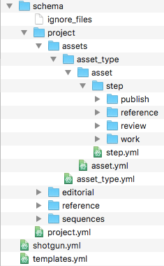
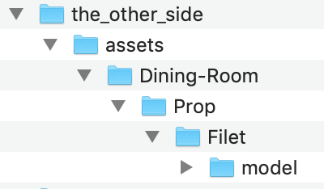
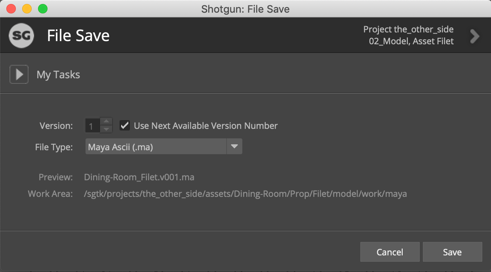

# Dynamic filesystem configuration 

In this guide, you will learn how to modify your Toolkit pipeline configuration to customize your production folder structure and file naming. 

## About the guide

One of the hardest things about managing a pipeline is keeping track of the myriad files that will be created. Your Toolkit pipeline automates filesystem management: by creating folders based on data in Shotgun and a configured folder structure, and automatically writing files to the right place and with standardized naming, artists can focus on content creation. Your pipeline configuration comes with a default set of folder and file naming conventions, but productions often customize them. This guide will provide the knowledge necessary to make those customizations. 

In the Default Configuration, assets are managed in a folder structure like `asset_type/asset/pipeline_step`. In this guide, we’ll be using a custom entity called “Set” to organize them further by the production set on which each asset is used. We will first set up the custom entity in Shotgun, then use it to manage the assets created for any given set, so that the folder structure looks like `set/asset_type/asset/pipeline_step`. 

We can demonstrate the idea behind organizing assets by set with an example: say you have a project where some scenes take place in a garage, while others take place in a dining room. With our setup, files for assets like “wrench”, “oilcan”, or “workbench” would be organized in a “garage” folder, while “plate”, “winebottle”, or “tablecloth” would be organized in a “dining_room” folder. In our example, we'll be ensuring that a juicy "filet" asset is properly placed in the dining room. 

As part of our example, we’ll also edit the filenaming templates for the project, such that Maya work files for assets will include the set in their name. The dynamically generated name of the file will distinguish files for the dining room from files used in other sets. 

### There are three parts to this guide

* Creating a **custom entity** in Shotgun called “Set”, which you will use to associate with the dining room elements the artists are creating.
* Editing the folder **schema**, enabling Toolkit to include a dynamically named folder based on the current set in the folder structure. 
* Editing the **template** used for naming asset work files, enabling Toolkit to include the name of the associated set in the file name. 

### Prerequisites 
 
To use this guide, the following is required:

1. An active [Shotgun](https://www.shotgunsoftware.com/signup/) site. You should have a project with at least one Asset created. The asset should have a Model task. 
2. A basic understanding of how a Shotgun site is used to manage assets
3. [Shotgun Desktop](https://support.shotgunsoftware.com/hc/en-us/articles/115000068574-Integrations-user-guide#Installation%20of%20Desktop) installed on your system.
4. A cloned pipeline configuration for the identified project, or complete the [Getting started with configurations](./advanced_config.md) guide and clone the configuration created in that exercise.
5. Basic familiarity with YAML. 
6. Read and write permissions set appropriately for the filesystem where the Pipeline Configuration is stored.
7. Read and write permissions set appropriately to allow Toolkit to read and write to the production filesystem.
8. An active subscription for Maya. Get a 30 day trial of [Maya](https://www.autodesk.com/products/maya/free-trial-dts?adobe_mc_ref=https%3A%2F%2Fwww.google.com%2F&adobe_mc_sdid=SDID%3D577C0A84DDF5D35D-50E96EA2052056FE%7CMCORGID%3D6DC7655351E5696B0A490D44%2540AdobeOrg%7CTS%3D1543444689) 



### About file schemas and templates

The schema and templates in the Toolkit pipeline configuration allow you to take advantage of your Shotgun data for managing production files on disk. The schema in the Default Configuration includes entities like **Shot**, **Sequence**, **Asset**, **Asset Type**, etc.  Other entities like **Level**, **Episode**, **Season**, or in our case, custom entities like **Set** can be added. 

The Toolkit platform allows you to build your folder structure dynamically by using a **schema**, a miniature version of a production folder structure that will be used as a template when building out your actual production filesystem. The schema is an explicit guide for the dynamic creation of folders, and uses YAML files to define the rules for dynamically created folders. The Default Configuration includes a pre-configured schema that supports folder creation for both asset and shot pipelines. You will be modifying the portion of the schema that supports creating the asset folder structure, `/assets/<asset_type>/<asset>/<step>`, to add support for the new **Set** entity you’re creating. 

**Templates** allow you to dynamically name and save files as they’re created using Shotgun data and information from the schema structure. The Default Configuration provides a set of starter templates that you can edit to meet the needs of your pipeline. 



## Begin exercise

Customizing your schema and templates will allow you to dynamically manage the files generated when creating the dining room set: a place setting, a steaming hot filet mignon, a bottle of Penfolds Grange Hermitage 1951, potatoes au gratin, lemon garlic asparagus, etc. Assets used in the dining room set will be associated with the "Dining Room" Set entity enabling you to manage them more easily. Set is not an entity type that comes standard with the Default Configuration, so you need to enable a [custom entity](https://support.shotgunsoftware.com/hc/en-us/articles/114094182834-Enabling-a-custom-entity) and call it Set before extending the schema and templates to use it.

### Enabling a custom entity

**Step 1:** Open your Shotgun site in the browser. Click on your avatar and go to ADMIN > Site Preferences. In the resulting page, expand the **Entities** section.


Displayed is a list of entity types that are available in Shotgun. At the top of the list in the image below are some entity types that are configured for the current Shotgun site. Underneath these entity types are several **Custom Entities** that are not configured or enabled. 

### Choose one of the custom entity types, configure it, and enable it.


**Step 2:** Select the arrow to open the settings on a grayed out disabled custom entity. Select the radio button next to **Yes, use Custom Entity…**, change the **Display name** to **Set** then scroll to the top of the window and select Save Changes.


Doing this makes that custom entity active in Shotgun and gives it the display name *Set*. Essentially you are creating an alias for the custom entity because the system name of the entity remains `CustomEntity01`. In this example, we're using `CustomEntity01`; you might use a different custom entity.



### Add a data field to associate assets with sets

Adding a data field to the Asset entity enables us to link assets to the new entity. The assets the artists create for the dining room will be associated with the **Dining Room** set entity.

**Step 3:** Select the **Projects** dropdown at the top of the page to open the project you want to use for this exercise. 

**Step 4:** Select **Assets** in your project menu bar to go to an Assets page. In the Assets menu, select **Fields > Manage Asset Fields…** 


This action displays the asset field manager.


Select **+ Add a new field**

Select the parameters for the new field.

In **New Field Name**, type “Set”. In the **GENERAL** menu under **Field Type**, select **Entity** and scroll down to **Restrict the type** to **Set**. Select **Next**.


For this guide, apply it to **Only the current project** and select **Create Field**. 

Shotgun will configure the new field.


Your change has been applied and you can select **Done**.

### Creating the **Dining Room** Set entity

**Step 5:** Select the new **Set** field of an asset and start typing Dining Room. A dialog box is displayed stating, **No matches found. Create “Dining Room”** 


Select **Create “Dining Room”**.


Select **Create Set**.

Adding **Dining Room** in the Set field of an asset creates an [association](https://support.shotgunsoftware.com/hc/en-us/articles/115000010973-Linking-a-custom-entity) with the Dining Room set entity. 


**Step 6:** Assign the Model task on the **filet** asset to yourself, so you can find it easily for testing purposes. 

### Setting up the schema

You’ve now enabled a Set custom entity, created a Set entity called “Dining Room”, and linked an Asset entity to the Dining Room set. You’ve got all the pieces in place in your Shotgun site to now modify your folder structure. When an artist starts working on a task, Toolkit uses the associated Shotgun data to determine what folders to create in the filesystem. New folders are created and named automatically based on the pipeline configuration’s schema. 

Now it’s time to define the folder structure you want Toolkit to dynamically generate as artists step through the production pipeline. This is done by editing the schema.

{% include info title="Note" content="It’s a good practice to test configurations in a *cloned* configuration, so as not to affect the active production configuration. The cloning process creates a *copy* of the configuration that you can edit safely before pushing changes to the live config. You can find details on cloning your config in the [Configuration Staging and Rollout](https://support.shotgunsoftware.com/hc/en-us/articles/219033168-Configuration-staging-and-rollout#Cloning%20your%20Configuration) document." %}

**Step 7:** Navigate to your pipeline configuration. Drill down to the schema folder, `<pipeline_configuration_root>/config/core/schema` and open the `project` folder.



The current schema, which looks like this:

`<project>/assets/<asset_type>/<asset>/<step>`

supports dynamically creating this folder structure:

`the_other_side/assets/prop/filet/model`

We want the following structure instead:

`the_other_side/assets/Dining-Room/Prop/filet/model`

To achieve this, you would set up the schema like this:

`<project>/assets/<CustomEntity01>/<asset_type>/<asset>/<step>`

The Set entity is represented as `CustomEntity01`. While we gave CustomEntity01 the *display name* of Set in Shotgun, in our configuration, we’ll always refer to it by its system name, `CustomEntity01`. 

### How the schema uses YAML files

A schema can contain static and dynamic folders. If you have a static folder in your schema called “assets”, it will correspond to a single folder in your production filesystem called “assets”. On the other hand, you might have a dynamic folder in your schema named “asset” that represents one folder for each asset in your project. Every dynamic folder has a corresponding YAML file next to it with the same name as the folder (eg, `asset/` and `asset.yml`) that defines the rules for how to generate production folders based on the schema folder.

### Create the new folder and YAML file for the Set entity

The schema has a `project` folder that contains folders relative to the different entities Shotgun tracks. You are adding the new asset entity, CustomEntity01, to enable Shotgun to track the items in a Set. These items are assets, so you will edit the folders and YAML files under assets.

Again, our goal is to go from an `asset_type/asset/step` folder structure to `set/asset_type/asset/step`. So, we’ll want to add a folder to represent set in our schema, with a corresponding YAML file. Since we need to use the system name for custom entities, we’ll be creating the `CustomEntity01/` folder and `CustomEntity01.yml`. 

**Step 8:** Add a `CustomEntity01` folder inside the `project/assets` folder of your schema.


**Step 9:** Create a file called `CustomEntity01.yml` file next to the `CustomEntity01` folder, with the following contents:

```
type: "shotgun_entity"

name: "code"

entity_type: "CustomEntity01"

filters:
    - { "path": "project", "relation": "is", "values": [ "$project" ] }
```

The YAML file will give the instructions to Toolkit for what to name the `CustomEntity01` folder. In this case, we’re making a folder of type `shotgun_entity`, which means that it corresponds to a Shotgun query. The `entity_type` field tells us to query the `CustomEntity01` entity in Shotgun, and the `name` field tells us which *field* on the entity to query – in this case we’re getting the `code` field from `CustomEntity01`. 

The `filters` field limits the cases in which this dynamic folder should be created.

**Step 10:** Move `asset_type/` and `asset_type.yml` into the `CustomEntity01` folder

As we want our folder structure to look like `Dining-Room/Prop/filet`, the `asset_type` folder should be *below* the `CustomEntity01` folder in our hierarchy. Move `asset_type/` and `asset_type.yml` into the `CustomEntity01` folder.


### Edit the asset.yml file

The `filters` field limits which entities have folders created for them at a given time. In its current state, the filters field in `asset.yml` looks like this:

```
filters:
    - { "path": "project", "relation": "is", "values": [ "$project" ] }
    - { "path": "sg_asset_type", "relation": "is", "values": [ "$asset_type"] }
```

When we decide to make a folder for an asset, we want to make sure that we’re in the correct project folder, and in the correct asset_type folder. Now that we’ve added a set folder, we’ll want to add a third filter. Without it, we’d end up with folders like the following, which of course would be incorrect:

```
assets/Dining-Room/Prop/spoon
assets/Garage/Prop/spoon
assets/Classroom/Prop/spoon
```
To prevent that, we’ll add a third filter, which will ensure that an asset’s folder will only be created in the correct set’s folder.

**Step 11:** Modify the `filters` field in `asset.yml` to look like this:

```
filters:
    - { "path": "project", "relation": "is", "values": [ "$project" ] }
    - { "path": "sg_asset_type", "relation": "is", "values": [ "$asset_type"] }
    - { "path": "sg_set", "relation": "is", "values": [ "$CustomEntity04" ] }
```


## Test folder creation

You’ve now successfully modified your schema to organize assets by a Set custom entity. Now,  let’s test it out. 

Folders are created at a few points in Toolkit pipeline workflows:

* **Application launchers**: Every time a user launches a DCC for a task, Toolkit will create the directories for that task if they’re not already there. Since launching a DCC tends to be the first thing someone does with Toolkit, this is the usual way directories get created. This can happen via the right-click menus in Shotgun, or from Shotgun Desktop or Create apps.
* **Shotgun menu**: The most direct way to create folders for a task is to right-click on it in Shotgun and choose the “Create Folders” menu item.
* **Toolkit API**: You can trigger the directory creation logic directly through the Toolkit API. This can be used to plug Toolkit into a custom launcher, or for something like an event trigger for a workflow where you want to automatically create the directories for a Shot as it is created in Shotgun.
* **tank command**: Analogous to the menu item in Shotgun, the `tank folders` terminal command will also create folders for a task.

We’ll test with the `tank` command.

**Step 12:** Run `tank folders` on the `filet` asset. From your terminal, run the following:

```
> cd <pipeline_configuration_root_folder>
>  ./tank Asset Filet folders
```

Abridged output:

```
----------------------------------------------------------------------
Command: Folders
----------------------------------------------------------------------

Creating folders, stand by...

The following items were processed:
 - /Users/michelle/Documents/Shotgun/projects/the_other_side
. . .
 - /Users/michelle/Documents/Shotgun/projects/the_other_side/assets/Dining-Room
 - /Users/michelle/Documents/Shotgun/projects/the_other_side/assets/Dining-Room/Prop
 - /Users/michelle/Documents/Shotgun/projects/the_other_side/assets/Dining-Room/Prop/Filet/
 - /Users/michelle/Documents/Shotgun/projects/the_other_side/assets/Dining-Room/Prop/Filet/model
 - /Users/michelle/Documents/Shotgun/projects/the_other_side/assets/Dining-Room/Prop/Filet/model/publish
. . .

In total, 23 folders were processed.
```

The final structure matches what was expected, and Toolkit is so smart that it even added a dash between Dining and Room.

`/the_other_side/assets/Dining-Room/Prop/Filet/model`




### Toolkit templates for reading and writing files

Now that we’ve set up our folder structure, the next step is to edit the *templates*, so production files will be named appropriately and put in the correct folder when they're created. 

### How Toolkit apps use templates

You first created a way to associate an asset with a set in Shotgun by enabling CustomEntity01 to represent sets, then adding a link field to the Asset entity to represent the link between an asset and a set. After establishing the relationship between assets and sets, you set up your folder schema to use that association to place all asset *folders* within a folder for their associated set. Now you’re going to create a way to dynamically name *files* and allow Toolkit Apps to manage the files automatically. 

As artists start working on tasks in a project, the necessary folder structure is generated. Then,  when they initiate the Workfiles app’s **File Save** action, the file is named automatically. A template accessed through Toolkit’s Workfiles app is used to name that file. Render apps like Nuke Write node and Houdini Mantra node use templates to name and save rendered files, as does the Publisher app for published files.

When files are accessed using the Workfiles **File Open** action, it uses a template to find the appropriate file to load. The Publisher, Loader, and Nuke Studio Export apps also use templates to find and manage files. The artist doesn’t have to worry about file names or locations; Toolkit manages it all based on the template and the task being performed.

Templates are managed by the configuration file `/<pipeline_configuration_root>/config/core/templates.yml`. In the last two guides, you managed and created settings that were specific to work environments. The schema and template settings are stored in the `config/core` folder and are not specific to an environment. While all templates are stored in a single file, they are referenced from this file in app settings in the different environment configuration files. For example, `template_work` is the setting for the Workfiles app that specifies which template in `templates.yml` to use for work files. Depending on the environment and engine in which Workfiles is configured, you might use this configuration setting to point to the `maya_shot_work` template or the `houdini_asset_work` template from `templates.yml`. 

**Step 13:** Open `config/core/templates.yml` in your pipeline configuration.

This file is broken down into three sections:

* **Keys:** A set of tokens (like `{version}`, `{Asset}`, etc.) to be used to build templates. They will be replaced with real values when the template is actually used. Each key has a required name and type and other optional parameters. 
* **Paths:** Named strings that use keys to represent paths to folders and files on disk. Note that templates in the `paths` section are validated and must actually exist on disk. 
* **Strings:** Similar to the paths section, but these are templates for arbitrary text. While items in the paths section are validated and must correspond with actual paths on disk, strings can be used to store any text data that you want to refer to in your Toolkit workflows. 

### Add a template key for the Set entity

The first thing to do is define a new key for the Set entity, using the entity’s system name.

**Step 14:** Add the following lines to the `keys` section of `templates.yml`, being mindful of proper indentation: 

```
       CustomEntity01:
           type: str
```

### Modifying the template

Since templates define where Toolkit reads and writes files, it’s crucial that the paths we define here stay in step with the folder structure defined in the schema. After all, production files should go into the filesystem we’re creating. So, we’re going to modify all of our asset-related templates to match the new folder structure we defined in the schema. 

Then, we’ll modify the template for work files on asset steps in Maya to also include the set in the file name. In the Default Config, the template in question is `maya_asset_work`, and that’s where we’ll start. 



**Step 15:** Open `templates.yml` and search for `maya_asset_work`. 

```
   maya_asset_work:
        definition: '@asset_root/work/maya/{name}.v{version}.{maya_extension}'
```

The `definition` value for `maya_asset_work` begins with `@asset_root`. The `@` symbol signifies that the value of `@asset_root` is defined elsewhere. 



Since each integration, each app, and each environment might use different settings, you can imagine that the first part of a path might be used in many different places inside `templates.yml`. The configuration is set up so it can use a single variable to store a common path root, then refer to that variable within templates. You won’t have to change each instance of the path generation settings when you can reference the common root.

The Default Configuration has three of these common root variables: `@shot_root`, `@sequence_root`, and `@asset_root`. We’ll be modifying `@asset_root`, and this single change will affect every asset-related template.

### Edit the template to match the path in the filesystem schema

**Step 16:** Search for `asset_root` at the top of the `paths` section of `templates.yml`. In the Default Config, it looks like:

`asset_root: assets/{sg_asset_type}/{Asset}/{Step}`

Add `CustomEntity01` to the `asset_root` path to match the schema modifications:

`asset_root: assets/{CustomEntity01}/{sg_asset_type}/{Asset}/{Step}`

### Add set to the file name

We’ve changed the folder structure for our files to reflect our schema changes, and now files will be read and written to the proper location. Now, let’s modify the file *name* for the Maya asset work file template, so that it also includes the set. 

Find the `maya_asset_work` template definition again.  In its current state, the file *name* is 

`{name}.v{version}.{maya_extension}`

The `{name}` template key is a special key that represents user input in the Workfiles app’s File Save action. Let’s modify the template so that it doesn’t include any user input, and instead just consists of the current set and asset. 

**Step 17:** Modify the `maya_asset_work` template definition so that it looks like this:

```
    maya_asset_work:
        definition: '@asset_root/work/maya/{CustomEntity01}_{Asset}.v{version}.{maya_extension}'
```

This action allows you to use the Dining-Room entity proper name in the file name. The result will be something like `Dining-Room_Filet.v1.mb`.

You’ve now modified `templates.yml` to reflect the new set folder in your production folder structure, and to include the name of the set in work files for asset tasks in Maya. Let’s test out the changes. 

### Test it

**Step 18:** Launch Maya from Shotgun Desktop.


In Maya, go to **Shotgun > File Open**, and in the resulting dialog, select a task on an asset for which you’ve specified a Set in Shotgun. 


Select **+New File**.

You can create a simple 3D object or just save the file using the **Shotgun > Save File**.



Success!

Notice the **File Save** dialog box is displaying **Preview: Dining-Room_scene.v001.ma** using the new settings in the template.

The **Work Area**: is displaying **.../Shotgun/projects/the_other_side/assets/Dining-Room/Prop/Filet/model/work/maya** as the path for where Workfiles is saving the file.

## Advanced topics

### Extending the example

In this example, we modified a single template, but there’s plenty more you can do with your filesystem configuration. In a real world example, you’d likely change *all* asset-related files to have the same file naming conventions. You can make modifications based on other entities (Season, Episode, Level, etc.), create user folders, name your folders based on Shotgun data manipulated with regular expressions, and much more. You can learn about all of Toolkit’s folder and schema options in the [Filesystem Configuration Reference](https://support.shotgunsoftware.com/hc/en-us/articles/219039868). 

### The Path Cache

At folder creation time, a mapping is created between a folder on disk and a Shotgun entity. These mappings are stored as FilesystemLocation entities in Shotgun, and cached in an SQLite database on user machines. To learn more about how the path cache works and how to work with it, see [this document](https://support.shotgunsoftware.com/hc/en-us/articles/219040418-What-is-the-Path-Cache-What-are-Filesystem-Locations-).


### Additional Resources

* [Filesystem Configuration Reference](https://support.shotgunsoftware.com/hc/en-us/articles/219039868)
* [Intro to Toolkit Configuration webinar video](https://www.youtube.com/watch?v=7qZfy7KXXX0&t=1961s)

