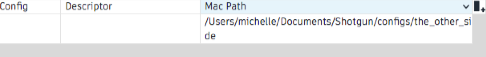
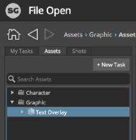

# Editing a pipeline configuration
After completing this guide, you will have the knowledge fundamental to: 

* Finding a configuration setting for a specific Toolkit app
* Editing the settings
* Exploring what other functions the configuration settings can extend.

## About the guide
 
This guide describes how to edit settings within an existing Pipeline Configuration to meet the needs of a project pipeline. The first guide, **[Getting started with configurations](./advanced_config.md)**, described how to prepare a pipeline configuration for editing. If you aren’t familiar with how to create an editable configuration for your project, complete **Getting started with configurations** before proceeding.

Through extending the Default Configuration, Shotgun Toolkit allows for customizing tasks within pipeline workflows. An example of a customization might be as simple as enabling or disabling a button in a Toolkit app within one or more software packages, changing the way users interact with Toolkit's features. Toolkit allows proprietary configurations that enable you to work smarter and faster by: creating custom workflows, automating repetitive and mundane tasks, modifying hooks, and even adding custom tools built on the Toolkit platform. Unfortunately, it’s only accessible through Shotgun software integrations, and not yet released for everyday tasks like washing your clothes.

The exercises in this guide will teach you how to find what configuration settings control actions within the Shotgun software integrations, where the settings live, and how to edit them. Specifically, we will edit a setting in the Workfiles app that manages the behavior of the **+New Task** button, preventing artists from creating a new task when working on a project inside Maya.

### Using this document
 
To use this guide and perform an edit on a pipeline configuration, the following is required:

1. An active [Shotgun](https://www.shotgunsoftware.com/signup/?utm_source=autodesk.com&utm_medium=referral&utm_campaign=creative-project-management) site.
2. A project with at least one asset. You can add an asset to the_other_side project you created in the first guide. You can review how to create an asset for a project in the [Getting started with configurations](./advanced_config.md) guide.
3. A pipeline configuration for the identified project, or complete the [Getting started with configurations](./advanced_config.md) guide and use the configuration created in that exercise.
4. Read and write permissions set appropriately for the filesystem where the Pipeline Configuration is stored.
5. Shotgun Desktop installed on your system.
6. An active subscription for Maya. Get a 30 day trial of Maya [here](https://www.autodesk.com/products/maya/free-trial-dts?adobe_mc_ref=https%3A%2F%2Fwww.google.com%2F&adobe_mc_sdid=SDID%3D577C0A84DDF5D35D-50E96EA2052056FE%7CMCORGID%3D6DC7655351E5696B0A490D44%2540AdobeOrg%7CTS%3D1543444689) 

**NOTE:** This guide is based on the `tk-config-default2` pipeline configuration. If your config was modified, the location of files, folders, and blocks of YAML settings may vary from what is described here.

## About the Workfiles app

The Workfiles app governs file management in a Shotgun software integration and controls access to functionality for browsing, opening, and saving work files. The **+New Task** button is an action of the Workfiles app that allows a user to add a task without having to go to Shotgun to do so. The configuration is broken down into per-environment files. This allows you to manage functionality relative to different stages in the pipeline, controlling when a user can create, name and save files, execute tasks, or perform certain functions. This is relevant for all the functions in the Workfiles app and it also applies to modifying settings for any app or engine. Find more details in the [Advanced Topics](#advanced-topics) at the end of this document.
 
### Getting familiar with the configuration files

Use the Pipeline Configuration List in Shotgun to locate where the pipeline configuration is stored for the project you’re working with. If you know where it’s stored, you can skip to <a href="#step5">Step 5</a>.

## Begin Exercise 

### Finding the pipeline configuration

**Step 1:** Open the **Shotgun site** that manages the project you will be using for this exercise.

**Step 2:** Access the project from the **Shotgun site** by selecting it from the **Projects page**.


**Step 3:** Select the **avatar** in the upper right to display the **ADMIN** menu and scroll down to select **Default Layouts > Pipeline Configuration > Pipeline Configuration List**.


**Step 4:** Once the **Pipeline Configuration List** is displayed, select the **+** sign on the far right of the column headers to add another column. In the dropdown list, choose the appropriate path for your operating system.
  


The path will be displayed in a new field.



**Step 5:** In a terminal or file manager, browse to the folder where the project’s pipeline configuration is stored and open the folder. 

There are three subfolders in a Toolkit configuration root folder: **cache**, **config** and **install**. Open the **config** folder and nested inside you will find several subfolders and a few files. 


The **env** folder stores the integration settings that support the environments artists work within. Environments allow different stages in the pipeline to have customized configuration settings. The Default Configuration comes with a set of pre-defined environments, but these can be modified if your pipeline requires a more granular set.

**Step 6:** Open the **env** folder.

Toolkit uses YAML files to configure functionality. YAML was chosen as the language for the configurations because it allows the files in Toolkit to be formatted in a way that’s easily readable, lightweight, and simple to customize. You can explore more about YAML [here](https://yaml.org/). The configurations are made up of nested YAML files that provide identifiers engines, apps, and frameworks. It’s a roadmap of sorts guiding you to the specific bundle of code that controls the actions you want to affect.

### Editing the configuration file

Shotgun Toolkit allows alterations to the apps that are integrated within various software packages. One of the functions of the Workfiles app is the **+New Task** button, which allows a user to add a new task in the **File Open** dialog box. By default, this function is enabled for every user at every phase of a project. But a studio might want to restrict this functionality – say, if they have a specific naming convention, or want to limit task creation to a project's production management team. In this case, they would disable the **+New Task** button for all the points in a pipeline where artists will be working in Maya.

### Disabling the +New Task button for projects in Maya

**Step 7:** Open **Shotgun Desktop**. Select the project whose configuration you are going to edit. 


**Step 8:** Launch Maya from Shotgun Desktop. 


Wait for the **Shotgun** menu to fully load. If you have a slow internet connection, this would be the time to run the configuration that makes you that perfect shot of espresso with just the right amount of crema.

Once Maya and Shotgun are fully loaded, the **File Open** dialog box will open automatically. When launching Maya from Shotgun Desktop, you will enter Maya in the project environment; the `config/env/project.yml` file drives the configuration for your Maya integration. The environments that are identified in the Default Configuration are `project`, `sequence`, `shot`, `shot_step`, `asset`, `asset_step`. 

**Step 9:** Select the **Assets** tab in the left pane of the **File Open** dialog box. Select any asset inside the folder displayed in the search results. 



The **+New Task** button is enabled.

### Find what setting controls the +New Task button

Toolkit pipeline configurations are used to customize environments to meet your pipeline's needs. A pipeline configuration can override default Shotgun integration settings, varying as much or as little as necessary to meet the needs of a project’s pipeline. This structure allows configurations to be lightweight, adding only the settings that are different from the default values in the Shotgun core code. In this exercise, we want to turn off the Workfiles app's **+New Task** button, but before we can do so, we need to figure out which configuration setting controls it.

**Step 10:** Select the **>** at the top right of the **File Open** window next to **Project (name of project)**. 

This reference box shows details about the configuration settings that control the functions of the **File Open** window. Some apps in Toolkit have a reference box to show what settings are used for the app and what the default settings are. Notice the **Location:**: identifier is **tk-multi-workfiles2**. This is the identifier for the bundle of code that creates the Workfiles app. When searching a pipeline configuration this name will identify where the settings live for the app. There’s an [Apps and Engines page](https://support.shotgunsoftware.com/hc/en-us/articles/219039798-Integrations-Apps-and-Engines) that lists all the configuration settings, apps, and engines for what’s available in a Shotgun Integration.


Look under the **Configuration** header to find the settings for this specific environment. 


**NOTE:** After the setting **my_tasks_filters** is a setting **launch_at_startup**. This is important to note because it’s the default setting for the **File Open** setting in the project environment. This tells you that when Maya is launched from the Shotgun Desktop, the **File Open** dialog box automatically opens. 

Scroll down to **Setting allow_task_creation**. The default value of this setting is **True**, allowing a user to create a new task while in the Maya project environment.


When searching for a setting there are several things to consider:

* What software application you are running.
* What file you are working on and what environment you are working in. This is found in the App’s reference box.
* What the specific setting is called. This is found in the App’s reference box or on the [Apps and Engines page](https://support.shotgunsoftware.com/hc/en-us/articles/219039798-Integrations-Apps-and-Engines) page.
* What YAML file to extend. There are identifiers and a roadmap detailed in the YAML files to guide you to where the settings live.
* What specific blocks within the YAML file to extend. This is identified in the roadmap.
* What identifiers and symbols are used in the YAML files.
* And, most importantly, where the configuration is stored for the current project.

A setting can be utilized in multiple places within a pipeline configuration. What determines where it goes are: which software integration you want to affect and where in the pipeline process you want to impact a change. 

### Find where to set the value for `allow_task_creation`

**Step 11:** Bring the main Maya window forward. 

**Step 12:** Find the **Shotgun** menu item in the upper right of the Maya window.


**TIP:** If the menu isn’t visible there will be **>>** to show that some menu items are hidden. Select the **>>** to display the Shotgun menu or you can widen the Maya window.

**Step 13:** Select **Shotgun > Project the_other_side > Work Area Info…** on the top right of the menu.


The **Work Area Info** dialog box shows what’s under the hood and details about your current work area. This includes the environment that you are is working in and the path to the environment configuration file where the settings are located. 

**Step 14:** In the **Your Current Work Area** dialog box, select the **Environment** tab at the bottom.

The first item identifies the engine being used. The engine is what drives the ability to have the Shotgun tools integrated within a specific software application. It holds the logic specific to each software integration. The second item displayed in the window shows the path where the current project environment is located.


The last two folders are `config/env/` followed by `project.yml`. The `project.yml` file is the start of the roadmap that will guide you to where the settings for the current environment are located.

**Step 15:** Open `project.yml` in your favorite text editor.

```
description: Apps and Engines when launching with a project only context.

################################################################################

includes:
- ./includes/frameworks.yml
- ./includes/settings/tk-3dsmaxplus.yml
- ./includes/settings/tk-desktop.yml
- ./includes/settings/tk-flame.yml
- ./includes/settings/tk-houdini.yml
- ./includes/settings/tk-mari.yml
- ./includes/settings/tk-maya.yml
- ./includes/settings/tk-motionbuilder.yml
- ./includes/settings/tk-nuke.yml
- ./includes/settings/tk-photoshopcc.yml
- ./includes/settings/tk-shell.yml
- ./includes/settings/tk-shotgun.yml

################################################################################
# configuration for all engines to load in a project context

engines:
  tk-3dsmaxplus: "@settings.tk-3dsmaxplus.project"
  tk-desktop: "@settings.tk-desktop.project"
  tk-flame: "@settings.tk-flame.project"
  tk-hiero: "@settings.tk-nuke.hiero.project"
  tk-houdini: "@settings.tk-houdini.project"
  tk-mari: "@settings.tk-mari.project"
  tk-maya: "@settings.tk-maya.project"
  tk-motionbuilder: "@settings.tk-motionbuilder.project"
  tk-nuke: "@settings.tk-nuke.project"
  tk-nukestudio: "@settings.tk-nuke.nukestudio.project"
  tk-photoshopcc: "@settings.tk-photoshopcc.project"
  tk-shell: "@settings.tk-shell.project"
  tk-shotgun: "@settings.tk-shotgun.project"

################################################################################
# reference all of the common frameworks

frameworks: "@frameworks"

```

<!---->

Inside `project.yml`, there are three sections below the description: `includes`, `engines`, and `frameworks`. The `includes` section is a list of file pointers that *reference* other YAML files in the configuration. The architecture of the Default Configuration takes advantage of nesting files and using pointers as another way to keep the files lightweight. Following the **includes** will bring you through one file to the next until you find the configuration setting you are looking for. It’s a bit like Russian Matryoshka dolls: you open up each doll that’s nested inside the next until you find the appropriate configuration setting.

Every engine is identified as `tk-<name of software application>`. You know you want to affect settings in Maya, so the identifier we’re looking for is `tk-maya`.

Look under the `includes:` section of the `project.yml` file and find this line, `./includes/settings/tk-maya.yml`. This line indicates the configurations controlling the **settings** for the Maya engine, `tk-maya`, are nested inside the **includes** folder within the **settings** folder.

In the `engines:` section find the `tk-maya` value. 

`tk-maya: "@settings.tk-maya.project"`

The `@` signifies that a value is coming from an included file. 

The `settings` and `project` reference indicate it’s a project’s settings. These are naming conventions within the Default Configuration that help to guide you. 

This complete line tells us to look for the `settings.tk-maya.project` block in the included file to find the configuration settings for the Maya engine, `tk-maya`. 

Shotgun Toolkit uses simple terms in the YAML files to indicate the names of the settings and what paths will lead you to them. You already know from looking in the Maya **File Open** reference box that the bundle of code which controls how the **+New Task** button performs, is identified by `tk-multi-workfiles2`. Toolkit bundles are referenced in the YAML files using these identifiers. ‘tk-multi-workfiles2’ is the identifier for the Workfiles app code bundle, and the **+New Task** button is a function of the Workfiles app.

Looking for the Workfiles App settings in tk-maya.yml

**Step 16:** In your file browser, browse to the **env/includes/settings** folder and open `tk-maya.yml`.


**Step 17:** Following the include from `project.yml`, search the `tk-maya.yml` file for `settings.tk-maya.project`. You are specifically looking to disable the **+New Task** button in the project environment of a specific project. You are in the configuration for that project and obtained the location information while you were in the project environment. 

```
# project
settings.tk-maya.project:
  apps:
    tk-multi-about:
      location: "@apps.tk-multi-about.location"
    tk-multi-screeningroom: "@settings.tk-multi-screeningroom.rv"
    tk-multi-shotgunpanel: "@settings.tk-multi-shotgunpanel"
    tk-multi-workfiles2: "@settings.tk-multi-workfiles2.launch_at_startup"
  menu_favourites:
  - {app_instance: tk-multi-workfiles2, name: File Open...}
  location: "@engines.tk-maya.location"
```

<!---->

Under `settings.tk-maya.projects`, the `tk-multi-workfiles2` app settings are listed as 

`tk-multi-workfiles2: "@settings.tk-multi-workfiles2.launch_at_startup"`

The `@` symbol tells us that that the value for `tk-multi-workfiles2` is coming from an included file. In the `includes` section at the top of `tk-maya.yml`, we see the following:

```
includes:
...
- ./tk-multi-workfiles2.yml
```

We should look for `settings.tk-multi-workfiles2.launch_at_startup` in the `tk-multi-workfiles2.yml` file, in the same directory as the current file, `config/env/includes/settings`.

**Step 18:** Open the `tk-multi-workfiles2.yml` file and search for `settings.tk-multi-workfiles2.launch_at_startup`.

```
# launches at startup.
settings.tk-multi-workfiles2.launch_at_startup:
  launch_at_startup: true
  entities:
```
  
<!---->

The Maya reference box indicated the `allow_task_creation` setting has a default value of `true`. As a best practice, no default settings are reflected in a pipeline configuration. This allows for a **sparse** format, adding only the settings that differ from the default code to the configuration. If a setting isn’t explicitly provided, any calls accessing that setting will receive the default value. When Toolkit reads the configuration and builds an environment, the apps, engines, and frameworks running in that environment use that project’s pipeline configuration settings and override any default settings based on what’s in the configuration. 

**Step 19:** In `tk-multi-workfiles2.yml`, add `allow_task_creation` under `settings.tk-multi-workfiles2.launch_at_startup:` and set the value to `false` 

```
# launches at startup.
settings.tk-multi-workfiles2.launch_at_startup:
  allow_task_creation: false
  launch_at_startup: true
  entities:
```
  
<!---->

**NOTE:** Toolkit Default Configuration settings are organized alphabetically as an easy way to find specific settings. Keeping this convention will make your life a lot easier as the configuration gets a little heavier.

**Step 20:** Save the file.

### Reload the configuration

**Step 21:** In the **File Open** dialog box inside of Maya, open the reference box and select **Reload Engines and Apps**.


This will reload the configuration settings.

### View your changes

**Step 22:** Navigate to the **File Open** dialog box and select an asset.


Notice that the **+New Task** button is not visible.

You’ve modified a configuration setting for the Workfiles app, changing the behavior of a button in a project environment. Since you only modified that setting in the project environment, if you start working in another environment the settings for the **+New Task** button will still be active. In a real production example, you'd likely make the change we made here for *all* environments.

### Changing environments

**Step 23:** Under the Assets search results, open a folder and select asset you wish to work on.


**Step 24:** Select **+New File**

By selecting **+New File**, you began to work on a new asset and the `asset_step` environment was loaded in Maya. When an artist selects an asset task and creates a new file or opens an existing one, the `asset_step` environment is automatically loaded, presenting the tools and functions configured for that stage in the pipeline.

### Discover what environment you are working in

**Step 25:**  In the upper right of the Maya menu select **Shotgun**.


**Art, Asset** tells you’re working on and what environment you’re in.

**Step 26:** Select **Art, Asset > Work Area Info…** to display what the parameters are in your current work area. 

**Step 27:** Select the **Environment** tab at the bottom.


Each environment will display the information necessary to determine where the settings live in the pipeline configuration. To disallow an artist from adding a new task, it’s necessary to disable the **+New Task** button for every environment that artist works in. For each environment, use the same steps outlined above to edit the configuration appropriately.

NOTE: Each environment is independent, a project has a dedicated configuration, and the software integrations only read settings for their specific software from the pipeline configuration when a project is loaded.

You've now edited your pipeline configuration, making a change to the settings for an app. And now the real fun begins: learning all the things you can do with Shotgun Toolkit environments. Here are some advanced topics to explore. 

## Advanced topics

In this guide, we made a simple change to the configuration settings for an app, in a single engine (`tk-maya`) and in a single environment (project). You’ve learned that Toolkit is organized by environments, each environment is unique for every software implementation, and the environments are focused by project and task allowing you to have specific functions available for artists at defined points in a pipeline. You can generalize our simple change to make rich customizations to your Toolkit pipeline configuration.

### Other engines

The system name for the Workfiles app is `tk-multi-workfiles2`, and `multi` in the name implies that it’s a **multi app**. Multi apps are software-agnostic: their features and functionality are the same whether you run them in Maya, Nuke, Houdini, or any other supported app. If you wanted to disable task creation in Workfiles across all software packages, you’d follow the steps in this guide for every **engine**: `tk-nuke`, `tk-houdini`, and so on.

### Other environments

We disabled task creation in the project environment, but in a real studio environment, you’d probably want to disable it for all environments in which your artists are working. To do so, you’d follow the steps in the guide, but instead of starting at `project.yml`, you’d start at `asset_step.yml`, `shot_step.yml`, and so on.

### Creating custom environments

The Default Configuration comes with a set of pre-defined pipeline steps: `project`, `sequence`, `shot`, `shot_step`, `asset`, and `asset_step`. However, a studio might want different configuration settings for every stage in the pipeline – say `asset_step_rig`, `asset_step_model`, `shot_step_anim`, `shot_step_light`, and so on. You can create custom environments by adding the desired environment configuration files to `config/env` and overriding the `pick_environment` core hook to recognize your new environments. Hooks allow you to modify bits of the logic that runs at various points in Toolkit workflows, and the [`pick_environment` core hook](https://github.com/shotgunsoftware/tk-core/blob/master/hooks/pick_environment.py) contains the logic that Toolkit uses to determine the environment. You can take over the hook to modify this logic.

### Video Resources

* [Intro to Toolkit configurations](https://www.youtube.com/watch?v=7qZfy7KXXX0&t=1961s) from our SIGGRAPH 2018 Developer Day
* [Demystifying the Default Configuration webinar](https://www.youtube.com/watch?v=eKHaC1dZCeE)

Now that you’ve learned how to modify an app configuration setting, try [adding an app to your Toolkit configuration](./installing_app.md)
