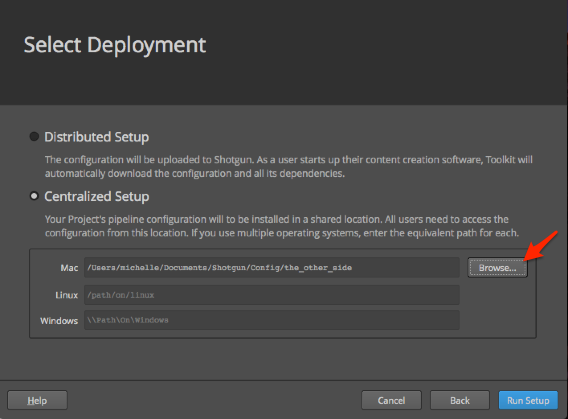

# Getting started with configurations



## About the guide
 
This guide describes how to use the Advanced Project Setup Wizard in Shotgun Desktop to create a configuration for a digital content creation pipeline. You will quickly become acquainted with the configuration tools, learn how to use the Wizard, and be presented with opportunities to learn more. Using the Wizard creates a Default Configuration with information specific to your project and prepares the configuration to be edited and extended to support each step in the pipeline. The configuration controls aspects of the UI, Shotgun Apps, and various tools necessary to support a production pipeline. Using the Wizard is just one way to extend a configuration. Along with adding specific settings for each step in a pipeline it will add integrations with software applications, and add some apps making it easier to utilize and customize for any project’s pipeline needs.  

This guide assumes the user: 

1. Has never used the Advanced Project Setup Wizard
2. Has some basic knowledge of how to use Shotgun
3. Is new to Shotgun Toolkit. 

After completing this guide, the user will have the knowledge fundamental to exploring ways to extend the configuration for a project.

## Using this document
 
To use this guide and create a Default Configuration the following is required:

1. An active Shotgun site. You can register for Shotgun [here](https://www.shotgunsoftware.com/signup/?utm_source=autodesk.com&utm_medium=referral&utm_campaign=creative-project-management) and get a 30-day trial to begin exploring. 
2. Shotgun Desktop. If Desktop is not installed, you can begin by following this [link.]( https://support.shotgunsoftware.com/hc/en-us/articles/115000068574-Integrations-user-guide#Installation%20of%20Desktop) 
3. Access to a filesystem where you can store project files and a pipeline configuration. On the filesystem, create a `projects` folder and a `configs` folder.
4. A configuration folder named `the_other_side`. Inside the `configs` folder where you store your configs, create a folder using this project name. We will be creating a project called "the_other_side" in this exercise.
 
  
## About the Advanced Project Setup Wizard

The Advanced Project Setup Wizard in Shotgun Desktop generates a Default Configuration that provides a solid base to build on, adding key software integrations, customizable settings, apps and UI elements that support the pipeline process. It creates a configuration you can edit and extend to meet your project’s pipeline needs.

The Default Configuration includes: 
* A basic filesystem schema and templates that determine where files live on disk 
* All of the supported [software integrations](https://support.shotgunsoftware.com/hc/en-us/articles/219039798-Integrations-Apps-and-Engines) allowing file management from directly inside the user’s software applications. 

Customizations are only limited by imagination, cleverness, and programming knowledge or the ability to borrow from what others in the Shotgun community have created.
 
## Extending the Default Configuration 

A configuration is required for every project. The first time a project is accessed through Shotgun Desktop, a Basic Configuration is generated by Shotgun Toolkit. This Basic Configuration automatically detects the supported software applications a user has on their system. Settings in the pipeline configuration govern the integrations within the supported software applications that display project related information and the apps that manage project files. The project information is displayed through the integrated display [Panel]( https://support.shotgunsoftware.com/hc/en-us/articles/219033098-Shotgun-Panel). Publishes are managed by publishing files with the [Publisher]( https://support.shotgunsoftware.com/hc/en-us/articles/219032998-Publishing-your-work). Loading published files is managed through the [Loader]( https://support.shotgunsoftware.com/hc/en-us/articles/219033078-Load-Published-Files-). The Basic Configuration does not include filesystem management setup or the development of templates for specifying how files and directories are named on your disk. It also doesn’t have the plethora of Apps that are added when a Default Configuration is created. It is a bare-bones configuration that allows Toolkit to run without any manual editing of configuration files. The Wizard  generates a Default Configuration based on the settings you choose and has more apps and engines to support you on your journey. This guide will expand your mind to the possibilities. 

## Difference between the Default Configuration and Basic Configuration.

## SHOTGUN CONFIGURATIONs

| BASIC CONFIGURATION | DEFAULT CONFIGURATION |
|:-------------------:|:---------------------:|
| A Basic Configuration is automatically downloaded and updated from a GitHub repository when a project is accessed. | A Default Configuration is automatically downloaded from a GitHub repository when using the Advanced Configuration Tool and takes the place of the Basic Configuration.|
| A hidden file with limited settings that can be edited.| An accessible file with settings that meet the needs of a simple pipeline workflow and can be edited.|
| Automatically updated when core changes are made to shotgun | Manually updated when core changes are made to shotgun |
| No support for filesystem schema | A basic filesystem schema and templates that determine where files live on disk |
| BASIC SOFTWARE INTEGRATIONS: | MORE SOFTWARE INTEGRATIONS: |
| 3d max, Houdini, Maya, Nuke, Photoshop, Flame | 3d max, Houdini, Maya, Nuke, Photoshop, Flame, Hiero, Motionbulder, Mari | 
| Change settings, add environments, modify Hooks into core code, create custom tools and apps | Change settings, add environments, modify Hooks into core code, create custom tools and apps |
| Add software application integrations not included in the default and choose which ones are available in desktop | Add software application integrations not included in the default and choose which ones are available in desktop |
| BASIC TOOLKIT APPS BEYOND SOFTWARE INTEGRATIONS INCLUDED: | MORE TOOLKIT APPS BEYOND SOFTWARE INTEGRATIONS INCLUDED: |
| The panel, Publisher, Loader, Launch Applications, Review, Submit | The panel, Publisher, Loader, Launch Applications, Review, Sumbit, Workfiles, Snap Shot, Scene breakdown * |
|   | * *These are just the basics. There’s so much more than what’s listed here. Some apps work only in relevant software integrations, or are specific to administering shotgun.*

## Difference between the Default Configuration and Basic Configuration.

## SHOTGUN CONFIGURATIONs

| BASIC CONFIGURATION | DEFAULT CONFIGURATION |
|:-------------------:|:---------------------:|
| A Basic Configuration is automatically downloaded and updated from a GitHub repository when a project is accessed. | A Default Configuration is automatically downloaded from a GitHub repository when using the Advanced Configuration Tool and takes the place of the Basic Configuration.|
| A hidden file with limited settings that can be edited.| An accessible file with settings that meet the needs of a simple pipeline workflow and can be edited.|
| Automatically updated when core changes are made to shotgun | Automatically updated when core changes are made to shotgun |
| BASIC SOFTWARE INTEGRATIONS: | MORE SOFTWARE INTEGRATIONS: |
| • 3d max | • 3D Max | 
| • Houdini | • Houdini |
| • Maya | • Maya |
| • Nuke | • Nuke |
| • Photoshop | • Photoshop |
| • Flame | • Flame |
|   | • Hiero |
|   | • Motionbuilder |
|   | • Mari|
| Change settings, add environments, modify Hooks into core code, create custom tools and apps | Change settings, add environments, modify Hooks into core code, create custom tools and apps |
| Add software application integrations not included in the default and choose which ones are available in desktop | Add software application integrations not included in the default and choose which ones are available in desktop |
| Basic toolkit apps beyond software integrations included: | More toolkit apps beyond software integrations included: |
| • The panel | • The panel |
| • Publisher | • Publisher |
| • Loader | • Loader |
|   | • Launch application |
|   | • Workfiles
|   | • Sync frame range with shotgun
|   | • Screening room integration
|   | • Scene breakdown
|   | • Shotgun python console
|   | • Scene snapshot
|   | • Review submission
|   | • Perforce
|   | • About shotgun pipeline toolkit
|   | • Shotgun toolkit demos
|   | * *These are just the basics. There’s so much more than what’s listed here. Some apps work only in relevant software integrations, or are specific to administering shotgun.*

In this guide you will use the Shotgun Advanced Configuration Wizard to generate a Default Configuration and associate it with a project. Generating a Default Configuration sets you up for editing the configuration to allow for the customizations necessary to support a proprietary production pipeline.

## Prepare to create a Default Configuration

**Step 1:** Create a new project in Shotgun called "the_other_side.”

**Step 2:** Launch the Shotgun Desktop app and log in using the same username and password from your Shotgun site.

**Step 3:** Navigate to the Project where you wish to run the Advanced Project Setup Wizard by selecting its thumbnail image.

TIP: If a new project was created while Desktop was open, the Projects window may need to be refreshed to see the new projects. Click on your profile Avatar at the bottom right of the desktop and select Refresh Projects.

## Creating the Advanced Configuration

A Basic Configuration was generated when the project was accessed. The Publish App and other software packages available with the Default Configuration were detected and automatically added to the Apps pane. 

**Step 4:** Once the project is loaded, click on your profile Avatar at the bottom right of the screen. In the popup menu select "Advanced project setup…” to initiate the Advanced Project Setup Wizard.

A dialog box will be displayed with four options and Shotgun Default selected. At this point there’s an option to select a configuration file that already exists somewhere else instead of using the Default configuration generated by the Toolkit. There are three different options for importing a configuration from somewhere else. 

For example, there may be a current project where the technical director (TD) had extended the configuration significantly to allow for specific proprietary pipelines within your facility and you don’t want to recreate those again. In this example you would select **Another Project**, then navigate to that project’s configuration file. The Wizard will base your project's new configuration on the selected project's. 

A different scenario might be that you heard about a pipeline guru who created significant time saving shortcuts to some of the tedious work involved in sharing effects used in multiple shots for an episodic, like the millions of times the transporter effect has been used in Star Trek. Lucky for you she’s shared the configuration settings with the Shotgun community in Github. In this case you would choose the option, **Git**. 

For the last option let’s say there’s a sequel you’ve been asked to produce and your facility produced the original movie five years ago. Fortunately, your facility maintains a repository that neatly stores the various configurations used over the years. To retrieve the configuration that was used for this scenario you would choose **Browse**, to browse to the configuration path on disk.

For this exercise use **Shotgun Default**. This option will create a Default Pipeline Configuration for the project.

**Step 5:** Click Continue. 

A dialog box will be displayed with two options and Default selected. At this point there’s an option to select a Legacy Default Configuration setup. This configuration setup is from an older version of Shotgun for studios who still use that version. We will use the Default for this exercise.

**Step 6:** Click Continue.

Define the storage locations for project files.

A dialog box will appear displaying a drop down menu next to the word `Storage:`

**Step 7:** Identify where to store project data for this project. From the dropdown at the top of the dialogue box select **+ New** and type **projects** in the field. 

Three operating systems are supported in Shotgun Toolkit: Linux, Mac, and Windows.

**Step 8:** Select the field next to the operating system utilized for storing project data. Select the folder icon and navigate to the project folder created on the filesystem prior to this exercise.

This setup allows Shotgun to have access to only the folder you identify for storing production data. When preparing for this exercise you added a projects directory above the Shotgun root directory. The projects directory is where Shotgun will store any local project related information. The folder you identify will be the only place a Shotgun site will store information. For more information about what data is stored here and how Shotgun accesses this folder explore [here](link to describe Shotgun local data)

**Step 9:** Select save to identify the projects folder as the storage destination for project data.

The operating system path is automatically updated to identify the path where the project data is stored.

**Step 10:** Select continue.

## Name the Project Folder. 

A dialog box is displayed with the name of the project populating the text field. The name is automatically populated pulling from the project information and the path is automatically updated.

Shotgun can work in either a Distributed Setup, where each user downloads a copy of the Pipeline Configuration to their local machine, or a Centralized Setup, where the users share a single configuration over a network. For this exercise we will use a Centralized Setup. 

The final step generates the appropriate folders, files, and data necessary to create the configuration specific to a project. Find (more information) [Link to more about how this works…] on what’s part of the configuration and the types of customizations possible.

**Step 11:** Under the appropriate file system click browse and navigate to the configuration folder you created when preparing for this exercise.  /config/the_other_side. Select Run Setup and… wait for it… 

**Step 12:** Select **Done** to display the new icons populating the project Apps pane. Shotgun automatically detected the software on your system and added the new launchers that are part of the Default Configuration to your Shotgun Desktop.

TIP: Pin the app to the menu bar to allow quick access to Shotgun Desktop: Click on your Avatar and select Pin to Menu.

You’re done, the project setup is complete, and you’re ready to start customizing.

Take a look in the configs folder and you will find several folders and files. Explore a little to see what’s in there.

And now the real fun begins, learning all the things you can do with the Configuration. Below are some advanced topics to explore:

# Advanced Topics

Shotgun Toolkit provides many convenient ways to edit, clone, or take over a configuration. Extending existing configurations will save time and allow you access to all of the cool stuff that others within your network have created. You can take advantage of the vast Shotgun [community](link to a good place in the community) that may have the exact configuration you need. The Shotgun community is a sharing community, so be kind, say thank you, and recognize the person who created the configuration that helped you get the job done. Oh, and don’t forget to give back, it’s how we help our fellow Shotgun gurus and what makes it so special to be a part of this community! 

Below are some ways you can have fun with configurations

## Using the command line to create a default configuration

From inside any project configuration the tank command lets you run administrative commands and apps from a command shell. The tank command lets you run administrative commands and apps from a command shell. Each new project you create gets its own Core API with a tank command. The `tank set_up` command will run a script that creates a default configuration and don’t worry if you follow the guide carefully you won’t blow anything up. 

If you’re not currently logged into your project in Desktop when using the tank command, you will be prompted to login. To see all available commands for a project navigate to a project configuration and execute the tank command:

$ `cd  ../configs/your_project_name`

$ `./tank`

There's a lot you can do with the [tank command](https://support.shotgunsoftware.com/hc/en-us/articles/219033178-Administering-Toolkit#Using%20the%20tank%20command).

## Editing a configuration that's in production

There will be times when you want to edit a configuration that is currently in production and you won't want to edit it while artists are using it. With just a few commands Shotgun provides a way to copy an existing configuration, setup a temporary Sandbox to edit and test the configuration, and then push it into production. This process replaces the production configuration with the new one and automatically backs up the old one. 

Creating a staging sandbox allowing you to play with a copy of the pipeline configuration currently being used in production. In the sandbox you make changes to the copy of the configuration and test the changes before pushing the changes live into production. This way you don’t affect the live configuration until the copy is fully tested. 

The reasons you would want work on a copy of a configuration are:

1. To update the configuration
2. Test some modifications before going live
3. Upgrade, or add some apps
4. Do development and roll it out after it’s been tested

To create a copy of the live pipeline configuration you would use the creating a clone process detailed in the Configuration, staging and rollout [guide](link to guide). 

or

Here are some basics on [configuration management](https://support.shotgunsoftware.com/hc/en-us/articles/219033168-Configuration-staging-and-rollout#Basics%20of%20configuration%20management).

## Sharing configuration files between users

Sharing configuration files allows all users with specified roles on a project to work in the same environment instantaneously. An environment is loaded based on the task the user is performing and each task can have their own environment with specific tools, UI and apps specific to that task. The simplest way to distribute a Toolkit configuration to a group of users, whether these are distributed in different locations or all working in the same building, is to [upload the configuration](https://developer.shotgunsoftware.com/tk-core/initializing.html#uploading-a-configuration-to-shotgun) to Shotgun.

There will be times when you want to edit a configuration that is currently in production and you won't want to edit it while artists are using it. With just a few commands Shotgun provides a way to copy an existing configuration, setup a temporary Sandbox to edit and test the cloned configuration, and then push it into production. This process replaces the production configuration with the new one and automatically backsup the old one. Here are some basics on [configuration management](https://support.shotgunsoftware.com/hc/en-us/articles/219033168-Configuration-staging-and-rollout#Basics%20of%20configuration%20management).

## Working with more than one root folder

Ideally your facility would want to be optimized for specific tasks and for processing those tasks. Shotgun helps you with both. You can work with more than one root folder to optimize things like video playback for dailies on one server and interactive processing on another. 

What if you want to share files with a client? The easiest way is to give them a link to view the content on your server and create a share drive specifically for that reason. You wouldn't want them to see what else you might be working on. Keeping your work files in a secure drive while giving your clients access somewhere else is ideal. Shotgun provides a way to do just [that](https://support.shotgunsoftware.com/hc/en-us/articles/219040478-How-do-I-convert-my-project-from-a-single-root-to-a-multi-root-configuration-).

Cloning a configuration: copying your configuration, creating a sandbox, and safely editing, extending, and testing before pushing the new configuration live are important aspects of managing Shotgun Toolkit. Shotgun helps you with streamlining production and managing your pipeline while Shotgun Toolkit provides a way to setup the environments for artists to work and interact with content more effectively while also providing efficient ways to interact with your facility.

Jump into the next getting started guide. [Editing a Pipeline Configuration](link)
