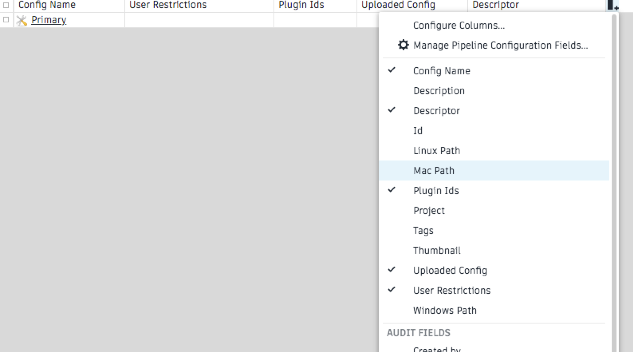
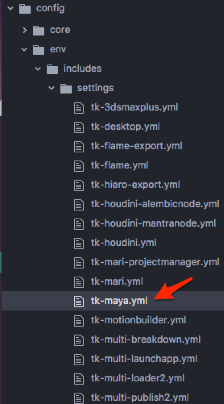

# Editing a Pipeline Configuration



## About the guide
 
This guide describes how to edit settings within an existing Pipeline Configuration to meet the needs of a project pipeline. The first guide, [Getting started with configurations](./advanced_config.md), described how to prepare a pipeline configuration for editing. If you aren’t familiar with how to create an Advanced Configuration, complete the Advanced Configuration Guide before proceeding.

Through extending the Default Configuration, Shotgun Toolkit enables the creation of custom workspace [environments](link to environments document) creating an integrated UI that allows for custom pipeline workflows. An example of a customization might be as simple as enabling and disabling a button to control at what step in a pipeline a function of a Toolkit App can or cannot be used, and by whom. These customizations change the way specified users interact with the Apps. Toolkit allows proprietary configurations that enable you to work smarter and faster by: creating custom workflows, automating repetitive and mundane tasks, modifying hooks as well as adding custom tools. Unfortunately, it’s only accessible through Shotgun, and not yet released for everyday tasks like washing your clothes.

The exercises in this guide will teach you how to find what configuration settings control actions within the Shotgun Toolkit software integrations, where the settings live, and how to edit them. We will edit a setting in the Workfiles App that manages the behavior of the +New Task button in Maya and prevents an artist from creating a new task when working on a project inside Maya. After completing this guide, you will have the knowledge fundamental to: finding a configuration setting for a specific Toolkit app, editing a setting, and exploring what other functions the configuration settings can extend.

## Using this document
 
To use this guide and perform an edit on a pipeline configuration the following is required:

1. An active [Shotgun](https://www.shotgunsoftware.com/signup/?utm_source=autodesk.com&utm_medium=referral&utm_campaign=creative-project-management) site.
2. A project with at least one asset, or you can add an asset to the_other_side project you created in the first guide. You can review how to create an asset for a project [here](link). Or follow these simple steps.
   * Open the project in a Shotgun site
   * From within the project, select the +Asset button
   * Fill out the form with Asset Name and Asset Type
   * Select Create Asset
3. A pipeline configuration for the identified project, or complete the [Getting started with configurations](./advanced_config.md) and use the configuration created in that exercise.
4. Read and write permissions set appropriately for the filesystem where the Pipeline Configuration is stored.
5. Shotgun Desktop installed on your system.
6. An active subscription for Maya. Get a 30 day trial of Maya [here](https://www.autodesk.com/products/maya/free-trial-dts?adobe_mc_ref=https%3A%2F%2Fwww.google.com%2F&adobe_mc_sdid=SDID%3D577C0A84DDF5D35D-50E96EA2052056FE%7CMCORGID%3D6DC7655351E5696B0A490D44%2540AdobeOrg%7CTS%3D1543444689) 

NOTE: This guide is based on the `tk-config-default2` pipeline configuration. If your config was modified, the location of files, folders, and blocks of YAML settings may vary from what is described here.

## About the Workfiles Application

The Workfiles App governs file management in Shotgun Toolkit and controls access to functionality for browsing, opening, and saving Workfiles and [Publishes](link to glossary). The **+New Task** button is an action of the Workfiles App and allows a user to add a task to any appropriate phase of the pipeline. The configuration is broken down into blocks representing each step in the pipeline. This allows you to manage functionality relative to each step in a pipeline controlling when a user can create, name and save files, execute tasks, or perform certain functions. Each block in the configuration defines the environment the artist is working in. The settings can be very high-level, for example not allowing any artist within Maya to add a file or create a new task, or very granular, stating that an artist working on assets can’t add a new file or a new task at a specific step in the pipeline. This is relevant for all the functions in the Workfiles App. Find more details in the [Advanced Topics](#advanced-topics) at the end of this document.
 
## Getting familiar with the configuration files

Use the Pipeline Configuration List in Shotgun to locate where the Pipeline Configuration is stored for the project you’re working with. If you know where it’s stored, you can skip to **Step 5**.

Finding the Pipeline Configuration

**Step 1:** Open the Shotgun Site that manages the project you will be using for this exercise.

**Step 2:** Access the project from inside of Shotgun by selecting it from the Projects page.

**Step 3:** Select the **avatar** in the upper right to display the Admin menu and scroll down to select **Default Layouts > Pipeline Configuration > Pipeline Configuration List**.

**Step 4:** Once the Pipeline Configuration List is displayed, select the **+** sign on the far right of the column headers and add another column. In the dropdown list, choose the appropriate Path for your operating system.
  

The path will be displayed in a new field.

**Step 5:** In a Terminal or File Manager, browse to the folder where the project’s pipeline configuration is stored and open the folder. 

There are three subfolders in a Shotgun configuration root folder: **cache**, **config** and **install**. Open the **config** folder and nested inside you will find several subfolders and a few files. 

The **env** folder stores the configurations that support a project’s environments. Environments allow each step in a pipeline process and each type of user: animator, modeler, compositor, TD, etc..., to have a customized workspace. Different artist types who focus on specific steps of a pipeline can have the Environment customized for the way they work and customized in a way that makes the pipeline more effective. The Default Configuration allows for easy setup of environments targeted at various steps in a pipeline within specific software integrations. Customizing environments based on artist types requires a more advanced setup. Explore more about [Environments](Link to environment document). 

**Step 6:** Open the **env** folder; the other folders are utilized to extend other areas of Toolkit.

Toolkit uses YAML files to configure functionality. YAML was chosen as the language for the configurations because it allows the files in Shotgun Toolkit to be formatted in a way that’s easily readable, lightweight, and simply customized by the administrator. You can explore more about YAML [here](https://yaml.org/). The YAML files are a network of files linked together that contain identifiers for Apps and other bundles of code. It’s a roadmap of sorts guiding you to the specific bundle of code that controls the actions you want to affect.

## Editing the configuration file

Shotgun Toolkit allows alterations to the apps that are integrated within the various software applications. One of the functions of the Workfiles App is the **+New Task** button, which allows a user to add a new task in the File Open dialog box. By default this function is enabled for every user at every phase of a project. A Pipeline Technical Director (TD) might want to control which steps in a pipeline a new task can, or cannot, be added and by whom. 

A studio may have a standardized naming convention for new tasks and a specific person on the production team who is responsible for maintaining the naming conventions for all pipeline steps in Maya. If it’s a large project with multiple artists, you can imagine what kinds of naming conventions will arise allowing all of those creative types to develop new tasks and name those tasks whatever they fancy. In this case the TD would disable the **+New Task** button for all the pipeline steps where artists will be working in Maya.

## Disabling the +New Task button for projects in Maya

**Step 7:** Open Shotgun Desktop.

**Step 8:** Select the project whose configuration you are going to edit. 

**Step 9:** Launch Maya from Desktop. 

Wait for the Shotgun menu to fully load; if you have a slow internet connection this would be the time to run the configuration that makes you that perfect shot of espresso with just the right amount of crema.

Once Maya and Shotgun are fully loaded, the **File Open** dialog box will open automatically. When launching an app from Shotgun Desktop the default environment that is loaded is the Maya Project Environment. The pipeline steps that are identified in the Default Configuration are `project`, `scene`, `shot`, `shot_step`, `asset`, `asset_step`. Environments are automatically loaded based on what tasks are being performed within specific software.

**Step 10:** Click on the **Assets** tab in the left pane of the File Open dialog box. Select any asset inside the folder displayed in the search results. 

The **+New Task** button is enabled.

## Find what setting controls the +New Task button

Pipeline configurations are used to create new environments and customize existing environments based on the needs of each step in a pipeline. A pipeline configuration can override core Shotgun settings creating custom environments for each step in a project pipeline. Taking over an existing configuration is the easiest way to develop a configuration specific to your pipeline needs. Settings can vary from the Shotgun core as much or as little as necessary to meet the needs of a project’s pipeline. This structure allows configurations to be lightweight adding only the settings that are different from the default values in the Shotgun core code. For this exercise you will override the default setting for adding a new task by taking over and editing a Default Configuration.

**Step 11:** Click on the arrow at the top right of the **File Open** window next to the **Project (name of project)**. 

This reference box shows details about the configuration settings that control the functions of the **File Open** window. Some Apps in Shotgun Toolkit have a reference box to show what settings are used for the app and what the default settings are. Notice the **Location:** identifier is **tk-multi-workfiles2**. This is the identifier for the bundle of code that creates the Workfiles App. When searching a pipeline configuration this name will identify the settings for the App. There’s an [Apps and Engines page](https://support.shotgunsoftware.com/hc/en-us/articles/219039798-Integrations-Apps-and-Engines) that lists all the configuration settings and app names used for what’s available in the Shotgun Toolkit.

Look under the **Configuration** header to find the settings for this specific environment. A Pipeline Configuration supports multiple environments based on artist tasks, steps in a pipeline, and the supported software integrations.

NOTE: After the setting **my_tasks_filters** is a setting **launch_at_startup**. This is important to note because it’s the default setting for the File Open app in the project environment. This tells you that when Maya is launched from the Shotgun Desktop the File Open app automatically opens. 

Scroll down to **Setting allow_task_creation**. The default value of this setting is **True**, allowing a user to create a new task while in the Maya project environment.

When searching for a setting there are several things to consider:

What software application you are running.
What file you are working on and what Environment you are working in. This is found in the App’s reference box.
What the specific setting is called. This is found in the App’s reference box or on the [Apps and Engines page](https://support.shotgunsoftware.com/hc/en-us/articles/219039798-Integrations-Apps-and-Engines) page.
What YAML file to extend. There are identifiers and a roadmap detailed in the YAML files to guide you to where the settings live.
What specific blocks within the YAML file to extend. This is identified in the roadmap.
What [identifiers and symbols](link to file) are used in the YAML files.
And, most importantly, where the configuration is stored for the current project.

A setting can be utilized in multiple places within a pipeline configuration. What determines where it goes are: which software integration you want to affect and where in the pipeline process you want to impact a change. 

## Find where to set the value for `allow_task_creation`

**Step 12:** Bring the main Maya window forward. 

**Step 13:** Find the Shotgun menu item in the upper right of the Maya window.

TIP: If the menu isn’t visible there will be **>>** to show that some menu items are hidden. Select the **>>** to display the Shotgun menu, or you can widen the Maya window.

**Step 14:** Select **Shotgun > Project the_other_side > Work Area Info…** on the top right of the menu.

The Work Area Info dialog box shows what’s under the hood and details about the current Toolkit work area. This includes the environment that the user is working in and the path to the environment configuration file where the settings are located. 

**Step 15:** In **Your Current Work Area** dialog box select the **Environment** tab at the bottom.

The first item identifies the Engine being used. The Engine is what drives the ability to have the Shotgun tools integrated within a specific software application. It holds the logic specific to each software integration, creates the windows to the Shotgun Apps, and gives access to the Shotgun functions from within each specific GUI. The second item displayed in the window shows the path where the current project Environment is located.

The last two folders are `config/env/` followed by `project.yml`. The project.yml file is the start of the roadmap that will guide you to where the settings for the current Environment are located.

**Step 16:** Open `project.yml` in your favorite text editor.

Inside `project.yml,` there are three sections below the description: `includes`, `engines`, and `frameworks`. The includes is a list of file pointers that reference other YAML files in the configuration. The architecture of the Default Configuration takes advantage of nesting files and using pointers as another way to keep the files lightweight and sparse. Following the **includes** will bring you through one file to the next until you find the configuration setting you are looking for. It’s a bit like the Russian Matryoshka dolls where you open up each doll that’s nested inside the next until you find the appropriate configuration setting.

Every Engine is identified as `tk-(name of software application)`. You know you want to affect settings in Maya, so the identifier we’re looking for is `tk-maya`.

Look under the `includes:` section of the `project.yml` file and find this line, `./includes/settings/tk-maya.yml`. This line indicates the configurations controlling the **settings** for the Maya Engine, `tk-maya`, are nested inside the **includes** folder within the **settings** folder.

In the `engines:` section find the `tk-maya` value. 

`tk-maya: "@settings.tk-maya.project"`

The `@` signifies that a value is coming from an included file. 

The `settings` and `project` reference indicate it’s a project’s settings. These are naming conventions within the configuration that help to guide you. 

This complete line tells us to look for the `settings.tk-maya.project` block in the includes to find the configuration settings for the Maya Engine, `tk-maya`. 

Shotgun Toolkit uses simple terms in the YAML files to indicate the names of the settings and what paths will lead you to them. You already know from looking in the Maya **File Open** reference box that the bundle of code, which controls how the **+New Task** button performs, is identified by the `tk-multi-workfiles2`. Shotgun Toolkit settings are organized into bundles. Those bundles are referenced in the YAML files using the bundle identifiers. ‘tk-multi-workfiles2’ is the identifier for the Workfiles App code bundle. The **+New Task** button is a function of the Workfiles App.

Looking for the `settings.tk-multi-workfiles2.launch_at_startup` in tk-maya.yml

**Step 17:** In your text editor browse to the env/includes/settings folder.

**Step 18:** Search the `tk-maya.yml` file for `project`. You are specifically looking to disable the **+New Task** button in the Project Environment of a specific project. You are in the configuration for that project and obtained the location information while you were in the Project Environment. 

Under `settings.tk-maya.projects`, the `tk-multi-workfiles2` app settings are listed as 

`tk-multi-workfiles2: "@settings.tk-multi-workfiles2.launch_at_startup"`

This tells you to look for `"@settings.tk-multi-workfiles2.launch_at_startup"` in the `tk-multi-workfiles2.yml`. That file is included in the **settings** folder.

**Step 19:** Open the `tk-multi-workfiles2.yml` file, located in the **settings** folder, and search for `launch_at_startup`.

The Maya reference box indicated the `allow_task_creation` setting has a default value of `true`. As a best practice, no default settings are reflected in a pipeline configuration. This allows for a sparse format adding only the settings that differ from the default code to the configuration. If a setting isn’t explicitly provided any calls accessing that setting will receive the default value. When Toolkit reads the configuration and builds an Environment, the Apps, Engines, and Frameworks running in that Environment use that project’s Pipeline Configuration settings and override any default settings based on what’s in the configuration. 

**Step 20:** In `tk-multi-workfiles2.yml`, add `allow_task_creation` under `settings.tk-multi-workfiles2.launch_at_startup:` and set the value to `false` 

NOTE: Toolkit Default Configuration settings are organized alphabetically as an easy way to find specific settings. Keeping this convention will make your life a lot easier as the code gets a little heavier.

The [Environment Configuration Reference](link to file) lists where the configuration settings live for environment variables, what’s in the different YAML files, and why.

**Step 21:** Save the file.

Shotgun Toolkit utilizes the Pipeline Configuration when it accesses a project. Launching a project from Shotgun Desktop initializes the Pipeline Configuration for that project. The guide, [How Shotgun Toolkit works](Link to How Shotgun Toolkit works), is a good reference for learning about the basics of Shotgun Toolkit.

Refresh the configuration

**Step 22:** In the **File Open** dialog box inside of Maya open the reference box and select **Reload Engines and Apps**.

This will Reload the configuration settings.

View your changes

**Step 23:** Navigate to the **File Open** dialog box and select an asset.

Notice that the **+New Task** button is not visible.

You’ve modified a configuration setting for the Workfiles App by changing the behavior of a button in a project environment. Since you only modified that setting in the Project Environment, if you start working in another environment the settings for the **+New Task** button will still be active. The configuration change for the **+New Task** button only affected the specific project environment inside of Maya.

Changing Environments

**Step 24:** Under the Assets search results open a folder and select the type of asset you wish to create.

**Step 24:** Select **+New FIle**

By selecting **+New File** you began to create a new asset and the environment changed to the **assets_step** environment. When an artist selects an asset task and creates a new file the **assets_step** environment is automatically loaded, presenting the tools and functions necessary to create and manage an asset.

Discover what Environment you are working in

Using the **Environment** tab in Your Current Work Area discover what environment you are currently working in.

**Step 25:**  In the upper right of the Maya menu select **Shotgun**.

**Art, Asset** tells you’re working on and what environment you’re in.

**Step 26:** Select **Art, Asset > Work Area Info…** to display what the parameters are in your current work area. 

**Step 27:** Select the **Environment** tab at the bottom.

Each Environment will display the information necessary to determine where the settings live in the Pipeline Configuration. To disallow an artist from adding a new task it’s necessary to disable the **+New Task** button for every environment that artist works in. For each environment use the same steps outlined above to edit the configuration appropriately.

NOTE: Each environment is independent, a project has a dedicated configuration, and the software integrations only read settings for their specific software from the pipeline configuration when a project is loaded.

To reiterate, the Environments that are identified in the Default Configuration are **project**, **scene**, **shot**, **shot_step**, **asset**, and **asset_step**. You can add your own environments to a projects pipeline configuration.

For more information about the different Environments, adding your own, and how to manage them, view the [Environment Configuration Reference](link) and continue to read through the Advanced Topics below.

## Advanced Topics

And now the real fun begins: learning all the things you can do with Shotgun Toolkit Environments. Here are some advanced topics to explore…

You’ve learned that Toolkit is organized by environments, each environment is unique for every software implementation, and the environments are focused by project and task allowing you to have specific functions available for artists at defined steps in a pipeline.

For example, you might offer Nuke for artists working on **shot** tasks, but Mari for artists working on **asset** tasks. Here are some other examples of what you can do:

  * One group of artists working in Maya might want to have the **File Open** dialog box open automatically when they launch Maya from the Desktop and another group of artist might be working in Nuke and want the opportunity to choose the **File Open** function manually.

  * You might also have different *versions* of Maya for various steps in a pipeline requiring a new feature that only the latest beta release has, but you wouldn’t want to use a beta version for all the tasks you’re performing with Maya. In this case you would need two different environments.

Shotguns structure enables configurations to be easily manipulated when creating environments and adding pipeline steps. This allows the code to be lightweight, sparse, and consistent.

## Creating environments based on your artist's tasks

Environments are based on the tasks artists are performing and the software they’re using to do the task. Studio pipelines commonly have different workflows based on tasks. If in your studio, asset artists, like modelers and riggers working in Maya, are authorized to create their own tasks, but shot artists, like animators and lighters working in Houdini, are expected to work on tasks that production has created for them you could achieve this by editing a few settings in the configuration to make the **+New Task** button available for asset artists working in Maya, but not available for shot artists working in Houdini. This creates two specific environments based on the task the artist is performing and the software they are using to execute the task.

The Default Configuration provides the `shot_step` and `asset_step` environments: the former represents pipeline steps on Shot entities; the latter pipeline steps on Asset entities. To achieve the example above you would set the `allow_task_creation` to `true` for the asset_step environment for the Maya engine and false for the `shot_step` environment for the Houdini engine.

## Creating custom environments

The Default Configuration comes with a few defined pipeline steps [listed](anchor link to environments) above, but you can always create more. A studio might want different configuration settings for every stage in the pipeline–`asset_step_rig`, `asset_step_model`, `shot_step_anim`, `shot_step_light`, and so on. In that case, they'd need to add these pipeline steps. Hooks allow you to add pipeline steps that hook directly into the core Shotgun code. Taking over a core hook allows you to create a custom pipeline step that you can use to create the environment you need.

[`pick_environment` core hook](https://github.com/shotgunsoftware/tk-core/blob/master/hooks/pick_environment.py) contains the logic that Toolkit uses to determine the environment. You can take over the hook to modify this logic.

Learn more about taking over hooks in the (Taking Over a Hook Guide)[doesn’t exist yet]

Learn more about the `pick_environment` core hook in the [Environment Configuration Reference](link)

Watch our [Intro to Toolkit Configurations video](https://www.youtube.com/watch?v=7qZfy7KXXX0&t=1961s) from our SIGGRAPH 2018 Developer Day

Now that you’ve learned how to modify an app configuration setting, try [adding an app to your Toolkit configuration](link to next guide)
