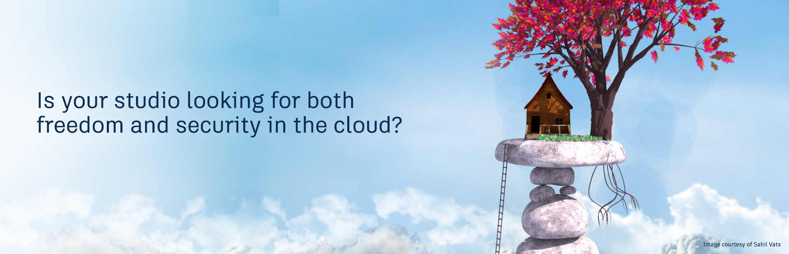

# Isolation Feature Set

The isolation feature set is an hybrid solution that satisfies strict security and legal requirements, while minimizing Shotgun System Admin specific required knowledge and maintenance. These features enable creative studios to confidently meet their supplier’s and studio’s highly stringent security, privacy, and performance requirements—from the cloud.

Continue to [About the isolation feature set](./tier1/getting_started/about.md) for more details.

## In This Section

### Getting Started
<!-- When updating this, also update getting_started/getting_started.md -->
* [About Isolation](./tier1/getting_started/about.md)
* [Client Responsibilities](./tier1/getting_started/responsibilities.md)
* [Onboarding Process](./tier1/getting_started/onboarding.md)
* [Planning your Setup](./tier1/setup/planning.md)

### Setup
<!-- When updating this, also update setup/setup.md -->
* [Setup Overview](./tier1/setup/setup.md)
* [Migration Test Site](./tier1/setup/shotgun_poc_site.md)
* [Media Isolation](./tier1/setup/s3_bucket.md)
* [Media Traffic Isolation](./tier1/setup/media_segregation.md)
* [Web Traffic Isolation](./tier1/setup/traffic_segregation.md)
* [Media Replication](./tier1/setup/s3_replication.md)
* [Isolation Fine Tuning](./tier1/setup/tuning.md)

### AWS Knowledge
<!-- When updating this, also update knowledge/knowledge.md -->
* [Connecting Your Studio With Your AWS VPC](./tier1/knowledge/connecting.md)
* [Shotgun AWS Direct Connect Onboarding](./tier1/knowledge/direct_connect_onboarding.md)
* [S3](./tier1/knowledge/s3.md)
* [VPC / IAM / Security Group](./tier1/knowledge/vpc_iam_sec.md)
* [Direct Connect](./tier1/knowledge/direct_connect.md)
* [Private Link](./tier1/knowledge/private_link.md)
* [VPC Endpoints](./tier1/knowledge/vpc_endpoints.md)
* [AWS Knowledge](./tier1/knowledge/aws.md)
