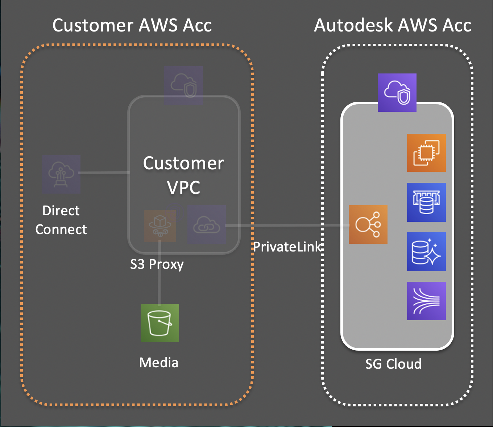
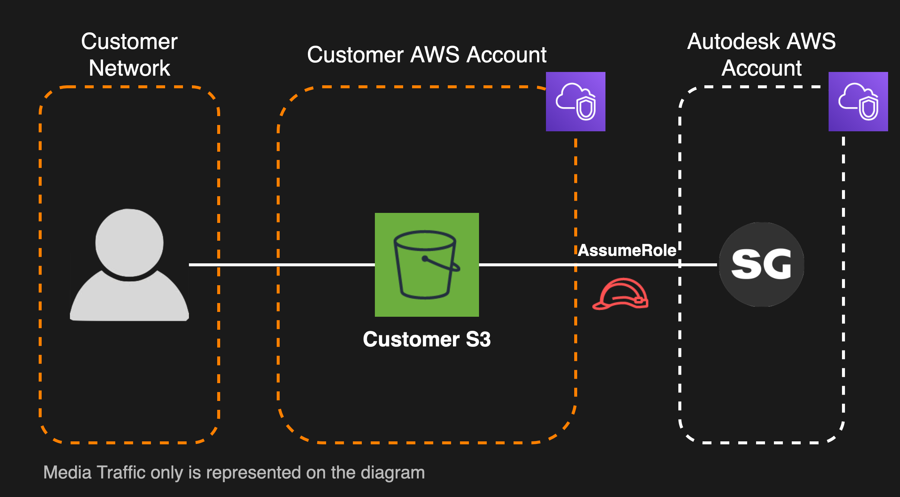

# Media Isolation
Media Isolation allows your studio to keep ownership and control of the media and attachments that you upload to Shotgun. With Media Isolation, all the content that you upload to Shotgun is stored in your studios private S3 Bucket. Access to the media is provided to the Shotgun services only, using [AWS AssumeRole keyless Security Token Service](https://docs.aws.amazon.com/STS/latest/APIReference/API_AssumeRole.html).

## Client Owned S3 Bucket
Storing media and attachments in an S3 bucket that you own means that you remain the legal owner of these artifacts, allowing you to comply with your company's security and legal policies. Your studio retains control of asset storage and access, access that you can revoke at will.

## More about Access
When using Shotgun to upload and download media it is transferred directly to / from AWS S3 without transiting through Autodesk infrastructure. Shotgun will only access media in two situations:
1. The Shotgun Transcoding service will get read/write access once, soon after upload, when transcoding the media. See [Ephemeral Transcoding](../getting_started/about.md#ephemeral-transcoding) for details.
2. When the Shotgun service generates S3 Links to your sources and transcoded media.

This is rendered possible by leveraging [AWS AssumeRole keyless Security Token Service](https://docs.aws.amazon.com/STS/latest/APIReference/API_AssumeRole.html). When setting up Media Isolation, an AWS Role allowing Shotgun to access your media for the action listed above is created, and the Shotgun service is allowed to assume that role.

Shotgun Support staff do not have access to your S3 Bucket under any circumstances.

## Costs
When activating Media Isolation the following costs, previously covered by Autodesk, become the responsibility of the client:
1. **S3 Costs.** All the S3 storage costs will be assumed by the customer. See [Media Isolation](../setup/tuning.md) for more details about how to reduce costs.
2. **S3 Bandwidth.** Bandwidth out of the S3 bucket will be assumed by the customer.

## What Media Isolation is not providing
Activating Media Isolation doesn't guarantee that the access to your Shotgun site or media takes place within a closed network. 