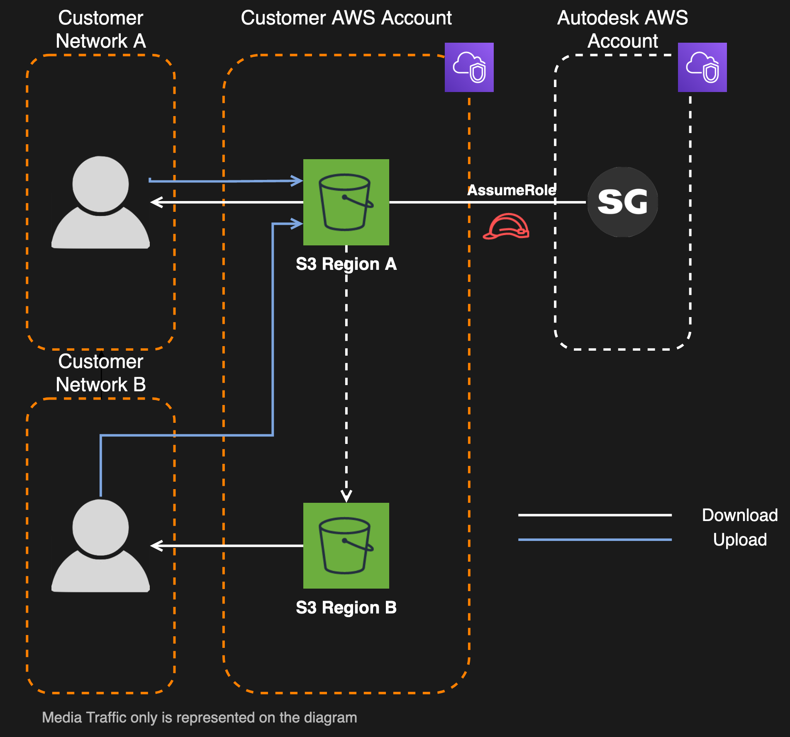

# Media Replication

 is compatible with the S3 Cross-Region replication feature, allowing your users located in different regions to read from the region closer to them in order to reduce latency and increase throughput. Replication to one region is currently supported.

## Pre-requisites
Media Isolation is required in order to elect Media Replication.

## Configuration by users
When using Media Replication, each user can customize which region data is read from. A user can either specify the region to use, or use automatic mode. In automatic mode  selects the replica determined by the user's IP address using IP ranges specified in the Isolation Preferences.

## How it works
 can be configured to read from up to two different buckets. Using the [AWS S3 Replication](https://docs.aws.amazon.com/AmazonS3/latest/dev/replication.html) feature, you can configure replication between buckets in different regions, and then consume media from the region closest to your users. It is important to underline that media is always uploaded to the main bucket.

Following AWS service level agreement, S3 guarantees the replication of 99.99% of the object within 15 minutes.

### Replication Delay
A small amount of time, typically under 15 minutes, is required before replication happens. The replication time depends on the size of the object to replicate. In order to alleviate that replication delay,  will, for a small period of time, generate links from to object in the source bucket instead of the replica. The duration of this transitional state in configurable in the Isolation Preferences.

## Costs
Activating the Media Replication feature can increase your AWS costs considerabibly. Before activating, be aware that:
1. Your S3 cost linked to  usage will more or less double, because the media is now stored in two regions.
2. You will be charged for the transfer cost between the source and the destination region. See [AWS S3 CRR and the destination region](https://docs.aws.amazon.com/AmazonS3/latest/dev/replication-and-other-bucket-configs.html#replication-and-dest-region) for more details.

## Next Steps
See [Media Replication Setup](../setup/s3_replication.md) for setup instructions.
