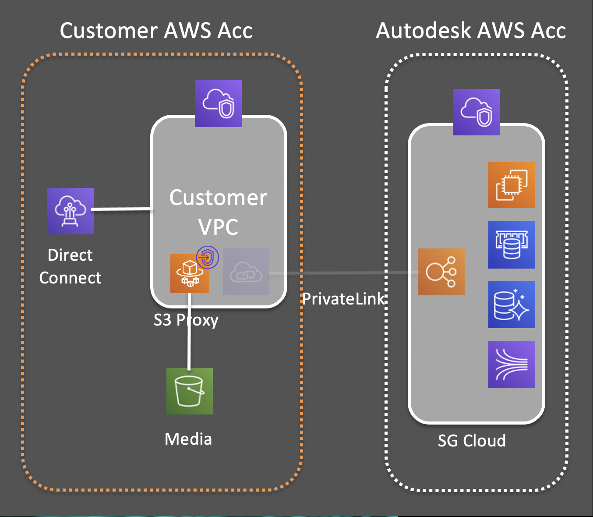
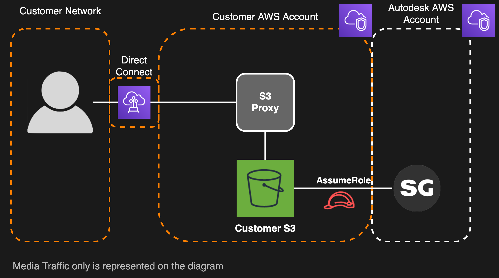

# Media Traffic Isolation

Communication between your client systems and S3 bucket targets a number of AWS network endpoints and data traverses the open Internet by default. Media Traffic Isolation allows you to limit the number of network endpoints used to transfer data to and from your S3 bucket and optionally restrict access to your AWS VPC or a defined set of public address scopes.

## Configuration
An S3 interface VPC endpoint is deployed within your VPC; which is then used as the endpoint for all S3 communication.

## How it works
 can be configured to use an S3 interface VPC endpoint to communicate with your S3 bucket. Deploying the S3 VPC endpoint within your VPC makes it possible to isolate traffic from the public Internet completely, or to allow more tightly controlled access from the Internet to your media.

## Costs
Activating the Media Traffic Isolation feature will increase your AWS costs. Before activating, be aware that:
1. There are costs associated with running the S3 interface VPC Endpoint. See [AWS PrivateLink pricing](https://aws.amazon.com/privatelink/pricing/) for more details.

## Next Steps
See [Media Traffic Isolation](../setup/media_segregation.md) for setup instructions.
