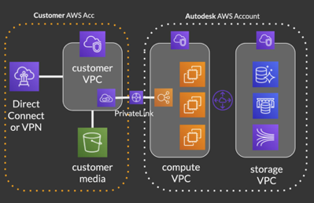
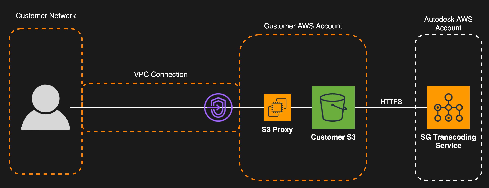

# What is the Isolation Feature Set

The isolation feature set combines our Cloud Hosted Platform with client-managed AWS resources to provide a solution that satisfies the most stringent security and privacy requirements. Clients retain control of their sensitive content without having to host  on their infrastructure.

Leveraging the isolation feature set has the following advantages over the Standard offering:

* **Media Isolation** by hosting of assets and attachments in a **client-owned S3 Bucket**
* **Web Traffic Isolation** from the public internet
* **Media Traffic Isolation** from the public internet
* **Media Replication** allowing you to replicate media in one additional AWS Region
* Access to fully managed  Cloud Services
* Automatic and continuous version upgrades
* Ephemeral compute + in-memory segration between clients

In a nutshell, this means that with the isolation features, your  site and the data related to it cannot be reached by anyone outside of your studio network.

The isolation feature set is a solution that requires less upkeep, as well as less IT/System Administrator knowledge and skills, than hosting  on-premise. The list of advantages compared to on-premise includes, but is not limited to:

* No  specific knowledge required
* No manual  updates required
* Very low level of maintenance required for the AWS components

## Media isolation feature
Media Isolation allows your studio to keep the ownership and control of the media and attachments that you upload to . With Media Isolation, all the content that you upload to  can be store in your studio private S3 bucket. Access to the media is provided to the  service only, using AWS AssumeRole keyless Security Token Service. Your studio remains in control of the assets and the access to the assets, access that you can revoke at will.

## Traffic isolation features
Media and Web traffic isolation features can be enabled to prevent your traffic from being routed on the public internet, limiting it to the AWS backbone and your studio network. The traffic between  Services and your studio stays in closed network, never going outside AWS or your Studio network.

With the Media Traffic Isolation feature activated, the media will only leave your studio infrastructure once to get transcoded.

## Media Replication
 is compatible with the S3 Cross-Region replication feature, allowing your users located in different regions to read from the region closer to them in order to reduce latency and increase throughput. Replication to one region is currently supported.

# Eligibility

The Isolation feature set is available for all Super Awesome clients. See [Getting Started](./getting_started.md) for more details about how to active the different features. The activation of the isolation feature set is not instantaneous, and requires manual setup involving your AWS account.

# What the Isolation Feature Set is not

The isolation feature set is not a completely isolated solution. Both the compute services and the database services are shared amongst clients, and managed by . From a hardware standpoint, the isolation features does not guarantee complete physical isolation. However,  services are guaranteeing isolation at the memory level. Processes are never reused to answer requests from different clients during their lifetime. Client metadata is stored in different databases. Client media is individually stored on S3.

# High Level Architecture

The  cloud service  can be decoupled at a high level in 3 parts:

**Compute Stack:** The part of the  Service that handles client requests and serves data to the client.

**Data Stack:** Metadata storage (databases).

**Media Storage:** Where the client's attachments, media, and assets are stored.  uses AWS S3 to store client content.

Please read [Securing Studio IP in AWS: Cloud-based VFX Project Management with Autodesk ](https://aws.amazon.com/blogs/media/securing-studio-ip-in-aws-cloud-based-vfx-project-management-with-autodesk-shotgun/) for more details about the architecture.

## Ephemeral compute and memory isolation
Even if clients share the same infrastructure,  guarantees a complete memory isolation, both in transit and at rest, of client data. This makes  less prone to data leaking due to architecture flaws or software vulnerabilities exploiting memory, like buffer overflow.

## Ephemeral transcoding

Everytime media is uploaded to , the transcoding service is invoked to create a web friendly versions of your assets. That process happens only once, after the initial upload. The media is directly uploaded from the client to S3, from where it is fetched by the  Transcoding Service. Each transcoding job is handled by a single container, which is killed after that unique job. The only place the media temporarily lives is in the container memory. The  Transcoding service doesn't store permanently a copy of your media.
