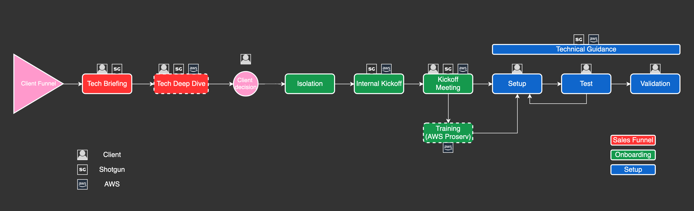

# Onboarding Process

Leveraging the isolation features requires adopters to become AWS users. In order to ensure that this joint venture between Autodesk, AWS, and our clients is as streamlined as possible, we decided to work closely with AWS to define a cooperative onboarding process that would meet client expectations for a premium offering.

Autodesk and Amazon will provide dedicated resources during the onboarding process to help you on this journey.

To start the on-boarding process for any of the Isolation features, please open a [ Support ticket](https://support.shotgunsoftware.com/hc/en-us/requests/new), before proceeding with [your setup](../setup/setup.md)

## Onboarding Process Overview

During the onboarding process, you'll have direct access to Autodesk and AWS Leaders who will support you during the implementation.

**Tech Briefing:**  Overview meeting of all of our offerings, where we underline the advantages and disadvantages of each.

**Tech Deep Dive:**  OPTIONAL. Deeper technical dive into isolation features. This meeting can be combined with the Tech Briefing.

**Kickoff Meeting:**	AWS and  Leaders review the setup process with the you.

**Setup / Test / Validation:**	Iterative installation process where you connect your AWS resources to , and activate the isolation features.

**Training:** OPTIONAL. Help sessions, if needed, as you ramp up on the AWS/ technologies required to securely set-up the isolation features for your site.

## Onboarding Resources

** Community:** The [ Isolation Community](https://community.shotgridsoftware.com/c/trusted-solutions/isolation/34) forum can be used to ask questions that can be answered by either  Experts or other isolation features users. This should be your first stop when asking general questions about isolation features, during setup and beyond.

**Private Slack Channel:** During the onboarding, you will be given access to a dedicated Autodesk Slack Channel. Your  and AWS Leaders will be available for quick feedback, answers, and ad-hoc meetings to help you progress as fast as possible with your  Isolation setup. This channel will be available only for the onboarding period.

** Support:** A [ Support](https://support.shotgunsoftware.com/hc/en-us/requests/new) ticket will be used to track your onboarding at a higher level. Once your  Isolation setup is complete, follow-up support tickets can be opened with the support team as needed.

## Next Steps

Once the onboarding process is started, you can start thinking about [your setup](../setup/setup.md)