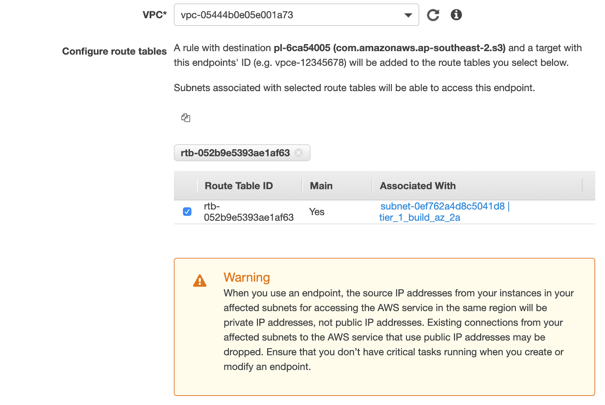
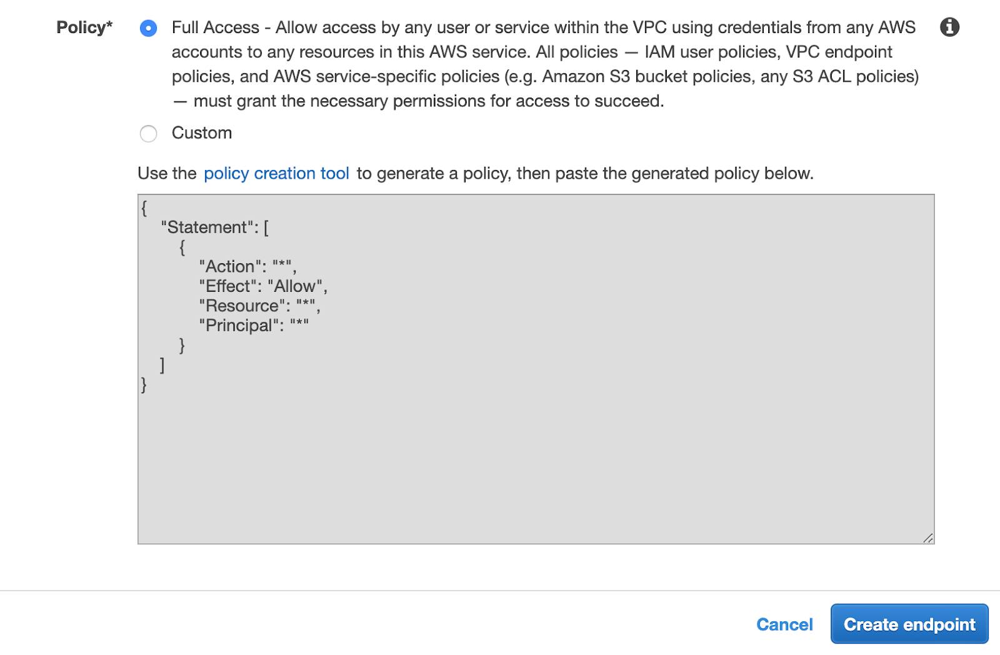

# Media Traffic Isolation



The media traffic isolation allows your users to access your media in your AWS S3 bucket privately (not transiting on the public internet). Please note that if you have a multi-region setup and that you are leveraging the Shotgun Transcoding service, there may still be cases where the media in going throught the public internet. Reach out to our support team for more details.

Media Isolation activation is a pre-requisite to enable this feature. If you didn't do so already, see [Media Isolation](./s3_bucket.md)

## Set up a VPC with private subnets in your S3 bucket AWS region

You will need to deploy a private VPC with the required VPC endpoints. We provide a [private VPC CloudFormation template](https://sg-shotgunsoftware.s3-us-west-2.amazonaws.com/tier1/cloudformation_templates/sg-private-vpc.yml) as a starting point. The template creates a VPC with 2 private subnets and the required VPC endpoints.

  * Go the CloudFormation service in AWS Console
  * Click Create stack -> With new resources (standard)
  * Select Template is ready
  * Set Amazon S3 URL depending upon your desired configuration
    * Private VPC (default):
      [`https://sg-shotgunsoftware.s3-us-west-2.amazonaws.com/tier1/cloudformation_templates/sg-private-vpc.yml`](https://sg-shotgunsoftware.s3-us-west-2.amazonaws.com/tier1/cloudformation_templates/sg-private-vpc.yml)`
    * Public VPC:
      [`https://sg-shotgunsoftware.s3-us-west-2.amazonaws.com/tier1/cloudformation_templates/sg-public-vpc.yml`](https://sg-shotgunsoftware.s3-us-west-2.amazonaws.com/tier1/cloudformation_templates/sg-public-vpc.yml)
  * Click Next
  * Set a stack name like `shotgun-vpc`
  * Choose network ranges that doesn't conflict with your studio network and set subnet CIDR values accordingly
  * Set your S3 bucket name
  * Click Next
  * Click Next

## Set up access from your site network to your AWS VPC

Options provided by AWS:
* [AWS Site-to-Site VPN](https://docs.aws.amazon.com/vpn/latest/s2svpn/VPC_VPN.html)
* [AWS Direct Connect](https://aws.amazon.com/directconnect/)



## Add an S3 endpoint to your VPC if you didn't use the CloudFormation template.





## Set up S3 proxy

You will need to deploy an S3 proxy in your VPC to proxy the traffic from your network into the S3 VPC endpoint. We provide an [S3 proxy CloudFormatiom Template](https://sg-shotgunsoftware.s3-us-west-2.amazonaws.com/tier1/cloudformation_templates/sg-s3-proxy.yml) as a starting point. This will create an ECS Cluster and an ECS service to run the S3 proxy on AWS Fargate behind an AWS ALB.

### Upload the Docker image to a private AWS Docker repositoty

Create an [AWS ECR Repository](https://aws.amazon.com/ecr/) named s3-proxy.

Upload the s3-proxy Docker image to your ECR repository.
 
  * You will need to install Docker on your workstation then run the following commands.
  * Do the docker login using instructions in your AWS Console *View push commands* button.

You will need to change the ECR repository URL to match yours.
  
```
docker pull quay.io/shotgun/s3-proxy:1.0.6
docker tag quay.io/shotgun/s3-proxy:1.0.6 627791357434.dkr.ecr.us-west-2.amazonaws.com/s3-proxy:1.0.6
docker push 627791357434.dkr.ecr.us-west-2.amazonaws.com/s3-proxy:1.0.6
```

### Create CloudFormation stack

Create a new stack in AWS Console using the [S3 proxy CloudFormatiom Template](https://sg-shotgunsoftware.s3-us-west-2.amazonaws.com/tier1/cloudformation_templates/sg-s3-proxy.yml).

  * Go the CloudFormation service in AWS Console
  * Select Template is ready
  * Set Amazon S3 URL to https://sg-shotgunsoftware.s3-us-west-2.amazonaws.com/tier1/cloudformation_templates/sg-s3-proxy.yml
  * Next
  * Set a stack name like shotgun-s3-proxy
  * Set all the parameters with no default value
  * Next
  * Accept `I acknowledge that AWS CloudFormation might create IAM resources`
  * Next

### Configure HTTPS

Shotgun only support https S3 proxy. You will need to configure https support on the AWS ALB. 

  * First add a DNS Entry in your domain to access the S3 proxy. ie: https://s3-proxy.mystudio.com.
  * Get a SSL certificate for your url, we recommend using [AWS Certificate Manager](https://aws.amazon.com/certificate-manager/).
  * Configure the HTTPS support on the S3 proxy by adding a new HTTPS listener on the AWS load balancer.

## Validation

### Test the S3 proxy

Try to access your S3 proxy using the ping route. ie: https://s3-proxy.mystudio.com/ping 

### Configure your test site to use your S3 proxy.

Go in your test site Preferences menu and set S3 Proxy Host Address to the S3 proxy url. ie: https://s3-proxy.mystudio.com.
Check if you call still access and upload new media.

## Next Steps

See [Web Traffic Isolation](./traffic_segregation.md) to activate the Web Traffic Isolation feature.

See [Media Replication](./s3_replication.md) to activate the Web Traffic Isolation feature.

Go to [Setup](./setup.md) for an overview of the possible next steps.
