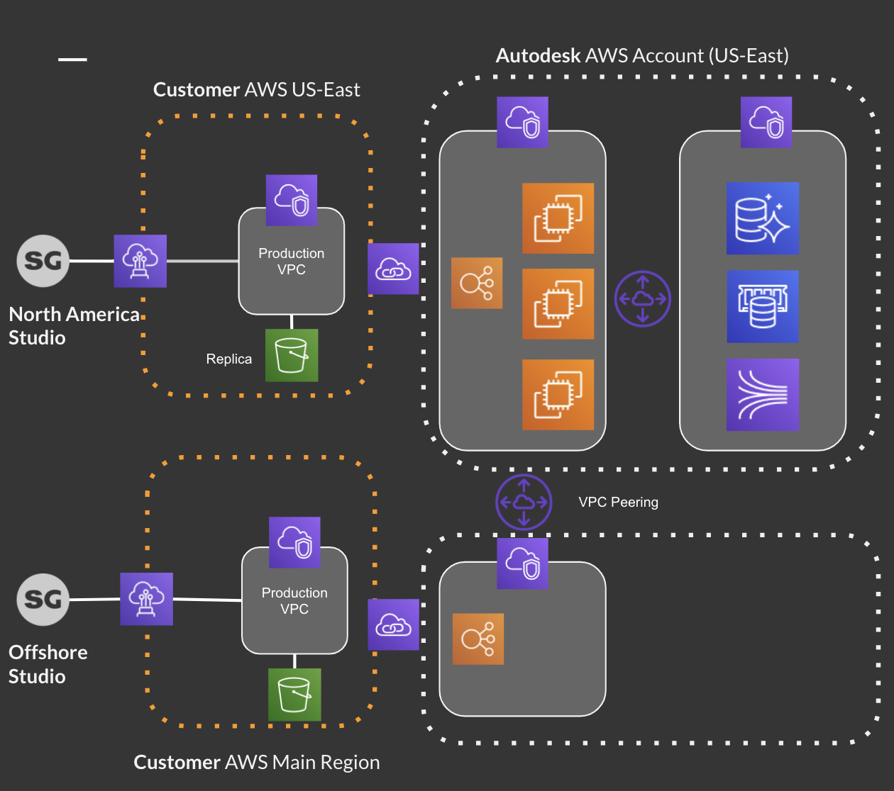

# Media Replication

## Description

It's possible to add S3 replication between two S3 buckets in different regions and configure  to leverage it for faster access to media.

## Features

 * Support one replica bucket in another region leveraging the [AWS S3 replication feature](https://docs.aws.amazon.com/AmazonS3/latest/dev/replication.html)

## How it works

When S3 bucket replication is activated, users will be able download media files from the replica S3 bucket.

For each user, the S3 replication is activated by the `Use S3 Replication` field.

| Value| Behavior | 
|------|----------------------------------------------|
|`no`  | Never use replica S3 bucket (default)|
|`yes` | Use replica S3 bucket when delay is over|
|`auto`| Use replica S3 bucket when delay is over and the client IP is in `IP Adresses for S3 replication` range|

The `IP Adresses for S3 replication` preference can be edited in Site Preferences under the Isolation category.

## Limitations

 * Only one replica S3 bucket can be configured
 * Only downloading from the replica bucket is supported
 * Configurable delay for new media to be replicated before being made available to users

# Setup steps

  * Create the replica S3 bucket in a new AWS region. See [Media Isolation](./s3_bucket.md)
  * Update your existing  role policy to allow  to also access the replica bucket
  * Setup the replication rules on the primary S3 bucket. See [How do I add a replication rule to an S3 bucket?](https://docs.aws.amazon.com/AmazonS3/latest/user-guide/enable-replication.html#enable-replication-add-rule)
  * Setup a VPC + Direct Connect + S3 proxy in the new AWS region. See [Media Traffic Isolation](./media_segregation.md)
  * Contact  Support to configure your site to use the new S3 replica bucket, providing the following information:
    * Replica Bucket Name
    * Replica Bucket Region
    * Replica S3 proxy URL

## FAQ

### Copy existing media

S3 replication only applies to media uploaded after the feature has been enabled. Existing media in the primary bucket must be copied to the replica bucket manually. You can simply use `aws-cli` sync or use [Amazon S3 Batch Operations](https://aws.amazon.com/s3/features/batch-operations/) if you have a lot of media to achieve this.

## Next Steps

See [Fine Tuning](./tuning.md) to finalize your setup and optimize costs and security.

Go to [Setup](./setup.md) for an overview of the possible next steps.