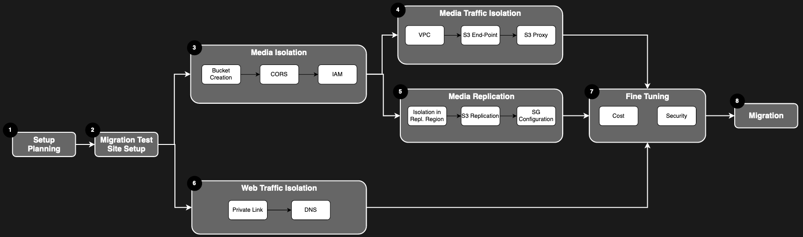

# Shotgun Isolation Feature Set - Setup

Isolation the isolation features are independent of each other, and can be activated independently of each other. Media replication have as pre-requisite for Media Isolation to be implemented.

The setup process will depend on which feature you want to activate for your site. 

## In This Section
<!-- When updating this, also update tier1.md -->
* [Planning your Setup](./planning.md)
* [Migration Test Site](./shotgun_poc_site.md)
* [Media Isolation](./s3_bucket.md)
* [Media Traffic Isolation](./media_segregation.md)
* [Web Traffic Isolation](./traffic_segregation.md)
* [Isolation Fine Tuning](./tuning.md)
* [S3 Replication](./s3_replication.md)

# Setup Process

## [Planning your Setup](./planning.md)

The first step consist in planning your setup, choosing the feature you need and get the required security/legal approval from your team to get started with the Isolation feature set.

## [Migration Test Site](./shotgun_poc_site.md)

To help you setting up the Isolation features without breaking your production environment and to helping smooting the migration, Shotgun propose to use a test site on which to test your setup before applying the result to production.

## [Media Isolation](./s3_bucket.md)

This feature allow you to use a S3 Bucket owned by your studio to store media.

## [Media Traffic Isolation](./media_segregation.md)

This feature allows for private routing of the media through the AWS Backbone and your studio network, isolating the media traffic from the public internet.

## [Web Traffic Isolation](./traffic_segregation.md)

This feature isolate the web traffic on AWS Backbone and your studio network, isolating the traffic from the public internet.

## [S3 Replication](./s3_replication.md)

This feature allows the media to be replicated between AWS Regions, for faster access in your world wide studios. Media Isolation is required.

## [Fine Tuning](./tuning.md)

Once the isolation features you need are activated, make sure that you everything is properly configured for security and cost-efficiency by reviewing this fine tuning guide.