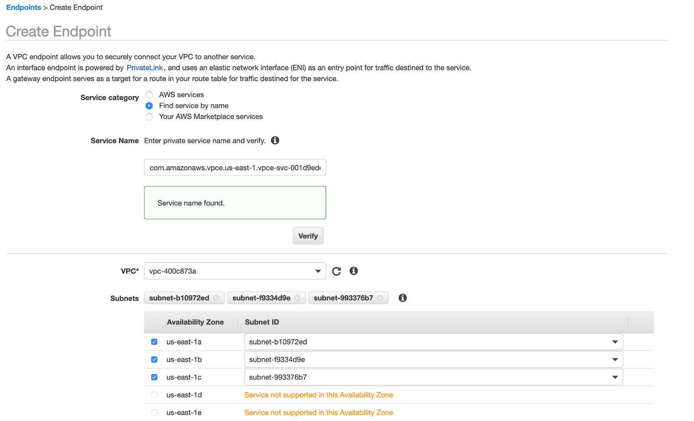

# Web Traffic Isolation

The goal is to set up an AWS PrivateLink to privately access your Shotgun site.

## Set up PrivateLink to Shotgun

  * Ask Shotgun support to provide you with the Shotgun PrivateLink service name for your AWS region.

  * Update the private VPC CloudFormation stack you created earlier and set ShotgunPrivateServiceName parameter.

### Manual steps if needed

  * Add a new VPC Endpoint in your VPC

  * For the security group, Shotgun service only requires the inbound port tcp/443 to be open.




## DNS Configuration

Provide your PrivateLink DNS name to Shotgun support. We will setup a new private URL for your site that will look like `mystudio-staging.priv.shotgunstudio.com`.

## Validation

Verify that your site private URL resolves to IPs in your AWS VPC block.

```
nslookup mystudio-staging.priv.shotgunstudio.com
```

Try to access your test site from inside your office ie https://mystudio-staging.priv.shotgunstudio.com
