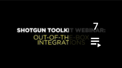

  
#  Toolkit Webinars

*Updated: 2020/5/8*

##  Toolkit Webinar Playlist

##  Toolkit Webinar Videos

1:  Toolkit Webinar: Out-of-the-box Integrations *(60m)*

In the first of a new series of Toolkit webinars, Rob Blau, and Manne Öhrström, answer questions about out-of-the-box integrations.

2:  Toolkit Webinar: Demystifying the New Default Configuration *(60m)*

In this webinar, Josh Tomlinson and Rob Blau cover what has changed (and why) in the new default configuration for Toolkit projects.

3:  Toolkit Webinar: Customizing Publish Workflows - A Live Demo *(60m)*

In this webinar, Josh Tomlinson gives a step-by-step walkthrough of creating a custom publish workflow in Maya. Learn the constructs of the publish app, how to configure it, and how to write custom hooks for collecting and publishing data.

*Supplemental Material*

[Pipeline Tutorial](https://developer.shotgridsoftware.com/cb8926fc/?title=Pipeline+Tutorial)

4:  Toolkit Webinar: Cloud Configurations and Multi-location Workflows *(60m)*

In this webinar, Manne Ohrstrom explores workflows for studios with artists in multiple locations.

*Supplemental Material*

[Developer docs on Toolkit initialization and configuration management](https://developer.shotgridsoftware.com/tk-core/initializing.html)

[List of Descriptor types that Manne references in the video](https://developer.shotgridsoftware.com/tk-core/descriptor.html#descriptor-types)

5:  Ecosystem Webinar: REST API *(60m)*

In this webinar, Brandon Ashworth will walk us through a bunch of useful demos, examples, and recipes to show what the REST API is, why it’s important, and how it can be used.

*Supplemental Material*

[REST API reference docs](https://developer.shotgridsoftware.com/rest-api/)

6:  Toolkit Webinar: The New Publisher API *(35m)*

The latest Integrations release includes an improved Publish API, which allows you to decouple publish logic from the GUI app and run publishes from your own tools, or even on the render farm. In this webinar, Jean-Francois Boismenu demos how you can use the API to pass a publish item tree from the Publisher UI to a render farm job.

*Supplemental Material*

[Github repo with config](https://github.com/shotgunsoftware/tk-config-publish_api_webinar)

[Pull Request referenced at 31:00](https://github.com/shotgunsoftware/tk-config-publish_api_webinar/pull/1)

[Publish API Documentation](https://developer.shotgridsoftware.com/tk-multi-publish2/)

7:  Toolkit Webinar: After Effects Integration *(38m)*

Adobe After Effects is our latest  integration. In this webinar, Rob Blau dives deep into the After Effects integration with a live demo of features and discusses how we refactored the heaving lifting from our Photoshop integration to develop a reusable framework for any Adobe integration.  
  
Also, Tannaz Sassooni tours our new developer’s documentation site and shows how we’re making it easier for our users to learn how to integrate with .

*Supplemental Material*

[After Effects integration documentation](https://developer.shotgridsoftware.com/1eca509c/?title=After+Effects)

[Developer documentation portal](https://developer.shotgridsoftware.com)

##  Developer Day Playlist

##  Developer Day Videos

At SIGGRAPH 2018 and 2019, the  team presented  Developer Day: a series of courses designed to acquaint developers on the many resources available for automating tasks, writing custom apps and more. After SIGGRAPH, we held a series of webinars featuring the content from Developer Day. This playlist contains recordings of those webinars.

Full slide decks, code examples and other resources related to this content can be found [here for 2019](https://github.com/shotgunsoftware/sg-siggraph-2019) and [here for 2018](https://github.com/shotgunsoftware/sg-devday-2018/) .

1: SIGGRAPH Developer Day 2019: Introduction to  Development *(83m)*

In this webinar, Tannaz Sassooni and Patrick Boucher give an introduction to  development, including a discussion on ’s entry points for automation, ’s Python and REST APIs and how ’s APIs automate tasks and data-tracking for studios.

[0:56](https://www.youtube.com/watch?v=i0aVJepZw8Y&list=PLEOzU2tEw33r4yfX7_WD7anyKrsDpQY2d&index=1&t=56s) Welcome and orientation

[3:00](https://www.youtube.com/watch?v=i0aVJepZw8Y&list=PLEOzU2tEw33r4yfX7_WD7anyKrsDpQY2d&index=1&t=180s) Introduction to  Development: A high-level overview of common pipeline needs and how you can use 's APIs and development frameworks to address them. [Tannaz Sassooni]

[25:59](https://www.youtube.com/watch?v=i0aVJepZw8Y&list=PLEOzU2tEw33r4yfX7_WD7anyKrsDpQY2d&index=1&t=1559s) Introduction to Data Management Using  APIs: Dive into 's API using simple Python and REST scripting, as well as frameworks for creating Action Menu Items. [Patrick Boucher]

2: SIGGRAPH Developer Day 2019: Advanced  Development *(78m)*

In this webinar,  Brandon Ashworth and Manne Öhrström dive into  using the event daemon and new webhooks to react to data changes in , and show how to write a simple pipeline tool using  Toolkit.

[0:39](https://www.youtube.com/watch?v=xUeY1pECHdI&list=PLEOzU2tEw33r4yfX7_WD7anyKrsDpQY2d&index=2&t=39s) Welcome and orientation

[2:33](https://www.youtube.com/watch?v=xUeY1pECHdI&list=PLEOzU2tEw33r4yfX7_WD7anyKrsDpQY2d&index=2&t=153s) Working with  Events [Brandon Ashworth]

[41:25](https://www.youtube.com/watch?v=xUeY1pECHdI&list=PLEOzU2tEw33r4yfX7_WD7anyKrsDpQY2d&index=2&t=2485s) Developing a  Tool that runs in multiple artist apps [Manne Öhrström]

3: SIGGRAPH Developer Day: Toolkit Administration *(1h15m)*

In this webinar,  Josh Tomlinson, Tannaz Sassooni and Phil Scadding demo how to take over integrations and create a custom directory structure and hooks to automate more of the data flow in your studio.

[0:00](https://www.youtube.com/watch?v=7qZfy7KXXX0&list=PLEOzU2tEw33r4yfX7_WD7anyKrsDpQY2d&index=2&t=0s) Welcome and Orientation

[1:04](https://www.youtube.com/watch?v=7qZfy7KXXX0&list=PLEOzU2tEw33r4yfX7_WD7anyKrsDpQY2d&index=2&t=64s)  Toolkit Administration: Learn how to launch common content creation software through our  Desktop app and check out how artists can interact with  without ever leaving their work session, with our default pipeline integrations. [Phil Scadding]

[32:41](https://www.youtube.com/watch?v=7qZfy7KXXX0&list=PLEOzU2tEw33r4yfX7_WD7anyKrsDpQY2d&index=2&t=1961s) Introduction to Toolkit Configurations: Master navigating through the Toolkit Pipeline Configuration, learning how to use it to customize your pipeline workflows. [Tannaz Sassooni]

[56:20](https://www.youtube.com/watch?v=7qZfy7KXXX0&list=PLEOzU2tEw33r4yfX7_WD7anyKrsDpQY2d&index=2&t=3380s) Managing Hooks: Learn to use  Toolkit's extensive set of hooks to add custom logic to your configuration and tailor your Toolkit pipeline to your studio's needs. [Josh Tomlinson]

4: SIGGRAPH Developer Day: Advanced  Development *(1h15m)*

Manne Ohrstrom, Jeff Beeland, and Rob Blau demonstrate best practices for source control and cloud-based pipeline deployment, and dive into building apps and using Toolkit’s standard frameworks for rapidly designing UIs and handling data.

[0:00](https://www.youtube.com/watch?v=bT2WlQaJVmY&list=PLEOzU2tEw33r4yfX7_WD7anyKrsDpQY2d&index=3&t=0s) Welcome and Orientation

[2:31](https://www.youtube.com/watch?v=bT2WlQaJVmY&list=PLEOzU2tEw33r4yfX7_WD7anyKrsDpQY2d&index=3&t=151s) Toolkit platform: Development and deployment patterns: Learn the different ways you can set up and deploy a Toolkit pipeline configation, including workflows for development, version control best practices, and distributing your pipeline configuration to remote users by uploading it to your  site. [Manne Ohrstrom]

[30:23](https://www.youtube.com/watch?v=bT2WlQaJVmY&list=PLEOzU2tEw33r4yfX7_WD7anyKrsDpQY2d&index=3&t=1823s) Toolkit platform: Writing your own App: Walk through writing a simple Toolkit app, utilizing provided APIs and frameworks to rapidly create a powerful UI. [Jeff Beeland]

[1:02:22](https://www.youtube.com/watch?v=bT2WlQaJVmY&list=PLEOzU2tEw33r4yfX7_WD7anyKrsDpQY2d&index=3&t=3742s) Introduction to Autodesk Forge: Learn about Forge, Autodesk's series of API-driven cloud services, and how you can use them to extend the  experience. [Rob Blau]
  
