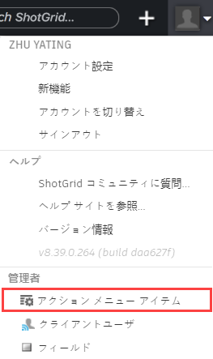

# カスタム アクション メニュー アイテム

API 開発者は、アクション メニュー アイテム(AMI)からエンティティごとにコンテキスト メニュー項目をカスタマイズできます。たとえば、Versions ページから複数のバージョンを選択して右クリックし、Build a PDF Report を選択します。

## アクション メニュー アイテム フィールド:

## アクション メニュー アイテムのタイプ

作成できるメニュー項目は次の 2 つです。

## HTTP URL の例

たとえば、「Build PDF Report」と呼ばれるカスタム メニュー項目を作成できます。これにより、ユーザは任意のバージョン ページに移動し、1 つまたは複数のバージョンを選択して右クリックし、 メニューから「Build PDF Report」を選択することができます。この操作により、スクリプトが起動し(このスクリプトは作成する必要があります)、適切にフォーマット化されたレポートがブラウザに送られます。次にその方法を説明します。

### UI を使用してメニュー項目を作成する

設定メニューから[アクション メニュー アイテム] (Action Menu Item)を選択し、AMI の管理ページを開きます。

新しい AMI を作成するには、 をクリックします。

タイトルと他の必須フィールドを入力し、[アクション メニュー アイテムを作成] (Create Action Menu Item)をクリックします。

### ユーザが AMI をクリックすると起こること

 が新しいウィンドウ(オプションが選択されている場合はモーダル ダイアログ)で POST 要求を割り当て、現在のページから POST 要求に含まれるデータを受信 URL にデータを送信します。次に、ワークフローの例を示します。

* [バージョン] (Versions)ページに移動します
* 1 つまたは複数のバージョンを選択します
* コンテキスト メニューを表示します(ツールバーの歯車メニューを右クリックまたはクリック)
* ユーザが Build PDF Report をクリックします
*  が新しいウィンドウで POST 要求を AMI の URL に割り当てます( サーバに HTTPS 経由で接続している場合に、URL を HTTP 経由で送受信すると、ブラウザに警告が表示されます)
* 指定した URL に格納されたスクリプトが POST データを処理し、PDF ドキュメントを生成します
* 適切にフォーマット化された PDF レポートが、表示またはダウンロード用にユーザに送り返されます

## カスタム プロトコル ハンドラの例

カスタム AMI の最新の実装には、カスタム プロトコル ハンドラのセットアップが含まれます(例: ://process_version)。これにより、ローカル コンピュータ上のスクリプトを介して Maya、RV、Cinesync などのアプリケーションと  を接続できます。HTTP(S)プロトコル以外を指定すると、POST の代わりに GET を使用してデータが URL に送信されます。異なる要求を割り当てる社内ツールを起動するために使用することもできます。

カスタム プロトコルの詳細については、「[カスタム ブラウザ プロトコルを使用してアプリケーションを起動する](https://developer.shotgridsoftware.com/ja/67695b40/)」を参照してください。

> **注:** [ の統合](https://developer.shotgridsoftware.com/ja/d587be80/)により、Maya などのソフトウェア パッケージに組み込んで統合することもできます。
### 軽量ペイロード

カスタム プロトコルを使用する場合、クエリー情報は GET 要求として送信されます。特定のオペレーティング システムとブラウザの組み合わせには、許容される GET 要求のサイズに関するさまざまな制限事項があります。カスタム プロトコル AMI で軽量ペイロード チェックボックスをオンにすることをお勧めします。軽量ペイロードをオンにすると、レコードの `meta` フィールドの `ami_payload` キーを読み取ることで完全なペイロードを取得するためにフェッチできる、単一のイベント ログ エントリ ID をスクリプトが受け取ります。

## 例

次に、基本的ないくつかのサンプル スクリプトを示します。

* [ActionMenuItem 呼び出しの処理](http://developer.shotgridsoftware.com/python-api/cookbook/examples/ami_handler.html)
* [バージョン パッケージ ツール](http://developer.shotgridsoftware.com/python-api/cookbook/examples/ami_version_packager.html)

## ペイロードの内容

### ユーザ データ

* **user_id**: 現在ログイン中のユーザのユーザ ID (例: 34)
* **user_login**: 現在ログイン中のユーザのログイン(例: joe)

### エンティティ データ

* **entity_type:** 現在のページまたはビューのエンティティ タイプ(例: Version)
* **selected_ids**: 選択したエンティティ ID のカンマ区切りリスト(例: 931、900)
* **ids**: 現在のページのクエリーが返すエンティティの ID すべてのカンマ区切りリスト。これにより、ページネーションが原因で表示されない ID を含めたすべての ID が返されます。(931、900、904、907 など)。AMI で[選択が必要] (Selection required)がオンになっている場合、この値は **selected_ids** と同じ値になります。

### ページ データ

* **title:** ページ タイトル(例: "All Versions")
* **page_id**: アクション メニュー アイテムのクリック元のページの ID (例: 1353)
* **server_hostname:** AMI がトリガされたシステムのホスト名。同じ AMI を呼び出す複数のサーバがある場合に役立ちます(ステージング サーバとプロダクション サーバなど)。
* **referrer_path:** AMI が呼び出された URL の正規のパス。
* **session_uuid:** この AMI が呼び出されたウィンドウの一意の識別子。AMI が呼び出されたページに情報を一斉送信するために、[データ更新のポーリング] (Poll for Data Updates)チェックボックスと Python API の [`set_session_uuid`](http://developer.shotgridsoftware.com/python-api/reference.html?highlight=session_uuid#shotgun_api3.shotgun.Shotgun.set_session_uuid) メソッドで使用できます。 **注:** この機能の更新のポーリングは急激に減少し、最終的に停止します。そのため、ポーリングが停止する前に AMI が更新されない場合、ソース ページに更新が表示されないことがあります。
* **cols**: ページで表示可能な列すべてのシステム フィールド名を含むカンマ区切りリスト(例: code, sg_status_list, description)
* **column_display_names:** ページで表示可能な列すべての表示名を含むカンマ区切りリスト(例: Version, Status, Description)
* **view:** AMI が呼び出されたときに選択されていたビュー。ページのデザイン モードを使用して、任意のページに対して複数のビューを作成できます。
* **sort_column**: ソート対象の列のシステム名(例: code)。最初のソート キーのみが送信されます。複数ある場合は、**sort_columns** を参照してください
* **sort_direction:** (例: asc または desc)最初のソート方向のみが送信されます。複数ある場合は、**sort_directions** を参照してください
* **sort_columns:** ページまたはビューがソートされた列のシステム名のカンマ区切りリスト(例: code,created_at)。複数のソート キーがある場合にのみ送信されます
* **sort_directions:** ページまたはビューがソートされた列のシステム名のカンマ区切りリスト(例: e.g., code, created_at)。複数のソート キーがある場合にのみ送信されます
* **grouping_column:** グループ化対象の列のシステム名(例: code)。最初のグループ化列のみが送信されます。複数ある場合は、**grouping_columns** を参照してください
* **grouping_method:** グループ化が行われる方法(例: エンティティ フィールドの場合は `entitytype` によるグループ化、日付フィールドの場合は `month` によるグループ化)。最初のグループ化方法のみが送信されます。複数ある場合は、**grouping_methods** を参照してください
* **grouping_direction:** グループ化の方向(例: asc または desc)。最初のグループ化方向のみが送信されます。複数ある場合は、**grouping_directions** を参照してください
* **grouping_columns:** データがグループ化された列のシステム名のカンマ区切りリスト(例: code,created_at)。複数のグループ化列がある場合にのみ送信されます
* **grouping_methods:** グループ化方法のカンマ区切りリスト(例: entity_type,month)。複数のグループ化列がある場合にのみ送信されます
* **grouping_directions:** グループ化の方向のカンマ区切りリスト(例: asc,desc)。複数のグループ化列がある場合にのみ送信されます

### プロジェクト データ(現在のページのすべてのエンティティが同じプロジェクトを共有する場合のみ送信されます)

* **project_name**: プロジェクトの名前(例: Gunslinger)
* **project_id**: プロジェクトの ID (例: 81)