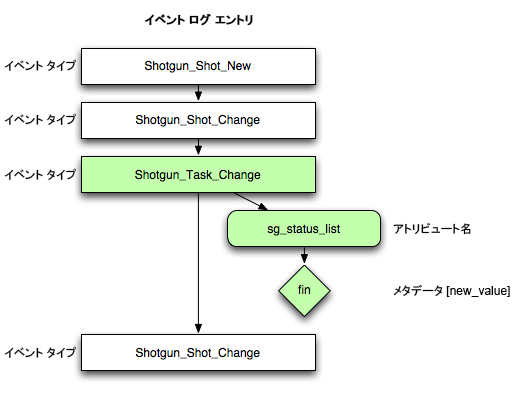

#  イベント フレームワーク
このソフトウェアは、[Rodeo Fx](http://rodeofx.com) と Oblique のサポートを受けて [Patrick Boucher](http://www.patrickboucher.com) により開発されました。これは現在、[ソフトウェア](http://www.shotgridsoftware.com)の[オープン ソース イニシアチブ](https://github.com/shotgunsoftware)の一部になっています。

このソフトウェアは、LICENSE ファイルまたは[オープン ソース イニシアチブ](http://www.opensource.org/licenses/mit-license.php)の Web サイトにある MIT ライセンスの下で提供されます。

**目次:**

- [概要](#overview)
- [フレームワークの利点](#advantage-of-the-framework)
- [イベント駆動型トリガを書き込む](#writing-event-driven-triggers)
   - [使用例](#example-use-cases)
   - [イベント駆動型トリガの仕組み](#how-event-driven-triggers-work)
   - [EventLog のポーリングとトリガの比較](#polling-the-eventLog-versus-triggers)
   - [イベント タイプ](#event-types)
   - [トランザクションと欠落の可能性があるイベント](#transactions-and-potentially-missing-events)

## 概要

 イベント ストリームにアクセスする場合の望ましい方法として、イベント テーブルを監視し、新しいイベントを取得し、イベントを処理して、また同じ手順を繰り返します。

このプロセスを成功させるためには多くの要素が必要ですが、それらの中には、適用すべきビジネス ルールに直接関係しないものがあります。

フレームワークの役割は、退屈な監視タスクをビジネス ロジックの実装作業から分離することです。

フレームワークはサーバ上で動作し、 のイベント ストリームを監視するデーモン プロセスです。イベントが見つかったら、デーモンはイベントを一連の登録済みのプラグインに渡します。各プラグインは、意図したとおりにイベントを処理できます。

デーモンは次を処理します:

- 1 つまたは複数の指定したパスからプラグインを登録する。
- クラッシュするプラグインを非アクティブ化する。
- プラグインがディスク上で変更された場合に再ロードする。
-  のイベント ストリームを監視する。
- 最後に処理されたイベント ID とバックログを記憶する。
- デーモンの起動時に、最後に処理されたイベント ID から開始する。
- 接続エラーを検出する。
- 必要に応じて、stdout、ファイル、または電子メールに情報を記録する。
- コールバックによって使用される  への接続を作成する。
- 登録されたコールバックにイベントを渡す。

プラグイン ハンドル:

- 任意の数のコールバックをフレームワークに登録する。
- フレームワークによって提供された 1 つのイベントを処理する。

## フレームワークの利点

- スクリプトごとに 1 つではなく、すべてのスクリプトに対して単一の監視メカニズムのみを扱います。
- ネットワークおよびデータベースのロードを最小限に抑えます(多くのイベント処理プラグインにイベントを提供するただ 1 つのモニタ)。

# イベント駆動型トリガを書き込む

**注:** イベント駆動型トリガの詳細については、[https://github.com/shotgunsoftware/shotgunEvents](https://github.com/shotgunsoftware/shotgunEvents) にあるオートデスクのドキュメントを参照してください。

 は、 で行われるすべてのアクションについて[イベント ログ エントリ](https://help.autodesk.com/view/SGSUB/JPN?guid=SG_Administrator_ar_data_management_ar_event_logs_html)を作成します。 これらのイベントは  サイトだけでなく、 API からも確認できます。

 にイベントの詳細な履歴が表示されるだけでなく、独自のイベント リスナー スクリプトを作成して EventLog をポーリングし、関心のある特定のイベントに対処することができます。独自のスクリプトでパイプラインの他の内部スクリプトを実行したり、 API を使用して  の他の情報を更新したりできます。

## 使用例

イベント駆動型トリガの使用例をいくつか示します。

* ショットの「Layout」タスクのステータスが「最終(Final)」としてマークされると、自動的に「Animation」タスクのステータスを「開始の準備完了(Ready to Start)」に設定して、アニメータがショットで作業を開始することを把握できるようにする。
* 新しいショットが  で作成されるたびにファイルシステム上で適切なショット フォルダを作成する。
* 「保留中(On Hold)」の場合にショットに割り当てるアーティストを通知する。
* アセットの作成が完了したらフォルダを読み取り専用にする。
* バージョンが  のレビューに追加されたら、関連するバージョン(テイク)の情報をデイリー システムにコピーする。
* シーンのショットが 25 個になったら、シーンの説明フィールドの 3 番目の文字と同じ文字で始まる任意の引用をツイートする。

## イベント駆動型トリガの仕組み

次に、 で生成される EventLogEntries を簡単な図で説明します。スクリプトは API を使用して、指定後に発生したイベントのリストを取得します。次に、各イベント タイプ(_Task_Change など)を調べて、イベント駆動の対象であるかを確認します。

候補のイベントが見つかると、イベントの詳細をさらに調べます(変更されたフィールドや変更された値など)。このときに API を使用してエンティティの詳細情報を要求することもできます)。

イベントがイベント駆動の対象だと判断されると、スクリプトはそのイベントに従い、 API、パイプラインの他のコード、またはその両方を使用するかにかかわらず、実行する必要があるコードを実行します。チェックするイベントがなくなると、プロセスを繰り返し、API を使用して先ほどチェックした後に発生したイベントのリストを取得します。

## EventLog のポーリングとトリガの比較

 はイベント情報を絶えず提供し続けます。ユーザはその情報をすべて確認し、任意のイベントに対してのみ操作を実行できます。これは、 自体でトリガをコントロールするよりも次のような利点があります。

* **柔軟性**: トリガ スクリプトは  とは関係なく実行することができます。このため、スクリプトは任意の方法で  とパイプラインの両方とやり取りできます。何の制約も受けずに任意のルールとアクションを定義します。 側では、指定したイベント トリガについて何も把握する必要はありません。Shotgun に必要なのは、EventLogEntries を生成し続けることです。それ以外のことはすべてユーザが管理します。
* **リモート**: スクリプトは、 サーバにネットワーク アクセスできる任意の場所から実行できます。スクリプトの実行に必要なのは API アクセスだけです。
* **多様性**: 複数のスクリプトを同時に実行できます。 それぞれの部門でニーズは異なるため、異なるイベントを待機します。すべてのトリガが同じスクリプトから実行されなければならない、というような制限はありません。トリガを個別の論理的スクリプトに分割できる場合もあります。ポーリングのクエリーは非常に軽量であるため、パフォーマンスにはほとんど影響しません。
* **説明責任**: スクリプトで  を変更した場合は、このスクリプトによる変更内容を正確に記録する独自のイベントも生成されます。

## イベント タイプ

すべての内部イベント タイプは、**`Shotgun_[entity_type]_[New|Change|Retirement]`** の形式に従います。例として、`Shotgun_Shot_New` と `Shotgun_Asset_Change` があります。詳細については、[イベント タイプのドキュメント](https://github.com/shotgunsoftware/shotgunEvents/wiki/Technical_Overview#event-types)を参照してください。

## トランザクションと欠落の可能性があるイベント

 はトランザクションで破壊的データベース クエリーを実行し、トランザクション終了時に EventLog にのみ書き込みます。 このため、「ID の最大値」メソッドを使用すると、イベントを見落としてしまう可能性があります。ただし、[GitHub サイトのイベント トリガ フレームワーク](https://github.com/shotgunsoftware/shotgunEvents)には、この状況を処理できるコードがあります。