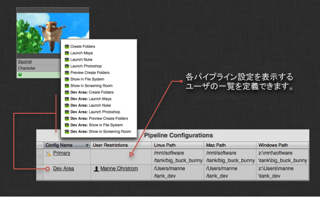
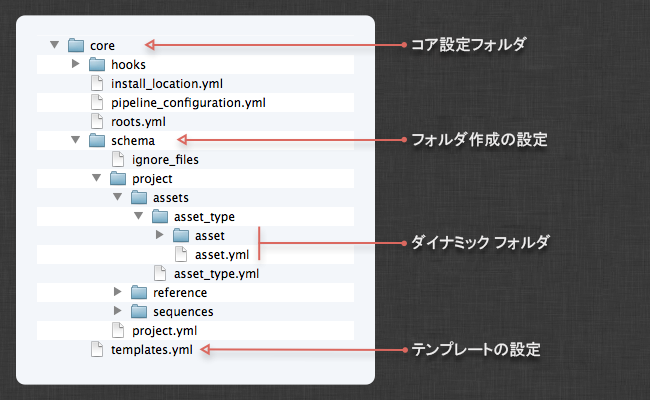
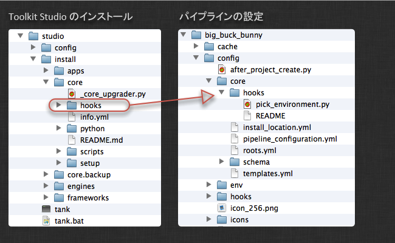
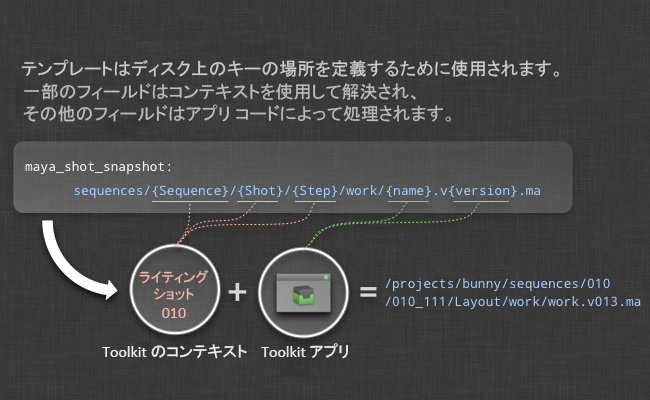
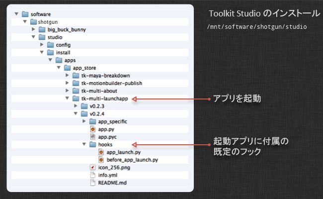

# 高度な Toolkit 管理

ここでは、高度な設定用に Toolkit を管理および設定する方法について紹介します。

このトピックの内容:
- [はじめに](#introduction)
- [Tank コマンドを使用する](#using-the-tank-command)
   - [デバッグ モードで実行する](#running-in-debug-mode)
   - [Tookit API を使用して Tank コマンドを実行する](#running-tank-commands-via-the-tookit-api)
   - [役に立つ Tank コマンド](#useful-tank-commands)
      - [setup_project](#setup_project)
      - [core](#core)
      - [configurations](#configurations)
      - [updates](#updates)
      - [install_app, install_engine](#install_app-install_engine)
      - [app_info](#app_info)
      - [folders, preview_folders](#folders-preview_folders)
      - [shell](#shell)
      - [dump_config](#dump_config)
         [高度な Tank コマンド](#advanced-tank-commands)
- [Toolkit Python API](#the-toolkit-python-api)
- [パイプライン設定とサンドボックス](#pipeline-configurations-and-sandboxes)
   - [サンドボックス用に Tank コマンドを実行する](#running-the-tank-command-for-a-sandbox)
   - [サンドボックスの Core API を使用する](#using-the-core-api-from-a-sandbox)
   - [サンドボックスにアクセスする](#accessing-a-sandbox)
   - [パイプライン設定をローカライズする](#localizing-a-pipeline-configuration)
   - [クローン作成した環境設定を削除する](#deleting-a-cloned-configuration)
- [更新を確認する](#checking-for-updates)
   - [ステージング サンドボックスを作成する](#creating-a-staging-sandbox)
- [アプリの起動方法を設定する](#configuring-how-apps-are-launched)
- [ディスク上にフォルダを作成する](#creating-folders-on-disk)
   - [ファイル システムの場所](#filesystem-locations)
   - [Toolkit のフォルダの名前を変更する](#renaming-toolkit-folders)
   - [遅延作成とユーザ サンドボックス](#deferred-creation-and-user-sandboxes)
- [テンプレートを設定する](#configuring-templates)
   - [テンプレート ファイルの @include 構文](#include-syntax-in-the-template-file)
   - [テンプレート ファイルに外部ファイルを含める](#including-external-files-in-your-template-file)
   - [フォルダ作成とテンプレート](#folder-creation-and-templates)
- [フック](#hooks)
   - [アプリ レベル フック](#app-level-hooks)
   - [コア レベル フック](#core-level-hooks)
   - [スタジオ レベル フック](#studio-level-hooks)
   - [プロジェクト名フック](#project-name-hook)
   - [接続フック](#connection-hook)
- [アプリとエンジンを設定する](#configuring-apps-and-engines)
   - [アプリごとの場所の設定](#each-app-has-a-location-setting)
   - [ファイルをインクルードする](#including-files)
   - [テンプレート設定(ファイル パス)を設定する](#configuring-template-settings---file-paths)
   - [フックを使用してアプリの動作をカスタマイズする](#using-hooks-to-customize-app-behaviour)


# はじめに

 Toolkit 管理者ガイドへようこそ。このドキュメントでは、管理者から見た  Pipeline Toolkit との連携方法、アプリのインストールと更新、新しいプロジェクトのセットアップ、スタジオ設定の管理について説明します。Toolkit はある程度技術的であるため、設定と管理の担当者はシステム管理者、パイプラインやツールの開発者、または TD である必要があります。詳細を説明する前に、以下のドキュメントをまだ確認していない場合は先に確認することをお勧めします。数多くの基本的なコンセプトと、設定管理と更新の概要について説明されています。

[ Pipeline Toolkit の基本的なコンセプトの概要](https://developer.shotgridsoftware.com/ja/e95205a8/)

 Toolkit をまだセットアップしていない場合は、『[統合ユーザ ガイド](https://developer.shotgridsoftware.com/ja/d587be80/)』を参照してください。

# Tank コマンドを使用する

 Toolkit を管理して Toolkit を一般的に使用する場合は、`tank` コマンドを使用することになります。`tank` コマンドを使用すると、コマンド シェルから管理コマンドと実際のアプリの両方をすばやく簡単に実行できます。

既定では、新しいプロジェクトごとに独自の Core API とその独自の `tank` コマンドを作成します。プロジェクト設定の場所に移動して `tank` コマンドを実行すると、このプロジェクトに適用可能なすべてのコマンドが表示されます。

```
cd /mnt/software//big_buck_bunny
./tank
```
Tank コマンドはさまざまな方法で使用することができます。基本的な考え方としては、まず動作させる場所を Tank コマンドに指示し、次に実行する内容を指示します。 実行する内容を指示しない場合は、利用可能なすべてのコマンドのリストが表示されます。 動作させる場所を指示しない場合は、現在のディレクトリが使用されます。 また、Tank コマンドを使用すると、 で項目をリスト表示することもできます。

Tank コマンドの使用方法の基本的な概要を次に示します。

```python
# Show all tank commands for an asset named 'piano'
> tank Asset piano

# We can also list all assets containing the phrase 'pi'
> tank Asset pi

# We can execute the built-in folder creation command for
# the piano
> tank Asset piano folders

# If the application launcher app is installed, we can launch maya
# and set the work area to the piano
> tank Asset piano launch_maya

# Alternatively, we can specify a path on disk instead of a  entity
> tank /mnt/projects/hero/assets/piano launch_maya

# Or we can change our work directory and run tank like this
> cd /mnt/projects/hero/assets/piano launch_maya
> tank launch_maya
```
## デバッグ モードで実行する

内部で何が起こっているかを確認すると役立つことがあります。`tank` コマンドに `--debug` フラグを渡すと、詳細な出力とタイミング設定が有効になるため、問題を簡単にトラックしたり、予想外の動作の理由を把握したりできます。

## Tookit API を使用して Tank コマンドを実行する

ほとんどの Tank コマンドの実行も API を使用して完全にサポートされています。このため、幅広いスクリプト作成ワークフローの一部として、Toolkit に関連するメンテナンス操作を簡単に実行できます。この詳細については、「[Core API リファレンス](https://developer.shotgridsoftware.com/tk-core/)」を参照してください。

## 役に立つ Tank コマンド

次に、 Toolkit の管理に役立つ Tank コマンドの簡単なリストを示します。

### setup_project

 Desktop にあるセットアップ プロジェクト ウィザードのコマンド ライン バージョンです。 Toolkit を使用して新しいプロジェクトを設定します。 内にプロジェクトがあり、このプロジェクトを拡張して Toolkit を使用する場合は、ここから開始します。コマンドに従ってプロセスを進めると、使用する設定やセットアップするプロジェクトなど、さまざまな情報の入力が求められます。

**同一プロジェクトで setup_project を再実行する**

既定では、setup_project はまだセットアップされていないプロジェクトのみを表示します。ただし、多くの場合、特にテスト中は同一プロジェクトで setup_project を再実行する必要があります。このためには、以前にセットアップされているプロジェクトを特定するメモを使用して、すべてのプロジェクトを表示する --force フラグを指定します。

```python
> tank setup_project --force

Welcome to SGTK!
For documentation, see https://developer.shotgridsoftware.com
- Running setup_project...

force mode: Projects already set up with Toolkit can be set up again.

Welcome to SGTK Project Setup!

Connecting to ...
Connecting to the App Store...

------------------------------------------------------------------
Which configuration would you like to associate with this project?

You can use the configuration from an existing project as a template for this
new project. All settings, apps and folder configuration settings will be
copied over to your new project. The following configurations were found:

   big_buck_bunny: '/mnt/software/sgtk/big_buck_bunny'
   ghosts: '/mnt/software/sgtk/ghosts'
   chasing_perfection: '/mnt/software/sgtk/chasing_perfection'

If you want to use any of the configs listed about for your new project, just
type in its path when prompted below.

You can use the Default Configuration for your new project.  The default
configuration is a good sample config, demonstrating a typical basic setup of
the  Pipeline Toolkit using the latest apps and engines. This will be
used by default if you just hit enter below.

If you have a configuration stored somewhere on disk, you can just enter the
path to this config it will be used for the new project.

[tk-config-default]:
Downloading Config tk-config-default v0.4.15 from the App Store...

This is the 'Default Config' config.

Below are all active projects, including ones that have been set up:
--------------------------------------------------------------------

[ 4] Demo Project
     Fubar is an epic story of an on-going political wa...

[ 5] Big Buck Bunny
Note: This project has already been set up.
     A killer bunny movie

[ 6] The Ghosts of Pere Lachaise
Note: This project has already been set up.
     De Films en Aiguille and ChezEddy present this year...

[ 7] Chasing Perfection
Note: This project has already been set up.
     You've seen the car commercials, the car races, and...

[ 8] What Happened to My Headphones?
     The Ryan Mayeda story

Please type in the id of the project to connect to or ENTER to exit:
```

Toolkit は、プロジェクト セットアップ プロセスの一部としてプロジェクト名を提案します。その名前に問題がない場合は、[Enter]キーを押して続行するか、手動で別の名前を入力できます。

プロジェクト用に特別な独自の命名規則がある場合は、セットアップ プロジェクト プロセスで提案される既定値を制御することもできます。それには高度なスタジオ レベルのフックを使用します。本ドキュメントのスタジオ レベルのフック セクションを参照してください。

### core

Core API の更新をチェックします。アプリ ストアに接続し、最新バージョンの Core API が利用可能かどうかを確認します。利用可能な場合、更新するかどうかを尋ねられます。

このコマンドの出力例:

```python
> tank core

Welcome to Sgtk!
Starting Sgtk for your current directory '/private/tmp'
- Running core...

WARNING: You are potentially about to update the Core API for multiple
projects.

Welcome to the Sgtk update checker!
This script will check if the Sgtk Core API
installed in /mnt/software/sgtk/studio
is up to date.

You are currently running version v0.13.22 of the Sgtk Platform
No need to update the Sgtk Core API at this time!
```

### configurations

プロジェクトの全環境設定の概要を表示します。プロジェクトの現在のアクティビティの概要を取得する場合に便利です。

このコマンドの出力例:

```python
> tank Project Bunny configurations

Welcome to Sgtk!
Will search across all  Projects.
- Found Project Big Buck Bunny
- Starting Sgtk v0.13.22 using configuration
/mnt/software/sgtk/big_buck_bunny.
- Setting the Context to Big Buck Bunny.
- Running configurations...

Fetching data from ...

======================================================================
Available Configurations for Project 'Big Buck Bunny'
======================================================================

Configuration 'Primary' (Public)
-------------------------------------------------------

This is the Project Master Configuration. It will be used whenever this
project is accessed from a studio level sgtk command or API constructor.

Linux Location:  /mnt/software/sgtk/big_buck_bunny
Winows Location: z:\mnt\software\sgtk\big_buck_bunny
Mac Location:    /mnt/software/sgtk/big_buck_bunny

This configuration is using a shared version of the Core API.If you want it to
run its own independent version of the Toolkit Core API, you can run:
> /mnt/software/sgtk/big_buck_bunny/tank localize

If you want to check for app or engine updates, you can run:
> /mnt/software/sgtk/big_buck_bunny/tank updates

If you want to change the location of this configuration, you can run:
> /mnt/software/sgtk/big_buck_bunny/tank move_configuration

This is a public configuration. In , the actions defined in this
configuration will be on all users' menus.

Configuration 'Dev Area' (Private)
-------------------------------------------------------

Linux Location:  /Users/manne/sgtk_dev
Winows Location: z:\Users\manne\sgtk_dev
Mac Location:    /Users/manne/sgtk_dev

This configuration is using a shared version of the Core API.If you want it to
run its own independent version of the Toolkit Core API, you can run:
> /Users/manne/sgtk_dev/tank localize

If you want to check for app or engine updates, you can run:
> /Users/manne/sgtk_dev/tank updates

If you want to change the location of this configuration, you can run:
> /Users/manne/sgtk_dev/tank move_configuration

This is a private configuration. In , only Admin 3 will see the actions
defined in this config. If you want to add additional members to this
configuration, navigate to the SG Pipeline Configuration Page and add
them to the Users field.
```

### updates

このコマンドはプロジェクトに関連付けられているすべての環境を表示し、最新バージョンのアプリやエンジンが利用可能かどうかを確認します。アプリとエンジンのインストール方法に応じて異なりますが、ローカルの git リポジトリ、Github、または  Toolkit アプリ ストアが確認されます。最新バージョンが検出された場合は、セットアップを更新するかどうかが尋ねられます。新しい設定パラメータが最新バージョンのアプリで導入されている場合は、値についてプロンプトが表示されることがあります。

一般的な構文:

```
> tank updates [environment_name] [engine_name] [app_name]
```

特別なキーワードである ALL を使用すると、カテゴリ内のすべての項目を指定できます。以下に例を示します。

- すべてをチェックする: `tank updates`
- ショット環境をチェックする: `tank updates Shot`
- すべての環境内のあらゆる Maya アプリをチェックする: `tank updates ALL tk-maya`
- ショット環境内のあらゆる Maya アプリをチェックする: `tank updates Shot tk-maya`
- Loader アプリが常に最新の状態を維持するようにする: `tank updates ALL ALL tk-multi-loader`
- Loader アプリが Maya で最新の状態を維持するようにする: `tank updates ALL tk-maya tk-multi-loader`

### install_app、install_engine

プロジェクトに関連付けられた環境の 1 つに新しいエンジンまたはアプリをインストールします。このコマンドを使用すると、Toolkit アプリまたは git のいずれかからインストールできます。

### app_info

すべてのアプリとその主な環境設定の概要が表示されます。

### folders、preview_folders

ディスク上で項目のフォルダを作成します。

このコマンドの出力例

```python
Welcome to Sgtk!
Will search across all  Projects.
- Found Asset Squirrel (Project 'Big Buck Bunny')
- Starting Sgtk v0.13.22 using configuration
/mnt/software/sgtk/big_buck_bunny.
- Setting the Context to Asset Squirrel.
- Running folders...

Creating folders, stand by...

The following items were processed:
 - /mnt/projects/big_buck_bunny
 - /mnt/projects/big_buck_bunny/reference
 - /mnt/projects/big_buck_bunny/reference/artwork
 - /mnt/projects/big_buck_bunny/reference/footage
 - /mnt/projects/big_buck_bunny/sequences
 - /mnt/projects/big_buck_bunny/assets
 - /mnt/projects/big_buck_bunny/assets/Character
 - /mnt/projects/big_buck_bunny/assets/Character/Squirrel
 - /mnt/projects/big_buck_bunny/assets/Character/Squirrel/sgtk_overrides.yml
 - /mnt/projects/big_buck_bunny/assets/Character/Squirrel/Art
 - /mnt/projects/big_buck_bunny/assets/Character/Squirrel/Model
 - /mnt/projects/big_buck_bunny/assets/Character/Squirrel/Rig
 - /mnt/projects/big_buck_bunny/assets/Character/Squirrel/Surface
 - /mnt/projects/big_buck_bunny/assets/Character/Squirrel/Art/publish
 - /mnt/projects/big_buck_bunny/assets/Character/Squirrel/Art/publish/elements
 - /mnt/projects/big_buck_bunny/assets/Character/Squirrel/Art/publish/maya
 - /mnt/projects/big_buck_bunny/assets/Character/Squirrel/Art/publish/nuke
 - /mnt/projects/big_buck_bunny/assets/Character/Squirrel/Art/publish/photoshop
 - /mnt/projects/big_buck_bunny/assets/Character/Squirrel/Art/publish/photoshop/jpg
 - /mnt/projects/big_buck_bunny/assets/Character/Squirrel/Art/publish/photoshop/psd
 - /mnt/projects/big_buck_bunny/assets/Character/Squirrel/Art/reference
 - /mnt/projects/big_buck_bunny/assets/Character/Squirrel/Art/reference/artwork
 - /mnt/projects/big_buck_bunny/assets/Character/Squirrel/Art/reference/footage
 - /mnt/projects/big_buck_bunny/assets/Character/Squirrel/Art/review
 - /mnt/projects/big_buck_bunny/assets/Character/Squirrel/Art/work
 - /mnt/projects/big_buck_bunny/assets/Character/Squirrel/Art/work/images
 - /mnt/projects/big_buck_bunny/assets/Character/Squirrel/Art/work/maya
 - /mnt/projects/big_buck_bunny/assets/Character/Squirrel/Art/work/maya/workspace.mel
 - /mnt/projects/big_buck_bunny/assets/Character/Squirrel/Art/work/maya/snapshots
 - /mnt/projects/big_buck_bunny/assets/Character/Squirrel/Art/work/nuke
 - /mnt/projects/big_buck_bunny/assets/Character/Squirrel/Art/work/nuke/snapshots
 - /mnt/projects/big_buck_bunny/assets/Character/Squirrel/Art/work/photoshop
 - /mnt/projects/big_buck_bunny/assets/Character/Squirrel/Art/work/photoshop/snapshots
 - /mnt/projects/big_buck_bunny/assets/Character/Squirrel/Model/publish
 - /mnt/projects/big_buck_bunny/assets/Character/Squirrel/Model/publish/elements
 - /mnt/projects/big_buck_bunny/assets/Character/Squirrel/Model/publish/maya
 - /mnt/projects/big_buck_bunny/assets/Character/Squirrel/Model/publish/nuke
 - /mnt/projects/big_buck_bunny/assets/Character/Squirrel/Model/publish/photoshop
 - /mnt/projects/big_buck_bunny/assets/Character/Squirrel/Model/publish/photoshop/jpg
 - /mnt/projects/big_buck_bunny/assets/Character/Squirrel/Model/publish/photoshop/psd
 - /mnt/projects/big_buck_bunny/assets/Character/Squirrel/Model/reference
 - /mnt/projects/big_buck_bunny/assets/Character/Squirrel/Model/reference/artwork
 - /mnt/projects/big_buck_bunny/assets/Character/Squirrel/Model/reference/footage
 - /mnt/projects/big_buck_bunny/assets/Character/Squirrel/Model/review
 - /mnt/projects/big_buck_bunny/assets/Character/Squirrel/Model/work
 - /mnt/projects/big_buck_bunny/assets/Character/Squirrel/Model/work/images
 - /mnt/projects/big_buck_bunny/assets/Character/Squirrel/Model/work/maya
 - /mnt/projects/big_buck_bunny/assets/Character/Squirrel/Model/work/maya/workspace.mel
 - /mnt/projects/big_buck_bunny/assets/Character/Squirrel/Model/work/maya/snapshots
 - /mnt/projects/big_buck_bunny/assets/Character/Squirrel/Model/work/nuke
 - /mnt/projects/big_buck_bunny/assets/Character/Squirrel/Model/work/nuke/snapshots
 - /mnt/projects/big_buck_bunny/assets/Character/Squirrel/Model/work/photoshop
 - /mnt/projects/big_buck_bunny/assets/Character/Squirrel/Model/work/photoshop/snapshots
 - /mnt/projects/big_buck_bunny/assets/Character/Squirrel/Rig/publish
 - /mnt/projects/big_buck_bunny/assets/Character/Squirrel/Rig/publish/elements
 - /mnt/projects/big_buck_bunny/assets/Character/Squirrel/Rig/publish/maya
 - /mnt/projects/big_buck_bunny/assets/Character/Squirrel/Rig/publish/nuke
 - /mnt/projects/big_buck_bunny/assets/Character/Squirrel/Rig/publish/photoshop
 - /mnt/projects/big_buck_bunny/assets/Character/Squirrel/Rig/publish/photoshop/jpg
 - /mnt/projects/big_buck_bunny/assets/Character/Squirrel/Rig/publish/photoshop/psd
 - /mnt/projects/big_buck_bunny/assets/Character/Squirrel/Rig/reference
 - /mnt/projects/big_buck_bunny/assets/Character/Squirrel/Rig/reference/artwork
 - /mnt/projects/big_buck_bunny/assets/Character/Squirrel/Rig/reference/footage
 - /mnt/projects/big_buck_bunny/assets/Character/Squirrel/Rig/review
 - /mnt/projects/big_buck_bunny/assets/Character/Squirrel/Rig/work
 - /mnt/projects/big_buck_bunny/assets/Character/Squirrel/Rig/work/images
 - /mnt/projects/big_buck_bunny/assets/Character/Squirrel/Rig/work/maya
 - /mnt/projects/big_buck_bunny/assets/Character/Squirrel/Rig/work/maya/workspace.mel
 - /mnt/projects/big_buck_bunny/assets/Character/Squirrel/Rig/work/maya/snapshots
 - /mnt/projects/big_buck_bunny/assets/Character/Squirrel/Rig/work/nuke
 - /mnt/projects/big_buck_bunny/assets/Character/Squirrel/Rig/work/nuke/snapshots
 - /mnt/projects/big_buck_bunny/assets/Character/Squirrel/Rig/work/photoshop
 - /mnt/projects/big_buck_bunny/assets/Character/Squirrel/Rig/work/photoshop/snapshots
 - /mnt/projects/big_buck_bunny/assets/Character/Squirrel/Surface/publish
 - /mnt/projects/big_buck_bunny/assets/Character/Squirrel/Surface/publish/elements
 - /mnt/projects/big_buck_bunny/assets/Character/Squirrel/Surface/publish/maya
 - /mnt/projects/big_buck_bunny/assets/Character/Squirrel/Surface/publish/nuke
 - /mnt/projects/big_buck_bunny/assets/Character/Squirrel/Surface/publish/photoshop
 - /mnt/projects/big_buck_bunny/assets/Character/Squirrel/Surface/publish/photoshop/jpg
 - /mnt/projects/big_buck_bunny/assets/Character/Squirrel/Surface/publish/photoshop/psd
 - /mnt/projects/big_buck_bunny/assets/Character/Squirrel/Surface/reference
 - /mnt/projects/big_buck_bunny/assets/Character/Squirrel/Surface/reference/artwork
 - /mnt/projects/big_buck_bunny/assets/Character/Squirrel/Surface/reference/footage
 - /mnt/projects/big_buck_bunny/assets/Character/Squirrel/Surface/review
 - /mnt/projects/big_buck_bunny/assets/Character/Squirrel/Surface/work
 - /mnt/projects/big_buck_bunny/assets/Character/Squirrel/Surface/work/images
 - /mnt/projects/big_buck_bunny/assets/Character/Squirrel/Surface/work/maya
 - /mnt/projects/big_buck_bunny/assets/Character/Squirrel/Surface/work/maya/workspace.mel
 - /mnt/projects/big_buck_bunny/assets/Character/Squirrel/Surface/work/maya/snapshots
 - /mnt/projects/big_buck_bunny/assets/Character/Squirrel/Surface/work/nuke
 - /mnt/projects/big_buck_bunny/assets/Character/Squirrel/Surface/work/nuke/snapshots
 - /mnt/projects/big_buck_bunny/assets/Character/Squirrel/Surface/work/photoshop
 - /mnt/projects/big_buck_bunny/assets/Character/Squirrel/Surface/work/photoshop/snapshots

In total, 93 folders were processed.
```
### shell

現在選択しているコンテキストでインタラクティブな Python シェルを開始します。初期化済み API、コンテキスト、エンジン オブジェクトに関する便利なリファレンスをセットアップします。`./tank shell` を使用すると、Toolkit と  API のコード例を試してみることができます。Tank の実行可能ファイルはローカル マシン上の**パイプライン設定ルート**に格納されており、次のようなコードになります。

```
> cd /my_tank_configs/project_foobar
```

このコマンドの出力例:

```python
Welcome to SGTK!
For documentation, see https://developer.shotgridsoftware.com
You are running a tank command associated with  Project 'Chasing the
Light'. Only items associated with this project will be considered.
- Found Shot moo87 (Project 'Chasing the Light')
- Starting the SG pipeline toolkit v0.15.14.
- Setting the Context to Shot moo87.
- Started Shell Engine version v0.3.3
- Environment: /mnt/software/tank/chasing_the_light/config/env/shot.yml.
- Running shell...

Welcome to SG Pipeline Toolkit Python!
2.7.1 (r271:86832, Jul 31 2011, 19:30:53)
[GCC 4.2.1 (Based on Apple Inc. build 5658) (LLVM build 2335.15.00)]
Running on darwin

- A tk API handle is available via the tk variable
- A Shotgun API handle is available via the Shotgun variable
- Your current context is stored in the context variable
- The shell engine can be accessed via the engine variable
>>>
>>> tk
<Sgtk Core vHEAD@0x105f66990 Config /mnt/software/tank/chasing_the_light>
>>>
>>> context
<Sgtk Context:   Project: {'type': 'Project', 'id': 88, 'name': 'Chasing the Light'}
  Entity: {'type': 'Shot', 'id': 1184, 'name': 'moo87'}
  Step: None
  Task: None
  User: {'type': 'HumanUser', 'id': 42, 'name': 'Manne \xc3\x96hrstr\xc3\xb6m'}
  Additional Entities: []>
>>>
>>> Shotgun
<tank_vendor.Shotgun_api3.Shotgun.Shotgun object at 0x105fb2990>
>>>
>>> engine
<Sgtk Engine 0x105feead0: tk-shell, env: shot>
>>>
```

上記の例では、`./tank` は Python シェルを開始し、必要に応じていくつかの変数をセットアップしています。このため、上記変数にこのようなハンドルとコンテキストを指定すると、認証とユーザ セッションのセットアップや  サイトへの接続の開始など、基本的な作業が省略されます。

- 変数 `tk` には [Toolkit API](https://developer.shotgridsoftware.com/tk-core/core.html?highlight=context#the-toolkit-core-api) にアクセスできるハンドルがあります。
- 変数 `` には、サイトに既に接続され、[ サイト]のデータベースや他の項目をクエリーする準備が完了した [ API](https://developer.shotgridsoftware.com/python-api/) のハンドルがあります。
- コンテキスト変数は現在のコンテキスト(プロジェクト、ショット、アセット、パイプライン ステップ、ユーザなど)を読み込みます。アクティブなコンテキストの例については、[こちら](https://developer.shotgridsoftware.com/tk-core/core.html?highlight=context#sgtk.Context)を参照してください。この例では、コンテキスト インスタンスを使用して現在のコンテキストを定義する主なフィールド セットを収集します。コンテキストは現在の作業領域として参照することがあります。通常、これは誰かが作業している現在のショットまたはアセットになります。この例で、プロジェクトは「Chasing the Light」、ID は 1184、ショットは「moo87」です。割り当てられたパイプライン ステップやタスクはありませんが、ユーザは Manne です。Toolkit API のスクリプトを作成する場合にこの情報が必要になる場合がありますが、すべての情報はこの便利なコンテキスト変数から入手できます。

```python
<Sgtk Context:   Project: {'type': 'Project', 'id': 88, 'name': 'Chasing the Light'}
     Entity: {'type': 'Shot', 'id': 1184, 'name': 'moo87'}
     Step: None
     Task: None
     User: {'type': 'HumanUser', 'id': 42, 'name': 'Manne \xc3\x96hrstr\xc3\xb6m'}
     Additional Entities: []>
```

変数 `engine` は、現在動作中の[シェル エンジン](https://developer.shotgridsoftware.com/ja/2ad59ee8/)のインスタンスを指しています。

### dump_config

Core `v0.18` で利用可能です。

既存の環境設定を `STDOUT` または別のファイルにダンプします。環境設定の完全表現または簡易表現をダンプする機能があります。完全表現にはすべての設定の既定値が含まれ、簡易表現には設定の既定値とは異なる値のみが含まれます。既定では、コマンドの出力には、既定値を見つけた場所のマニフェストと設定とは異なる既定値を記録する各設定のコメントが含まれます。このコマンドは、安全対策として既存のファイルへの環境設定のダンプを許可していません。

使用方法:

```
./tank dump_config env_name [--sparse | --full] [--no_debug-comments] [--file=/path/to/output/file.yml]
```

このコマンドの出力例:

```python
> ./tank dump_config shot_step --sparse --file=/tmp/shot_step.yml

Welcome to SGTK!
For documentation, see https://developer.shotgridsoftware.com
Starting toolkit for path '/Shotgun/configs/sparse34913'
- The path is not associated with any SG object.
- Falling back on default project settings.
- Running as user 'Toolkit'
- Using configuration 'Primary' and Core HEAD
- Setting the Context to sparse34913.
- Running command dump_config...

----------------------------------------------------------------------
Command: Dump config
----------------------------------------------------------------------

Dumping config...
```

上記のコマンドを実行すると、`/tmp/shot_step.yml` に現在のプロジェクトの環境ファイル `shot_step` の簡易表現のコピーが書き込まれます。

追加のデバッグ コメントを除外するには、`--no_debug_comments` フラグを使用します。

### 高度な Tank コマンド

次に、 Toolkit の管理に使用できる高度な Tank コマンドの簡単なリストを示します。

- `tank share_core`: 新しいプロジェクトを作成すると、多くの場合、各プロジェクトで Core API のコピーを独自に管理するように新しいプロジェクトが作成されます。このコマンドを使用すると、このようなプロジェクトの Core API を取り込み、ディスク上の別の場所に移動することができます。これにより、複数のプロジェクトで Core API の 1 つのコピーが共有されるように共有コアを作成できます。

- `tank attach_to_core`: 新しいプロジェクトを作成すると、多くの場合、各プロジェクトで Core API のコピーを独自に管理するように新しいプロジェクトが作成されます。このコマンドを使用すると、独自の組み込みバージョンの Core API を維持するのではなく、既存の Core API インストールに設定を追加できます。

- `tank localize`: このコマンドは、特定のパイプライン設定の場所に Core API をダウンロードします。これは、Toolkit のステージング領域内で新しいバージョンの Core API をテストする場合に役立ちます。このプロセスの詳細はこの文書の後半で説明します。

- `tank clear_cache`: Toolkit の一部のキャッシュをクリアします。これは、メニュー項目が何らかの理由で  内に表示されない場合に役立ちます。

- `tank validate`: プロジェクト設定を検証します

- `tank cache_apps`: 必要なすべてのアプリ、エンジン、およびフレームワークのバージョンがディスク上に保存されていることを確認します。

- `tank switch_app`: 開発に役立ちます。アプリ ストア モードからローカル モードや git モードにアプリを切り替えたり、またはその逆の切り替えを行います。

- `tank push_configuration`: 現在のパイプライン設定に含まれる環境設定を別のパイプライン設定に送信します。

# Toolkit Python API

 Desktop、`tank` コマンド、または  を使用してアプリケーションを起動する場合、Toolkit は `PYTHONPATH` に自動的に追加されて、初期化されます。Toolkit API を手動で取得して実行する場合に役立つことがあります。このためには、Toolkit Core API を Python パスに追加して読み込みます。

各プロジェクト設定の `project_config_root/install/core/python` 内に `python` フォルダがあります。この場所を Python パスに追加するだけで `sgtk` API を読み込むことができます。

```python
import sgtk

# create a Sgtk API object for a  entity
tk = sgtk.sgtk_from_entity("Shot", 123)

# Create a Sgtk API object based on a file system location
tk = sgtk.sgtk_from_path("/mnt/projects/hero/assets/chair")
```

# パイプライン設定とサンドボックス

パイプライン設定の基本構造はスタジオのインストールと同じです。最も重要なのは、`tank` コマンドと `install/core/python` 内の Toolkit API の両方が含まれることです。API と Tank コマンドが各設定で複製される理由は、プロダクション環境以外で開発と作業を簡単に行うことができるようにするためです。

新しいプロジェクトを  Toolkit でセットアップすると、プロジェクトの***プライマリ パイプライン設定***が作成されます。これは常に「プライマリ」と呼ばれ、プロジェクトの主要な設定を表します。プロジェクトのパイプライン設定エンティティの形式で  内に表示される環境設定を確認できます。開発時や環境設定の変更を行う場合、通常はプライマリ環境設定で作業は行いません。何かを偶然壊した場合、そのプロジェクトで作業するすべてのユーザが影響を受けるからです。代わりに、 内の環境設定の「クローン」を作成できます。これで、独自の並列設定を使用して、他のユーザに影響を与えずに変更を加えることができます。

## サンドボックス用に Tank コマンドを実行する

スタジオ レベルの `tank` コマンドを使用してアプリを実行する場合は、プロジェクトに対して常にプライマリ環境設定が使用されます。そのため、`tank Shot ABC123 launch_maya` と入力するだけで、 Toolkit はこのショット ABC123 が属するプロジェクトを探し、そのプライマリ パイプライン設定を見つけ、Maya の起動時にその設定が使用されます。あるいは、開発サンドボックスで実験的な設定を使用する必要がある場合は、Maya を起動するために開発サンドボックス内で特定の Tank コマンド(`~/sgtk_dev_sandbox/tank Shot ABC123 launch_maya`)を使用します。Toolkit はプロジェクトのプライマリ環境設定の代わりに開発サンドボックスで実験的な設定を使用できるようになります。

## サンドボックスの Core API を使用する

同様に、スタジオのインストール場所ではなく、パイプライン設定内から Toolkit API を実行する場合は、スタジオの Python API ではなく、`PYTHONPATH` に開発サンドボックスを追加できます。

## サンドボックスにアクセスする

 内ではさらに簡単です。プロジェクトの各パイプライン設定にはこの設定を表示できるユーザのリストがあります。このフィールドを空のままにすると、すべてのユーザにこの設定が表示されます。



環境設定のクローンを作成すると( で右クリックして実行)、この設定と自動的に関連付けられるため、実質的に、この設定は作成者にのみ表示されるようになります。Maya で新しいツールを開発し、アーティストにこのツールをテストしてもらう場合は、パイプライン設定の開発サンドボックスにアーティストを追加するだけで、アーティストがサンドボックスから Maya を起動し、拡張ツールで作業にアクセスできるようになります。

## パイプライン設定をローカライズする

既定では、パイプライン設定はそのコードを、インストールした  Toolkit Studio から選択します。Toolkit Studio のインストールには、 Toolkit が使用しているすべてのアプリとエンジンのコードのキャッシュと、Toolkit Core API インストールが含まれます。各パイプライン設定は、スタジオの場所にある Core API とアプリ キャッシュを共有します。これは、すべてのプロジェクトに Core API を同時に適用することができるため便利です。スタジオの場所を更新するだけで、すべてのプロジェクトに反映されます。

ただし、パイプライン設定を中断して独立できるようにする際に役立つ場合があります。次にその例を示します。

- もうすぐ完了するプロジェクトがあり、更新を中断して何も変更されないようにする場合。
- パイプライン設定があり、そこで新しいバージョンの Toolkit Core API をテストする場合。
- 自宅で作業する場合に使用する Toolkit 最小バンドルを組み立てる場合。

スタジオ インストールから完全に独立したパイプライン設定を作成するこのプロセスは設定の***ローカライズ***と呼ばれ、基本的には Core API をパイプライン設定にコピーすることを意味します。それには `tank localize` コマンドを実行します。

設定をローカライズすると、必然的にスタジオの Tank コマンドを実行できなくなります。基本的に、プロジェクトがローカライズされると、そのローカルにある Tank コマンドと Python API を使用する必要があります。

## クローン作成した環境設定を削除する

クローン作成した環境設定または開発領域がこれ以上必要ない場合は、レコードを削除して、ディスクから削除するだけです。

# 更新を確認する

アプリやエンジンの更新の確認は簡単です。プロジェクトで `tank updates` コマンドを実行するだけです。 Toolkit により更新がチェックされ、更新するかどうかが確認されます。既定値が設定されていない新しいパラメータがある場合、更新スクリプトが値の入力を求めるプロンプトを表示します。変更内容の詳細を確認する場合のために、各更新にはリリース ノート ページへの URL リンクが表示されます。このプロセスはいつでも終了できます。

Toolkit Core API の更新は同じくらい簡単です。`tank core` コマンドを実行するだけです。

## ステージング サンドボックスを作成する

プライマリ環境設定で `tank updates` を実行するだけならほとんど問題ありませんが、この環境設定をプロダクション環境に適用する前にテストした方がよい場合があります。この場合、単純にプライマリ パイプライン設定のクローンを作成し、ここで更新コマンドを実行します。Core API をアップグレードする場合、`core` コマンドを実行する前にサンドボックスをローカライズしているかを確認します(ローカライズの詳細については上記を参照)。更新の動作を確認したら、プライマリ環境設定で更新を再び実行します。この方法の詳細については、「[設定を管理する](https://developer.shotgridsoftware.com/ja/60762324/)」を参照してください。

# アプリの起動方法を設定する

インストール直後に設定する必要のある Toolkit 設定の一部にアプリの起動設定があります。これはスタジオが既にカスタマイズしてツールを展開していることの多い領域であるため、柔軟にカスタマイズできるようにしました。

 内からまたは Tank コマンドを使用してアプリケーション(Maya や Nuke など)を起動する場合は、アプリケーションの起動と Toolkit の初期化を管理するアプリを実行します。このアプリは、`tk-multi-launchapp`と呼ばれます。

Toolkit のスターター設定のいずれかを使用して新しいプロジェクトをセットアップする場合は、起動アプリケーションで使用するアプリケーション パスの変更方法に関する手順が表示されます。別のシステムが導入され、同様に機能している場合は、このアプリを使用する必要はありません。通常、ランチャー アプリケーションは次の手順を実行します。

1. 使用するコンテキストを特定します。コンテキストは現在の作業領域を表します。 内のタスク、アセット、またはショットを右クリックすると、クリック対象に基づいてコンテキストが作成されます。Tank コマンドを使用している場合は、コマンド ラインの一部として指定するか、現在のディレクトリから選択します。

2. 次に、アプリケーションの環境設定に基づいてアプリケーションが起動されます。起動アプリケーションは、アプリケーションへのパス、渡すコマンド ライン引数、アプリケーションの起動前に設定する必要があるアプリケーションと環境変数を実行する実際のコードなど、複数の方法で設定できます。

3. 後で Toolkit API が初期化されるように PYTHONPATH が設定されます。

4. アプリケーションを起動すると、Toolkit API が読み込まれて初期化されます。

5. 最後にエンジンが起動します。

**例:  Toolkit の起動方法の詳細なサンプル**

Toolkit の通常のブートストラップはいくつかのフェーズで発生します。

- メインのホスト アプリケーションが起動します。これには Python インタプリタが含まれます。最も単純なものとして、標準シェルで実行される CPython インタプリタがあります。また、Maya や Nuke または Python インタプリタが組み込まれたアプリもあります。

- Toolkit Core API が `PYTHONPATH` に追加されて読み込まれます(`import sgtk`)。

- ここで、コンテキストを特定する必要があります。これにはディスク上のパスまたは  オブジェクトを指定できます。ファクトリ メソッド `tk = sgtk.sgtk_from_path("/mnt/projects/hero/assets/chair01/lighting")` を使用して Toolkit API インスタンスを作成できるようになりました。または、 エンティティ `tk = sgtk.sgtk_from_entity("Shot", 123)` を使用できます。エンティティを使用する場合、上記のコードは  に接続し、このショットのパイプライン設定を解決して、ディスク上のパイプライン設定を特定し、ファイル システム テンプレートなどの Sgtk の基本設定をロードします。この時点でロードされるアプリまたはエンジンはありません。パスを参照する場合、ファイル システムを使用してパイプライン設定を特定します。

- ここで、現在の作業領域を表すコンテキスト オブジェクトを作成します。これにはエンティティ `ctx = tk.context_from_entity("Shot", 123)` またはパス `ctx = tk.context_from_path("/mnt/projects/hero/assets/chair01/lighting")` を使用します。

- 最後にエンジンを起動します。Maya を起動していると仮定した場合、Maya の Python インタプリタでこのコマンドを実行すると、`sgtk.platform.start_engine('tk-maya', tk, ctx)` のようになります。これにより、次の操作を実行します。

   - コンテキストの選択環境フックを実行します。選択環境フックは使用する環境設定を返します。環境設定には、ロードするすべてのアプリのリストとその設定値が含まれます。

   - 環境ファイルが決定されると、エンジンがメモリにロードされます。これにより、エンジン ベースのオブジェクトが自動的にロードされ、その初期化メソッドが実行されます。エンジンがロードされると、すべてのアプリが同じ方法でロードされます。通常、この一環として、エンジンはアプリケーション内に「」メニューを登録し、各アプリは一連のコマンドをエンジンに登録します。このコマンドは後で実行する際のエントリ ポイントになります。ユーザが  メニューのどれかをクリックすると、アプリの実行がトリガされます。

完全なサンプルでは次のような行が含まれます。

```python
# starting up sgtk when your context is based on a path
import sgtk
path = "/mnt/projects/hero/assets/chair01/lighting"
# create a sgtk api handle
tk = sgtk.sgtk_from_path(path)
# create a context object
ctx = tk.context_from_path(path)
# start the tank engine
sgtk.platform.start_engine('tk-maya', tk, ctx)

# starting up sgtk when your context is based on a  object
import sgtk
entity_type = "Shot"
entity_id = 123
# create a sgtk api handle
tk = sgtk.sgtk_from_entity(entity_type, entity_id)
# create a context object
ctx = tk.context_from_entity(entity_type, entity_id)
# start the sgtk engine
sgtk.platform.start_engine('tk-maya', tk, ctx)
```

# ディスク上にフォルダを作成する

Toolkit 設定の主な要素の 1 つにファイル システム設定があります。 Toolkit は一貫した方法でディスク上にフォルダを作成することができ、作成プロセスは  によって決定されます。次に、設定内のコア フォルダの概要を示します。



フォルダ設定のセットアップは比較的簡単です。この設定の基本は、フォルダがアセットやショットなどを表すことを示すいくつかの設定ファイルを使用して作成する、テンプレート フォルダ構造です。ファイル システム構造を設定する場合、***フォルダ プレビュー***機能を使用すると、作成内容のリストを確認できます。このコマンドは  と Tank コマンドの両方で使用できます。

最初に標準フォルダを使用するスキャフォールディングを定義します。アセット、ショット、またはパイプラインの手順などを表現する動的フォルダがスキャフォールディングにある程度作成されている場合、この時点では無視します。結果に問題がなければ、各動的フォルダに動的機能を段階的に追加します。このためには、各フォルダと同じ名前の yml ファイルを追加します。

yml ファイル内で、特殊な構文を使用してフォルダの作成方法を定義します。 Toolkit は幅広い動的な動作を数多くサポートしますが、通常の動作は  エンティティを表す動的ノードです。この場合、設定ファイルは次のようになります。

```python
# the type of dynamic content
type: "Shotgun_entity"

# the Shotgun field to use for the folder name
name: "{code}_{sg_prefix}"

# the Shotgun entity type to connect to
entity_type: "Asset"

# Shotgun filters to apply when getting the list of items
# this should be a list of dicts, each dict containing
# three fields: path, relation and values
# (this is std Shotgun API syntax)
# any values starting with $ are resolved into path objects
filters:
    - { "path": "project", "relation": "is", "values": [ "$project" ] }
    - { "path": "sg_asset_type", "relation": "is", "values": [ "$asset_type"] }

```

これは、動的フォルダでアセット エンティティの 2 つの  フィールドを使用する名前のフォルダを作成する必要があることを示します。標準的な  API クエリー構文を使用することで、制限事項の定義も親フォルダに基づいて行われます。考慮する必要があるのは、現在のプロジェクトのアセットとアセット タイプのみです。

サポート対象のノード タイプの完全なリファレンスについては、[リファレンス ドキュメント](https://developer.shotgridsoftware.com/ja/82ff76f7/)を参照してください。

## ファイル システムの場所

Toolkit フォルダ作成システムを使用してディスク上にフォルダを作成した場合、このフォルダは  内で保存およびトラックされます。フォルダは、管理者メニューの下にある、 の**[ファイルシステムの場所] (Filesystem Location)**エンティティとして表示されます。通常このデータは Toolkit によってシーンの背後でトラックされるため、ユーザは何も確認する必要がありません。この[ファイルシステムの場所] (Filesystem Location)エンティティはディスク上のフォルダを同期およびトラックするために Toolkit によって使用され、このエンティティを使用すると、最初にフォルダ作成を実行して作成したときと同じようにディスク上にフォルダ構造を再作成できます。[ファイルシステムの場所] (Filesystem Location)エンティティ データは、ディスク上の特定のパスに関連付けられた  エンティティを特定する場合に主に使用されます。

パフォーマンス上の理由から、[ファイルシステムの場所] (Filesystem Location)テーブルの内容はユーザのローカル マシン上にキャッシュ化されます。これはフォルダ/エンティティの参照スピードを上げるためです。エキスパート ユーザの場合は、`cache_location` コア フックを変更してこのキャッシュの場所をカスタマイズできます。キャッシュ化されたローカル フォルダ表現は、ディスク上へのフォルダ作成時とアプリケーションの起動時に同期されます。

## Toolkit のフォルダの名前を変更する

Toolkit のフォルダ作成を実行すると、 のエンティティとディスク上のフォルダ間の接続が確立されます。Toolkit はそのフォルダ スキーマ設定を使用して、ディスク上に一連のフォルダを生成します。各フォルダは  に `Filesystem Location` エンティティとして登録されます。これは、 データ(ショットやアセット名など)と設定がディスクの実際のフォルダおよび  に「ベイク処理」されていると考えることができます。

フォルダが作成されると、 のエンティティの名前を自由に変更できなくなります。エンティティの名前を変更しようと Toolkit を起動すると、エラー メッセージが表示されます。これは、特定のエンティティに関連付けられたフォルダのトラック情報を失わないようにするためです。

Toolkit のフォルダの名前を変更するには、次の手順を実行します。

- 最初に  のエンティティ(アセットまたはショット)の名前を変更します。
- `tank unregister_folders` コマンドを実行して登録されているフォルダを登録解除します。これにより、ディスク上のエンティティと場所の関係をトラッキングする  の[ファイルシステムの場所] (Filesystem Location)エンティティが削除されます。このコマンドはディスク上のコンテンツには影響せず、ディスク上の場所を示す  の `Filesystem Location` エンティティにだけ影響します。たとえば、Plant という名前の付いたアセットのフォルダを登録解除するには、`tank Asset Plant unregister_folders` コマンドを実行します。登録解除するフォルダの概要が表示され、この操作を確定するように求められます。
- フォルダを登録解除すると、基本的にはアセットを「リセット」したことになります。このアセットとフォルダの関連付けはなくなるため、 で新しい名前を指定してフォルダ作成を実行すると、ディスク上に新しいフォルダが作成されます。
- 最後に、ディスク上の以前の場所から新しい場所にデータを移動します。また、ファイル間のリンクが更新され、新しい場所をポイントすることを確認してください。

## 遅延作成とユーザ サンドボックス

Toolkit のフォルダ作成をセットアップして、フォルダ作成コマンドを実行したときとアプリケーションを起動する直前という 2 つのフェーズで実行されるようにすることもできます。これは Toolkit アプリケーション ランチャーに組み込まれた動作です(フォルダ作成を実行する標準的な API メソッドを呼び出すだけです)。遅延フォルダ作成を使用すると、次の状況に対応できます。

- パイプラインに複数の異なるコンテンツ作成アプリケーションがあるが実際に必要になるまでどのアプリケーションにも完全なフォルダ スキャフォールディングを追加しない場合、各コンテンツ作成アプリケーションで設定内に独自の遅延サブツリーが設定されるようにフォルダ作成をセットアップできます。制作者または管理者がショット用のフォルダを作成する場合、Maya、Nuke、Mari などの作業領域を作成する直前に停止します。その後、アプリケーションを起動すると、このフォルダはアプリケーションの起動直前に作成されます。
- ファイル システム内のユーザ ベースのサンドボックスを作成する場合は、作業を開始する直前に作成する必要があります。遅延フォルダ作成を使用すると、このプロセスを簡単にする特別なユーザ ノードを追加できます。テンプレート設定でユーザ ノードを参照する場合は、 API での表記方法である HumanUser を使用します。

遅延作成の詳細については、[リファレンス ドキュメント](https://developer.shotgridsoftware.com/ja/82ff76f7/)を参照してください。

# テンプレートを設定する

ファイル システム構造を作成したら、上記のフォルダ構造に基づいて一連のファイル システムの場所を設定することをお勧めします。この場所は「テンプレート」と呼ばれ、 Toolkit に不可欠なものです。テンプレート ファイルには 3 つのセクションがあります。各フィールドの意味を定義できるキー セクション、テンプレート パスを定義できるパス セクション、文字列式を定義できる文字列セクションです。 ファイルでは 2 つの構文を使用できます。1 つのストレージ ルートを持つ設定に使用できるシンプルな形式の構文と、マルチルート設定に使用できる高度な構文です。

**例: 単一のルート テンプレート形式**

```yml
# The keys section contains the definitions for all the different keys that are being
# used in the Toolkit. A key is a magic token that is replaced by a value at runtime, for example
# {Shot}. The section below tells the Toolkit which data types and formats to expect for each key.
keys:
    Sequence:
        type: str
    Shot:
        type: str
    Step:
        type: str
    sg_asset_type:
        type: str
    Asset:
        type: str
    name:
        type: str
        filter_by: alphanumeric
    iteration:
        type: int
    version:
        type: int
        format_spec: '03'
    version_four:
       type: int
       format_spec: '04'
       alias: version
    timestamp:
        type: str
    width:
        type: int
    height:
        type: int
    channel:
        type: str
        filter_by: alphanumeric
    SEQ:
        type: sequence
        format_spec: '04'
    eye:
        type: str

# The paths section contains all the the key locations where files are to be stored
# by the Toolkit Apps. Each path is made up of several keys (like {version} or {shot}) and
# these are defined in the keys section above.
#
# Toolkit apps use these paths as part of their configuration to define where on disk
# different files should go.
paths:

    ##########################################################################################
    # Shot pipeline / maya

    shot_root: 'sequences/{Sequence}/{Shot}/{Step}'

    # define the location of a work area
    shot_work_area_maya: '@shot_root/work/maya'

    # define the location of a publish area
    shot_publish_area_maya: '@shot_root/publish/maya'

    # The location of WIP files
    maya_shot_work: '@shot_root/work/maya/{name}.v{version}.ma'

    # The location of backups of WIP files
    maya_shot_snapshot: '@shot_root/work/maya/snapshots/{name}.v{version}.{timestamp}.ma'

    # The location of published maya files
    maya_shot_publish: '@shot_root/publish/maya/{name}.v{version}.ma'

    ##########################################################################################
    # Asset pipeline / maya

    asset_root: 'assets/{sg_asset_type}/{Asset}/{Step}'

    # define the location of a work area
    asset_work_area_maya: '@asset_root/work/maya'

    # define the location of a publish area
    asset_publish_area_maya: '@asset_root/publish/maya'

    # The location of WIP files
    maya_asset_work: '@asset_root/work/maya/{name}.v{version}.ma'

    # The location of backups of WIP files
    maya_asset_snapshot: '@asset_root/work/maya/snapshots/{name}.v{version}.{timestamp}.ma'

    # The location of published maya files
    maya_asset_publish: '@asset_root/publish/maya/{name}.v{version}.ma'

# The strings section is similar to the paths section - but rather than defining paths
# on disk, it contains a list of strings. Strings are typically used when you want to be
# able to configure the way data is written to  - it may be the name field for a
# review version or the formatting of a publish.
strings:

    nuke_shot_version_name: '{Shot}_{name}_{channel}_v{version}.{iteration}'
    nuke_asset_version_name: '{Asset}_{name}_{channel}_v{version}.{iteration}'
```

**例: マルチ ルート テンプレート形式**

```yml
#
# The keys section contains the definitions for all the different keys that are being
# used in the Toolkit. A key is a magic token that is replaced by a value at runtime, for example
# {Shot}. The section below tells the Toolkit which data types and formats to expect for each key.
#
keys:
    Sequence:
        type: str
    Shot:
        type: str
    Step:
        type: str
    sg_asset_type:
        type: str
    Asset:
        type: str
    name:
        type: str
        filter_by: alphanumeric
    iteration:
        type: int
    version:
        type: int
        format_spec: '03'
    version_four:
       type: int
       format_spec: '04'
       alias: version
    timestamp:
        type: str
    width:
        type: int
    height:
        type: int
    channel:
        type: str
        filter_by: alphanumeric
    SEQ:
        type: sequence
        format_spec: '04'
    eye:
        type: str

# The paths section contains all the the key locations where files are to be stored
# by the Toolkit Apps. Each path is made up of several keys (like {version} or {shot}) and
# these are defined in the keys section above.
# Toolkit apps use these paths as part of their configuration to define where on disk
# different files should go.
paths:

    ##########################################################################################
    # Shot pipeline / Maya

    shot_root: 'sequences/{Sequence}/{Shot}/{Step}'

    # define the location of a work area
    shot_work_area_maya:
      definition: '@shot_root/work/maya'
      root_name: primary

    # define the location of a publish area
    shot_publish_area_maya:
      definition: '@shot_root/publish/maya'
      root_name: primary

    # The location of WIP files
    maya_shot_work:
      definition: '@shot_root/work/maya/{name}.v{version}.ma'
      root_name: primary

    # The location of backups of WIP files
    maya_shot_snapshot:
      definition: '@shot_root/work/maya/snapshots/{name}.v{version}.{timestamp}.ma'
      root_name: primary

    # The location of published maya files
    maya_shot_publish:
      definition: '@shot_root/publish/maya/{name}.v{version}.ma'
      root_name: primary

    ##########################################################################################
    # Asset pipeline / Maya

    asset_root: 'assets/{sg_asset_type}/{Asset}/{Step}'

    # define the location of a work area
    asset_work_area_maya:
      definition: '@asset_root/work/maya'
      root_name: secondary

    # define the location of a publish area
    asset_publish_area_maya:
      definition: '@asset_root/publish/maya'
      root_name: secondary

    # The location of WIP files
    maya_asset_work:
      definition: '@asset_root/work/maya/{name}.v{version}.ma'
      root_name: secondary

    # The location of backups of WIP files
    maya_asset_snapshot:
      definition: '@asset_root/work/maya/snapshots/{name}.v{version}.{timestamp}.ma'
      root_name: secondary

    # The location of published maya files
    maya_asset_publish:
      definition: '@asset_root/publish/maya/{name}.v{version}.ma'
      root_name: secondary

# The strings section is similar to the paths section - but rather than defining paths
# on disk, it contains a list of strings. Strings are typically used when you want to be
# able to configure the way data is written to  - it may be the name field for a
# review version or the formatting of a publish.

strings:

    # when a review version in  is created inside of nuke, this is the
    # name that is being given to it (the code field)
    nuke_shot_version_name: '{Shot}_{name}_{channel}_v{version}.{iteration}'
    nuke_asset_version_name: '{Asset}_{name}_{channel}_v{version}.{iteration}'
```

テンプレート ファイルに使用可能な設定オプションが数多くあります。完全なリファレンスについては、[こちら](https://developer.shotgridsoftware.com/ja/82ff76f7/)を参照してください。

## テンプレート ファイルの @include 構文

テンプレート ファイルで繰り返しを減らすために、フィールドを再利用することができます。

```yml
paths:
    asset_root: 'assets/{sg_asset_type}/{Asset}/{Step}'
    maya_asset_work: '@asset_root/work/maya/@maya_asset_file'

strings:
    maya_asset_file: '{name}.v{version}.ma'
```

また、複数のファイル間でテンプレートを分割し、他のファイルにファイルを含めることもできます。詳細については、[リファレンス ドキュメント](https://developer.shotgridsoftware.com/ja/82ff76f7/)を参照してください。


## テンプレート ファイルに外部ファイルを含める

環境設定を複数のファイルに分割して他のファイルにファイルを含めるのと同じように、テンプレート ファイルをこの方法で管理することができます。これは、複数のプロジェクトで共有されるグローバル環境設定をセットアップする場合などに役立ちます。

次のいずれかの include 構文を使用して、`templates.yml` ファイルに別のファイルを含めます。

```yml
# single include using a path local to the location of the current file
include: './include_file.yml'
# multiple incudes, processed in order
includes: ['./include_file_1.yml', './include_file_2.yml']
# you can also use absolute paths when including things:
include:
# files that are not recognized are skipped, so you can put paths for
# windows and linux next to each other for multi platform support:
includes: ['/foo/bar/hello.yml', 'z:\foo\bar\hello.yml']
# you can use environment variables inside of full paths too
includes: ['$STUDIO_ROOT/foo/bar/hello.yml', '%STUDIO_ROOT%\foo\bar\hello.yml']
```

含めるファイルにはメインの templates.yml ファイルと同じ構造が必要です。つまり、`paths`、`keys`、および `strings` セクションが含まれている必要があります。Toolkit が複数の include を処理する場合、降順かつ深さ優先で再帰的に読み込みを行い、`paths`、`keys`、および `paths` の 3 つの「バケット」にデータを個別に追加します。この処理中に値がバケット内に既に存在する場合は上書きされます。すべての include が処理されると、環境設定全体が検証されます。

次に、簡単な例を示します。これはメインの `templates.yml` ファイルです。

```yml
include: ./global_defs.yml
keys:
    name:
        type: str
        filter_by: alphanumeric
    version:
        type: int
        format_spec: "03"
paths:
    maya_shot_work: '@shot_root/work/maya/{name}.v{version}.ma'
```
これは追加されたファイル `global_defs.yml` のコンテンツです。

```yml
keys:
    Sequence:
        type: str
    Shot:
        type: str
    Step:
        type: str
paths:
    shot_root: sequences/{Sequence}/{Shot}/{Step}
```

各ファイルに必要なすべての情報が含まれるように、キーとパスを一緒に保管することをお勧めします(ただし、常に適切だとは限りません)。通常は、これで維持が簡単になります。

## フォルダ作成とテンプレート

フォルダ作成システムで作成されたフォルダを参照するテンプレートを作成する場合、「 API」スタイルの表記を使用してフィールドを指定する必要があります。これは見逃してしまいがちな細かい設定です。上記の例はそのことを適切に示しています。フォルダ作成では、最初にアセット タイプとアセット名ごとに項目をグループ化する環境設定をセットアップします。以下に例を示します。

```
/mnt/projects/my_project/assets/character/Hero
```

その後、このパスに一致するテンプレートを Toolkit で作成します。パスとコンテキストが設定されたテンプレートと  Toolkit を一致させるには、 API を使用して名前を付けた場合と同じようにフィールドに名前を付けます。アセット タイプ フォルダ レベルは  のこのフィールドのフィールド名であるため、`sg_asset_type` と名前を付ける必要があります。アセット レベル フォルダには `Asset` (大文字 A)と名前を付ける必要があります。これは  API を使用する場合にアセット エンティティ タイプをこのように参照するからです。

# フック

フックは Toolkit 設定の中で柔軟性に優れた部分です。通常、アプリ、エンジン、または Core API を設定する場合は、何らかの動作を定義するパラメータのコレクションを指定します。しかし、これでは十分な強力さが得られない場合があります。そのときはフックを使用します。 フックは Python コードの小さなかたまりで、アプリ、エンジン、または実際の Core の特性をカスタマイズするために使用できます。フックは軽量でアトミックになるように設計されています。フックは Toolkit に 3 つの異なるレベルで表示されます。各レベルの詳細については、以下のセクションを参照してください。

## アプリ レベル フック

各 Toolkit アプリ(これに該当するエンジン)には一連の設定が含まれ、その一部はフックです。各アプリには既定のフック コレクションが設定されており、特別にオーバーライドしない限り自動的に使用されます。通常、フックはアプリケーション固有の動作をカスタマイズするために使用します。たとえば、Maya にイメージをロードする Toolkit の場合、UI コードとすべての相互作用ロジックはアプリ内に格納されていますが、実際にイメージを Maya にロードするビジネス ロジックの一部はフック内に格納されています。このため、スタジオで動作をカスタマイズすることができます。既定のフックは Maya で標準的なテクスチャ ノードを作成するだけですが、異なるノード タイプの使用を望むスタジオはこのフックをオーバーライドして、コードを再作成せずにアプリ全体の動作を簡単に変更できます。

アプリのフックをカスタマイズする場合は、通常、アプリのフック フォルダ内の既定のフックをプロジェクトのフック フォルダにコピーします。次に、既定のフックではなく、新しいフックが読み込まれるように、環境ファイル内のアプリ設定を更新する必要があります。カスタム フックはアプリに含まれる既定のフックから自動的に継承されるため、既定のフックのビジネス ロジックの大部分を維持したまま簡単に微調整することができます。フックの継承の詳細については、「[環境設定リファレンス](https://developer.shotgridsoftware.com/ja/6d10dedf/)」を参照してください。

## コア レベル フック

コア フックを使用すると、Toolkit でシステム全体の動作をオーバーライドできます。コア レベル フックはプロジェクトごとにすべてオーバーライドされるため、各プロジェクトはオーバーライド値で個別にセットアップする必要があります (新しいプロジェクトのセットアップ時と同じ環境設定を再利用する場合は、通常はこの方法が簡単です)。

コア設定領域には特別な `hooks` フォルダがあります。このフォルダには特定のコア フックの独自の実装を格納できます。コア フックはアプリ内のフックと似ており、Toolkit からコード スニペットを抽出してカスタマイズすることができます。Core API を使用すると、ファイル システム I/O、フォルダ作成、ファイル システム構造の検証など、数多くのさまざまなコアの動作をオーバーライドできます。



既定では、Toolkit は API フォルダ自身から必要なコア フックを選択します。動作をカスタマイズする場合は、自分の環境設定の `config/core/hooks` 領域にフック ファイルをコピーします。次にコードを修正します。

利用可能なコア フックのリストについては、Core API 内のフックのフォルダを確認してください。各フックには、その機能と修正方法に関する広範なドキュメントが含まれます。

## スタジオ レベル フック

「スタジオ レベル フック」と呼ばれるいくつかの非常に特殊なフックもあります。 このフックはグローバルであり、すべてに影響します。特定のプロジェクトには含まれない Toolkit の特性を制御します。

## プロジェクト名フック

プロジェクト セットアップ プロセスによりプロジェクトの「ディスク名」の入力を求めるプロンプトが表示され、 でのプロジェクト名に基づいた名前が提示されます。スペースやファイル システム以外に対応した他の文字はアンダースコアに置き換えられます。ディスク名は、プロジェクト データと環境設定が格納されるフォルダの名前になります。

ディスク名の指定にはスラッシュを使用できます。これにより、複数のフォルダ階層に渡るプロジェクト ルート ポイントが生成されます。スタジオで分野(コマーシャルや vfx など)に基づいてプロジェクトを整理する場合や、ファイル システムの 1 つのレベルで概要を表示できないほどスタジオのプロジェクト量が膨大になった場合に役立つことがあります。常にスラッシュ(「/」)を使用する必要があります。Windows では、Toolkit が必要な調整を行います。

上記のマルチ レベルのフォルダを組み合わせると、Toolkit がセットアップ プロセスの一環として推奨する名前をカスタマイズすることもできます。これには特別なスタジオ レベルのフックを使用します。この動作をカスタマイズする場合は、`config/core` フォルダ内のスタジオの API の場所に `project_name.py` という名前のファイルを作成します。このフォルダには、`install_location.yml`、`app_store.yml`、`shotgun.yml` などのファイルが既に含まれています。

`project_name.py` フック ファイルの表示例は次のとおりです。

```python
from tank import Hook
import os

class ProjectName(Hook):

    def execute(self, sg, project_id, **kwargs):
        """
        Gets executed when the setup_project command needs a disk name preview.
        """

        # example: create a name based on both the sg_type field and the name field

        sg_data = sg.find_one("Project", [["id", "is", project_id]], ["name", "sg_type"])

        # create a name, for example vfx/project_x or commercials/project_y
        name = "%s/%s" % ( sg_data["sg_type"], sg_data["name"] )

        # perform basic replacements
        return name.replace("_", "/").replace(" ", "/")
```

## 接続フック

Toolkit には、関連付けられた  インスタンスに接続できるように接続設定が保存されています。動的な方法でこの接続設定を制御すると便利な場合があります。この場合、`config/core` フォルダ内のスタジオの API の場所に `sg_connection.py` という名前のファイルを作成します。このフォルダには、`install_location.yml`、`app_store.yml`、`shotgun.yml` などのファイルが既に含まれています。

 接続後に呼び出されるこのフックは設定ファイル `shotgun.yml` と `app_store.yml` から読み込まれます。一部の外部環境変数に依存するプロキシ サーバのセットアップなど、接続設定を段階的かつ簡単に修正できます。

フックには次の 3 つのパラメータが渡されます。

- `config_data` は、読み込まれた  設定ファイル内の設定を含むディクショナリです。通常、`host`、`api_script`、`api_key`、および `http_proxy` の各キーが含まれます。

- `user` は、接続情報が関連付けられたユーザ プロファイルです。これはエキスパート設定で、通常は `defualt` に設定されています。

- `cfg_path` は、`config_data` のロード元の設定ファイルのパスです。

フックは、config_data と同じ形式のディクショナリを返す必要があります。

プロキシ設定をカスタマイズする場合、プロキシ文字列は、123.123.123.123, 123.123.123.123:8888 や username:pass@123.123.123.123:8888 など、 API の作成者が予期する形式と同じものを返す必要があります。

次に、初めての使用に最適な実装例を示します。

```python
from tank import Hook
import os

class CustomShotunConnection(Hook):
    """
    Allows for post processing of  connection data prior to connection
    """
    def execute(self, config_data, user, cfg_path, **kwargs):

        # explicitly set the proxy server setting
        config_data["http_proxy"] = "123.123.123.123"
        return config_data
```

# アプリとエンジンを設定する

ここでは、ディスク上のすべてのキーの場所を定義するテンプレート ファイルをセットアップし、環境設定内に含めるアプリとエンジンの特定を開始します。導入用マニュアルの他の部分で説明したように、アプリとエンジンの設定は一連の***環境設定***に分けられています。環境設定の基本は代替設定です。これは、多くの場合、それぞれのアプリ スイートでショット作業やアセット作業ごとに設定を変える必要があるため便利です。複雑なパイプラインの場合、モデリングでリギングとは異なるセットアップを指定できるように、部門ごとに設定を分けることができます。これはすべて環境設定で処理されます。

環境ファイルは数多くの利用可能なエンジンを定義します。実行するアプリケーションに応じて、このセクションのいずれかが使用されます。たとえば、Maya を実行する場合、Toolkit に「tk-maya」エンジンを起動するように指示します。 Toolkit は使用する環境を(現在の作業領域に基づいて)最初に特定し、この環境内で `tk-maya` エンジンを探します。エンジンが見つかった場合は、このセクションで定義したすべてのアプリにロードします。

各アプリには指定可能な設定が数多く用意されています。アプリをインストールまたはアップグレードする場合は、 Toolkit によって、既定値が指定されていない設定を指定するように指示されます。多くの場合、Toolkit アプリは再利用可能であるため、セットアップ方法に応じて、さまざまな方法とワークフローで使用することができます。同じ環境で同じアプリを何回か定義することもできます。たとえば、Maya メニューに 2 つのパブリッシャを表示するとします。1 つがリグ パブリッシュ用、もう 1 つがモデル パブリッシュ用の場合、両方とも同じパブリッシュ アプリを使用して設定をそれぞれ変えられます。

**例: 環境ファイル**

```yml
include: ./includes/app_launchers.yml

engines:

  # 3dsmax engine
  tk-3dsmax:
    debug_logging: false
    location: {name: tk-3dsmax, type: app_store, version: v0.2.6}

    # all the registered apps for this engine
    apps:

      tk-multi-about:
        location: {name: tk-multi-about, type: app_store, version: v0.1.8}

      tk-multi-loader-texture:
        dependency_mode: false
        hook_add_file_to_scene: default
        location: {name: tk-multi-loader, type: app_store, version: v0.2.6}
        menu_name: Load Texture...
        publish_filters: []
        sg_entity_types:
          Asset: []
        single_select: true
        tank_types: [Diffuse Texture, Specular Texture]

      tk-multi-publish:
        display_name: Publish
        hook_copy_file: default
        hook_post_publish: default
        hook_primary_pre_publish: default
        hook_primary_publish: default
        hook_scan_scene: default
        hook_secondary_pre_publish: default
        hook_secondary_publish: default
        hook_thumbnail: default
        location: {name: tk-multi-publish, type: app_store, version: v0.2.5}
        primary_description: Publish and version up the current 3ds Max scene
        primary_display_name: 3ds Max Publish
        primary_icon: icons/publish_3dsmax_main.png
        primary_publish_template: max_shot_publish
        primary_scene_item_type: work_file
        primary_tank_type: 3dsmax Scene
        secondary_outputs: []
        template_work: max_shot_work

      tk-multi-screeningroom: '@launch_screeningroom'

      tk-multi-snapshot:
        hook_copy_file: default
        hook_scene_operation: default
        hook_thumbnail: default
        location: {name: tk-multi-snapshot, type: app_store, version: v0.1.15}
        template_snapshot: max_shot_snapshot
        template_work: max_shot_work

      tk-multi-workfiles:
        hook_copy_file: default
        hook_scene_operation: default
        location: {name: tk-multi-workfiles, type: app_store, version: v0.2.5}
        sg_entity_types: [Shot, Asset]
        template_publish: max_shot_publish
        template_publish_area: shot_publish_area_max
        template_work: max_shot_work
        template_work_area: shot_work_area_max

  # the maya engine
  tk-maya:
    debug_logging: false
    location: {name: tk-maya, type: app_store, version: v0.2.7}
    menu_favourites:
    - {app_instance: tk-multi-workfiles, name: File Manager...}
    - {app_instance: tk-multi-snapshot, name: Snapshot...}
    - {app_instance: tk-multi-workfiles, name: Save As...}
    - {app_instance: tk-multi-publish, name: Publish...}
    template_project: shot_work_area_maya

    # all the registered apps for this engine
    apps:

      tk-maya-breakdown:
        hook_multi_update: default
        hook_scan_scene: default
        location: {name: tk-maya-breakdown, type: app_store, version: v0.2.7}

      tk-multi-about:
        location: {name: tk-multi-about, type: app_store, version: v0.1.8}

      tk-multi-loader-1:
        dependency_mode: false
        hook_add_file_to_scene: default
        location: {name: tk-multi-loader, type: app_store, version: v0.2.6}
        menu_name: Load Assets...
        publish_filters: []
        sg_entity_types:
          Asset: []
        single_select: true
        tank_types: [Maya Model, Maya Rig]

      tk-multi-loader-2:
        dependency_mode: false
        hook_add_file_to_scene: default
        location: {name: tk-multi-loader, type: app_store, version: v0.2.6}
        menu_name: Load Shots...
        publish_filters: []
        sg_entity_types:
          Shot: []
        single_select: true
        tank_types: [Maya Anim, Maya Lighting, Maya Scene]

      tk-multi-publish:
        display_name: Publish
        hook_copy_file: default
        hook_post_publish: default
        hook_primary_pre_publish: default
        hook_primary_publish: default
        hook_scan_scene: default
        hook_secondary_pre_publish: default
        hook_secondary_publish: default
        hook_thumbnail: default
        location: {name: tk-multi-publish, type: app_store, version: v0.2.5}
        primary_description: Publish and version up the current Maya scene
        primary_display_name: Maya Publish
        primary_icon: icons/publish_maya_main.png
        primary_publish_template: maya_shot_publish
        primary_scene_item_type: work_file
        primary_tank_type: Maya Scene
        secondary_outputs: []
        template_work: maya_shot_work

      tk-multi-screeningroom: '@launch_screeningroom'

      tk-multi-setframerange:
        location: {name: tk-multi-setframerange, type: app_store, version: v0.1.2}
        sg_in_frame_field: sg_cut_in
        sg_out_frame_field: sg_cut_out

      tk-multi-snapshot:
        hook_copy_file: default
        hook_scene_operation: default
        hook_thumbnail: default
        location: {name: tk-multi-snapshot, type: app_store, version: v0.1.15}
        template_snapshot: maya_shot_snapshot
        template_work: maya_shot_work

      tk-multi-workfiles:
        hook_copy_file: default
        hook_scene_operation: default
        location: {name: tk-multi-workfiles, type: app_store, version: v0.2.5}
        sg_entity_types: [Shot, Asset]
        template_publish: maya_shot_publish
        template_publish_area: shot_publish_area_maya
        template_work: maya_shot_work
        template_work_area: shot_work_area_maya
```

## アプリごとの場所の設定

環境ファイルの各項目には特別な `location` トークンがあります。このトークンは、Toolkit がアプリ コードを選択する場所と新しいバージョンのアプリを確認する方法を定義します。たとえば、場所のトークンは次のように定義できます。

```
location: {name: tk-multi-setframerange, type: app_store, version: v0.1.2}
```

タイプは、このアプリがアプリ ストアから取得されたものであり、特定のバージョンが使用されていることを示しています。更新チェックを実行すると、 Toolkit はアプリ ストアに接続して、`v0.1.2` よりも新しいバージョンがあるかどうか、その場合にアップグレードするかどうかを確認します。Toolkit は、git や github など、異なるいくつかの場所タイプをサポートしているため、独自のアプリを作成し、git を使用してこのアプリをトラックできます。git で新しいタグを作成する場合、この更新はアップグレード チェックで正しく処理されるかを検出します。詳細については、[リファレンス ドキュメント](https://developer.shotgridsoftware.com/ja/6d10dedf/)を参照してください。

## ファイルをインクルードする

環境ファイルに外部ファイルをインクルードすることができます。これは、設定を集中管理したり、オーバーライドを管理したりする場合に便利です。

- 複数の環境で Maya を起動しても、アプリケーション(Maya、Nuke)のすべてのファイル パスを 1 つの場所で管理できるように環境設定を整理することができます。

- 複数の環境で同じ設定を使用するアプリを 1 つの場所で定義できます。

- 複数のプロジェクトで共有される「一括」パイプライン設定を管理でき、それを更新することですべてのプロジェクトが更新のメリットを受けられます。各プロジェクトでは、特定の動作を設定する必要がある場合、含まれる一括設定をオーバーライドまたは拡張できます。

- コンテキストのファイルをオーバーライドとしてインクルードできます。つまり、ショットまたはアセットごとに設定パラメータを再設定することができます。これは、ショットまたはアセットごとに Maya や Nuke などのパスをオーバーライドできる既定の設定に示されています 。

- フル パスで環境変数を使用する場合は自動的に展開されます。Linux の場合、インクルード パーサが混乱するため、環境変数は、`${ENV_VAR}` 形式ではなく `$ENV_VAR` 形式で指定する必要があります。例: `['$STUDIO_ROOT/foo/bar/hello.yml'`、`'%STUDIO_ROOT%\foo\bar\hello.yml']` をインクルードします。

**例: アプリの起動に関するショット固有のオーバーライド**

シェル エンジンで次の環境ファイルを指定するとします。

```yml
include: ./includes/app_launchers.yml

engines:
  tk-shell:
    debug_logging: false
    location: {name: tk-shell, type: app_store, version: v0.3.0}

    apps:
        tk-multi-launch3dsmax: '@launch_3dsmax'
        tk-multi-launchmaya: '@launch_maya'
        tk-multi-launchmotionbuilder: '@launch_motionbuilder'
        tk-multi-launchnuke: '@launch_nuke'
        tk-multi-launchphotoshop: '@launch_photoshop'
```

各アプリは、`app_launchers` インクルード ファイルで定義されたリファレンスです。このファイルには各アプリの実際のアプリ設定が含まれ、次のようになります。

```yml
includes:

    # first include the configuration's global settings for application paths
    - ./paths.yml

    # now include overrides - these will be loaded if they are found
    - sequences/{Sequence}/{Shot}/sgtk_overrides.yml
    - assets/{sg_asset_type}/{Asset}/sgtk_overrides.yml

launch_3dsmax:
  engine: tk-3dsmax
  extra: {}
  hook_app_launch: default
  hook_before_app_launch: default
  linux_args: ''
  linux_path: ''
  location: {name: tk-multi-launchapp, type: app_store, version: v0.2.4}
  mac_args: ''
  mac_path: ''
  menu_name: Launch 3DSMax
  windows_args: ''
  windows_path: '@3dsmax_windows'

launch_maya:
  engine: tk-maya
  extra: {}
  hook_app_launch: default
  hook_before_app_launch: default
  linux_args: ''
  linux_path: '@maya_linux'
  location: {name: tk-multi-launchapp, type: app_store, version: v0.2.4}
  mac_args: ''
  mac_path: '@maya_mac'
  menu_name: Launch Maya
  windows_args: ''
  windows_path: '@maya_windows'
```

上記のファイルには、Maya や Nuke などの実際のパスは含まれません。その代わりに、別のファイル `paths.yml` で定義されます。

```yml
# maya
maya_windows: 'C:\Program Files\Autodesk\Maya2012\bin\maya.exe'
maya_mac: /Applications/Autodesk/maya2012/Maya.app
maya_linux: maya

# nuke
nuke_mac: /Applications/Nuke6.3v8/Nuke6.3v8.app
nuke_windows: 'C:\Program Files\Nuke6.3v8\Nuke6.3.exe'
nuke_linux: Nuke6.3
```

最初、`app_launchers` ファイルには上記のファイルがインクルードされますが、後で `sequences/{Sequence}/{Shot}/sgtk_overrides.yml` もインクルードされます。これはテンプレートのようなコンテキスト固有のファイル パスなので、現在のコンテキストと比較してパスが解決されます。解決する場合は、パスを検出してロードします。つまり、ショットの場所に `sgtk_overrides.yml` を作成し、固有のショットに対してのみアプリケーション パスをオーバーライドします。

```yml
# maya
maya_windows: 'C:\Program Files\Autodesk\Maya2012\bin\special_maya.exe'
```

ここでは、Maya for Windows の特別バージョンを使用しています。残りのパスは `paths.yml` ファイルで定義された元のパスになります。

インクルードの動作の詳細については、[リファレンス ドキュメント](https://developer.shotgridsoftware.com/ja/82ff76f7/)を参照してください。

## テンプレート設定(ファイル パス)を設定する

多くのアプリで使用される重要な設定タイプは `template` です。ファイル システムの場所を指定する必要のあるアプリはこの設定を使用します。アプリは、任意のファイル システム構造または命名規則に対応して汎用性と柔軟性に優れた設計となるように開発されています。テンプレートは、アプリが基本のファイル システムから独立するために重要な部分です。詳細については、[コンセプトの概要](https://developer.shotgridsoftware.com/ja/e95205a8/)を参照してください。

テンプレート設定を伴うアプリを設定する場合、適切なフィールド セットを含むテンプレートを指定する必要があります。フィールドには必須とオプションがあります。必須フィールドはテンプレートに含める必要があり、オプション フィールドはテンプレートに含めることはできますが、このフィールドをテンプレートで定義していなくてもアプリは動作します。



アプリを実行すると、環境設定で指定したテンプレートのパスが作成されます。このパスは、現在のコンテキストに加えて、アプリ ロジックによって指定された一連のフィールドに基づいて作成されます。つまり、コンテキストに含まれないフィールドまたはアプリのオプション フィールドや必須フィールドに含まれないフィールドがテンプレートに含まれる場合、アプリはそのフィールドの値の設定方法が分からないため、動作しません。この状況は、起動時に環境設定を検証する Toolkit によって回避されます。

テンプレート設定の検証時、Toolkit は最初にコンテキストをチェックし、コンテキストによって指定されたフィールドとテンプレート内のフィールドを比較します。コンテキストと比較されたフィールドのリストがアプリの必須とオプションのパラメータ定義と一致しない場合、検証エラーが発生します。

**実例: スナップショット アプリ**

次に、この機能についての実例を示します。Toolkit アプリの 1 つである**スナップショット アプリ**を見てみましょう。

このアプリでは、多くのテンプレート設定を使用します。次に、アプリ設定ブレイクダウンで定義されている設定の 1 つを示します。

- **設定名**: template_snapshot
- **タイプ**: template
- **必要なテンプレート キー**: version
- **オプション テンプレート キー**: name、timestamp、increment
- **説明**: スナップショットのバックアップが保存されるディスク上の場所を定義するテンプレートのリファレンスです。

実行時にコンテキストによって指定されるフィールドに加えて、このテンプレート設定には `version` フィールドを含むテンプレートが必要です。また、`name`、`timestamp`、または `increment` のオプション フィールドも含まれますが、他のフィールドは含まれません。以下に例を示します。

ショットのタスクで Maya を起動するとします。コンテキストには次のフィールドが含まれます。

- 現在のプロジェクトが設定されます。
- 現在のエンティティ(ショットなど)が設定されます。
- 現在のステップが設定されます。
- 現在のタスクが設定されます。

エンジンが起動すると、この設定が確認されます。次に、上記の `template_snapshot` フィールドに異なる設定を指定した場合の例を示します。

- テンプレート `sequences/{Sequence}/{Shot}/{Step}/work/maya/{name}.v{version}.ma` は、スナップショット `template_snapshot` 設定を使用すると有効になります。

   - `Sequence`、`Shot`、および `Step` がコンテキストで統合されます。コンテキストは現在のショットを把握しているため、自動的に現在のシーケンスが特定されます(ファイル システムの親フォルダであるため)。
   - アプリ設定で必要なテンプレートには `version` フィールドがあります。
   - `name` フィールドはオプションです。
   - 他のフィールドはありません。

- (ショット)コンテキストは `Asset` フィールドの解決方法を把握していないため、テンプレート `assets/{Asset}/work/maya/{name}.v{version}.ma` は無効になります。

- `version` 必須フィールドが見つからないため、テンプレート `sequences/{Sequence}/{Shot}/{Step}/work/maya/{name}.ma` は無効になります。

- フィールド `extension` は不明で、アプリが統合方法を把握していないため、テンプレート `sequences/{Sequence}/{Shot}/{Step}/work/maya/{name}.v{version}.{extension}` は無効になります。

## フックを使用してアプリの動作をカスタマイズする

アプリで頻繁に使用される設定のタイプに `hook` 設定タイプもあります。フックは、アプリが通常の実行の一部として実行するコードの一部です。フックを使用すると、アプリを非常に柔軟にカスタマイズできます。つまり、アプリのビジネス ロジックの一部を実際のアプリ コードから分離できるということです。

たとえば、シーンのさまざまなリファレンスとファイル入力値をスキャンする必要のあるブレイクダウン アプリがあるとします。Maya の場合、Maya が提供する標準的なリファレンス ノードを処理する既定の動作を指定できますが、スタジオでリファレンス ノードのカスタム タイプを使用する場合はどうすればよいでしょうか。通常、スタジオはアプリを選択して github に取り込みますが、シーンのリファレンス ノードをスキャンするコードにカスタム ノード タイプを追加するだけの場合、これは非常に極端な操作です。

その代わりに、ブレイクダウン アプリはシーン スキャン コードのスニペットをフックとして実装できます。つまり、アプリ設定の一部として効果的に設定できるということです。これには、シンプルな Maya の動作を処理する既定値が設定されているため、すぐに利用できますが、必要に応じてこの動作を完全に変更するように  Toolkit を設定することも簡単に行えます。

アプリをインストールすると、すべてのフック設定が既定値として環境設定に表示されます。 つまり、アプリは、このアプリに付属する組み込みのフック実装を使用します。たとえば、次に、ランチャー アプリの設定例を示します。

```yml
launch_maya:
  engine: tk-maya
  extra: {}
  hook_app_launch: default
  hook_before_app_launch: default
  linux_args: ''
  linux_path: '@maya_linux'
  location: {name: tk-multi-launchapp, type: app_store, version: v0.2.4}
  mac_args: ''
  mac_path: '@maya_mac'
  menu_name: Launch Maya
  windows_args: ''
  windows_path: '@maya_windows'
```

ここでは `hook_app_launch` と `hook_before_app_launch` の 2 つのフックがあり、両方とも既定のアプリ実装を使用しています。これらのフックは、スタジオで起動プロセスをカスタマイズしたり、環境変数を設定したりできるように作成されています。



これらのフックをカスタマイズするには、最初に元の実装を探す必要があります。各アプリには、フックが登録されるフック フォルダがあります。ここでカスタマイズするフックを選択し、***このフックを環境設定内のフック フォルダにコピー***します。必要に応じてコードを変更します。

環境設定のフックは、変更しない限りまだ `default` に設定されています。アプリに付属する既定のフックのみが選択されます。新しい設定を選択するには、既定値を環境設定のフック フォルダ内にある Python フック ファイルの名前に変更します。

**例: フックをカスタマイズする方法**

次に、アプリ ランチャーの `hook_before_app_launch` フックのカスタマイズ方法に関する概要を示します。

1. 既定のフック実装をコピーします。アプリに付属する既定のフックの場所については、上図を参照してください。ここでこのファイルをフック フォルダの設定領域にコピーします。たとえば、パイプライン設定が `/mnt/software/sgtk/big_buck_bunny` 内に格納されている場合は、ファイルを `/mnt/software/sgtk/big_buck_bunny/config/hooks/before_app_launch.py` にコピーします。

2. 必要に応じて Python コードを変更します。

3. 最後に、新しいコードを使用するように環境設定を更新します。

```yml
yaml launch_maya: engine: tk-maya extra: {} hook_app_launch: default hook_before_app_launch: before_app_launch # <-- uses custom hook! linux_args: '' linux_path: '@maya_linux' location: {name: tk-multi-launchapp, type: app_store, version: v0.2.4} mac_args: '' mac_path: '@maya_mac' menu_name: Launch Maya windows_args: '' windows_path: '@maya_windows'
```

次に起動アプリを実行すると、既定のフック コードの代わりにこのコードが実行されます。