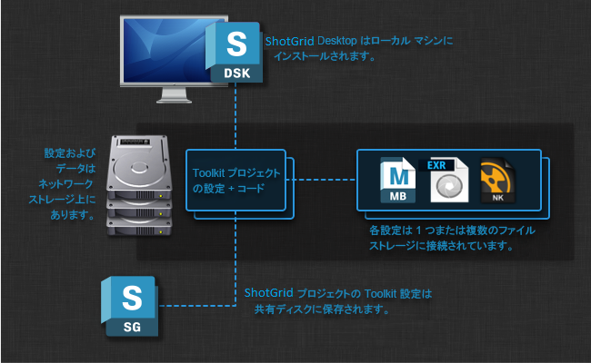

# 最初のプロジェクトの作成後

ここでは、 Desktop を使用して最初のプロジェクトを設定および実行した後の作業について説明します。ここには、よくある質問、トピック、役に立つドキュメントが掲載されています。

# Toolkit へようこそ

Toolkit へようこそ! このドキュメントを読んでいるということは、 Desktop を使用して最初の  Pipeline Toolkit プロジェクトのインストールに成功したことになります。

この段階では、上記のスクリーンショットのような画面や、いくつかのアプリケーション ランチャーが設定されたプロジェクト ページが表示されているはずです。ここでは、Maya、Nuke、または他のアプリケーションを起動してみてください。ファイルとアセットを管理するための詳細な機能を含む  メニューが表示されているはずです。

では次に何をしましょうか? Toolkit は、環境設定とその仕組みに関して優れた柔軟性を発揮します。このドキュメントでは、 Desktop を使用して最初のプロジェクトを完成したら実行すべきいくつかの推奨手順について説明します。

# 基本設定

このセクションには、一連の調整項目と、設定すると便利な項目が含まれます。最初の Toolkit プロジェクトをセットアップしたら、すべてを正しく機能させるためにたくさんの項目を少しずつ調整することになるでしょう。このセクションでは、それらのさまざまな手順について説明します。その中には設定ファイルの編集や現時点の「具体的な調査」が含まれます。何か質問がありましたら、[サポート サイト](https://knowledge.autodesk.com/ja/contact-support)にアクセスしてサポートを依頼してください。

## アプリケーション パスをセットアップする

最初のプロジェクトをセットアップして、Maya、Motionbuilder、または Nuke のいずれかの起動ボタンをクリックすると、次のようなエラー メッセージが表示される可能性があります。

Toolkit プロジェクト設定には、起動可能なさまざまな実行可能ファイルへのパスが保存されています。上記のメッセージが表示された場合は、このパスがスタジオのセットアップと一致していない可能性があります。
 この場合、異なるバージョンのアプリケーションが起動されていることもあります。たとえば、既定では Maya 2015 へのパスが設定されていますが、スタジオで Maya 2014 を使っている場合などです。この場合、このパスも変更する必要があります。

既定の設定では、このようなパスはすべて、`paths.yml` と呼ばれる 1 つのファイルに保存されています。パスを変更するためには、ディスク上のプロジェクト設定を特定し、`paths.yml` ファイルが見つかるまで設定フォルダを移動します。

このファイルを開いて、パスに必要な変更を加えます。ファイルを保存したら、 Desktop 内のプロジェクトを終了して、このプロジェクトを再びクリックする必要があります (ただし、アプリケーション全体を再起動する必要はありません)。

**その他の資料**

アプリケーションの詳細については、次のトピックを参照してください。

- [Toolkit Application Launcher](https://support.shotgunsoftware.com/hc/ja/articles/219032968)
- [コマンドライン引数を渡す](https://support.shotgunsoftware.com/hc/ja/articles/219032968#Use%20Command%20Line%20Arguments%20at%20Launch)

##  統合

Toolkit は  と統合し、特別なツールキット アクション メニュー アイテムを UI のさまざまな部分に追加することで従来のインタフェースを拡張します。

これにより、データに作用する Toolkit アプリケーションまたはカスタム ツールを  から直接起動できるようになります。 サイトとの統合の詳細については、[『管理者ガイド』の「ブラウザの統合」のセクション](https://support.shotgunsoftware.com/hc/ja/articles/115000067493-Integrations-Admin-Guide#Browser%20Integration)を参照してください。

##  UI にパブリッシュを追加する

Toolkit をインストールしたら、通常は  UI レイアウトに微調整を加える必要があります。ファイルをパブリッシュすると、 Pipeline Toolkit は_パブリッシュ エンティティ_を作成するため、ショットやアセットなどのキー アセットに _Publishes タブ_を簡単に追加できます。このためには、管理者ユーザとしてログインする必要があります。アセットまたはショットを選択し、_[デザイン モード] (Design Mode)_ を選択して開始します。

ここで、タブ上の小さな三角形のメニューをクリックし、_[新しいタブを追加] (Add New Tab)_ アクションを選択します。これでダイアログ UI が表示されます。_[パブリッシュ] (Publishes)_タブを呼び出し、_[パブリッシュ ファイル] (Published File)_ エンティティと関連付けられていることを確認します。

ここで _[保存] (Save)_ をクリックして変更内容を保存します。設定がすべて完了しました。

注: 新しいタブを作成すると、 は取り込むいくつかの既定のフィールドを選択します。パブリッシュ用にいくつかのフィールドを追加する場合があります。このためには、新しいパブリッシュ タブの下に表示されるスプレッドシートの右上隅にある小さなプラス ボタンをクリックします。次のフィールドを追加することをお勧めします。

- **[説明] (Description)**: このパブリッシュの変更に関する説明が表示されます
- **[作成者] (Created By)**: パブリッシュを作成したユーザ
- **[作成日] (Date Created)**: パブリッシュが作成された日付

レイアウトを変更する場合は、後でページを忘れずに保存してください。

## 複数のオペレーティング システム

**Python が見つからない**ことを通知するメッセージがドキュメントのこのセクションへのリンクとともに表示される場合があります。

Toolkit は、[Python](https://www.python.org/) と呼ばれる言語を使用してスクリプトと機能を実行します。 Desktop には完全な Python がインストールされているため、通常はこのことを心配する必要はありません。 Desktop を使用して新しい Toolkit プロジェクトをセットアップすると、既定では、プロジェクトは  Desktop にバンドルされた Python を使用するようにセットアップされます。ただし、場合によっては、Toolkit に Python の使用を明示的に指示する必要があります。これは次の場合に発生します。

- すべての Python の既定値が自動的に設定されない、古いバージョンの  Desktop を使用する場合。
-  Desktop をディスク上の標準の場所以外にインストールしている場合。
- 手動または複雑な Toolkit プロジェクト セットアップを実行している場合。

Python へのパスは設定ファイルに保存されており、手動で編集することができます。

正しいファイルを探すためには、最初にプロジェクト設定に移動します。ここで、`interpreter_` から始まる 3 つのファイルを探します。Linux、Windows、および Mac (「Darwin」)用の Python インタプリタへのパスが含まれています。これらのファイルには、3 つのオペレーティング システム用の Python の場所がそれぞれ含まれます。ここで、使用するオペレーティング システム用の Python の場所を手動で追加する必要があります。

ファイルが空の場合、古いバージョンの  Desktop を使用していることを示しています。このような場合は、既定の Python のパスで空のファイルを更新します。既定のパスは次のとおりです。

- Macosx (Darwin): `/Applications/Shotgun.app/Contents/Frameworks/Python/bin/python`
- Windows: `C:\Program Files\Shotgun\Python\python.exe`
- Linux: `/opt/Shotgun/Python/bin/python`

標準の場所以外に  Desktop をインストールしたり、独自の Python の場所を使用したりする場合は、ファイル内のこのパスが有効な Python インストールをポイントしていることを確認してください。バージョンは v2.6 以上(Python 3 以外)を指定する必要があります。UI ベースのアプリケーションとツールを実行する場合は、指定した Python に PyQt または PySide がインストールされており、QT v4.6 以降にリンクされていることを確認してください。

複数のオペレーティング システムで Toolkit を実行するために、プロジェクト セットアップ ウィザードの実行時にすべての任意のプラットフォームへのパスを指定する必要があることにも注意してください。パスをまだ指定しておらず、別のオペレーティング システムをストレージ パスまたは設定場所に追加する場合は、[サポート サイト](https://knowledge.autodesk.com/ja/contact-support)にアクセスしてサポートを依頼してください。

# 次のステップ

この時点で、 プロジェクト(またはテスト プロジェクト)用に既定の  セットアップが動作しているはずです。アプリケーションが起動し、コンテキスト メニュー アクションとパブリッシュが  に表示され、任意のオペレーティング システム プラットフォームすべてで処理が行われています。

このセクションでは、次の作業、つまり既定の設定を取り込んで、スタジオ パイプラインの全体と機能するように調整するプロセスについて説明します。Toolkit には柔軟性があり、高度にカスタマイズ可能で、たくさんのドキュメントが用意されています。開始前にすべてのアクションを確認するために、数分間を費やしてさまざまなウォークスルー ビデオを視聴することをお勧めします。このビデオでは、 Pipeline Toolkit の操作、Maya や Nuke などのアプリケーション内での動作について説明しています。また、パブリッシュ、バージョン管理、読み込みなどの基本的なコンセプトについても説明します。

[ Toolkit のビデオ コレクション](https://support.shotgunsoftware.com/hc/ja/articles/219040678)

## Toolkit プロジェクトの構造

新しい Toolkit プロジェクトを作成する場合、いくつかの主要な場所があります。

-  Desktop とその環境設定はローカル マシンにインストールされます (必要に応じて、アプリケーションと環境設定の両方を共有ストレージに配置することができます)。
- Toolkit プロジェクトがテクスチャ、ファイル、レンダリングなどを保存するデータ領域です。通常この領域は、他のユーザとデータを共有するために共有ストレージ上にありますが、これには例外があります。ユーザ作業領域をローカル(ユーザのみの)ストレージ上に指定し、Perforce 統合などで外部システムを使用してコンテンツを配布する場合です。
- Toolkit の環境設定は、コード、アプリ、Core API などを完全に独自にバンドルしています。通常、これは共有ストレージに格納されており、すべてのユーザが環境設定に簡単にアクセスできます。

ディスク上のプロジェクト設定にはいくつかの異なる項目が含まれています。

次のセクションでは、プロジェクト設定フォルダのさまざまな部分について説明します。

### コマンド ライン アクセス

 Desktop を使用する場合と同様に、端末またはシェルからも Toolkit にアクセスできます。ディスク上に作成した各プロジェクトには、API セッションやアプリケーションの起動など、たくさんの機能にコマンド ライン ベースでアクセスする特別な `tank` コマンドが用意されています。

プロジェクト設定に移動すると、設定のルートに `tank` と `tank.bat` コマンドが表示されます。オプションを使用せずにこれらのコマンドを実行すると、現在の環境設定でサポートされるすべてのコマンドがリスト表示されます。次のような便利なコマンドもあります。

- `tank shell`: tk api アクセスでインタラクティブな Python シェルを起動します
- `tank core`: このプロジェクトの Core API に更新があるかどうかを確認します
- `tank updates`: この設定のアプリまたはエンジンに更新があるかどうかを確認します

`tank` コマンドの実行内容の詳細については、詳細な技術ドキュメントを参照してください。

[Toolkit を管理する方法](https://support.shotgunsoftware.com/hc/ja/articles/219033178)

### 主要な設定ファイル

`config` フォルダにはいくつかの主要な設定ファイルが含まれます。

Toolkit には、アプリケーションの起動時に必要なすべての構造がディスク上に用意され、事前に設定が完了するようディスク上にフォルダを自動的に作成するフォルダ作成システムが付属します。この設定は上記の `schema` フォルダ内にあります。

このフォルダにアクセスすると、パブリッシュ、作業ファイル、レンダリングなど、設定可能なファイルへのさまざまなパスを簡単に定義できる Toolkit の「テンプレート システム」__があります。これは上記の `templates.yml` ファイルに保存されています。

プロジェクト設定のこれら 2 つを組み合わせると、既存のパイプラインで認識されるディスク上の場所にデータを書き込むために Toolkit が使用するさまざまなアプリを調整できます。

詳細については、高度なドキュメントを参照してください。

- [フォルダ設定](https://support.shotgunsoftware.com/hc/ja/articles/219033178#Creating%20folders%20on%20disk%20with%20Sgtk)
- [ファイルシステム テンプレート](https://support.shotgunsoftware.com/hc/ja/articles/219033178#Configuring%20Templates)

Toolkit の基本設定では、一連の**アプリとエンジン**が既に設定されています。この設定は `env` フォルダ内に格納されています。上記のファイル システム設定ファイルでディスク上のリソースの格納場所を定義する場合、そのアプリとエンジンを含む環境設定はパイプラインの動作内容を定義します。____

### Core API プラットフォーム

各プロジェクト設定で一連のアプリとエンジンが使用されます。このアプリとエンジンの環境設定は環境設定内の `env` フォルダに格納されています。Toolkit は、このアプリとエンジンの実行に必要なコードのさまざまなバージョンを自動的にダウンロードおよび管理します。このコードは `install` フォルダ内に配置されます。

環境設定、アプリ、およびエンジンはすべて、Toolkit Core プラットフォーム上で動作します。新しいプロジェクトの場合、これも `install` フォルダに保存されます。基本的に、プロジェクト設定は完全な自己完結型で、Toolkit の実行に必要なすべてのパーツは 1 つの場所に格納されています。また、各プロジェクトは独立しており、1 つのプロジェクトを更新しても別のプロジェクトには影響しません。

テクニカル ノート: 共有 Toolkit Core を使用する(クリックして展開)

### その他の資料

さらに、 Pipeline Toolkit の概念と「概要」を説明した技術ドキュメントもあります。最初に Toolkit の操作を簡単に把握したら、自社固有のニーズに合わせて Toolkit を調整する方法について理解できるこのドキュメントを確認することをお勧めします。

[ Toolkit の概念の説明](https://support.shotgunsoftware.com/hc/ja/articles/219040648)

## Toolkit コミュニティ

Toolkit にはパイプライン エンジニアと TD のコミュニティがあります。当社は、Toolkit と組み合わせて強力で柔軟性に優れたパイプライン環境を展開できるようにコードを積極的に共有するコミュニティの作成に取り組んでいます。

質問がある場合や過去の投稿や会話を確認する場合は、[公開フォーラム セクション](https://support.shotgunsoftware.com/hc/ja/community/topics/200682428)にアクセスしてください。

