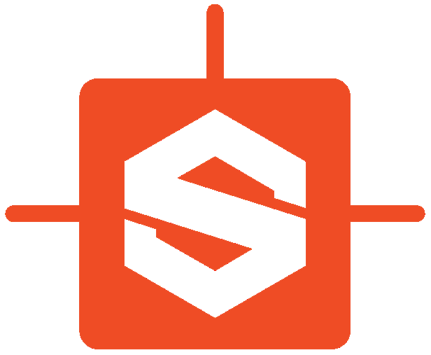
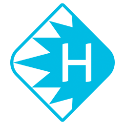
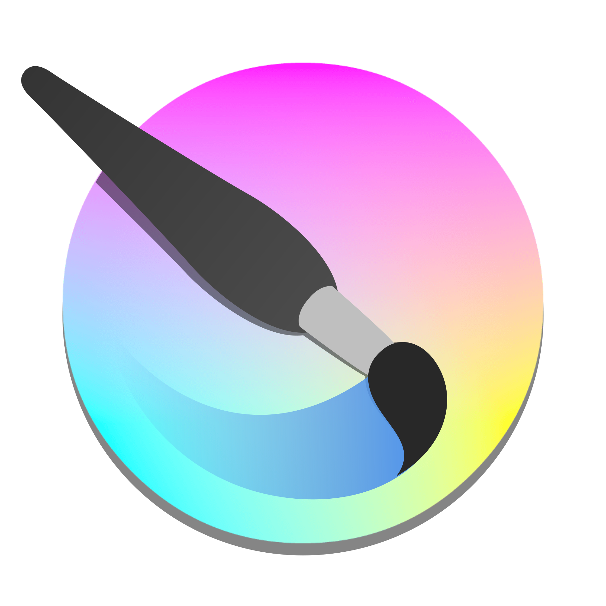
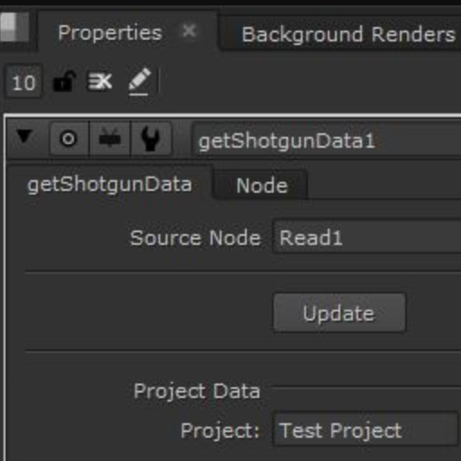
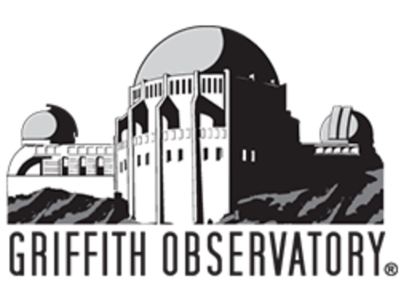

# コミュニティで共有されている統合

以下に示すものは、Toolkit コミュニティのユーザが共有しているプロジェクトです。 の開発チームが作成したものではないため、保証は適用されませんが、質問にはお答えします。このリストに自分のプロジェクトを追加したいと思う方は、[サポート サイト](https://knowledge.autodesk.com/ja/contact-support)にアクセスしてサポートを依頼してください。

### エンジン

----------

| 統合 | エンジン | 情報 |
|:-----------:|:------:| ----------- |
| |  **tk-katana**  | プロジェクト URL: [https://github.com/robblau/tk-katana](https://github.com/robblau/tk-katana)  プロジェクト投稿者: [Lightchaser Animation](https://github.com/LightChaserAnimationStudio)  プロジェクト管理者:   プロジェクトの説明: Foundry の Katana 用の  エンジン   |
| | **tk-unreal** | プロジェクト URL: [https://docs.unrealengine.com/4.26/ja/ProductionPipelines/UsingUnrealEnginewithAutodeskShotgun/](https://docs.unrealengine.com/4.26/ja/ProductionPipelines/UsingUnrealEnginewithAutodeskShotgun/)  プロジェクト投稿者: [Epic Games](https://epicgames.com/)  プロジェクト管理者:  プロジェクトの説明: [Unreal Engine](https://www.unrealengine.com/en-US/) 用の  エンジン |
| |  **tk-substancepainter** | プロジェクト URL: [https://github.com/diegogarciahuerta/tk-substancepainter](https://github.com/diegogarciahuerta/tk-substancepainter)  プロジェクト投稿者: [Factor64](https://www.factor64.com/)  プロジェクト管理者: [Diego Garcia Huerta](https://www.linkedin.com/in/diegogh/)  プロジェクトの説明: Adobe の Substance Painter 用の  エンジン |
| |  **tk-substancedesigner**  | プロジェクト URL: [https://github.com/diegogarciahuerta/tk-substancedesigner](https://github.com/diegogarciahuerta/tk-substancedesigner)    プロジェクト投稿者: [Factor64](https://www.factor64.com/)    プロジェクト管理者: [Diego Garcia Huerta](https://www.linkedin.com/in/diegogh/)    プロジェクトの説明: Adobe の Substance Designer 用の  エンジン     詳細: [ コミュニティ フォーラム](https://community.shotgridsoftware.com/t/substance-designer-shotgun-toolkit-engine-released/9944)|
| |  **tk-modo**  | プロジェクト URL: [https://github.com/tremolo/tk-modo](https://github.com/tremolo/tk-modo)    プロジェクト投稿者: Lutz Pälike と [Walking The Dog](https://www.walkingthedog.be/)    プロジェクト管理者:    プロジェクトの説明: Foundry の Modo 用の  エンジン |
| |  **tk-clarisse** | プロジェクト URL: [https://github.com/diegogarciahuerta/tk-clarisse](https://github.com/diegogarciahuerta/tk-clarisse)  プロジェクト投稿者: [Factor64](https://www.factor64.com/)  プロジェクト管理者: [Diego Garcia Huerta](https://www.linkedin.com/in/diegogh/)  プロジェクトの説明: 設定された装飾、ルック開発、ライティング、およびレンダリング用の完全にインタラクティブな CG ツールセット [Clarisse iFX](https://www.isotropix.com/products) 用の  エンジン。 |
| |  **tk-natron** | プロジェクト URL: [https://github.com/diegogarciahuerta/tk-natron](https://github.com/diegogarciahuerta/tk-natron)  プロジェクト投稿者: [Factor64](https://www.factor64.com/)  プロジェクト管理者: [Diego Garcia Huerta](https://www.linkedin.com/in/diegogh/)  プロジェクトの説明: ノードをベースとする無償のオープンソース ソフトウェア アプリケーション [Natron](https://natrongithub.github.io/) 用の  エンジン。 |
| |  **tk-harmony** | プロジェクト URL: [https://github.com/diegogarciahuerta/tk-harmony](https://github.com/diegogarciahuerta/tk-harmony)  プロジェクト投稿者: [Factor64](https://www.factor64.com/)  プロジェクト管理者: [Diego Garcia Huerta](https://www.linkedin.com/in/diegogh/)  プロジェクトの説明: 業界をリードするアニメーション制作ソフトウェア [Toon Boom Harmony](https://www.toonboom.com/products/harmony) 用の エンジン。|
| |  **tk-cinema** | プロジェクト URL: [https://github.com/mikedatsik/tk-cinema](https://github.com/mikedatsik/tk-cinema)  プロジェクト投稿者: Mykhailo Datsyk   プロジェクト管理者: Mykhailo Datsyk   プロジェクトの説明: モデリング、アニメーション、レンダリングのためのデザイナー向けのツールセット [Maxon Cinema 4D](https://www.maxon.net/en-us/products/cinema-4d/overview/) 用の  エンジン。  詳細: [コミュニティ フォーラム](https://community.shotgridsoftware.com/t/shotgun-toolkit-engine-for-maxon-cinema-4d/6437)| 
| |  **tk-krita** | プロジェクト URL: [https://github.com/diegogarciahuerta/tk-krita](https://github.com/diegogarciahuerta/tk-krita)  プロジェクト投稿者: [Factor64](https://www.factor64.com/)  プロジェクト管理者: [Diego Garcia Huerta](https://www.linkedin.com/in/diegogh/)  プロジェクトの説明: デジタル ペインティングと 2D アニメーション向けの無償のオープンソース ラスター グラフィックス エディタである [Kriat](https://krita.org/en/) 用の  Engine  詳細: [コミュニティ フォーラム](https://community.shotgridsoftware.com/t/krita-shotgun-toolkit-engine-released/8724) |
| |  **tk-blender** | プロジェクト URL: [https://github.com/diegogarciahuerta/tk-blender](https://github.com/diegogarciahuerta/tk-blender)  プロジェクト投稿者: [Factor64](https://www.factor64.com/)  プロジェクト管理者: [Diego Garcia Huerta](https://www.linkedin.com/in/diegogh/)  プロジェクトの説明: [Blender](https://www.blender.org/) 用の  Engine。無償のオープンソース 3D コンピュータ グラフィックス ソフトウェアのツールセットで、アニメーション フィルム、ビジュアル エフェクト、アート、3D プリント モデル、モーション グラフィックス、インタラクティブ 3D アプリケーション、仮想現実(VR)、コンピュータ ゲームなどの作成に使用されます。  詳細: [コミュニティ フォーラム](https://community.shotgridsoftware.com/t/blender-shotgun-toolkit-engine-released/10773)|

### アプリ

----------

| 統合 | エンジン | 情報 |
|:-----------:|:------:| ----------- |
| | **tk-maya-playblast** | プロジェクト URL: [https://github.com/basestudio/tk-maya-playblast](https://github.com/basestudio/tk-maya-playblast)    プロジェクト投稿者: [BASE Studio](https://github.com/basestudio)    プロジェクト管理者:    プロジェクトの説明: Maya のプレイブラストをパブリッシュするアプリです。[https://goo.gl/5oJTv0](https://goo.gl/5oJTv0) を参照|
| | **tk-multi-renderfarm**  | プロジェクト URL: [https://github.com/baitstudio/tk-multi-renderfarm](https://github.com/baitstudio/tk-multi-renderfarm)    プロジェクト投稿者: [Bait Studio](https://www.baitstudio.com/)    プロジェクト管理者:    プロジェクトの説明: ファームに作業を送信するアプリです。[https://goo.gl/ew6mkD](https://goo.gl/ew6mkD) を参照 |
| | **tk-shotgun-publishrenders**  | プロジェクト URL: [https://github.com/janimation/tk-shotgun-publishrenders](https://github.com/janimation/tk-shotgun-publishrenders)    プロジェクト投稿者:    プロジェクト管理者: [Dave Sisk](mailto:dave@janimation.com)    プロジェクトの説明: このアプリは、既存のパブリッシュ ファイルまたはファイル シーケンスを検出するためにプロジェクトのディレクトリ構造を検索し、パブリッシュ ファイル オブジェクトがまだ存在しない場合は、パブリッシュ ファイルとして  にこのオブジェクトを登録します。 |
| | **nuke-getShotgunData**  | プロジェクト URL: [https://github.com/RicardoMusch/nuke-getShotgunData](https://github.com/RicardoMusch/nuke-getShotgunData)    プロジェクト投稿者: [Ricardo Musch](https://www.ricardo-musch.com/)    プロジェクト管理者: Ricardo Musch     プロジェクトの説明:  のデータを Nuke のテキスト ノードに取り込むのは少し厄介です。このノードは、スレート内のパイプやバーンインなど、さまざまな場所で使用できます。  |
| | **sb-shotgun-schema-introspection**  | プロジェクト URL: [https://github.com/scottb08/sb-shotgun-schema-introspection](https://github.com/scottb08/sb-shotgun-schema-introspection)    プロジェクト投稿者: [Scott Ballard](https://www.linkedin.com/in/scottballard/)    プロジェクト管理者: Scott Ballard     プロジェクトの説明:  および Toolkit の開発者が  エンティティ、フィールド、および基盤となるスキーマに素早く移動して検査できるようにする、シンプルな Toolkit アプリです。 |
| | **foto-multi-namingconvention**  | プロジェクト URL: [https://github.com/scottb08/foto-multi-namingconvention](https://github.com/scottb08/foto-multi-namingconvention)    プロジェクト投稿者: [Griffith Observatory](https://www.griffithobservatory.org/)    プロジェクト管理者: [Scott Ballard](https://www.linkedin.com/in/scottballard/)    プロジェクトの説明:  および Toolkit の開発者が  エンティティ、フィールド、および基盤となるスキーマに素早く移動して検査できるようにする、シンプルな Toolkit アプリです。 |
| | **tk-cpenv**  | プロジェクト URL: [https://github.com/cpenv/tk-cpenv](https://github.com/cpenv/tk-cpenv)    プロジェクト投稿者: [Dan Bradham](https://github.com/danbradham)    プロジェクト管理者: [Dan Bradham](https://github.com/danbradham)    プロジェクトの説明: このアプリは、ソフトウェア プラグイン、プロジェクトの依存関係、環境変数を管理するモジュールを使用する [cpiv](https://github.com/cpenv/cpenv) ツールのサポートを追加します。    詳細: [コミュニティ フォーラム](https://community.shotgridsoftware.com/t/rez-support/7350/7) |
| | **rtm-tk-hiero-shotgunDropper**  | プロジェクト URL: [https://github.com/RicardoMusch/rtm-tk-hiero-shotgunDropper](https://github.com/RicardoMusch/rtm-tk-hiero-shotgunDropper)  プロジェクト投稿者: [Ricardo Musch](https://www.ricardo-musch.com/)  プロジェクト管理者: Ricardo Musch   プロジェクトの説明: このアプリを使用すると、 から Hiero にバージョンとプレイリストをドロップできます。  詳細: [コミュニティ フォーラム](https://community.shotgridsoftware.com/t/release-shotgundropper-for-hiero/4183) |
