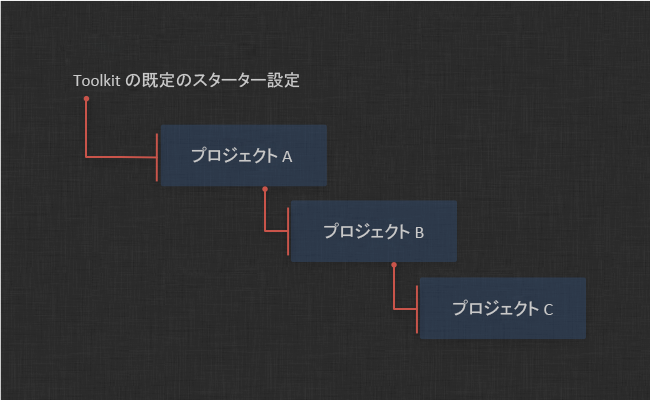

# 設定のステージングとロールアウト

このドキュメントでは、プロダクション パイプラインに変更を安全に展開する方法に関するベスト プラクティスについて説明します。運用環境のコピーであるステージングのサンドボックスを作成する方法、このサンドボックスを更新する方法、テスト方法、最後に運用環境に変更を反映する方法について説明します。

_このドキュメントは、Toolkit の設定を管理するユーザのみが使用可能な機能について説明します。既定の設定については、『[統合管理者ガイド](https://support.shotgunsoftware.com/hc/ja/articles/115000067493)』を参照してください。_

# はじめに

このドキュメントでは、Toolkit 設定を管理する方法について説明します。Toolkit には複数のユーティリティとツールが装備されているため、環境設定を管理し、安全なサンドボックス環境でアップグレードと変更をテストしてから、それらをプロダクション環境全体に適用できます。

このドキュメントでは、以下の方法について説明します。

- Toolkit Core API の安全なアップグレード方法
- アプリとエンジンの更新方法
- 複数のプロジェクト間で設定を管理するためのさまざまな方法
- プロダクションを中断せずにアップグレードと変更を安全にテストできるように、Toolkit の_クローン_機能と_プッシュ_機能にアクセスする方法
- `git` ソース コントロールと Toolkit の連携方法

# 設定管理の基本

各 Toolkit プロジェクトには関連する 1 つ以上の環境設定があります。環境設定には、ファイル システムの場所(テンプレート)やエンジン アプリなど、プロジェクトで必要になるすべての設定が含まれています。Toolkit では各プロジェクトを個別に設定できます。つまり、異なるプロジェクトが安全に共存でき、あるプロジェクトをアップグレードしても他のプロジェクトには影響しないということです。

大量のプロジェクトを作業していると、プロセスが複雑になることがありますが、このプロセスを簡単かつ安全に合理化できるいくつかの方法を用意しています。

 の各プロジェクトには多くの**パイプライン設定**があります。プロジェクトを初めて Toolkit でセットアップする場合、`primary` と呼ばれるパイプライン設定が作成されます。 のパイプライン設定エンティティは、Toolkit 設定が格納されているディスク上の場所をポイントしています。

多くの場合、プロジェクトの過程で環境設定に変更を加える必要があります。環境設定を調整したり、他のアプリやエンジンを追加したりする必要があります。また、新しいアプリ バージョンが頻繁にリリースされるため、できるだけ最新バージョンを使用することをお勧めします。

_primary_ プロジェクト設定は簡単にアップグレードできますが、これにはリスクがあります。この設定はプロジェクトのすべてのユーザが使用するため、問題が発生すると、すべてのユーザに影響を与えてしまいます。ある特定のグループのユーザだけがアクセスできるように、個別のバージョンの設定を作成するのが最適です。この安全な環境では、残りの制作環境に影響を与えることなく、アップグレード、設定変更、および開発を行うことができます。変更のテストが完了したら、安全かつ確実に変更をプライマリ環境設定に適用できます。

このプロセスは「クローン作成」__と呼ばれます。自分(および招待したその他のユーザ)のみがクローンにアクセスできるようにプライマリ環境設定のコピーを個別に作成するという操作です。ここでは、安全に変更を追加し、特に問題がなければ、この変更をプライマリ環境設定に適用することができます。

## 環境設定のクローンを作成する

Toolkit をセットアップしてプロジェクトを設定したら、セットアップは次のようになります。


_studio_ インストールにはすべてのプロジェクトの Core API が格納されます。また、この _studio_ の場所には、Toolkit に対応した  プロジェクトへのアクセスに使用できる `tank` コマンドと Toolkit Python API も含まれます。

これに加え、各プロジェクトの設定フォルダもあります。このフォルダには当該プロジェクトのすべての設定が含まれます。この設定で特別に動作する `tank` コマンド(および Python API)も含まれます。この `tank` コマンドまたは API コードを使用している場合は、この設定のみを操作できます。

新しいプロジェクトをセットアップすると、「 _プライマリ_ 環境設定」が作成されます。これは Toolkit がプロジェクトに既定で使用する環境設定です。このプライマリ環境設定に加えて、プロジェクトに追加の環境設定を作成できます。これらの環境設定は共存でき、チーム全体に影響を与えずに、変更のテスト、アプリのアップグレード、または開発などを少しずつ個別に行う場合に役立ちます。追加の環境設定は、 _クローン_ 作成と呼ばれる設定を新しい場所にコピーするプロセスによって作成されます。

環境設定のクローンが作成されると、セットアップは次のように表示されます。


スタジオ レベルの `tank` コマンドとプライマリ プロジェクト設定の `tank` コマンドに加えて、独自の `tank` コマンドを持つ新しいパイプライン設定を使用できるようになりました。この `tank` コマンドを実行すると、ステージング サンドボックスに格納された環境設定のみを操作できます。Maya のいくつかの新しい機能をテストする場合、クローン作成したサンドボックスにアクセスするだけです。`./tank Shot xyz launch_maya` を実行すると、Maya に表示される  メニューには、プライマリ環境設定ではなくステージング サンドボックス内の環境設定が反映されます。

スタジオ レベルの `tank` コマンドは常にプライマリ環境設定を使用するため、クローン作成した環境設定にアクセスする唯一の方法は、その場所にアクセスして、そのフォルダに格納された `tank` コマンドを使用することです。 では、パイプライン設定のエントリに特定のユーザ セットを割り当てることができます。環境設定に関連付けられたユーザは、プライマリ設定のメニューに加えて、新しいメニュー エントリが表示されます。


### クローン作成した環境設定を作成する

アップグレードを安全にテストできるステージング サンドボックスを作成するために、 でプロジェクトのパイプライン設定にアクセスし、プライマリ環境設定を右クリックします。設定のクローンを作成するためのオプションが表示されます。


このオプションをクリックすると、この新しい環境設定を格納するディスク上のパスを指定するためのダイアログが表示されます。マルチ OS セットアップを実行している場合は、関連するすべてのプラットフォームにパスを入力してください。


[OK]をクリックすると、Toolkit は設定をコピーしてクローンをセットアップします。また、クローンを作成したらすぐに  ユーザとこの設定が関連付けられるため、 内に新しいメニュー項目が表示されます。

### ステージング サンドボックスの変更をプライマリに適用する

関連する更新を適用して必要なテストを実行したら、`tank push_configuration` コマンドを実行してプロダクション環境に変更を反映することができます。これにより、ステージング サンドボックスで加えたすべての変更がプライマリ環境設定に転送されます。

現在の環境設定は、`push_configuration` コマンドを実行するバックアップ フォルダに移動されます。間違って適用した場合、または適用に問題が発生した場合は、バックアップ フォルダ内のコンテンツを選択し、設定フォルダにコピーするだけでロールバックできます。

既定では、このコマンドはファイル コレクションを対象のパイプライン設定の `config` フォルダにコピーします。UNIX を使用しており、詳細なアトミック更新が必要な場合は、`push_configuration` コマンドに `--symlink` フラグを追加することができます。これにより、対象のパイプライン設定の `config` フォルダがシンボリック リンクに変換されるため、現在実行中のセッションと設定の不一致が発生するリスクがなく、簡単にアップグレードできます。

### クローン作成した古い環境設定を更新する

以前の開発サンドボックスまたはステージング サンドボックスをセットアップしているが、それが古いためそのコンテンツと最新のプロダクション環境を同期する必要がある場合は、プライマリ環境設定で `push_configuration` コマンドを実行します。
```shell
tank push_configuration

Welcome to the  Pipeline Toolkit!
For documentation, see https://support.shotgunsoftware.com
Starting Toolkit for your current directory '/tmp'
- Using configuration 'Primary' and Core v0.14.52
- Setting the Context to Empty Context.
- Running command push_configuration...

----------------------------------------------------------------------
Command: Push configuration
----------------------------------------------------------------------

This command will push the configuration in the current pipeline configuration
('Primary') to another pipeline configuration in the project.

Your existing configuration will be backed up.

The following pipeline configurations are available to push to:
 - [324] Staging Sandbox (/my/staging/sandbox)

Please type in the id of the configuration to push to (ENTER to exit): 324
Hold on, pushing config...
Checking if there are any apps that need downloading...
Push Complete!

Your old configuration has been backed up into the following folder:
/my/staging/sandbox/config.bak.20140108_093218
```
プライマリ プロジェクト設定からステージング サンドボックスに適用する方法にご注目ください。_プライマリ_ 環境設定の `tank` コマンドを実行しています。複数のサンドボックスをセットアップしている場合は、サンドボックス間にデータを適用することもできます。

### クローン作成した環境設定を削除する

クローン作成した環境設定を削除する場合は、 のエントリを削除してディスクからフォルダを削除するだけです。

## 最新のアプリとエンジンを取得する

ステージング サンドボックス(または他の環境設定)内で、利用可能なアプリ更新を確認するために `tank updates` コマンドを実行できます。このコマンドには、環境設定の特定の領域を確認する場合にのみ使用できる基本的なフィルタがあります。

```shell
----------------------------------------------------------------------
Command: Updates
----------------------------------------------------------------------

This command will go through your current configuration and check if there are
any updates available. If there are updates, you will be asked if you want to
perform an upgrade. If settings has been added to the new version that you are
installing, you may be prompted to specified values for these.

Running this command with no parameters will check all environments, engines
and app. This may take a long time. You can also run the updater on a subset
of your installed apps and engines.

General syntax:
> tank updates [environment_name] [engine_name] [app_name]

The special keyword ALL can be used to denote all items in a category.

Examples:

Check everything:
> tank updates

Check the Shot environment:
> tank updates Shot

Check all maya apps in all environments:
> tank updates ALL tk-maya

Check all maya apps in the Shot environment:
> tank updates Shot tk-maya

Make sure the loader app is up to date everywhere:
> tank updates ALL ALL tk-multi-loader

Make sure the loader app is up to date in maya:
> tank updates ALL tk-maya tk-multi-loader
```
## Toolkit Core API をアップグレードする

このセクションでは、クローンのステージング サンドボックス設定を使用して Toolkit Core API を安全にアップグレードする方法について説明します。ステージング サンドボックスをまだ準備していない場合は、前のセクションの手順に従ってください。

ステージング サンドボックスのクローンが[共有スタジオ Core API](https://support.shotgunsoftware.com/hc/ja/articles/219040448) を使用してパイプライン設定から作成された場合、固有の Core API コードを使用できるようにサンドボックスを更新します。これはコアの「ローカライズ」と呼ばれ、ステージング サンドボックスにアクセスして `tank localize` を実行します。このコマンドにより、スタジオ インストールからサンドボックスに Core API がコピーされるため、後で Core API の別のバージョンを実行およびテストすることができます。

Toolkit の既定の動作は、コアを既定でローカライズすることです。_事前に共有スタジオ コアを明示的に作成していない場合は、コアが既にローカライズされていると見なした方が間違いありません。_
```shell
cd /my/staging/sandbox
./tank localize

Welcome to the  Pipeline Toolkit!
For documentation, see https://support.shotgunsoftware.com
Starting Toolkit for your current directory '/my/staging/sandbox'
- Using configuration 'Staging Sandbox' and Core v0.14.52
- Setting the Context to Empty Context.
- Running command localize...

----------------------------------------------------------------------
Command: Localize
----------------------------------------------------------------------

This will copy the Core API in /mnt/software/shotgun/studio into the Pipeline
configuration /my/staging/sandbox.

Do you want to proceed [yn]y

Localizing Core: /mnt/software/shotgun/studio/install/core -> /my/staging/sandbox/install/core
Copying Core Configuration Files...
Localizing Apps: /mnt/software/shotgun/studio/install/apps -> /my/staging/sandbox/install/apps
Localizing Engines: /mnt/software/shotgun/studio/install/engines -> /my/staging/sandbox/install/engines
Localizing Frameworks: /mnt/software/shotgun/studio/install/frameworks -> /my/staging/sandbox/install/frameworks
The Core API was successfully localized.

Localize complete! This pipeline configuration now has an independent API.
If you upgrade the API for this configuration (using the 'tank core' command),
no other configurations or projects will be affected.
```
Core API をスタジオの場所で共有しなくなりますが、独自のバージョンを実行しています。ここで、ローカルの Tank コマンドを再び使用して、標準的な Core API アップグレードを実行することができます。
```shell
cd /my/staging/sandbox
./tank core
```
Toolkit は新しいバージョンが利用可能かどうかを確認して、ダウンロードとインストールを通知します。

Core API を更新したら、このインストールを必ずテストしてください。サンドボックスで `tank` コマンドを使用するか、 の特別なメニュー項目を使用して、いくつかのアプリを起動します。パイプラインの概要を確認し、必要に応じてテストを実行します。

最後に、問題がなければ、スタジオ バージョンの Core API を更新します。一般的な Toolkit のセットアップでは、Core API はすべてのプロジェクト間で共有されるため、スタジオの場所にある `tank` コマンドの `tank core` コマンドを実行すると、すべてのプロジェクトの Core API が更新されます。

# プロジェクト ライフサイクルを管理する

各 Toolkit プロジェクトには、当該プロジェクトのすべての設定を保持する独立した環境設定が含まれます。多くのプロジェクトを管理している場合は、多くの環境設定を管理する必要があることを意味します。このため Toolkit には、個別のプロジェクト向け、およびスタジオのライフサイクルと環境設定の発展向けに環境設定を扱うさまざまなツールと方法があります。このセクションでは、いくつかのベスト プラクティスを紹介し、環境設定のセットアップ方法に関する実際の手順について説明します。

スタジオのニーズに応じて、さまざまなレベルの複雑性に分けられる場合があります。Toolkit には 3 つの異なる手法があるため、それぞれについて詳細に説明します。

- 最も簡単な方法は、新しいプロジェクトをセットアップするときに以前のプロジェクトから環境設定をコピーすることです。これは小規模なスタジオでプロジェクトの量が少ない場合に最適です。
- プロジェクトの数が多く、同時に複数のプロジェクトを実行している場合、次のレベルの統合として、`git` バージョン コントロールをお勧めします。Toolkit は git をネイティブでサポートしており、git ベースのワークフローを実行すると、スタジオの環境設定を 1 つにまとめられ、その後この設定に加えたすべての変更がトラックされます。各プロジェクトは、必要に応じて環境設定の変更を安全に取り込むことができます。
- 大規模な設備を稼働している場合は、1 つの環境設定がスタジオ内で現在アクティブなすべてのプロジェクトに直接接続されるようなセットアップを検討してもよいかもしれません。環境設定に 1 箇所変更を加えると、すべてのプロジェクトに即座に影響します。

次のセクションでは、さまざまな方法を詳細に説明します。

## 以前のプロジェクトの環境設定を継承する

これは最も簡単な環境設定の管理方法です。Toolkit で最初にプロジェクトをセットアップする場合、既定の環境設定をダウンロードします。パイプライン設定やファイル システムの場所などが一致するように最初のプロジェクトをセットアップします。プロジェクトの実行中、実行しているアプリ バージョンを更新するには、`tank updates` などのコマンドを実行します。

2 つ目のプロジェクトの場合、既定の環境設定を使用して開始しないときは、プロジェクト セットアップ手順で、新しいプロジェクトのスターターとして最初のプロジェクトの環境設定を選択します。つまり、最初のプロジェクトで実行したすべての変更、調整、および改良が、2 つ目のプロジェクトにも適用されます。3 つ目のプロジェクトの場合は 2 つ目のプロジェクトの環境設定を使用する、というように続きます。



これは、時間の経過とともに環境設定を徐々に発展させることができる、非常に簡単な方法です。変更と改良は、その場その場でプロジェクトからプロジェクトへと受け継がれていきます。初めて `setup_project` コマンドを実行したとき、セットアップ プロセスで使用する環境設定の指定を求められたら[Enter]キーを押します。これで既定の環境設定のダウンロードおよびインストールが行われます。

2 つ目のプロジェクトの場合、以前のプロジェクトの環境設定へのパスのリストが表示されます。これらのいずれかのパスを選択し、セットアップ プロセスで環境設定の指定を求められたら[Enter]キーを押します。これで新しいプロジェクトにこの環境設定がコピーされます。
```
Welcome to the  Pipeline Toolkit!
For documentation, see https://support.shotgunsoftware.com
- Running command setup_project...

----------------------------------------------------------------------
Command: Setup project
----------------------------------------------------------------------

Welcome to the  Pipeline Toolkit Project Setup!

Connecting to ...
Connecting to the App Store...

------------------------------------------------------------------
Which configuration would you like to associate with this project?

You can use the configuration from an existing project as a template for this
new project. All settings, apps and folder configuration settings will be
copied over to your new project. The following configurations were found:

   My very first project: '/mnt/software/shotgun/first_project/config'

If you want to use any of the configs listed about for your new project, just
type in its path when prompted below.

You can use the Default Configuration for your new project.  The default
configuration is a good sample config, demonstrating a typical basic setup of
the  Pipeline Toolkit using the latest apps and engines. This will be
used by default if you just hit enter below.

If you have a configuration stored somewhere on disk, you can enter the path
to this config and it will be used for the new project.

You can also enter an url pointing to a git repository. Toolkit will then
clone this repository and base the config on its content.

[tk-config-default]: /mnt/software/shotgun/first_project/config
```
## git ソース コントロールでのスタジオ設定

最初の方法には制限事項があります。プロジェクト同士の接続は行われません。10 個のプロジェクトがあり、重要なバグ修正がリリースされたためすべてを更新する必要がある場合、各プロジェクトに手動でアクセスして `tank updates` コマンドを実行する必要があります。

この問題を解決するには、マスター環境設定を作成して git ソース コントロールに保存する方法があります。新しいプロジェクトを作成した場合は、セットアップ プロジェクト ダイアログでこの git リポジトリへのパスを入力するだけで、Toolkit がクローンを作成してくれます。これですべてのプロジェクトが同じ「スタジオ マスター」環境設定に接続されます。プロジェクト設定にいくつかの適切な変更を加えた場合は、その変更をコミットしてスタジオ マスターに適用することができます。その後、他のプロジェクトはこの変更を簡単に取り込むことができます。また、git を使用してすべての変更履歴を保持することもできます。

    git とは


基本的には、git 設定を保持する git リポジトリをセットアップするという考え方です。`tank setup_project` を実行する場合、このリポジトリに git URL を指定します(`username@someserver.com:/studio_config.git` など)。セットアップ プロセスでは、新しいプロジェクトがメインのスタジオ リポジトリに接続されたリポジトリになるようにリポジトリのクローンを作成します。接続後は、変更を適用および取得し、微調整のためにブランチで作業できます。

### スタジオの設定リポジトリをセットアップする

何か操作する前に、スタジオの設定リポジトリを作成する必要があります。このセクションでは、既存の Toolkit 設定を取得してこの設定から git リポジトリを作成する方法について説明します。

最初に git サーバにアクセスしてリポジトリを作成します。このプロセスは、設定によって異なる場合があります。GitHub などを使用している場合は、Web ブラウザを起動して github.com にアクセスします。サーバにアクセスできる場合は、`git init --bare` のようなコードを実行できます。ここで作成する git リポジトリは `username@someserver.com:/studio_config.git`と呼ばれます。

これで、リポジトリのシード設定に使用するプロジェクトの `config` フォルダを `config.bak` の場所に移動します。
```shell
cd /project_configs/studio_config
mv config config.bak
```
スタジオ設定のベースにするプロジェクトの `config` の場所に初期化した git リポジトリのクローンを作成します。クローン作成コマンドを実行したら、git リポジトリにもなる空の `config folder` が作成されます。
```shell
cd /project_configs/studio_config
git clone username@someserver.com:/studio_config.git config
```
`config.bak` の場所から `config` フォルダにすべてのファイルをコピーします。完了したら、空の `config.bak` フォルダは削除できます。設定ファイルが git リポジトリ内に格納されるため、サーバに対してそのファイルの追加、コミット、および適用を実行する必要があります。その前に、Toolkit のいくつかのシステム ファイルを正しく処理するために下準備を実行する必要があります。`config` フォルダで `.gitignore` ファイルを作成し、以下の行を追加します。
```shell
install_location.yml
pipeline_configuration.yml
```

これで git はこれら 2 つのシステム ファイルを無視します。次に進んで残りのファイルを環境設定に追加し、コミットしてスタジオ リポジトリに適用します。

```shell
git add --all
git commit -am "initial commit of our studio config!"
git push
```
### git で新しいプロジェクトを作成する

新しいプロジェクトを作成する場合は、セットアップ プロセスで使用する環境設定のパスの入力を求めるプロンプトが表示されたときに有効な git URL を指定するだけです。上記の例では、`username@someserver.com:/studio_config.git` と入力します。プロジェクト セットアップ プロセスの一環として、Toolkit は新しいプロジェクト設定の `config` フォルダにこのリポジトリのクローンを作成します。つまり、後でこの設定フォルダにアクセスし、git コマンドを実行できるということです。クローン作成されたパイプライン設定も git リポジトリのクローンを作成し、シームレスに動作します。

### プロジェクトに変更を加える

プライマリ設定を変更する場合は、`config` フォルダにアクセスし、`git diff`、`git commit`、および `git push` を実行するだけです。これにより、プロジェクト設定のクローン作成元のスタジオ設定に変更が適用されます。

### プロジェクトを最新バージョンに更新する

スタジオ レベルの環境設定を更新していくつか変更し、この変更をプロジェクトに取り込む場合は、`config` フォルダにアクセスして `git pull` を実行するだけです。**重要**: 実行が終了したら、変更した環境設定に必要なすべてのアプリ バージョンがシステムに表示されるように `tank cache_apps` を実行してください。

### git の高度な利用方法: ブランチ

Toolkit の既定の動作として、新しいプロジェクトの作成時に単純なクローン操作が実行されます。プロジェクトには git `master` ブランチを使用します。高度なセットアップでは、プロジェクトのプライベートに特定の設定の変更を保存し、他のプロジェクトとその変更を共有しない場合など、プロジェクトの作成後に git ブランチをセットアップできます。その後、このブランチにコミットします。スタジオ設定に適用する変更は、プロジェクトのローカル マスター ブランチと統合してから適用することができます。

### git の高度な利用方法: バッチ展開

Toolkit はパイプライン設定エンティティを介して  サイト向けの異なる環境設定すべてのリストを保持するため、このリストを繰り返して処理し、各項目に `git pull` コマンドを実行して、すべてのプロジェクトでバッチ更新を効率的に実行できます。この機能は、現在 Toolkit に組み込まれているものではありませんが、Python および  Python API を使用してスクリプト化することができます。

## インクルードを使用したグローバル設定

上記の git ベースの方法では、git を介して接続された個別のプロジェクト設定を処理します。更新はプロジェクト全体に自動的に反映されないため、取り込んで適用する必要があります。

完全な一括管理の場合、環境設定は必ず 1 つの場所に格納され、1 つの変更がプロジェクトのグループにすぐに反映されるため、Toolkit 設定の `@include` 機能を使用する必要があります。これにより、各プロジェクト設定で実際の環境設定が格納されている一元的な場所をポイントするようにリファレンスを作成することができます。


`@include` 構文を使用すると、複数のファイルを 1 つに連結できます。たとえば、ファイル `/tmp/stuff.yml` を使用する場合は、次のコンテンツが含まれます。
```
# paths to maya
maya_windows: 'C:\Program  Files\Autodesk\Maya2012\bin\maya.exe'
maya_mac: '/Applications/Autodesk/maya2012/Maya.app'
maya_linux: 'maya'

# a configured toolkit app
file_manager:
  allow_task_creation: true
  file_extensions: []
  hook_copy_file: default
  hook_filter_publishes: default
  hook_filter_work_files: default
  hook_scene_operation: default
  launch_at_startup: false
  launch_change_work_area_at_startup: false
  location: {name: tk-multi-workfiles, type: app_store, version: v0.4.8}
  saveas_default_name: scene
  saveas_prefer_version_up: false
  sg_entity_type_filters: {}
  sg_entity_types: [Shot, Asset]
  task_extra_display_fields: []
  template_publish: null
  template_publish_area: null
  template_work: null
  template_work_area: null
```
上記のとおり、複数の異なるレベルでインクルードの定義を作成できます。上の例ではアプリの定義を 1 つと文字列の値を 3 つ設定しています。これらは環境ファイルから参照できます。
```
includes: ['/tmp/stuff.yml']

engines:

  tk-maya:

    # First all our app definitions
    apps:
        # normally, we would have the entire set of configuration parameters at this point.
        # because we are using an include, we can reference an entire sub-section of configuration
        # using the @ keyword:
        tk-multi-workfiles: '@file_manager'

        # alternatively, for simple values, we can use them as parameter values for apps:
        tk-maya-launcher:
          mac_path: '@maya_mac'
          linux_path: '@maya_linux'
          windows_path: '@maya_windows'
          location: {name: tk-multi-launchapp, type: app_store, version: v0.2.19}

    # and after the apps section follows specific configuration options for the engine
    location: {name: tk-maya, type: app_store, version: v0.4.1}
    menu_favourites:
    - {app_instance: tk-multi-workfiles, name:  File Manager...}
    template_project: null
    use_sgtk_as_menu_name: false
```
さらに、複数のインクルード ファイルを相互に読み取ることができます。同じインクルード定義が 2 つの異なるファイルに存在する場合は、最新の読み込みファイルが優先されます。上記の環境例は、次のように拡張できます。
```
includes:

    # first include a global config file which contains all the studio level app definitions
    - '/studio/configurations/studio_apps.yml'

    # now we can include an include containing overrides, for example based on project type.
    # if the global config contains an entry named file_manager and the vfx_apps.yml contains
    # the same, the vfx_apps definition will be used.
    - '/studio/configurations/vfx_apps.yml'

engines:

  tk-maya:    
    apps:
        tk-multi-workfiles: '@file_manager'

    location: {name: tk-maya, type: app_store, version: v0.4.1}
    use_sgtk_as_menu_name: false
```
上記の方法を使用すると、スタジオの既定値セットを指定し、それをプロジェクト タイプの既定値によってオーバーライドして、さらにそれを特定のプロジェクト設定でオーバーライドできます。
 上記の例で示すようにアプリ レベルで実行したり、または次のセクションに示すようにエンジン レベルで実行したりできます。

### グローバル設定のセットアップ時のベスト プラクティス

グローバル設定にはいくつかのセットアップ方法があります。セットアップの推奨ベスト プラクティスでは、エンジンごとに環境設定を分割します。各環境ファイルは完全に空で、個別のファイルで定義されるエンジン(およびアプリ)を参照します。これにより、エンジンを 1 つずつ簡単に調整および再設定できます。

このインクルード ファイルは標準的な形式で、エンジンに基づいた名前がそれぞれのファイルに付けられます。たとえば、Maya エンジンを使用する場合、インクルード ファイルにはエンジンとそのアプリのみが含まれます。その上位エントリには `maya` という名前だけが付けられます。
```yaml
maya:
    apps:
      tk-maya-breakdown:
        hook_multi_update: default
        hook_scan_scene: default
        location: {name: tk-maya-breakdown, type: app_store, version: v0.2.13}
      tk-multi-loader2:
        action_mappings:
          Maya Scene: [reference, import]
          Photoshop Image: [texture_node]
          Rendered Image: [texture_node]
        actions_hook: '{self}/tk-maya_actions.py'
        entities:
        - caption: Assets
          entity_type: Asset
          filters:
          - [project, is, '{context.project}']
          hierarchy: [sg_asset_type, code]
        filter_publishes_hook: '{self}/filter_publishes.py'
        location: {name: tk-multi-loader2, type: app_store, version: v1.0.6}
        menu_name: Load
        publish_filters: []
        title_name: Loader
      [... additional app entries here ...]

    debug_logging: true
    location: {name: tk-maya, type: app_store, version: v0.3.10}
    menu_favourites:
    - {app_instance: tk-multi-workfiles, name:  File Manager...}
    - {app_instance: tk-multi-snapshot, name: Snapshot...}
    - {app_instance: tk-multi-workfiles, name:  Save As...}
    - {app_instance: tk-multi-publish, name: Publish...}
    template_project: shot_work_area_maya
    use_sgtk_as_menu_name: false

# each include file has a framworks section containing all the frameworks needed for
# all apps in the file
frameworks:
  tk-framework-shotgunutils_v1.x.x:
    location: {name: tk-framework-shotgunutils, type: app_store, version: v1.0.8}
```
スタジオで Maya のみをセットアップすることはほとんどなく、さまざまな部門やタイプで異なるアプリを多数使用しているかと思います。それぞれに対して Maya インクルード ファイルをセットアップして、ファイル階層で整理することをお勧めします。これらの各ファイルでは、上記のファイルのように上位エントリとして `maya` が指定されます。


各プロジェクトには数多くの環境ファイルが含まれています。この環境ファイルはそれぞれエンジンのインクルードのリストで、この特定の環境とエンジンやアプリの一連のセットアップを関連付けています。スタジオで 1 つ(または複数)の既定のプロジェクト設定をセットアップすると、すべてにインクルードがこのように含まれるため、実際のアプリとエンジンのペイロードがインクルード ファイル内に完全に含まれ、グローバル ファイル内にも含まれます。グローバル インクルード ファイルに変更を加えると、すべてのプロジェクトに影響します。このセットアップを使用すると、環境ファイルは次のような形式になります。
```yaml
includes:     
    - '/studio/configurations/maya/asset.yml'
    - '/studio/configurations/nuke/asset.yml'
    - '/studio/configurations/houdini/generic.yml'

engines:
  tk-maya: '@maya'
  tk-nuke: '@nuke'
  tk-houdini: '@houdini'

# we don't need any frameworks here because there are no apps or engines defined
frameworks: null
```
上記のセットアップを分割し、いくつかのプロジェクト固有のエントリを定義する場合は、環境ファイル自身で `@maya` をアプリとエンジンの一連の定義で置き換えるだけです。

### グローバル設定を管理する

グローバル設定の管理は通常の設定の管理よりも複雑です。多数のプロジェクトを効果的に組み合わせて 1 つのファイル構造に統合しているため、プロジェクトから `tank updates` コマンドを実行し、アプリ バージョンを更新すると、他のすべてのプロジェクトに影響します。ここに記載された注意を参考にして作業を進めてください。

さらに、クローン作成の対象はプロジェクト設定であり、これにはインクルードしか含まれていないため、標準的なクローン作成ワークフローをすぐに使用することはできません。

安全なテストとメンテナンスのために、ソース コントロール(`git` など)にグローバル設定を保存して、特別なテスト プロジェクトの個別のテスト領域で更新することをお勧めします。品質管理上問題がなければ、変更を確定し、実際のグローバル設定に取り込みます。
