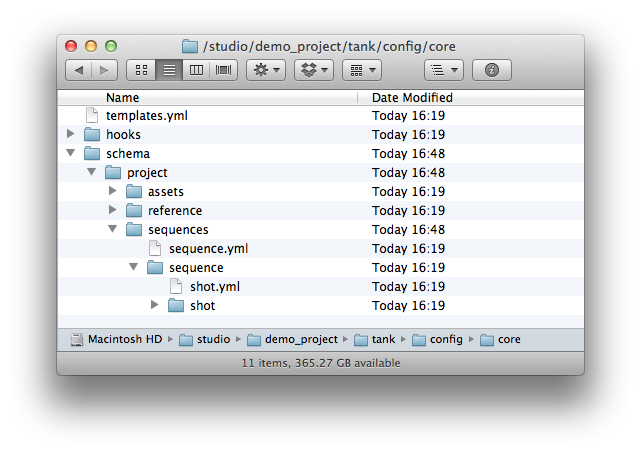
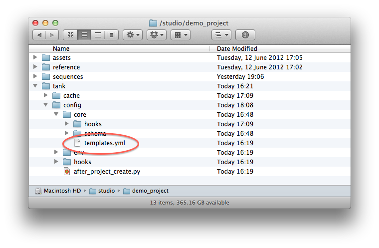

# ファイル システム設定リファレンス

このドキュメントは、 Pipeline Toolkit のファイル システム中心の環境設定に関する完全なリファレンスです。テンプレート システムの仕組みと利用可能なオプションについて説明します。また、フォルダ作成の設定に追加できるすべてのパラメータについても説明します。  
_このドキュメントは、Toolkit の設定を管理するユーザのみが使用可能な機能について説明します。詳細については、『[ 統合管理者ガイド](https://support.shotgunsoftware.com/hc/ja/articles/115000067493)』を参照してください。_

# はじめに

このドキュメントでは、サンプルを含むファイル システムに関連した Toolkit の設定の一部を設定する方法について説明します。Toolkit は多くのファイルとディレクトリを処理します。パスの統合方法とその意味を表す方法として Toolkit の設定を活用することができます。通常、ファイル システムへのアクセスには完全に異なる 2 つの方法があります。

1. **フォルダの作成:** でオブジェクトを作成したら、作業開始前にディスク上にフォルダを作成する必要があります。これは、ショットを表すディスク上にフォルダを作成するという簡単な作業であることも、ショットで作業する各ユーザがディスク上の個別の領域で作業できるようにユーザ固有の作業サンドボックスなどをセットアップするという複雑な作業であることもあります。

   - Toolkit はアプリケーションの起動時にフォルダを自動的に作成し(ショット BECH_0010 の Maya を起動する場合など)、Maya の起動前にフォルダが作成されるようにします。フォルダが存在しない場合はすぐに作成されます。また、フォルダは、API メソッド、[シェルの tank コマンド](https://support.shotgunsoftware.com/hc/ja/articles/219033178#Useful%20tank%20commands)、[ShotGrid の Create Folders](https://support.shotgunsoftware.com/hc/ja/articles/219040688#Shotgun%20Integration) を使用して作成することもできます。一連の特別な設定ファイルによってこのフォルダ作成プロセスが制御されます。これについては、次のセクションの「[パート 1](https://support.shotgunsoftware.com/hc/ja/articles/219039868-Integrations-File-System-Reference#Part%201%20-%20Folder%20Creation%20Syntax)」で説明します。
2. **作業の表示と保存:** 作業中、ディスク上の標準的な場所からファイルを開いてそこに保存する必要があります。通常、このファイルの場所は作業開始前に作成されたフォルダ構造内になります。

   - フォルダ構造を作成すると、この構造を使用してディスク上の主要な場所を特定できます。これらの場所は「[テンプレート](https://support.shotgunsoftware.com/hc/ja/articles/219039868-Integrations-File-System-Reference#Part%202%20-%20Configuring%20File%20System%20Templates)」と呼ばれます。たとえば、ショットのパブリッシュした Maya ファイルを参照するように `maya_shot_publish` と呼ばれるテンプレートを定義します。次に、[Toolkit アプリ](https://support.shotgunsoftware.com/hc/ja/articles/219039798)でこのテンプレートを使用します。パブリッシュ アプリがこのテンプレートを使用してファイルの書き込み場所を制御し、[作業ファイル アプリ](https://support.shotgunsoftware.com/hc/ja/articles/219033088)がこのテンプレートを使用して開くファイルの場所を把握できます。Toolkit の環境設定内では、各アプリが使用するテンプレートを制御できます。Toolkit で使用される主なファイルの場所はすべて 1 つのテンプレート ファイルで定義されるため、概要を簡単に表示できます。

# パート 1: フォルダ作成構文

フォルダ設定は  のエンティティをディスク上の場所にマッピングします。1 つの設定ファイルを使用するのではなく、環境設定が、設定された各ユニットのテンプレートして動作する「ミニ ファイル システム」の形式になります。これは**スキーマ設定**と呼ばれています。Toolkit のフォルダ作成が実行されると、フォルダとファイルがこの「ミニ ファイル システム」からその対象場所にコピーされます。動的な動作を作成することができます。たとえば、フォルダで  のショットを表し、そのフォルダの命名方法を制御することができます。具体的には、 のいくつかのフィールドからそのフォルダの名前を取り込み、フォルダの作成前に文字列変換を実行できます。

上図はスキーマ設定を示しています。Toolkit のフォルダ作成を実行すると、 のエンティティとディスク上のフォルダ間の接続が確立されます。Toolkit はこのフォルダ スキーマ設定を使用してディスク上に一連のフォルダを生成します。各フォルダは  に [`Filesystem Location`](https://developer.shotgridsoftware.com/ja/cbbf99a4/) エンティティとして登録されます。これは、 データ(ショットやアセット名など)と設定がディスクの実際のフォルダおよび  に「ベイク処理」されていると考えることができます。環境設定は常に「project」という名前のフォルダから始まります。これは  に接続されているプロジェクトを常に表し、プロジェクトの Toolkit の名前に置き換えられます。このレベルよりも下にあるのは静的フォルダです。たとえば、フォルダ作成ツールが **sequences** フォルダを自動的に作成します。

sequences フォルダ内を確認すると、**sequence** フォルダと **sequence.yml** ファイルがあります。Toolkit がフォルダと同じ名前の yaml ファイルを検出すると、この yaml ファイルの内容を読み取り、任意の動的な動作を追加します。この場合、**sequence.yml** にはプロジェクト フォルダ配下の構造が含まれます。この構造は次の 3 種類の項目で構成されます。

1. **通常のフォルダとファイル:** 対象の場所に単純にコピーされます。
2. **yaml ファイルを含むフォルダ**(フォルダと同じ名前): これは動的コンテンツを表します。たとえば、**shot** と **shot.yml** があるとします。フォルダを作成する場合、この **shot** フォルダは数多くのフォルダの生成に使用されるテンプレートになり、1 つのショットに対して 1 つのフォルダが生成されます。
3. **name.symlink.yml という名前のファイル**は、フォルダの処理中にシンボリック リンクを生成します。[シンボリック リンクについてはこのドキュメントで説明します](https://support.shotgunsoftware.com/hc/ja/articles/219039868#Symbolic%20Links)。

yaml ファイルで表される動的な設定セットアップは次のモードをサポートしています。

- **[クエリー フォルダ:](#shotgun-query-folders)**  データベース クエリーに基づく動的なフォルダ名です。たとえば、このモードを使用すると、プロジェクト内のすべてのショットにフォルダを作成できます。

- **[リスト フィールド フォルダ:](#shotgun-list-field-folders)** リスト フィールドに基づいた動的なフォルダ名。たとえば、このモードを使用すると、 のアセット エンティティにある  リスト フィールド「Asset Type」のすべての値にフォルダを作成できます。

- **[遅延フォルダ:](#workspaces-and-deferred-folder-creation)** 2 つ目のフォルダ作成パスが Toolkit API の create folders メソッドを介して要求された場合にのみ実行されます。通常はアプリケーション(Maya など)を起動した場合です。通常、このメソッドはアプリケーションの起動直前に Toolkit のさまざまなアプリケーション ランチャーによって実行されます。

- **[現在のユーザ フォルダ:](#current-user-folder)**現在のユーザを表す特別なフォルダ。

ここで各モードの詳細を見ていきましょう。

##  クエリー フォルダ

 クエリーに対応した動的なフォルダの場合、yaml ファイルに次の構文を使用します。

    
    # the type of dynamic content
    type: shotgun_entity

    
    # the  entity type to connect to
    entity_type: Asset

    
    # the  field to use for the folder name
    name: code

    
    #  filters to apply when getting the list of items
    
    # this should be a list of dicts, each dict containing
    
    # three fields: path, relation and values
    
    # (this is std  API syntax)
    
    # any values starting with $ are resolved into path objects
    filters: [ { "path": "project", "relation": "is", "values": [ "$project" ] } ]

- 動的なコンテンツ **type** フィールドの値を **shotgun_entity** に設定します。
- **entity_type** フィールドは、データの取得元の  エンティティ(「Asset」、「Shot」、「Sequence」、「CustomEntity02」など)に設定する必要があります。
- **name** フィールドは、 のデータに基づいて各フォルダに付与される名前です。

   - 上記の例のように(`name: code` など)、1 つのフィールドを使用できます。
   - 括弧内に複数のフィールド(`name:``"{asset_type}_{code}"` など)を使用できます。
   - 他にリンクされたエンティティのフィールドを追加する場合は、標準の  ドット シンタックス(`name: "{sg_sequence.Sequence.code}_{code}"` など)を使用できます。
- **filters** フィールドは  クエリーです。これは [ API 構文](http://developer.shotgridsoftware.com/python-api/reference.html)に比較的近くなります。ディクショナリのリストで、各ディクショナリには、_path_、_relation_、および _values_ の各キーを指定する必要があります。$syntax の有効値は、 エンティティ(ディレクトリ階層上位に sequence.yml がある場合はプロジェクトの `"$project"` と `"$sequence"` など)に対応した親フォルダです。 エンティティ リンクの場合、$syntax (`{ "path": "project", "relation": "is", "values": [ "$project" ] }` など)を使用すると、環境設定内の親フォルダを参照できます。この詳細については、[以下の例](https://support.shotgunsoftware.com/hc/ja/articles/219039868-Integrations-File-System-Reference#Examples)で説明します。

## 複数のフォルダ

複数のフォルダを一度に作成する式を作成するには、名前の定義にスラッシュを含めます。

    
    # the type of dynamic content
    type: shotgun_entity

    
    # the  entity type to connect to
    entity_type: Asset

    
    # the  field to use for the folder name
    name: "{sg_asset_type}/{code}"

    
    #  filters to apply when getting the list of items
    
    # this should be a list of dicts, each dict containing
    
    # three fields: path, relation and values
    
    # (this is std  API syntax)
    
    # any values starting with $ are resolved into path objects
    filters: [ { "path": "project", "relation": "is", "values": [ "$project" ] } ]

この種類のパスのファイル システム テンプレートを作成する場合(詳細については、このドキュメントのパート 2 を参照)、_last_folder は  のエンティティを表します。上の例は、たとえば、次のテンプレートを使用して表すことができます。

    asset_step_folder: assets/{asset_type}/{Asset}/{Step}

`{asset_type}` および `{Asset}` はいずれも文字列のテンプレート キーとして定義されていて、指定されたパスのコンテキストを決定する場合のコンテキストの計算には、`{Asset}` トークンが使用されます。

## 親フォルダを使用して作成する

 では、 データ構造内にネストがあります。このネストは、親子関係やその逆の関係と見なされます。たとえば、通常、シーケンスはファイル システム内のショットの親です。同様に、通常、ショットはシーケンスの子です。



shotgun_entity タイプ フォルダは、親が作成されるとフォルダ作成プロセスが再帰的な処理を行って子も作成されるようにするかどうかを制御するためのオプション フラグをサポートします。フラグは特定の固定値のみを指定できる設定で、この場合は「true」または「false」です。このフラグを追加するには、次の例を使用します。

    
    # recurse down from parent folder
    create_with_parent: true

前述のとおり、この設定はオプションで、既定では false に設定されています。true に設定すると、Toolkit は検出した子エンティティのフォルダを作成します。この例を続けるために、親シーケンスの作成時にショットが作成されるようにショットの `create_with_parent` を `true` に設定します。



## オプション フィールド

通常、フォルダ名(`{code}_{sg_extra_field}` など)を定義する場合、Toolkit で  のすべてのフィールドに値を指定する必要があります。たとえば、`sg_extra_field` が空の場合、エラー メッセージが生成されます。設定する場合、設定しない場合があるフィールドについては、オプションとすることができます。つまり、Toolkit は、値がある場合はこのフィールドを追加し、値が空でエラーでない場合はこのフィールドを除外します。

`{code}[_{sg_extra_field}]` のように角括弧を使用してオプション フィールドを定義します。これで次のフォルダ名が生成されます。

- `code` が BECH_0010 で `sg_extra_field` が extra の場合は、フォルダ名は `BECH_0010_extra` になります。

- `code` が BECH_0010 で `sg_extra_field` が空の場合、フォルダ名は `BECH_0010` になります。



## 正規表現トークンの一致

Toolkit では、正規表現を使用して、 フィールド名の一部を抽出できます。これにより、 の値でフォルダの作成を制御できる単純な式を作成できます。たとえば、 内のすべてのアセットに、3 文字のプリフィックスとその後に続くアンダースコア(`AAT_Boulder7` など)が名前として付けられている場合、この名前を 2 つのファイルシステム フォルダのレベルに分割できます(例: `AAT/Boulder7`)。

    
    # the type of dynamic content
    type: shotgun_entity

    
    # the  entity type to connect to
    entity_type: Asset

    
    # Extract parts of the name using regular expressions
    name: "{code:^([^_]+)}/{code^[^_]+_(.*)}"

    
    #  filters to apply when getting the list of items
    
    # this should be a list of dicts, each dict containing
    
    # three fields: path, relation and values
    
    # (this is std  API syntax)
    
    # any values starting with $ are resolved into path objects
    filters: [ { "path": "project", "relation": "is", "values": [ "$project" ] } ]

構文は、テンプレート システム内の `subset` トークンと似ています。 フィールド名の後にコロンを追加し、その後に正規表現を配置します。正規表現で定義されたすべてのグループ(`()` で囲まれたセクションなど)が、値を抽出するために使用されます。正規表現内に複数のグループがある場合は、結合されます。たとえば、次の式は、オブジェクトを作成したユーザのイニシャルを抽出します。`{created_by.HumanUser.code:^([A-Z])[a-z]* ([A-Z])[a-z]*}`

## 例

次の一連の例では、filters 構文の使用方法について説明します。

**現在のプロジェクトに属している処理中のショットすべてを検出するには**、次の構文を使用します。 ショットのエンティティには、ショットをプロジェクトに接続するプロジェクトと呼ばれるリンク フィールドがあります。現在のプロジェクトに関連付けられたショットのフォルダだけを作成するようにしてください。設定ファイル システム上位にプロジェクト レベルがあるため、$syntax を使用してこのレベルを参照すると、Toolkit はこの  エンティティ リンクのリファレンスを自動的に作成します。$syntax の有効値は、 エンティティ(ディレクトリ階層上位に sequence.yml がある場合はプロジェクトの `"$project"` と `"$sequence"` など)に対応した親フォルダであることを忘れないでください。

    entity_type: Shot
    filters:
        - { "path": "project", "relation": "is", "values": [ "$project" ] }
        - { "path": "status", "relation": "is", "values": [ "ip" ] }

ツリーの上位にシーケンス フォルダがあり、**このシーケンスに属するすべてのショットにフォルダを作成する場合**、次のようなフィルタを作成できます。

    entity_type: Shot
    filters:
        - { "path": "project", "relation": "is", "values": [ "$project" ] }
        - { "path": "sg_sequence", "relation": "is", "values": [ "$sequence" ] }

**すべてのアセットを検出するには**、次の構文を使用します。

    entity_type: Asset
    filters: [ { "path": "project", "relation": "is", "values": [ "$project" ] } ]

##  リスト フィールド フォルダ

[リスト フィールド](https://support.shotgunsoftware.com/hc/ja/articles/219031008) フォルダは、 ですべてのアセット タイプにフォルダを 1 つずつ作成する場合などに役立ちます。アセット タイプは  のリスト フィールドで、このフォルダの設定タイプにより、このアセット タイプのリストに反映されるファイル システムのレイヤを定義できます。



 リスト フィールドのすべての項目に対応する動的なフォルダを作成する場合は、yaml ファイルで次の構文を使用します。

    
    # the type of dynamic content
    type: "shotgun_list_field"

    
    # the  entity type to connect to
    entity_type: "Asset"

    
    # only create for values which are used in this project.
    
    # this is optional and will be set to false if not specified.
    skip_unused: false

    
    # by default, list fields are only created if they are needed by a child entity node
    
    # by setting the create_with_parent parameter to true you ensure that list field
    
    # nodes are always created
    create_with_parent: false

    
    # the  field to use for the folder name
    field_name: "{sg_asset_type}_type"

- 動的なコンテンツ **type** フィールドの値を `shotgun_list_field` に設定します。
- `entity_type` フィールドは、データの取得元の  エンティティ(「アセット」、「シーケンス」、「ショット」など)に設定する必要があります。
- `field_name` は、データの取得元の  フィールドに設定し、[リスト タイプ フィールド](https://support.shotgunsoftware.com/hc/ja/articles/219031008)にする必要があります。動的なコンテンツとともに静的な文字列を追加する場合は、式を使用することができます。`field_name: "{sg_asset_type}_type"` この式の例にはテキストとテンプレート キーが含まれます。

- オプションの `skip_unused` パラメータを指定すると、使用しないリスト タイプ フィールドの値に対してディレクトリが作成されなくなります(上記の「[オプション フィールド](https://support.shotgunsoftware.com/hc/ja/articles/219039868#Optional%20fields)」セクションで説明)。

- オプションの `create_with_parent` パラメータを指定すると、子エンティティ レベル ノードを現在処理していなくても、list_field ノードを強制的に作成します(上記の「[親フォルダを使用して作成する](https://support.shotgunsoftware.com/hc/ja/articles/219039868#Create%20With%20Parent%20Folder)」セクションを参照)。

## パイプライン ステップ フォルダ

パイプライン ステップ フォルダは [ のパイプライン ステップ](https://support.shotgunsoftware.com/hc/ja/articles/219031288)を表します。パイプライン ステップはステップとも呼ばれています。

    
    # the type of dynamic content
    type: "shotgun_step"

    
    # the  field to use for the folder name. このフィールドは、ステップ エンティティから取得する必要があります。name: "short_name"

ここで、[前述の Shotgun エンティティ](https://support.shotgunsoftware.com/hc/ja/articles/219039868#Shotgun%20List%20Field%20Folders)で使用したように名前の式を使用できます。 エンティティ フォルダ設定が検出されるまで、ノードは親や祖親などを探します。このエンティティ フォルダはステップに関連付けられ、エンティティのタイプを使用して作成するステップが決定されます。



既定では、ステップ フォルダは特定のエンティティに関連するすべてのステップを自動的に作成します。たとえば、5 つのステップ(レイアウト、アニメーション、エフェクト、ライティング、コンポジット)が指定されたショットのフォルダ作成がトリガされると、この 5 つのステップのステップ フォルダ(レイアウト、アニメーション、エフェクト、ライティング、コンポジット)が自動的に作成されます。

ただし、次の構文を使用すると、この処理をオフにすることができます。

    
    # recurse down from parent folder
    create_with_parent: false

環境設定にこの設定を追加すると、ショット フォルダの作成時にステップ フォルダが作成されなくなります。その代わり、タスクでフォルダを作成した場合にのみステップ フォルダが作成されるようになります。これは、ユーザ サンドボックスと作業開始直前に作成される他の構造を設定する場合に役立ちます。

### パイプライン ステップごとの異なるファイル システム レイアウト

ライトおよび合成にフォルダを 1 つと、それ以外のステップにフォルダを 1 つ設定するとします。パイプライン ステップごとに異なるファイル システム レイアウトを指定する場合は、`filter` 句を環境設定に追加します。このフィルタを使用すると、特定のステップの環境設定に含まれるパイプライン ステップの範囲を指定できます。この例では、`step_lightcomp.yml` と `step.yml` の 2 つの設定ファイルを作成できます。最初のファイルでは、次のようにフィルタを追加します。

    filters: [ { "path": "short_name", "relation": "in", "values": [ "Light", "Comp"  ] } ]

上記の構文は、タイプ `Light` または `Comp` のステップ フォルダが作成された場合にのみ使用されます。その他のファイルの場合には次のようなルールを作成します。

    filters: [ { "path": "short_name", "relation": "not_in", "values": [ "Light", "Comp"  ] } ]

これで各フォルダ内のサブ構造を個別に定義できます。

## 詳細設定: 親を指定する

フォルダ作成の一環として、Toolkit はパイプライン ステップとエンティティ(「ショット」や「アセット」など)を関連付ける必要があります。このために、既定ではフォルダ ツリーを検索し、見つけた最初の  エンティティ フォルダを選択します。たとえば、階層 `Sequence > Shot > Step` にアクセスすると、ステップ フォルダが通常は任意のショットと自動的に関連付けられます。

ただし、`Sequence > Shot > Department > Step` など、プライマリ エンティティよりも下の階層のエンティティの場合、既定では、Toolkit がステップと部門レベルを強制的に関連付けます。この場合、Toolkit に検索場所を明示的に指示する必要があります。このためには、ステップ設定に次のコードを追加します。

    associated_entity_type: Shot

##  タスク フォルダ

タスク フォルダは  の[タスク](https://support.shotgunsoftware.com/hc/ja/articles/219031248)を表します。既定では、タスク フォルダがその親とともに作成されることはありません。たとえば、タスク ノードが関連付けられたショットでフォルダ作成がトリガされても、タスク フォルダは自動的に作成されません。その代わり、タスク フォルダは、タスク( のタスクの起動など)でフォルダ作成を実行した場合にのみ作成されます。

    
    # the type of dynamic content
    type: "shotgun_task"

    
    # the  field to use for the folder name. This field needs to come from a task entity.
    name: "content"

ただし、次の構文を使用することにより、親エンティティとともにタスクが作成されるようにすることができます。

    
    # recurse down from parent folder
    create_with_parent: true

ステップと同様に、フォルダ設定で動作するタスクをフィルタする場合は、必要に応じて `filter` パラメータを指定することもできます。

ここで再び、[前述の  エンティティ](https://support.shotgunsoftware.com/hc/ja/articles/219039868#Shotgun%20List%20Field%20Folders)で使用したように名前の式を使用できます。動的コンテンツと静的コンテンツの両方が指定された名前を作成できるように、静的テキストが動的コンテンツとともに使用されます。

`name: "task_{content}"`

 エンティティ フォルダ設定が検出されるまで、ノードは親や祖親などを探します。このエンティティ フォルダはタスクに関連付けられ、作成するタスク フォルダの決定に使用されます。

### 詳細設定: 親を指定する

フォルダ作成の一環として、Toolkit はタスクとエンティティ(ショットやアセットなど)を関連付ける必要があります。このために、既定ではフォルダ ツリーを検索し、見つけた最初の  エンティティ フォルダを選択します。たとえば、階層 `Sequence > Shot > Task` にアクセスすると、タスク フォルダが通常は任意のショットと自動的に関連付けられます。

ただし、`Sequence > Shot > Department > Task,` など、プライマリ エンティティよりも下の階層のエンティティの場合(ショットよりも下)、既定では Toolkit はタスクと部門レベルを強制的に関連付けます。この場合、[前のセクション](https://support.shotgunsoftware.com/hc/ja/articles/219039868#Create%20With%20Parent%20Folder)でステップを使用した更新方法と同じように、Toolkit に検索場所を明示的に指示する必要があります。このためには、タスク設定に次のコードを追加します。

`associated_entity_type: Shot`

## 作業スペースと遅延フォルダ作成

遅延フォルダ作成は、2 つ目のフォルダ作成パスが Toolkit API の create folders メソッドのオプションである `engine` パラメータを介して要求された場合にのみ実行されます。通常、このメソッドはアプリケーションの起動直前に Toolkit のさまざまなアプリケーション ランチャーによって実行されます。ほとんどのフォルダ タイプが遅延フラグをサポートします。既定の設定は `false` です。遅延フォルダ作成を `true` にするには、次のフラグを追加します。

    
    # only create this folder when tk.create_filesystem_structure is
    
    # called with tk-maya, tk-nuke or any-custom-string.
    defer_creation: ["tk-maya", "tk-nuke", "any-custom-string]

    
    # create this folder when any application launches, but not when normal folder
    
    # creation runs
    defer_creation: true

このフラグにより、フォルダ作成を 2 つに分割できます。1 つ目は最初の「グローバル」パスで実行し、もう 1 つのパスは後で実行します。通常、2 つ目のパスはエンジンの起動に関連付けられているため(既定値が `false` のために自動的には実行されない)、ユーザはエンジンの起動直前にフォルダを作成できます。このため、主に次の 2 つのワークフローが可能になります。

1. **ワークスペース:** アプリケーション固有のフォルダ セットアップです。フォルダはアプリケーションの起動直前に作成できます。
2. 一般的なワークフローでは、ショットに必要なものとアーティストがそれを処理する方法に応じて、Houdini、Maya、および他のエンジンを必要とするパイプライン ステップを指定します。本来、アーティストはこのパイプライン ステップに対して、maya/、houdini/、および他のディレクトリを作成できますが、任意のショットのアーティストが Maya でしか作業しない場合、Houdini と他のエンジンの空のフォルダは不要になります。そのため、個別のエンジンの起動時にフォルダ作成を遅延し、アーティストが Houdini を使用しない場合、houdini/ フォルダはこのショットで作成されません。
3. **ユーザ フォルダ:**ユーザ フォルダはアプリケーションの起動直前に作成されます。ユーザ フォルダ設定の構成(上述)は、既定では遅延するように設定されています。
4. これは、 で割り当てられたユーザに基づいてユーザ フォルダを作成するのではなく、エンジンの起動時に現在のユーザのフォルダを作成できるように実行されます。たとえば、ショットで作業を開始して Maya を起動すると、( のユーザ名に基づいて)ユーザ名のフォルダが作成されるため、他のユーザの作業を邪魔することはありません。

_ヒント: アプリケーション(Maya など)の起動時に通常の静的なフォルダを作成するには、フォルダと同じ名前の yaml 設定ファイルを作成して、次のコードを追加するだけです。_

    
    # type of content
    type: "static"

    
    # only create this folder for maya
    defer_creation: "tk-maya"

    :::yaml
    
    # type of content
    type: "static"

    
    # only create this folder when tk.create_filesystem_structure is
    
    # called with any-custom-string.
    defer_creation: "any-custom-string"

## 現在のユーザ フォルダ

現在のユーザ フォルダは特別な構造をしており、別のユーザの作業領域をセットアップできます。一般的なシナリオとして、ある部門の複数のアーティストが同じショットに対して作業している場合があります。ユーザ フォルダを使用することにより、アーティストは自分の作業ファイルを独自のディレクトリに保存し、[作業ファイル アプリ](https://support.shotgunsoftware.com/hc/ja/articles/219033088)でこのファイルをフィルタリングできるようになります。この場合、設定ファイルに次のオプションを含める必要があります。

    
    # the type of dynamic content
    type: "user_workspace"

    name: "login"

- **type** フィールドの値を `user_workspace` に設定します。
- **name** フィールドはユーザ フォルダに付与される名前です。これは  のユーザ( の `HumanUser`)から取得したフィールドを組み合わせて構成する必要があります。
- 上記の例のように(`name: login` など)、1 つのフィールドを使用できます。
- 括弧内に複数のフィールド(`name: "{firstname}_{lastname}"` など)を使用できます。
- 他にリンクされたエンティティのフィールドを追加する場合は、標準の  ドット シンタックス(`name: "{sg_group.Group.code}_{login}"` など)を使用できます。

現在のユーザ フォルダは既定では遅延フォルダとして作成されます。つまり、2 つ目のフォルダ作成パスが Toolkit API の create folders メソッドでオプションの `engine` パラメータを介して要求された場合にのみ実行されます。

## 静的フォルダ

静的フォルダ(およびファイル)は最も簡単なタイプです。このフォルダを設定構成に追加すると、フォルダ作成プロセスの実行時にこのフォルダが自動的にコピーされます。[次に、既定の設定の静的フォルダの例](https://github.com/shotgunsoftware/tk-config-default/tree/master/core/schema/project) (https://github.com/shotgunsoftware/tk-config-default/tree/master/core/schema/project)を示します(静的フォルダには対応する yaml ファイルはありません)。

多くの場合、静的フォルダでこれ以上の機能は必要ありませんが、Toolkit は静的フォルダの高度な機能をいくつかサポートしています。静的フォルダを作成するかどうかを判断するための動的な条件を定義することができます。たとえば、編集タイプのパイプライン ステップでのみ作成される特別な静的フォルダについて設定するとします。この場合、yaml 設定ファイルを静的フォルダの次に追加し、拡張子は「yml」で同じ名前を付ける必要があります。次に、以下の構文を使用します。

    
    # the type of dynamic content
    type: "static"

    
    # pick one of the  folders that are above this folder
    
    # in the folder hierarchy. In this case it is a parent folder
    
    # named step that we want to look at when deciding if this
    
    # static folder should be created or not.
    constrain_by_entity: "$step"

    
    # we can now define constraints for this step. Constraints are simple
    
    #  queries, following the same syntax as the other  filters
    
    # shown in previous sections.
    #
    
    # In our example, if the parent step matches the constraints given
    
    # in the filter below, the static folder will be created. If not,
    
    # it (and its children) will be ignored by the folder creation process.
    constraints:
        - { "path": "short_name", "relation": "is", "values": [ "edit" ] }

既定では、静的フォルダはその親フォルダとともに自動的に作成されます。これが理想の動作とは異なる場合、静的フォルダがその親とともに作成されないように指示する特別なフラグを追加できます。

    
    # do not recurse down automatically
    create_with_parent: false

## シンボリック リンク

動的フォルダ作成の一部としてシンボリック リンク(symlink)を作成することができます。`artwork` という名前のシンボリック リンクを作成する場合は、`artwork.symlink.yml` という名前のスキーマ設定でファイルを作成します。これはシステムによってシンボリック リンク要求として識別され、全体にコピーされる代わりに処理されます。

`artwork.symlink.yml` ファイルには少なくとも `target` キーが含まれている必要があります。

    
    # Example of a .symlink.yml file

    
    # A target parameter is required.
    target: "../Stuff/$Project/$Shot"

    
    # Additional parameters will be passed to the hook as metadata
    
    # so you can for example include permission hints or other stuff
    
    # that you may need for advanced customization
    additional_param1: abc
    additional_param2: def

ターゲット パラメータに `$Asset`、`$Shot`、または `$Project` などの `$EntityType` トークンが含まれている場合、このエンティティ(アセット、ショット、プロジェクトなど)を表すフォルダの名前による解決が試行されます。Toolkit はこの値のファイルシステム ツリーを検索し、ツリーの上位で定義されていない場合は、エラーが報告されます。

リスト フィールド(アセットのアセット タイプなど)は、`$Asset.sg_asset_type` のようなエンティティ タイプを含む構文で表されます。以下に例を示します。

    
    # Example of a .symlink.yml file

    
    # A target parameter is required.
    target: "../renders/$Project/$Asset.sg_asset_type/$Asset"

symlink の作成は(すべての入力/出力(I/O)のように)フックを処理するフォルダ内で実行されます。特別な `symlink` アクションがシステムからフックに渡され、symlink の名前、完全に解決されたターゲット、この要求とともに定義ファイル内に含まれた yaml メタデータを受け取ります。上記の `artwork` の例の場合、次のようにショットの下にフォルダを作成します。

     {'action': 'symlink',
      'path': '/mnt/projects/chasing_the_light/Sequences/AA/AA001/artwork'
      'target': '../Stuff/chasing_the_light/AA001',
      'metadata': {'target': '../Stuff/$Project/$Shot', 'additional_param1': 'abc', 'additional_param2': 'def'}
      }

## ファイルとフォルダを無視する

スキーマ スキャフォールドに格納されたファイルは、フォルダ作成の一環として対象領域にコピーされます。たとえば、このコピー処理はコア フックで処理されるため、権限の取り扱いはプロジェクトまたはスタジオごとにカスタマイズできます。

{% include info title="注" content="この種の取り扱いの詳細は「簡単なカスタマイズ」の「[I/O と権限をカスタマイズする](https://support.shotgunsoftware.com/hc/ja/articles/219039868-Integrations-File-System-Reference#Simple%20customization%20of%20how%20folders%20are%20created)」セクションに記載されています。数多くのフォルダ セットアップを処理する [process_folder_creation コア フック](https://github.com/shotgunsoftware/tk-core/blob/master/hooks/process_folder_creation.py#L62-L71)  (https://github.com/shotgunsoftware/tk-core/blob/master/hooks/process_folder_creation.py#L62-L71)があります。このフックに chmod 呼び出しを追加して(mkdir を使用する際の権限の設定も可能)、作成するフォルダの権限を設定できます。" %}

場合によっては、フォルダ作成の一環としてコピーされないように特定のファイルとフォルダを除外するのに便利です。たとえば、Git または SVN にフォルダ作成設定を保存している場合、ショットまたはアセットの各フォルダにコピーしない `.git` フォルダと `.svn` フォルダを作成します。コピーしたくないファイルがある場合、`ignore_files` という名前のファイルをプロジェクト設定内の `config/core/schema` フォルダに配置できます。このファイルには、コピーしないようにファイルを定義する glob スタイル パターンを含める必要があります。各パターンは 1 行ずつ指定する必要があります。

    
    # This is a good example of a standard ignore_files file

    .svn                # no svn temp files to be copied across at folder creation time
    .git                # no git temp files to be copied across at folder creation time
    .DS_Store           # no mac temp files to be copied across at folder creation time

また、ワイルドカードを使用することもできます。たとえば、拡張子が TMP のすべてのファイルを除外する必要がある場合は、ファイルに *.tmp の行を追加するだけです。

    
    # This is a good example of a standard ignore_files file

    .svn                # no svn temp files to be copied across at folder creation time
    .git                # no git temp files to be copied across at folder creation time
    *.tmp           # no files with tmp extension to be copied across at folder creation time

## I/O と権限をカスタマイズする

多くの場合、ショットとアセットのフォルダは特別な権限とパラメータを使用して作成する必要があります。これはフォルダ作成中に権限を少しずつ設定するという簡単な作業であることも、適切な資格情報、グループ、および権限を使用してフォルダを作成する特別なフォルダ作成サーバにリモート要求を送信するという複雑な作業であることもあります。

また、ファイル システムのツリー内にある各レベルのフォルダに対し、通常は異なる権限を指定する必要があります。たとえば、作業領域フォルダはすべてのユーザに対して書き込み可能にし、ショット フォルダには厳格な権限を指定する必要があります。

Toolkit では 1 つのフックでフォルダ作成をカスタマイズできます。これは `process_folder_creation.py` という名前のコア フックです。フォルダ作成 API の呼び出しはフォルダ設定をトラバースし、作成するフォルダを特定するため、作成できる項目のリストが生成されます。この項目にはファイルとフォルダの両方が含まれます。フォルダ作成の最後の手順として、このリストは実際のフォルダの処理を取り扱うフックに渡されます。既定の [process_folder_creation コア フックはここで](https://github.com/shotgunsoftware/tk-core/blob/master/hooks/process_folder_creation.py#L62-L71)(https://github.com/shotgunsoftware/tk-core/blob/master/hooks/process_folder_creation.py#L62-L71)確認できます。

### フックに渡されるデータ

フォルダ作成フックはフォルダ作成要求ごとに 1 回だけ実行されます。すべてのフォルダ作成データはリストのフックに渡されます。通常、フックはこのデータを繰り返して処理し、Core API から渡されるパラメータに従ってフォルダを作成します。

リスト内のデータは常に深さ優先再帰で、最上位のフォルダとファイルから始まり、段階的に深い階層へとトラバースします。次に、フックに渡されるデータの例を示します。

    [

     {'action': 'entity_folder',
      'entity': {'id': 88, 'name': 'Chasing the Light', 'type': 'Project'},
      'metadata': {'root_name': 'primary', 'type': 'project'},
      'path': '/mnt/projects/chasing_the_light'},

     {'action': 'folder',
      'metadata': {'type': 'static'},
      'path': '/mnt/projects/chasing_the_light/sequences'},

     {'action': 'entity_folder',
      'entity': {'id': 32, 'name': 'aa2', 'type': 'Sequence'},
      'metadata': {'entity_type': 'Sequence',
                   'filters': [{'path': 'project',
                                'relation': 'is',
                                'values': [<tank.folder.folder_types.FilterExpressionToken object at 0x10ca04c90>]}],
                   'name': 'code',
                   'type': 'shotgun_entity'},
      'path': '/mnt/projects/chasing_the_light/sequences/aa2'},

     {'action': 'entity_folder',
      'entity': {'id': 1184, 'name': 'moo87', 'type': 'Shot'},
      'metadata': {'entity_type': 'Shot',
                   'filters': [{'path': 'sg_sequence',
                                'relation': 'is',
                                'values': [<tank.folder.folder_types.FilterExpressionToken object at 0x10ca04b10>]}],
                   'name': 'code',
                   'type': 'shotgun_entity'},
      'path': '/mnt/projects/chasing_the_light/sequences/aa2/moo87'},

     {'action': 'copy',
      'metadata': {'entity_type': 'Shot',
                   'filters': [{'path': 'sg_sequence',
                                'relation': 'is',
                                'values': [<tank.folder.folder_types.FilterExpressionToken object at 0x10ca04b10>]}],
                   'name': 'code',
                   'type': 'shotgun_entity'},
      'source_path': '/mnt/software/tank/chasing_the_light/config/core/schema/project/sequences/sequence/shot/sgtk_overrides.yml',
      'target_path': '/mnt/projects/chasing_the_light/sequences/aa2/moo87/sgtk_overrides.yml'},

     {'action': 'create_file',
      'metadata': {'entity_type': 'Shot',
                   'filters': [{'path': 'sg_sequence',
                                'relation': 'is',
                                'values': [<tank.folder.folder_types.FilterExpressionToken object at 0x10ca04b10>]}],
                   'name': 'code',
                   'type': 'shotgun_entity'},
      'content': 'foo bar',
      'target_path': '/mnt/projects/chasing_the_light/sequences/aa2/moo87/automatic_content.txt'},

     {'action': 'symlink',
      'path': '/mnt/projects/chasing_the_light/Sequences/AA/AA001/artwork'
      'target': '../Stuff/chasing_the_light/AA001',
      'metadata': {'target': '../Stuff/$Project/$Shot', 'additional_param1': 'abc', 'additional_param2': 'def'}
      },

    ]

このデータはディクショナリのリストです。各ディクショナリには `action` と呼ばれるキーがあります。このキーは要求された I/O 項目のタイプを示します。フォルダ作成フックを実装している場合は、次のさまざまなアクションのサポートを追加する必要があります。

- `entity_folder`:  エンティティと関連付けられたディスク上のフォルダです。
- `folder`: ディスク上のフォルダです。
- `copy`: 元の場所から対象の場所にコピーする必要があるファイルです。
- `create_file`: ディスク上に作成する必要があるファイルです。
- `symlink`: シンボリック リンクを作成する必要があります。

各アクションにはさまざまなディクショナリ キーがあります。たとえば、`entity_folder` アクションには、接続先のエンティティの詳細を含む `entity key` があります。`create_file` には、コピーするファイルや場所をフックに通知する `source_path` と `target_path` のキーがあります。

また、すべての `actions` には `metadata` と呼ばれるキーもあります。このキーは、スキーマ セットアップで関連する設定ファイルから取得された YAML 設定データを表します。上記の例は、 フォルダの `metadata` キーにスキーマ設定内でセットアップされるすべてのフィルタと命名情報がどのように含まれるかについて示しています。たとえば、上記の例のショット フォルダのメタデータは次のとおりです。

    {'action': 'entity_folder',
      'entity': {'id': 1184, 'name': 'moo87', 'type': 'Shot'},
      'metadata': {'entity_type': 'Shot',
                   'filters': [{'path': 'sg_sequence',
                                'relation': 'is',
                                'values': [<tank.folder.folder_types.FilterExpressionToken object at 0x10ca04b10>]}],
                   'name': 'code',
                   'type': 'shotgun_entity'},
      'path': '/mnt/projects/chasing_the_light/sequences/aa2/moo87'}

`shot.yml` スキーマ設定ファイルに対応しています。

    
    # Copyright (c) 2013  Software Inc.
    #
    
    # CONFIDENTIAL AND PROPRIETARY
    #
    
    # This work is provided "AS IS" and subject to the  Pipeline Toolkit
    
    # Source Code License included in this distribution package. See LICENSE.
    
    # By accessing, using, copying or modifying this work you indicate your
    
    # agreement to the  Pipeline Toolkit Source Code License. All rights
    
    # not expressly granted therein are reserved by  Software Inc.

    
    # the type of dynamic content
    type: "shotgun_entity"

    
    # the  field to use for the folder name
    name: "code"

    
    # the  entity type to connect to
    entity_type: "Shot"

    
    #  filters to apply when getting the list of items
    
    # this should be a list of dicts, each dict containing
    
    # three fields: path, relation and values
    
    # (this is std  API syntax)
    
    # any values starting with $ are resolved into path objects
    filters: [ { "path": "sg_sequence", "relation": "is", "values": [ "$sequence" ] } ]

`$sequence`注: 動的なトークン _ は実行中に実際のオブジェクトに解決されます。_

### 独自のフォルダ作成指示をフックに渡す

Toolkit で必要になるさまざまな設定指示とは別に、スキーマ設定の一部として独自の設定項目を定義することもできます。この項目は上述の `metadata` キーを使用してフックに渡され、フォルダ作成を制御するために使用されます。

たとえば、スキーマ設定に次の構造があるとします。

    
    # the type of dynamic content
    type: "shotgun_entity"

    
    # the  field to use for the folder name
    name: "code"

    
    # the  entity type to connect to
    entity_type: "Shot"

    
    #  filters to apply when getting the list of items
    filters: [ { "path": "sg_sequence", "relation": "is", "values": [ "$sequence" ] } ]

    
    # user settings
    studio_permissions_level: "admin"

この場合、フォルダ作成フックを使用して渡されるデータは次のようになります。

    {'action': 'entity_folder',
      'entity': {'id': 1184, 'name': 'moo87', 'type': 'Shot'},
      'metadata': {'entity_type': 'Shot',
                   'filters': [{'path': 'sg_sequence',
                                'relation': 'is',
                                'values': [<tank.folder.folder_types.FilterExpressionToken object at 0x10ca04b10>]}],
                   'name': 'code',
                   'type': 'shotgun_entity',
                   'studio_permissions_level': 'admin'},
      'path': '/mnt/projects/chasing_the_light/sequences/aa2/moo87'}

ここで、特別なパラメータ `studio_permissions_level` はフックに渡され、ファイル権限の制御などのために使用されます。また、このメソッドを使用すると、任意の複雑なデータ構造を渡すこともできます。この一般的な例として、非常に詳細なレベルでの権限の制御があります。

### カスタム設定を静的フォルダに追加する

通常、フォルダ スキーマ設定内にフォルダを作成したけれども、対応する YAML ファイルがない場合、Toolkit はこのフォルダが静的で、作成されるだけだと見なします。

カスタム設定のメタデータと静的フォルダを関連付ける場合は、`static` タイプの YAML 設定ファイルを作成する必要があります。たとえば、プロジェクト ルートの下に静的フォルダ `assets` があり、アセットをグループ化してカスタム設定のメタデータを追加するとします。このためには、次の `assets.yml` ファイルを作成します。

    type: static
    studio_permissions_level: "admin"

フックに渡される設定データには次のコードが含まれます。

    {'action': 'folder',
     'metadata': {'studio_permissions_level': 'admin', 'type': 'static'},
     'path': '/mnt/projects/chasing_the_light/assets'},

任意の複雑なデータはこの方法で YAML 設定ファイルからフックに渡すことができます。

## フォルダの作成方法の簡単なカスタマイズ

簡単なフォルダ作成フックは次のようになります。

    class ProcessFolderCreation(Hook):

        def execute(self, items, preview_mode, **kwargs):
            """
     The default implementation creates folders recursively using open permissions.

     This hook should return a list of created items.

     Items is a list of dictionaries. Each dictionary can be of the following type:

     Standard Folder
     ---------------
     This represents a standard folder in the file system which is not associated
     with anything in . It contains the following keys:

     * "action": "folder"
     * "metadata": The configuration yaml data for this item
     * "path": path on disk to the item

     Entity Folder
     -------------
     This represents a folder in the file system which is associated with a
      entity. It contains the following keys:

     * "action": "entity_folder"
     * "metadata": The configuration yaml data for this item
     * "path": path on disk to the item
     * "entity":  entity link dict with keys type, id and name.

     File Copy
     ---------
     This represents a file copy operation which should be carried out.
     It contains the following keys:

     * "action": "copy"
     * "metadata": The configuration yaml data associated with the directory level
     on which this object exists.
     * "source_path": location of the file that should be copied
     * "target_path": target location to where the file should be copied.

     File Creation
     -------------
     This is similar to the file copy, but instead of a source path, a chunk
     of data is specified. It contains the following keys:

     * "action": "create_file"
     * "metadata": The configuration yaml data associated with the directory level
     on which this object exists.
     * "content": file content
     * "target_path": target location to where the file should be copied.

     """

            # set the umask so that we get true permissions
            old_umask = os.umask(0)
            folders = []
            try:

                # loop through our list of items
                for i in items:

                    action = i.get("action")

                    if action == "entity_folder" or action == "folder":
                        # folder creation
                        path = i.get("path")
                        if not os.path.exists(path):
                            if not preview_mode:
                                # create the folder using open permissions
                                os.makedirs(path, 0777)
                            folders.append(path)

                    elif action == "copy":
                        # a file copy
                        source_path = i.get("source_path")
                        target_path = i.get("target_path")
                        if not os.path.exists(target_path):
                            if not preview_mode:
                                # do a standard file copy
                                shutil.copy(source_path, target_path)
                                # set permissions to open
                                os.chmod(target_path, 0666)
                            folders.append(target_path)

                    elif action == "create_file":
                        # create a new file based on content
                        path = i.get("path")
                        parent_folder = os.path.dirname(path)
                        content = i.get("content")
                        if not os.path.exists(parent_folder) and not preview_mode:
                            os.makedirs(parent_folder, 0777)
                        if not os.path.exists(path):
                            if not preview_mode:
                                # create the file
                                fp = open(path, "wb")
                                fp.write(content)
                                fp.close()
                                # and set permissions to open
                                os.chmod(path, 0666)
                            folders.append(path)

                    else:
                        raise Exception("Unknown folder hook action '%s'" % action)

            finally:
                # reset umask
                os.umask(old_umask)

            return folders

# パート 2: ファイル システム テンプレートを設定する

Toolkit テンプレート ファイルは Toolkit 設定のハブの 1 つです。プロジェクトごとにこのようなファイルが常に 1 つあり、パイプライン設定内の **config/core** フォルダ内に格納されています。

このファイルには _「テンプレート」_ の定義とその _「キー」_ が含まれます。

**キー**は定義された動的フィールドです。これには、名前、バージョン番号、スクリーン解像度、ショット名などを指定できます。キーには型が設定されるため、キーに文字列または整数などを定義できます。また、キーにはフォーマットを設定することもできるため、文字列に含められるのは英数字のみと定義したり、すべての整数にゼロを 8 個追加する必要があると定義したりできます。

**テンプレート**は動的なパスです。テンプレートは `shots/{shot}/publish/{name}.{version}.ma` のように表示されます。このテンプレートはショットの Maya パブリッシュを表し、括弧のフィールドはキーを表します。

テンプレート ファイルは、キー、パス、文字列の 3 つのセクションに分かれています。

## キー セクション

キーはフィールドで許容される値を定義します。テンプレート設定ファイルでは、キーは次の形式で定義されます。

    key_name:
       type: key_type
       option: option_value
       option: option_value

キーのタイプは、`str`、`int`、または `sequence` のいずれかです。str キーは値が文字列のキーで、int キーは値が整数のキーで、sequence キーは値が整数の列のキーです。

タイプの指定とは別に、追加オプションを指定することもできます。オプションは次のとおりです。

- `default: default_value` : 値が何も指定されない場合に使用される値です。Toolkit API を使用して一連のフィールド値をパスに解決する場合などに使用できます。

- `choices: [choice1, choice2, etc]` : このキーの有効値を列挙します。

- `exclusions: [bad1, bad2, etc]` : このキーに禁止されている値を列挙します。キーのタイプが sequence の場合、フレームの仕様値はこの設定で無効にできません。

- `length: 12` : このキーは正確な長さに指定する必要があります。

- `alias: new_name` : このキーを使用するテンプレートが key_name の代わりに使用する名前を指定します。たとえば、バージョン番号に 2 つのコンセプトがあり、その 1 つはクライアントの希望に応じてゼロを 4 個追加し、もう 1 つは内部的な処理方法が理由でゼロを 3 つ追加するとします。この場合、両方のキーに「version」という名前を付けようとしますが、キー名は固有である必要があるため不可能です。この場合、エイリアスを作成することができます。詳細については、以下の例を参照してください。

- `filter_by: alphanumeric` : キーのタイプが文字列の場合にのみ動作します。このオプションを指定すると、英数字の値(通常は ASCII 文字の a-z、A-Z、および 0-9 ですが、入力データが Unicode の場合は他の文字列も含めることが可能)を含む文字列のみが有効値であると見なされます。

- `filter_by: alpha` : キーのタイプが文字列の場合にのみ動作します。このオプションを指定すると、英字値(通常は ASCII 文字の a-z と A-Z ですが、入力データが Unicode の場合は他の文字列も含めることが可能)を含む文字列のみが有効値であると見なされます。

- `filter_by: '^[0-9]{4}_[a-z]{3}$'` : キーのタイプが文字列の場合にのみ動作します。検証マスクとして正規表現を定義できます。上記の例で 4 桁のキーを指定する必要がある場合などは、アンダースコアとその後に 3 つの小文字を指定します。

- `format_spec: "04"` : キーのタイプが int または sequence の場合、int または sequence の番号にはゼロまたはスペースが追加されます。例のように「04」を指定すると、ゼロが追加されて長さが 4 桁になります(例: 0003)。「03」を指定すると、ゼロが追加されて長さが 3 桁になります(例: 042)。「3」を指定すると、スペースが追加されて長さが 3 桁になります(例: 「__3」)。キーのタイプがタイムスタンプの場合、format_spec は [strftime と strptime の規則](https://docs.python.org/2/library/datetime.html#strftime-strptime-behavior) に従います。

- `strict_matching: true` : キーのタイプが整数の場合にのみ動作します。この設定は、フィールドが正しくフォーマット化された番号のみに一致することを表しています。たとえば、「003」と指定して strict_matching を true に設定すると、「002」、「12345」、および「042」は一致しますが、「00003」または「2」は一致しません。一致の厳密性を緩めるには、strict_matching を false に設定します。既定の動作は厳密な一致を採用します。

- `shotgun_entity_type`: `shotgun_field_name` オプションと組み合わせて使用すると、コンテキストで  の値を直接クエリーできます。これにより、ファイル名で使用するフォルダ構造で表示されていないフィールドの値を使用できます。

- `shotgun_field_name` : `shotgun_entity_type` と組み合わせた場合にのみ使用します。

- `abstract` : フィールドが抽象的であることを示します。抽象フィールドは、パターンでイメージ シーケンス(%04d)または立体視(%V)などのパスを定義する必要がある場合に使用されます。抽象フィールドには既定値が必要です。

- `subset` と `subset_format`: 指定した入力文字列のサブセットを抽出し、完全なユーザ名からイニシャルのキーを作成したり、すべてのショット名の最初の 3 文字を保持するキーを作成したりできるキーの値を作成します。

テンプレート キーの技術的詳細については、「[API リファレンス](http://developer.shotgridsoftware.com/tk-core/core.html#template-system)」を参照してください。

### 例: 英数字の名前

既定値が「comp」で英数字を使用する名前です。

    name:
        type: str
        default: "comp"
        filter_by: alphanumeric

    nuke_shot_work: sequences/{Sequence}/{Shot}/{Step}/work/nuke/{name}.v{version}.nk

### 例: バージョン番号

002、102、034、12341 などの番号と一致するバージョン番号

    version:
        type: int
        format_spec: "03"

002、102、034、12341 だけでなく、0002、2、0102 などの番号とも一致するバージョン番号

    version:
        type: int
        format_spec: "03"
        strict_matching: false

### 例: 立体視

一般的な立体視のセットアップです。視野は L または R のいずれかですが、ソフトウェアで使用する場合、一般的な抽象化方法で %V として参照されることが多くなります。%V はファイル名ではなくファイルのコレクションを参照し、_abstract_ フラグを設定します。抽象フィールドには、抽象的な表現が要求された場合に取得される既定値を指定する必要があります。

    eye:
        type: str
        choices: ["L", "R", "%V"]
        default: "%V"
        abstract: true

    nuke_shot_render_stereo: sequences/{Sequence}/{Shot}/{Step}/work/images/{Shot}_{name}_{eye}_v{version}.{SEQ}.exr

### 例: イメージ シーケンス

イメージ シーケンスは定義によって抽出され、特に指定しない限り、既定値は %0Xd に設定されます。以下のシーケンスの仕様は、0001、1234、および 12345 などのフレーム番号を識別します。

    SEQ:
        type: sequence
        format_spec: "04"

    nuke_shot_render_stereo: sequences/{Sequence}/{Shot}/{Step}/work/images/{Shot}_{name}_{channel}_{eye}_v{version}.{SEQ}.exr

### 例: エイリアスを使用して 2 つのフィールドに version という名前を付ける

「version」という名前のキーを要求するコードで使用できるバージョン番号を 2 つ定義します。これは、2 つの Toolkit アプリの両方に _version_ フィールドが必要だがこの version フィールドを個別にフォーマット化するという場合に役立ちます。

    nuke_version:
        type: int
        format_spec: "03"
        alias: version
    maya_version:
        type: int
        format_spec: "04"
        alias: version

    
    # nuke versions are using numbers on the form 003, 004, 005
    
    # the nuke publish app requires a field called {version}
    
    # however {nuke_version} is a valid replacement for {version}
    
    # because it has an alias defined
    nuke_shot_work: sequences/{Sequence}/{Shot}/{Step}/work/nuke/{name}.v{nuke_version}.nk

    
    # maya versions are using numbers on the form 0004, 0005, 0006
    maya_shot_work: sequences/{Sequence}/{Shot}/{Step}/work/maya/{name}.v{maya_version}.ma

### 例: タイムスタンプ

既定値が現在のローカル時間に設定され、YYYY-MM-DD-HH-MM-SS にフォーマット化されるタイムスタンプです。

    now:
        type: timestamp
        format_spec: "%Y-%m-%d-%H-%M-%S"
        default: now

既定値が現在の UTC 時間に設定され、YYYY.MM.DD にフォーマット化されるタイムスタンプです。

    year_month_day:
        type: timestamp
        format_spec: "%Y.%m.%d"
        default: utc_now

既定値が 9:00:00 に設定され、HH-MM-SS にフォーマット化されるタイムスタンプです。

    nine_am_time:
        type: timestamp
        format_spec: "%H-%M-%S"
        default: "09-00-00"

### 例:  のマッピング

これは、 フィールドをファイル名に追加する場合などに役立ちます。ファイル名にユーザ名を含めるには、次の定義を使用します。

    current_user_name:
        type: str
        shotgun_entity_type: HumanUser
        shotgun_field_name: login

    nuke_shot_work: sequences/{Sequence}/{Shot}/{Step}/work/nuke/{current_user_name}_{name}.v{version}.nk

Toolkit アプリで `context.as_template_fields()` メソッドを使用してすべてのコンテキスト フィールドを設定すると、上位レベルの `Shot`、`Sequence`、および `Step` が自動的に設定されます。また、`shotgun_entity_type` (上記の `current_user_name` フィールドなど)が定義されたすべてのフィールドもスキャンします。 エンティティがコンテキストで定義されている場合は、この値が自動的に解決されるようになります。現在のユーザはコンテキストで常にトラックされ、上記の例では、ショット、シーケンス、ステップのフィールドからデータを取得することもできます。その理由は、このフィールドが上位レベルのパスとコンテキストとして定義されているためです。ただし、フィールドのアセット エンティティを参照しようとしても、Toolkit がデータ取得元の  のアセットを把握できないため、上記の例では機能しません。

### 例: 2 つの有効な値を使用した文字列フィールド

多くの場合、スタジオでは ASCII とバイナリの Maya ファイルを保存する必要があるプロジェクトを使用します。この場合、2 つの有効値を含む文字列の値は次のようになります。

    maya_file_extension:
        type: str
        choices: ["ma", "mb"]



    maya_shot_work:  '@shot_root/work/maya/{name}.v{version}.ma'
    maya_shot_snapshot:  '@shot_root/work/maya/snapshots/{name}.v{version}.{timestamp}.ma'
    maya_shot_publish:  '@shot_root/publish/maya/{name}.v{version}.ma'

    If  you  instead  end  them  with  .mb,  then  the  apps  will  save  out  as  Maya  binary:

    maya_shot_work:  '@shot_root/work/maya/{name}.v{version}.mb'
    maya_shot_snapshot:  '@shot_root/work/maya/snapshots/{name}.v{version}.{timestamp}.mb'
    maya_shot_publish:  '@shot_root/publish/maya/{name}.v{version}.mb'

詳細については、以下の「[パス セクション](https://support.shotgunsoftware.com/hc/ja/articles/219039868#The%20Paths%20Section)」を参照してください。

### 例: 値を無効にする

値「assets」が許可されていない文字列フィールドです。これは、たとえば、すべてのアセットが格納された 1 つの「assets」フォルダとともにプロジェクトのすべてのシーケンスを格納するフォルダを含むフォルダが 2 つある場合に役立ちます。

    project
     |--- sequence1
     |--- sequence2
     |--- sequence3
     \--- assets

assets フォルダが単なる別のシーケンスではないことを Toolkit が正しく理解できるように、「assets」はシーケンス テンプレートの有効な値ではないと定義することができます。

    sequence:
        type: str
        exclusions: ["assets"]

上記の exclusions フィールドにより、正しく解決される 2 つのテンプレートを定義できます。

    sequence_work_area: {sequence}/{shot}/work
    asset_work_area: assets/{asset}/work

### 例: 文字列のサブセット

次の例では、前の例を拡張して、ユーザのイニシャルを使用してファイル名のプレフィックスを作成する方法について説明します。

    user_initials:
        type: str
        shotgun_entity_type: HumanUser
        shotgun_field_name: login
        subset: '([A-Z])[a-z]*  ([A-Z])[a-z]*'
        subset_format: '\{0\}\{1\}'

    nuke_shot_work: sequences/{Sequence}/{Shot}/{Step}/work/nuke/{user_initials}_{name}.v{version}.nk

## パス セクション

パス セクションは作業の保存場所を指定します。すべてのパスは少なくとも名前と定義から構成されます。定義は、括弧内に設定したキー名とパスを表すキー設定されていない値を混在させたものです。たとえば、ショットの作業ファイルの定義は次のようになります。

    shot_work: sequences/{Sequence}/{Shot}/{Step}/work/{Shot}.v{version}.ma

キーであるシーケンス、ショット、ステップ、およびバージョンは、同じテンプレート ファイルに定義されます。



この形式は任意のアトリビュートを定義する必要がある場合に必要です。現在、唯一のオプション属性は `root_name` で、複数のルートを持つプロジェクトでパスのプロジェクト ルートを指定するために使用されます。[複数のルート](https://developer.shotgridsoftware.com/ja/9ea9dd4e/)は、いくつかのプロジェクト ファイルを保存するために新しいストレージ ルートを追加する場合に使用されます。

`root_name: name_of_project_root`

たとえば、次のようになります。

    shot_work:
      definition: sequences/{Sequence}/{Shot}/{Step}/work/{Shot}.v{version}.ma
      root_name: primary

プライマリ ルートではなく別のストレージ ルートを使用する場合は、上記の形式を使用する必要があります。この例では、このシンプルな形式を使用することで、すべてのエントリのプライマリ ルートを使用することを意味しています。

## 文字列セクション

文字列は、単純な形式で指定できる名前と定義を含める必要があるという点でパスに似ています。

    string_name: string_definition

文字列定義は、ファイル システム パスではなく文字列に解決されるキー名と他の値で構成されるテンプレートです。 でパブリッシュに使用する名前を指定する場合、次のようになります。

    maya_publish_sg_name: "Maya publish,  {name},  v{version}"

同じファイル内で、キー名として名前とバージョンを定義しています。

## テンプレートでオプション キーを使用する

テンプレートのオプション キーが便利な理由は数多くあります。`{SEQ}` がレンダリング イメージのオプションである場合が一般的なケースの 1 つです。次の例では、`/path/to/render/shot.101.exr` (および 102 や 103 など)のように、フレーム番号で構成される一連の exr を設定できます。QuickTime ムービーにも、`/path/to/render/shot.qt` のように同じテンプレートを使用できます。より一般的なケースとしては、立体視イメージをレンダリングする場合があります。スタジオで使用する変換が `left eye: file.LFT.exr, right eye: file.RGT.exr, stereo image: file.exr?` の場合、`{eye}` をオプションにすることができます。

オプション セクションは角括弧を使用して定義できます。

    shot_work: sequences/{Shot}/work/{Shot}.[v{version}.]ma

オプション セクションには 1 つ以上のキーが含まれている必要があります。オプション セクションのキーに値を設定せずにパスを解決すると、定義内にこのセクションが存在しなかったかのようにパスが解決されます。上記の例は、1 つの定義に 2 つのテンプレートがベイク処理されていると見なすことができます。

    shot_work: sequences/{Shot}/work/{Shot}.v{version}.ma
    shot_work: sequences/{Shot}/work/{Shot}.ma

フィールドのディクショナリにパスすると、Toolkit は値に応じて適切なバージョンのテンプレートを選択します。

    >>> template = tk.templates["shot_work"]
    >>> template.apply_fields({"Shot":"ABC_123", "version": 12}
    /project/sequences/ABC_123/work/ABC_123.v12.ma
    >>> template.apply_fields({"Shot":"ABC_123"}
    /project/sequences/ABC_123/work/ABC_123.ma

# 高度な質問とトラブルシューティング

## 新しいエンティティ タイプをファイル構造に追加するにはどうしたら良いですか?

 サイトでフィーチャ アニメーションとショートを作成し、エピソード作品の賞を獲得したとします。ここでは、Toolkit にエピソード ワークフローを組み込む方法について説明します。最初に、[ここの](https://support.shotgunsoftware.com/hc/ja/articles/115000019414)説明に従って  でエピソード作品の階層をセットアップします。

{% include info title="注" content="Toolkit でネスト関係を再確認するには(ShotGrid のプロジェクト階層から完全に独立)、上記の「[親フォルダを使用して作成する](https://support.shotgunsoftware.com/hc/ja/articles/219039868#Create%20With%20Parent%20Folder)」を参照してください。" %}

**追加の参考資料:**

- [エピソード エンティティはどのように動作するのですか?](https://support.shotgunsoftware.com/hc/ja/articles/115000019414)
- [エンティティの階層をカスタマイズする](https://support.shotgunsoftware.com/hc/ja/articles/219030828)

### 「エピソード > シーケンス > ショット」の階層に必要な  フィールド

[ `Episode` ([サイト基本設定](Site Preferences) > [エンティティ] (Entities))のカスタム エンティティ](https://support.shotgunsoftware.com/hc/ja/articles/114094182834)を使用したり、 [7.0.7.0](https://support.shotgunsoftware.com/hc/en-us/articles/220062367-7-0-Release-Notes#7_0_7_0) で利用可能な正式なエピソード エンティティを使用したりできます。 7.0.7.0 以前(2017 より前)に登録している場合、「TV Show」テンプレートはエピソードに `CustomEntity02` を使用します。`CustomEntity02` または正式なエピソード エンティティではない別のエンティティを使用する場合も心配しないでください。 と Toolkit には柔軟性があります。両方の場合について説明します。

この演習のために、プロジェクト階層更新を使用してエピソードを取り込む方法の例としてエピソード(`CustomEntity02`)と正式なエピソード エンティティを使用します(いずれかを使用)。最初に、プロジェクトの **「エピソード > シーケンス > ショット」**の階層を正しくセットアップするために、次のフィールドが  内にあることを確認します。

#### エピソード

a) **正式なエピソード エンティティを使用する:** 「エピソード」エンティティは、プロジェクト テンプレートからテレビ番組プロジェクトを作成する場合に使用されるエンティティです。

**または**

b) **カスタム エンティティを使用する:** `CustomEntity02` は、プロジェクト テンプレートからテレビ番組を作成する場合に使用されるカスタム エンティティです。_前述のとおり、別のカスタム エンティティを有効にして、`CustomEntity02` の代わりに使用できます。有効にしたエンティティで必ずすべての `CustomEntity02` を置き換えてください。_

#### シーケンス

エピソード エンティティにリンクされたエピソード(`sg_episode`)と呼ばれる 1 つのエンティティ リンクが必要です。

**正式な `Episode` エンティティを使用する**

<iframe class="wistia_embed" title="Wistia ビデオ プレーヤー" src="https://fast.wistia.net/embed/iframe/n9q0fx1q9p" name="wistia_embed" width="640" height="400" frameborder="0" scrolling="no" allowfullscreen=""></iframe>

**`CustomEntity02` を使用する**

<iframe class="wistia_embed" title="Wistia ビデオ プレーヤー" src="https://fast.wistia.net/embed/iframe/r3xetbj4ff" name="wistia_embed" width="640" height="400" frameborder="0" scrolling="no" allowfullscreen=""></iframe>

#### ショット

シーケンス エンティティにリンクされたシーケンス(`sg_sequence`)と呼ばれる 1 つのエンティティ フィールドです。これは  のテレビ番組プロジェクト テンプレートの一部として既に存在しています。

**正式な `Episode` エンティティを使用する**

<iframe class="wistia_embed" title="Wistia ビデオ プレーヤー" src="https://fast.wistia.net/embed/iframe/qcsrn3sy0a" name="wistia_embed" width="640" height="400" frameborder="0" scrolling="no" allowfullscreen=""></iframe>

**`CustomEntity02` を使用する**

<iframe class="wistia_embed" title="Wistia ビデオ プレーヤー" src="https://fast.wistia.net/embed/iframe/juebp6yjn8" name="wistia_embed" width="640" height="400" frameborder="0" scrolling="no" allowfullscreen=""></iframe>

### Toolkit スキーマ定義

階層が次のようになっているとします(`{}` 内のフォルダは  の名前に基づいて動的に名前が付けられます)。

    - {project_name}
     - shots
     episode.yml
     - {episode_name}
     sequence.yml
     - {sequence_name}
     shot.yml
     - {shot_name}
     ...
     …

#### エピソード

`config/core/schema/project/shots` フォルダで、次のコンテンツと同じディレクトリ内に対応する `episode.yml` ファイルを含む `episode` という名前のフォルダを作成します。

**正式な `Episode` エンティティを使用する**

    
    # the type of dynamic content
    type: "shotgun_entity"

    
    # the  field to use for the folder name
    name: "code"

    
    # the  entity type to connect to
    entity_type: "Episode"

    
    #  filters to apply when getting the list of items
    
    # this should be a list of dicts, each dict containing
    
    # three fields: path, relation and values
    
    # (this is std  API syntax)
    
    # any values starting with $ are resolved into path objects
    filters: [ { "path": "project", "relation": "is", "values": [ "$project" ] } ]

**`CustomEntity02` を使用する**

    
    # the type of dynamic content
    type: "shotgun_entity"

    
    # the  field to use for the folder name
    name: "code"

    
    # the  entity type to connect to
    entity_type: "CustomEntity02"

    
    #  filters to apply when getting the list of items
    
    # this should be a list of dicts, each dict containing
    
    # three fields: path, relation and values
    
    # (this is std  API syntax)
    
    # any values starting with $ are resolved into path objects
    filters: [ { "path": "project", "relation": "is", "values": [ "$project" ] } ]

これにより、このプロジェクト内にすべてのエピソードのフォルダを作成するよう Toolkit に指示されます。

#### シーケンス

`config/core/schema/project/shots/episode` フォルダで、次のコンテンツと同じディレクトリ内に対応する `sequence.yml` ファイルを含む `sequence` という名前のフォルダを作成します。

    
    # the type of dynamic content
    type: "shotgun_entity"

    
    # the  field to use for the folder name
    name: "code"

    
    # the  entity type to connect to
    entity_type: "Sequence"

    
    #  filters to apply when getting the list of items
    
    # this should be a list of dicts, each dict containing
    
    # three fields: path, relation and values
    
    # (this is std  API syntax)
    
    # any values starting with $ are resolved into path objects
    filters: [ { "path": "sg_episode", "relation": "is", "values": [ "$episode" ] } ]`

これにより、ディレクトリ ツリー内に上記のようにエピソードにリンクされたすべてのシーケンスのフォルダを作成するよう Toolkit に指示されます。

#### ショット

`config/core/schema/project/shots/episode/sequence` フォルダで、次のコンテンツと同じディレクトリ内に対応する `shot.yml` ファイルを含む `shot` という名前のフォルダを作成します。

    
    # the type of dynamic content
    type: "shotgun_entity"

    
    # the  field to use for the folder name
    name: "code"

    
    # the  entity type to connect to
    entity_type: "Shot"

    
    #  filters to apply when getting the list of items
    
    # this should be a list of dicts, each dict containing
    
    # three fields: path, relation and values
    
    # (this is std  API syntax)
    
    # any values starting with $ are resolved into path objects
    filters: [ { "path": "sg_sequence", "relation": "is", "values": [ "$sequence" ] } ]`

これにより、ディレクトリ ツリー内に上記のようにシーケンスにリンクされたすべてのショットのフォルダを作成するよう Toolkit に指示されます。

完了後、スキーマには以下の内容が反映されます。

#### Toolkit テンプレート定義

スキーマでエピソードを使用していることを Toolkit に通知するには、上部の[キー セクション](https://support.shotgunsoftware.com/hc/ja/articles/219039868#The%20Keys%20Section)で新しいキーを作成して定義する必要があります。

**正式な `Episode` エンティティを使用する**

    keys:
        ...
        Episode:
            type: str
        ...

次に、以下のテンプレート パスで `shot_root` テンプレートとショット階層内にある他のテンプレート パスを更新し、`{Episode}` を適切な場所に挿入してディレクトリ構造内のエピソードを指定することでエピソード階層を一致させます。

    ...
        paths:
            shot_root: shots/{Episode}/{Sequence}/{Shot}/{Step}
            …

**`CustomEntity02` を使用する**

    keys:
        ...
        CustomEntity02:
            type: str
        ...

次に、以下のテンプレート パスで `shot_root` テンプレートとショット階層内にある他のテンプレート パスを更新し、`{CustomEntity02}` を適切な場所に挿入してディレクトリ構造内のエピソードを指定することでエピソード階層を一致させます。

    ...
        paths:
            shot_root: shots/{CustomEntity02}/{Sequence}/{Shot}/{Step}
            …

これが **「エピソード > シーケンス > ショット」**の基本的なワークフローに関するすべての作業です。

## 各自の構造内でブランチをセットアップするにはどうしたら良いですか?

これは「[パイプライン ステップごとの異なるファイル システム レイアウト](https://support.shotgunsoftware.com/hc/ja/articles/219039868#Different%20file%20system%20layouts%20for%20different%20pipeline%20steps)」に関連します。具体的には、各自の構造内ブランチを追加する場合です。たとえば、「パイプライン ステップ A」に 1 つの構造を指定し、他のすべてのパイプライン ステップに別の構造を指定するとします。

ここで、別の種類の[アセット タイプ](https://support.shotgunsoftware.com/hc/ja/articles/219030738)をパイプラインに追加して、その新しいアセット タイプを Vehicle に設定するとします。Vehicle のファイル構造を変更して、「geoprep」や「lookdev」など、パイプライン ステップごとに異なるフォルダを指定し、このパイプライン ステップ フォルダごとに別のフォルダを作成します。この更新と同様に、現在のアセットの作成方法は同じままです。この新しいフローに対応するようにパイプラインを更新する方法について説明します。

**手順 1: スキーマを修正する**

最初に、新しいアセット タイプを使用した各自のフォルダ構造の表示方法を反映するようにスキーマを修正します。

- スキーマでこの新しいアセット タイプ vehicle の新しいブランチを作成します。
- `asset/` と `asset.yml` と同じレベルで、`asset_vehicle/` フォルダと `asset_vehicle.yml` を追加します。
- この YAML ファイルにもフィルタ設定があります。vehicle 以外のすべてのアセットに適用されるように `asset.yml` 内のフィルタを修正してから、__タイプ vehicle のアセットのみに適用されるように `asset_vehicle.yml` を修正します。__[ここでは、このフィルタの例を示します](https://support.shotgunsoftware.com/hc/ja/articles/219039868#Different%20file%20system%20layouts%20for%20different%20pipeline%20steps)。
- これで `asset` と `asset_vehicles` を表す 2 つのフォルダが作成されました。アセット(`geoprep` や `lookdev` など)に対して作成するすべてのフォルダを `asset_vehicle` の下に追加します。

- このアセットのファイルを保存およびパブリッシュする場合は、`core/templates.yml` 内に保存およびパブリッシュしたファイルのファイル パスを定義するテンプレートを作成します。たとえば、[`maya_asset_work`](https://github.com/shotgunsoftware/tk-config-default/blob/v0.17.3/core/templates.yml#L480) とは別に、`maya_asset_work_vehicle` と呼ばれるテンプレートを作成すると、その定義は vehicle アセットの Maya 作業ファイルを保存するテンプレート化したパスになります。

**手順 2: 新しい環境ファイルを作成する**

この時点で、新しいアセット タイプのディレクトリ構造が作成されており、ファイルを保存およびパブリッシュする新しいフォルダ構造内の場所を定義したテンプレートがあります。ここで、この新しいテンプレートを使用するタイミングを Toolkit に指示する必要があります。このためには、新しい環境ファイルを作成します。

- `env/asset_vehicle_step.yml` と呼ばれる `env/asset_step.yml` のコピーを作成します。`env/asset_vehicle_step.yml` が新しいテンプレートを使用しない限り、この 2 つのファイルは同一です。`maya_asset_work_vehicle` で `maya_asset_work` のすべてのインスタンスを置き換えます。作成した他の vehicle テンプレートでも同じ操作を実行します。
- 最後に、新しい環境を選択するタイミングを Toolkit に指示する必要があります。このためには、コンテキストのアセットのタイプが `vehicle` の場合に `asset_vehicle` または `asset_vehicle_step` を返すように [pick_environment](https://github.com/shotgunsoftware/tk-config-default/blob/master/core/hooks/pick_environment.py) コア フックを修正します。これで、この新しいタイプ(vehicle)のアセットを使用する場合、Toolkit はその環境設定を使用するため、それに応じたファイル システム構造にファイルを保存およびパブリッシュします。

## カスタム エンティティを使用してカスタム パイプライン ステップを作成するにはどうしたら良いですか?

 7.0.6.0 では、[管理者メニューを使用したパイプライン ステップの管理](https://support.shotgunsoftware.com/hc/ja/articles/222766227#managing_pipeline_steps)が紹介されています。この機能を使用すると、パイプライン ステップにカスタム フィールドを簡単に追加できます。**専門家のヒント: 多くの場合、パイプライン ステップでカスタム フィールドを使用するほうが、カスタム エンティティを作成してそのパイプライン ステップを管理するよりもパイプラインの整理に役立ちます。**

ただし、高度なケースでは、代替のパイプライン ステップを作成すると便利なことがあります。たとえば、パイプライン ステップの領域でプロダクションとパイプラインのそれぞれの命名規則と構造に関する柔軟性と、個別に命名および構造化する際の柔軟性を実現するとします。通常の  の組み込みパイプライン ステップはスケジュール設定のために使用されますが、パイプラインでファイル システムを構造化して個別のタスクをグループするために別の[カスタム エンティティ](https://support.shotgunsoftware.com/hc/ja/articles/114094182834)を使用します。このためには、タスクのカスタム リンク フィールドをカスタム エンティティに作成します。次に、ステップ ノードを介してタスクをグループ化するためにこのリンクがシステムで使用されます。

フォルダ設定で、 の組み込みパイプライン ステップではなくカスタム ステップ セットアップを使用するように指示する特別な 2 つのオプションを追加します。

    entity_type: "CustomNonProjectEntity05"
    task_link_field: "sg_task_type"