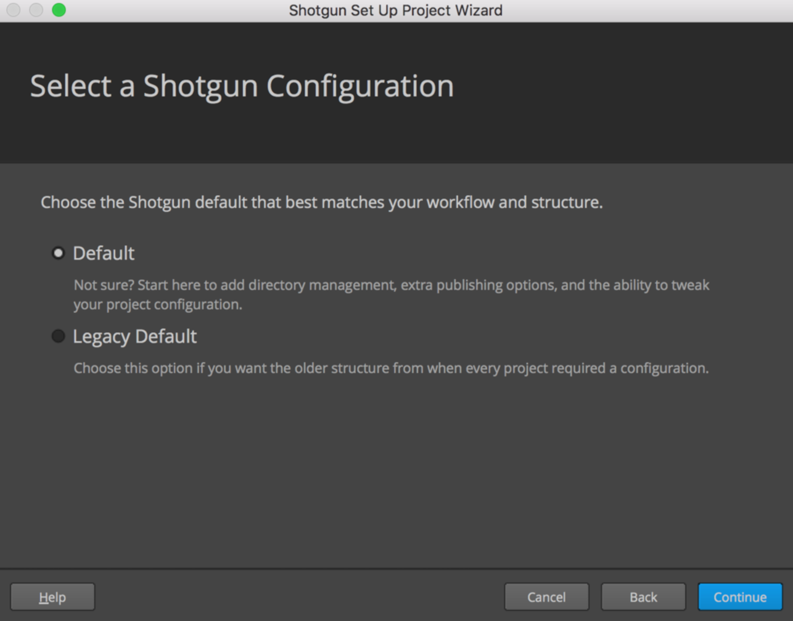
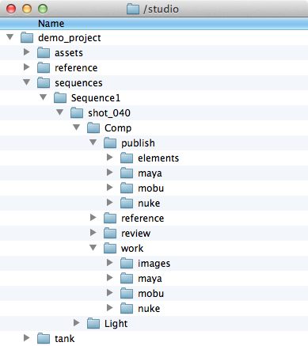

#  統合管理者ガイド

## はじめに

このドキュメントは、管理者向けの  統合ガイドです。ユーザ ガイド、管理者ガイド、開発者ガイドのうちの 1 つです。[ユーザ ガイド](https://support.shotgunsoftware.com/hc/ja/articles/115000068574)は、日常のワークフローで  の統合が必要なアーティストを対象にしています。[開発者ガイド](https://support.shotgunsoftware.com/hc/ja/articles/115000067513)は、機能を拡張するために Python コードを記述するユーザを対象にした技術ドキュメントです。この統合管理者ガイドは、これら 2 つのドキュメントの中間に位置するものです。 を統合するユーザ、ソフトウェア バージョンを管理するユーザ、パブリッシュ ファイルのストレージを決定するユーザを対象にしています。

## 標準的なパイプライン設定

Toolkit セットアップの中心はパイプライン設定です。つまり、インストールしたアプリからソフトウェア バージョンに至るまですべてを管理したり、ときにはプロダクションのディレクトリ構造とファイル名をセットアップするためのテンプレートを格納する YAML ファイル セットです。パイプライン設定は高度にカスタマイズ可能ですが、2 つの開始点が用意されています。

### 基本設定

すぐに利用可能な統合機能は、環境設定ファイルをセットアップまたは変更しなくても実行できるように設計されています。すぐに利用可能な統合機能を使用する場合は、管理が必要なものは何もありません。Toolkit が内部でパイプライン設定を暗示的に使用します。このパイプライン設定は基本設定と呼ばれています。基本設定によって、すべてのサポート対象ソフトウェア パッケージで Panel、Publisher、Loader の 3 つの Toolkit アプリを利用できるようにしたり、 のソフトウェア エンティティを参照して  Desktop に表示するソフトウェア パッケージを決定します。基本設定にはファイルシステム ロケーション サポートが含まれていません。プロジェクトですぐに利用可能な統合機能を使用すると、Desktop を起動するたびに基本設定のコピーが自動的に更新されるため、常に最新バージョンの統合が使用されます。[こちらからリリース ノートを参照](https://support.shotgunsoftware.com/hc/en-us/sections/115000020494-Integrations)したり、[こちらの Github で基本設定を参照](https://github.com/shotgunsoftware/tk-config-basic/)できます。

### 既定の設定

これは高度なプロジェクト設定を開始するための既定の開始点です。これには、[ファイルシステム ロケーション サポート](https://support.shotgunsoftware.com/hc/ja/articles/219039868)およびさまざまな Toolkit アプリとエンジンが含まれます。

[こちらから Github の既定の設定を参照](https://github.com/shotgunsoftware/tk-config-default2)できます。既定の設定の構造に関する詳細については、パイプライン設定の `config/env/README.md` ファイルを参照するか、[Github でこちらを参照](https://github.com/shotgunsoftware/tk-config-default2/blob/master/env/README.md)してください。

以前の構造による既定の設定に慣れている場合は、「[既定の設定更新に関するよくある質問(FAQ)](https://support.shotgunsoftware.com/hc/ja/community/posts/115003376154)」を参照してください。



## Publisher

Publisher は、すぐに使用可能なワークフローとすべてのパイプライン設定間の移行を簡単に実行できるように設計されています。すぐに使用可能なセットアップでは、ファイルが所定の方法でパブリッシュされるため、テンプレートまたはファイル システム スキーマを定義する必要がありません。高度なセットアップでプロジェクトを設定し、すべてのパイプライン設定を完了したら、同じパブリッシュ プラグインがアプリ設定に導入されたテンプレートを認識し、パブリッシュ前に指定されたパブリッシュ場所に対してファイルのコピーを開始します。このため、すべてが設定されたプロジェクトに対して、環境ごとまたは DCC ごとにテンプレートベースの設定を必要に応じて導入できます。既定の設定は、テンプレートベースのワークフローが完全に設定されているため、Publish アプリでテンプレートを設定する方法の確認に使用できます。詳細については、Github で既定の設定の [tk-multi-publish2.yml ファイル](https://github.com/shotgunsoftware/tk-config-default2/blob/master/env/includes/settings/tk-multi-publish2.yml)を参照してください。

Publisher のプラグインの作成に関する詳細については、[開発者ガイドの Publisher に関するセクション](https://support.shotgunsoftware.com/hc/ja/articles/115000067513#Publisher)を参照してください。

## ソフトウェアの起動を設定する

システムでホスト アプリケーションの  の自動検出を使用するのは簡単です。 Desktop を起動し、プロジェクトを選択するだけで、アプリケーションの標準フォルダ内に格納されたサポート対象のすべてのソフトウェア パッケージのランチャーが Desktop に表示されます。ただし、このソフトウェアをより細かく管理するための強力なツールもご用意しています。アプリケーションが、特定のプロジェクト、グループ、または個別のユーザに対してのみ表示されるよう制限できます。バージョンを指定し、サイト全体で任意のソフトウェア パッケージを無効にして、ソフトウェア パッケージをまとめてグループ化できます。これらはすべて、 のソフトウェア エンティティを使用して管理されます。

新しい  サイトを作成すると、既定のソフトウェア エンティティ セットが用意されます。サポート対象のホスト アプリケーションごとに 1 つのエンティティが設定されます。このエンティティを修正し、独自のエンティティを追加すると、ユーザの希望どおりに Desktop に表示されるソフトウェアを管理できます。

 でソフトウェア エンティティを表示するには、画面の右上隅にあるプロファイル アイコンをクリックし、[管理者] (Admin)メニューを開いて、`Software` を選択します。

ソフトウェア エンティティには次のフィールドがあります。

- **[ソフトウェア名](Software Name):** Desktop のソフトウェアの表示名です。
- **[サムネイル] (Thumbnail):** Desktop アイコン用にアップロードされるイメージ ファイルです。
- **[ステータス] (Status):** ソフトウェアが利用できるかどうかを制御します。
- **[エンジン] (Engine):** コンテンツ作成ツールの統合の名前です。
- **[製品] (Products):** バリアント(Houdini に対する Houdini FX など)を含むソフトウェア パッケージの場合は、ここでカンマ区切りリストを指定できます。手動モードではなく、自動検出モードの場合のみ有効です。
- **[バージョン] (Versions):** 表示するソフトウェアの特定のバージョンです。ここではカンマ区切りリストを指定できます。手動モードではなく、自動検出モードの場合のみ有効です。
- **[グループ] (Group):** `Group` フィールドの値が同じエンティティは、Desktop の 1 つのアイコンと  の 1 つのメニューにグループ化されます。たとえば、Houdini と Nuke を含む FX グループを作成することもできます。
- **[グループの既定値](Group Default):** グループ内のいずれかのメンバーの `Group Default` が選択されている場合、このアイコンまたはメニュー項目をクリックすると、このソフトウェアが起動します。
- **[プロジェクト] (Projects):** ソフトウェアを特定のプロジェクトに制限する方法です。
- **[ユーザ制限](User Restrictions):** ソフトウェアを特定のユーザまたはグループに制限する方法です。
- **[Linux/Mac/Windows のパス](Linux/Mac/Windows Path):** ソフトウェアに対する OS 固有のパスを明示的に指定するためにこのフィールドを使用します。
- **[Linux/Mac/Windows の引数](Linux/Mac/Windows Args):** ソフトウェアの起動時にコマンドに追加するためのコマンドライン引数です。

ここでは、これらのフィールドがどのように動作するかを学習するために、いくつかの使用方法を説明します。

### 例: 同一アプリケーションのバージョンをグループ化する(自動検出)

ファイルシステム上に、Maya 2016、Maya 2017、および Maya 2018 の 3 つの Maya のバージョンがあるとします。そして、これらすべてのバージョンをアーティストが利用できるようにしたいのですが、Desktop の 1 つのアイコンにすべてのバージョンがグループ化されている状態にしようと思います。

これら 3 つのバージョンの Maya がファイルシステム上の標準の場所にインストールされている場合は自動的に実行されます。Desktop でプロジェクトを選択すると、ローカル マシンの標準的なアプリケーション ディレクトリをスキャンし、3 つのバージョンを探します。 で Maya ソフトウェア エンティティを既に指定しているため、特定のバージョンまたはパスを指定しなくても、Desktop 内で検出されたすべてのバージョンが表示されます。


注意事項は次のとおりです。

-  がソフトウェアを自動検出すると、1 つのソフトウェア エンティティですべてのバージョンのメニュー項目が生成されます。
- パス フィールドの値を指定する必要はありません。ソフトウェア エンティティが自動検出モードの場合、アプリは標準の場所に格納されていると見なされます。

すべてのバージョンが Desktop に表示されます。Maya の場合は 1 つのアイコンが表示され、ドロップダウン リストにすべての利用可能なバージョンが表示されます。アイコン自体をクリックすると、最新バージョンの Maya が起動します。

### 例: 同一アプリケーションのバージョンをグループ化する(手動モード)

これは標準の場所以外に Maya を格納している場合に最適です。独自のソフトウェア エンティティを作成し、 にソフトウェアの場所が分かるようにパスを指定するだけです。次のように設定することができます。


注意事項は次のとおりです。

- 自動検出モードとは異なり、任意のソフトウェア パッケージのバージョンごとにソフトウェア エンティティがあります。
- これをグループ化するには、`Group` フィールドと `Group Default` フィールドを使用します。`Group` で同じ値を共有するソフトウェア エンティティは Desktop で 1 つのアイコンのドロップダウンにグループ化されます。その名前には `Group` の値が使用されます。
- このアイコン自体をクリックすると、`Group Default` を選択しているグループ内のソフトウェアが起動します。
- **ソフトウェア エンティティで Linux のパス、Mac のパス、または Windows のパスのいずれか__に値を指定すると、このエンティティは手動モードに移行します。**自動検出モードとは異なり、パス フィールドが空のときにソフトウェアが Desktop に表示されます__。手動モードでは、ソフトウェア パッケージのパスが指定されており、そのファイルが指定されたパスに存在する場合、ソフトウェア パッケージは任意のオペレーティング システム上でのみ__表示されます。
- 上記の例では、`Windows Path` を指定していないため、Windows にインストールされている Desktop には、Maya のバージョンは 3 つとも表示されません。

### 例: ユーザまたはグループ別に制限する

上記の最後の例で、Maya 2018 をすべてのユーザに利用可能にする準備がまだできていないとします。しかし、TD、Dev、QA エンジニア、Tessa Tester が使用できるようにするには、どうしたら良いでしょうか。この場合には、`User Restrictions` フィールドを使用します。以下の例を参照してください。


最後の例にいくつかの変更を加えました。

- グループの既定値は Maya 2017 です。これをプロダクション バージョンにする場合、このボックスを選択して Maya のアイコンをクリックすると、このバージョンが起動します。
- ユーザとグループの両方が受け入れられるように、`User Restrictions` フィールドにいくつかの値を追加しました。Dev と TD のグループと Tessa Tester ユーザを追加しました。これで、これらのユーザの Desktop にだけ Maya 2018 が表示されます。

### 例: ソフトウェアのバージョンをプロジェクトごとに制限する

複数のプロジェクトにわたってバージョンを細かく管理することが必要な場合があるかもしれません。プロジェクトを急いで仕上げなければならない場合に、新しいバージョンのソフトウェアの使用を制限していたが、それと同時に、その後継バージョンがリリースされ、評価が行えるようになったとします。このような場合は、ソフトウェア エンティティを次のようにセットアップすると良いかもしれません。


重要な注意事項は次のとおりです。

- 任意の環境の Desktop で表示される Maya のバージョンを 1 つにするため、ここでは `Group` と `Group Default` の値を削除しています。
- 3 つすべてのバージョンの `Software Name` を「Maya」に設定しています。この方法では、すべてのプロジェクトでユーザに同一名のアイコンが表示されますが、アイコンにはここで設定した内容に応じて異なるバージョンが指定されます。
- Maya 2016 の `Status` フィールドを `Disabled` に設定しています。このバージョンはもう使用しません。このフィールドですべてのプロジェクトのグローバル表示が切り替わります。
- Maya 2017 と Maya 2018 の `Projects` に値を指定しています。`Projects` は制限事項として機能します。Maya 2017 が表示されるのは Chicken Planet プロジェクトのみ__で、Maya 2018 は Chicken Planet II にしか表示されません。
- ソフトウェア エンティティの `Projects` に値を指定すると、ソフトウェアは指定したプロジェクトでしか表示されなくなります。そのため、スタジオに Chicken Planet シリーズとは別のプロジェクトがある場合は、そのプロジェクトのソフトウェアを明示的に指定する必要があります。

### 例: 独自のソフトウェアを追加する

次のような理由がある場合、 Desktop がシステムで自動検出したソフトウェア エンティティとは別に、新しいソフトウェア エンティティの追加が必要になる場合があります。

- Desktop でユーザが利用可能なエンジンがないためにアプリケーションを作成する必要がある場合。
- 社内ソフトウェアやサードパーティのソフトウェアなど、オートデスクではまだ統合を用意していないソフトウェアを使用し、独自のエンジンを定義している場合。
- ソフトウェアが標準の場所に格納されていないため、 とそのソフトウェアを手動で接続する場合(この場合は、上記の「同一アプリケーションのバージョンをグループ化する(手動モード)」に記載されています)。

上記の場合、独自のソフトウェア エンティティを追加することができます。`Software Name` フィールドに値を指定する必要があります。ソフトウェアに社内のエンジンを使用する場合は、`Engine` フィールドにこのエンジンの名前を指定します。スタジオによっては、アーティストの利便性を考えて、 に統合されていないアプリを Desktop に追加すると良い場合があります。アーティストは Desktop からこのアプリを直接起動できます。バージョンと使用上の制限を管理するために、上記の設定をすべて使用することもできます。この場合、`Engine` フィールドは空の状態にしますが、`Mac Path`、`Linux Path`、`Windows Path` のいずれかのフィールドに値を指定する必要があります。

## パブリッシュ ファイル パスの解決を設定する

ファイルをパブリッシュすると、Publisher により、`Path` と呼ばれる[ファイル/リンク](https://support.shotgunsoftware.com/hc/ja/articles/219031008) フィールドを含む PublishedFile エンティティが  に作成されます。その後、別のユーザがローダーを使用して独自の作業セッションにこのファイルをロードしようとします。Loader は複雑なロジックを使用して、有効なローカル パスをオペレーティング システム上の PublishedFile に解決します。

Loader がパブリッシュ データをパスに解決する方法は、パブリッシュがローカル ファイル リンクまたは `file://` URL に関連付けられているかどうかによって異なります。

### ローカル ファイル リンクを解決する

パブリッシュするパスが  の[サイト基本設定](Site Preferences)で定義されたローカル ストレージと一致する場合、ローカル ファイル リンクがパブリッシュ時に自動的に生成されます。パブリッシュがローカル ファイル リンクの場合は、そのローカル オペレーティング システムの表示が使用されます。ローカル ファイル リンクの詳細については、[こちら](https://support.shotgunsoftware.com/hc/ja/articles/219030938)を参照してください。

ローカル ストレージで現在使用しているオペレーティング システムのパスを定義しない場合は、環境変数を使用すると、ローカル ストレージ ルートを指定できます。環境変数の名前は `SHOTGUN_PATH_<WINDOWS|MAC|LINUX>_<STORAGENAME>` の形式になります。そのため、「Renders」と呼ばれるストレージ ルートのパスを Mac で定義する場合は、環境変数 `SHOTGUN_PATH_MAC_RENDERS` を作成します。次の例を使用して詳細を確認してみましょう。

-  サイトに「Renders」と呼ばれるストレージ ルートがあり、次のパスが指定されているとします。
- Linux のパス: `/studio/renders/`
- Windows のパス: `S:\renders\`
- Mac のパス: `<blank>`

- 現在は Mac を使用しています。

- パス `/studio/renders/sq100/sh001/bg/bg.001.exr` のパブリッシュをセッションにロードします。

ローダーはパスを解析して `/studio/renders/` がパスのストレージ ルートであると推定しますが、Mac 用のストレージ ルートは定義されていません。そのため、環境変数 `SHOTGUN_PATH_MAC_RENDERS` を探します。環境変数が見つかると、パスの `/studio/renders` とその値を置き換えます。

**注:** 環境変数 `SHOTGUN_PATH_MAC_RENDERS` を定義して、ローカル ストレージ レンダリングで Mac のパスが設定されている場合は、ローカル ストレージの値が使用され、警告がログに記録されます。

**注:** 現在のオペレーティング システムで何もストレージが解決できない場合は、`PublishPathNotDefinedError` が発生します。

### ファイルの URL を解決する

ローダーは `file://` URL の解決もサポートします。パブリッシュ時、パブリッシュするパスがサイトのローカル ストレージのどれとも一致しない場合、パスは `file://` URL として保存されます。ローカル ファイル リンクとは異なり、このパスはマルチ OS 表現に保存されず、作成元のオペレーティング システムで定義されるだけです。

URL を作成したときとは異なるオペレーティング システムで `file://` URL を解決しようとすると、Loader は一連の手法を使用して URL を有効なパスに解決しようとします。

- 最初に、`SHOTGUN_PATH_WINDOWS`、`SHOTGUN_PATH_MAC`、および `SHOTGUN_PATH_LINUX` の 3 つの環境変数を探します。これらの環境変数が定義されている場合は、メソッドがこの方法でパスを変換しようとします。たとえば、Windows で `file:///prod/proj_x/assets/bush/file.txt` を解決する場合、`SHOTGUN_PATH_WINDOWS=P:\prod` と `SHOTGUN_PATH_LINUX=/prod` をセットアップして、パスの解決方法のヒントを示すことができます。
- 複数の環境変数を使用する場合は、複数のストレージを表現するために、上記の変数名構文にサフィックスを付けて拡張します。
- レンダリングのストレージがある場合、たとえば、`SHOTGUN_PATH_LINUX_RENDERS`、`SHOTGUN_PATH_MAC_RENDERS`、および `SHOTGUN_PATH_WINDOWS_RENDERS` を定義して、レンダリング ストレージ内のデータを参照するようにパブリッシュされたすべての `file://` URL に移行メカニズムを提供します。
- その後、編集データのストレージもある場合は、`SHOTGUN_PATH_LINUX_EDITORIAL`、`SHOTGUN_PATH_MAC_EDITORIAL`、および `SHOTGUN_PATH_WINDOWS_EDITORIAL` を定義して、編集ストレージ ルートに移行メカニズムを提供します。

これらの環境変数で標準化したら、環境変数を  のローカル ストレージに変換できます。ローカル ストレージを  のプリファレンスで定義すると、自動的に選択されるため、環境変数は不要になります。

- 上記に加えて、 のプリファレンスで定義したすべてのローカル ストレージも同様です。
- ローカル ストレージが定義されているがオペレーティング システムが見つからない場合は、環境変数を使用して指定することができます。たとえば、Linux と Windows で定義された `Renders` と呼ばれるローカル ストレージがある場合は、`SHOTGUN_PATH_MAC_RENDERS` と呼ばれる環境変数を作成することにより、Mac をサポートするように拡張することもできます。この一般的な構文は `SHOTGUN_PATH_<WINDOWS|MAC|LINUX>_<STORAGENAME>` です。
- 一致するルートがない場合は、ファイル パスがそのまま返されます。

次に例を示します。

Linux で `/projects/some/file.txt` というファイルをパブリッシュしたため、 に `file:///projects/some/file.txt` という URL のパブリッシュが生成されました。Linux のパス `/projects` は Windows の `Q:\projects` と同じであるため、フル パスは `Q:\projects\some\file.txt` に変換されると考えられます。

次のすべてのセットアップでこれを処理します。

- 一般的な環境ベースのオーバーライド:
- `SHOTGUN_PATH_LINUX=/projects`
- `SHOTGUN_PATH_WINDOWS=Q:\projects`
- `SHOTGUN_PATH_MAC=/projects`

- 「Projects」と呼ばれる  のローカル ストレージで次のパスを設定します。

- Linux のパス: `/projects`
- Windows のパス: `Q:\projects`
- Mac のパス: `/projects`

- 「Projects」と呼ばれる  のローカル ストレージで次の環境変数を使用します。

- Linux のパス: `/projects`
- `Windows のパス:``
- `Mac Path:`/projects`
- `SHOTGUN_PATH_WINDOWS_PROJECTS=Q:\projects`

**注:** `Linux path` と環境変数 `SHOTGUN_PATH_LINUX_RENDERS` が設定された  でローカル ストレージ `Renders` が定義されている場合は、ストレージが優先され、環境変数は無視され、警告がログに記録されます。一般的に、ローカル ストレージ定義は、環境変数よりも常に優先されます。

### 高度な設定

PublishedFile パスの解決を実行する基本的なメソッドの詳細については、[開発者参照ドキュメント](http://developer.shotgridsoftware.com/tk-core/utils.html#sgtk.util.resolve_publish_path)を参照してください。

高度なプロジェクト セットアップを使用している場合は、`resolve_publish` コア フックをカスタマイズして、ローカル ファイル リンクと `file://` URL 以外のサポートを追加できます。有効なカスタマイズは次のとおりです。

- アップロード ファイルが関連付けられたパブリッシュは、コア フックによって適切なキャッシュの場所に自動的にダウンロードされ、パスが返されます。
- カスタム URL スキーマ(`perforce://` など)はローカル パスに解決できます。

## ブラウザの統合

 Toolkit でのブラウザ統合とは、 Web アプリケーションの右クリック コンテキスト メニューを使用して、Toolkit アプリおよびランチャーにアクセスすることを指します。上に例が示されているこのメニューには、さまざまなエンティティ タイプに対して設定されたアクションが含まれています。プロジェクトのパイプライン設定が複数ある場合、アクションはパイプライン設定別に整理されます。ブラウザ統合により、 のコンテキストを認識する Maya や Nuke などのコンテンツ作成ソフトウェアをブラウザから直接起動できるようになります。


### ブラウザ統合の簡単な歴史

長年にわたり、 Toolkit のブラウザ統合は複数の方法を取ってきました。技術とセキュリティ要件が進歩するにつれて、ブラウザ統合を実装するためのアプローチも進歩してきました。

**Java アプレット(廃止済み)**

最初は、 の Web アプリケーションからローカル デスクトップへのアクセスを提供する Java アプレットとして実装されました。Java アプレットが悪用可能なセキュリティ リスクとして認識されるにつれて、Java アプレットは衰退し、廃止を余儀なくされました。

**ブラウザ プラグイン(廃止済み)**

廃止された Java アプレットと置き換えられたのは、NPAPI を利用して  Web アプリケーションからローカル デスクトップにアクセスするブラウザ プラグインでした。NPAPI もセキュリティ リスクとして認識されるようになったため、主要な Web ブラウザは NPAPI の使用をブロックし始めました。そのため、ブラウザ プラグインは廃止を余儀なくされました。

** Desktop を介した Websocket v1 (旧バージョン)**

 Desktop アプリ内で Websocket サーバをホストすることも、 Web アプリケーションからローカル デスクトップと通信するアプローチでした。この方法は現在も使用できます。この Websocket サーバの RPC API の最初の実装では、以前の Java アプレットとブラウザ プラグインのために開発されたものと同じ基盤技術が使用されていました。サーバが  から要求を受け取ると、関連付けられたプロジェクトのパイプライン設定の tank コマンドが使用され、アクション メニューに表示されるコマンドのリストが取得されました。

** Desktop を介した Websocket v2**

Websocket サーバの RPC API のバージョン 2 では、Toolkit アクションの取得、キャッシュ、および実行に使用される基盤メカニズムが変更されています。この変更により、以前のブラウザ統合の実装に関連する多くのパフォーマンス上の問題が解決され、アクション メニューの視覚的構成が改善されました。また、[すぐに利用可能な  統合](https://support.shotgunsoftware.com/hc/ja/articles/115000068574#Getting%20started%20with%20Shotgun%20Desktop)のサポートも追加されました。これにより、明示的に Toolkit を設定することなく動作するようになりました。これがブラウザ統合の現在の実装です。

### 環境設定

エンティティ タイプごとにユーザに提示されるアクションをコントロールするには、プロジェクトのパイプライン設定で YAML 環境ファイルを変更します。最初にカスタマイズを試みるときに、いくつかの点について理解し、検討する必要があります。

**どのエンジン設定を使用するか**

 Web アプリ内の Toolkit アクションを管理する Toolkit エンジンは `tk-shotgun` であるため、このエンジンの設定によりアクション メニューに表示される内容がコントロールされます。


上記の [tk-config-basic](https://github.com/shotgunsoftware/tk-config-basic/) の例では、2 つのアプリが設定されており、いくつかのエンジン コマンドがメニュー アクションになっています。Toolkit アプリによって、アクション メニューに含まれるコマンドが登録されます。これにはローカル システム上の各ソフトウェア パッケージを起動するコマンドなどがあり、 サイトにある[ソフトウェア エンティティ](https://support.shotgunsoftware.com/hc/ja/articles/115000067493#Configuring%20software%20launches)のリストに対応しています。その結果、メニュー アクションのリストは次のようになります。


ブラウザ統合コードにより、ユーザのシステムで Houdini、Maya、Nuke、および Photoshop のインストールが検出されたため、それぞれの統合を起動するためのメニュー アクションが作成されました。特定の環境設定ファイルでは、その環境のエンティティにソフトウェアのランチャーを表示するために、ソフトウェア エンティティのエンジン__が必要になります。そのため、この例では、`tk-houdini`、`tk-maya`、`tk-nuke`、および `tk-photoshopcc` エンジンのすべてが、このスニペットの取得元であるファイルに含まれている必要があります。たとえば、このエンティティのランチャーのリストから Maya を削除する場合は、環境設定ファイルから `tk-maya` エンジン ブロックを削除するだけです。

また、Publish アプリの Publish... コマンドもメニューに含まれています。

**どの YML ファイルを使用するか**

環境設定の [pick_environment.py コア フック](https://github.com/shotgunsoftware/tk-core/blob/master/hooks/pick_environment.py)によってコントロールされるプライマリ環境設定(`config/env/*.yml`)、または `config/env/shotgun_<entity_type>.yml` ファイルを使用する [tk-config-default](https://github.com/shotgunsoftware/tk-config-default/) を利用する旧式アプローチという 2 つの方法のいずれかを使用できます。

標準環境ファイルを使用する場合、ブラウザの統合では `pick_environment` コア フックが使用され、指定されたエンティティのアクション メニューに使用される環境設定ファイルが決定されます。最も単純なケースでは、環境はエンティティ タイプに対応します。たとえば、ショットを右クリックした場合、結果のアクション メニューは `config/env/shot.yml` の `tk-shotgun` ブロックで設定されます。より複雑なロジックを使用するように `pick_environment` フックをカスタマイズすることができます。標準環境ファイルに `tk-shotgun` エンジンが設定されておらず、`shotgun_<entity_type>.yml` ファイルが存在する場合はフォールバックが発生します。これにより、エンティティ固有の環境ファイルを利用する従来の設定でブラウザの統合を行うことができます。

**_ヒント: tk-config-default2 によるブラウザ ランチャーからのソフトウェアの削除_**

 ブラウザからソフトウェアを起動する設定の更新方法は、tk-config-default と tk-config-default2 で異なります。

tk-config-default2 では、更新は config/env/includes/settings/[`tk-shotgun.yml`](https://github.com/shotgunsoftware/tk-config-default2/blob/v1.1.10/env/includes/settings/tk-shotgun.yml) に適用されます。tk-config-default では、更新は config/env/`shotgun_task.yml` で実行されていました。

たとえば、ブラウザ上でアセットから起動するときに、オプションのリストから Mari を削除してみましょう。

まず、[`config/env/asset.yml`](https://github.com/shotgunsoftware/tk-config-default2/blob/v1.1.10/env/asset.yml#L47) に移動し、`tk-shotgun` エンジン ブロックがどのように [`@settings.tk-shotgun.asset`](https://github.com/shotgunsoftware/tk-config-default2/blob/v1.1.10/env/asset.yml#L47) を参照しているかを確認します。`@` の記号は、設定の値がインクルードされたファイルのものであることを示します。これは、[env/includes/settings/`tk-shotgun.yml`](https://github.com/shotgunsoftware/tk-config-default2/blob/v1.1.10/env/includes/settings/tk-shotgun.yml) に移動して更新する必要があることを意味します。

`env/includes/settings/tk-shotgun.yml` で、エンティティごとのブロックの状態を確認します。たとえば、最初にアセットが次のようになっているとします。
```
<a name="asset"></a>
# asset
settings.tk-shotgun.asset:
  apps:
    tk-multi-launchapp: "@settings.tk-multi-launchapp"
    tk-multi-launchmari: "@settings.tk-multi-launchapp.mari"
    tk-multi-launchmotionbuilder: "@settings.tk-multi-launchapp.motionbuilder"
    tk-multi-publish2: "@settings.tk-multi-publish2.standalone"
    tk-multi-screeningroom: "@settings.tk-multi-screeningroom.rv"
    tk-shotgun-folders: "@settings.tk-shotgun-folders"
    tk-shotgun-launchfolder: "@settings.tk-shotgun-launchfolder"
  location: "@engines.tk-shotgun.location"
```

ブラウザでアセットのオプションのリストから Mari を削除するために、Mari の行を削除します([`tk-multi-launchmari: "@settings.tk-multi-launchapp.mari"`](https://github.com/shotgunsoftware/tk-config-default2/blob/master/env/includes/settings/tk-shotgun.yml#L29))。

```
<a name="asset"></a>
# asset
settings.tk-shotgun.asset:
  apps:
    tk-multi-launchapp: "@settings.tk-multi-launchapp"
    tk-multi-launchmotionbuilder: "@settings.tk-multi-launchapp.motionbuilder"
    tk-multi-publish2: "@settings.tk-multi-publish2.standalone"
    tk-multi-screeningroom: "@settings.tk-multi-screeningroom.rv"
    tk-shotgun-folders: "@settings.tk-shotgun-folders"
    tk-shotgun-launchfolder: "@settings.tk-shotgun-launchfolder"
  location: "@engines.tk-shotgun.location"
```

次に、 ブラウザで特定のソフトウェアを起動する機能を削除したいエンティティ(Shot など)ごとに同じ手順を実行します。ファイルを保存したら、1 分待ってからブラウザをハード リフレッシュして設定を有効にする必要があります。

### キャッシング

ブラウザの統合には堅牢なキャッシング メカニズムがあるため、可能な限りすばやくメニュー アクションをユーザに表示することができます。Toolkit をブートストラップしてエンジン コマンドのリストを取得するプロセスに時間がかかることがあるため、この機能が必要です。

**キャッシュはいつ無効になるか**

Websocket サーバの RPC API は、キャッシュされたデータがまだ有効かどうかを判断するために、2 つのものを確認します。YAML ファイルの変更時刻と、サイトのソフトウェア エンティティの内容です。指定された環境設定内のいずれかの YAML ファイルが、キャッシュ データが書き込まれた後に変更されている場合、必要なデータが再キャッシュされ、新しいデータが  Web アプリケーションに返されます。同様に、データがキャッシュされた後に  のソフトウェア エンティティ上のフィールドが変更された場合、Toolkit はブートストラップされ、新しいデータがキャッシュされます。

**キャッシュ ファイルはディスク上のどこにあるか**

キャッシュ ファイルの場所は、オペレーティング システムによって異なります。

```
OS X: ~/Library/Caches/Shotgun/<site_name>/site.basic.desktop/tk-desktop
Windows: %APPDATA%\Shotgun\<site_name>\site.basic.desktop\tk-desktop
Linux: ~/.shotgun\<site_name>\site.basic.desktop\tk-desktop
```

### フック メソッド

`browser_integration.py` フックは、次のフック メソッドを提供する `tk-framework-desktopserver` に含まれています。

- `get_cache_key`: このメソッドは、指定した設定の URI、プロジェクト エンティティ、およびエンティティ タイプに使用されるキャッシュ エントリのキーを決定します。既定の実装では、設定の URI およびエンティティ タイプが組み合わされます。
- `get_site_state_data`: このメソッドを使用すると、 からクエリーされた追加データを、キャッシュ内データの有効性をテストするために使用されるハッシュに含めることができます。既定では、サイト上にあるすべてのソフトウェア エンティティの状態が使用されますが、ハッシュに追加データを含める場合は、このフック メソッド内で実装することができます。
- `process_commands`: このメソッドは、 Web アプリケーションに返されるコマンドをカスタマイズまたは変更する場所を提供します。このメソッドに提供されるデータ構造は、各ディクショナリが単一のメニュー アクションを表す、ディクショナリのリストです。データは必要に応じて変更、除外、またはリストに追加することができ、Toolkit アクションを要求するメニューに直ちに反映されます。

### ログ

ブラウザ統合のログは、Toolkit の[標準のログ格納場所](https://developer.shotgridsoftware.com/38c5c024/)にあります。関連するログ ファイルは `tk-desktop.log` と `tk-shotgun.log` です。また、Google Chrome を使用している場合は、ブラウザの開発者コンソールで関連するログ出力を利用できることがあります。

### トラブルシューティング

Web アプリケーションとローカル デスクトップとの通信は複雑な性質を持つため、途中で障害が発生する可能性があります。以下に、障害の例とそのような状況になったときに最初にとるべき手順についての提案をいくつか示します。

**アクション メニューに[ Desktop を開くかインストールしてこのメニューを有効にする](Open or install ShotGrid Desktop to enable this menu)と表示される**


これは、次の 3 つのうちのいずれかを意味する可能性があります。

1.  Desktop が現在、ローカル マシン上で実行されていない。これは明らかなことに思えますが、間違いなく再確認する価値があります。

2. Chrome または Python の Websocket サーバが接続を拒否したため、 Web アプリケーションが  Desktop と通信できなくなった。この状況は、要求時に接続を続行できる自己署名証明書に関連している可能性が高いです。多くの場合、これらの証明書を最初から再生成することで問題が解決します。再生成は、次に示すように  Desktop からトリガできます。


1.  Desktop の Websocket サーバが起動に失敗した。この状況は、Websocket サーバの問題のあるリリースが一般に公開された場合にほぼ限定され、非常にまれです。この場合、[tk-desktop.log](https://developer.shotgridsoftware.com/38c5c024/) にエラーを説明するログが表示されます。このログを [ のサポート チーム](https://support.shotgunsoftware.com/hc/ja/requests/new)に送信してください。

**アクション メニューにアクションが表示されない**


このエンティティ タイプに対してアクションが予想されている場合、これは設定上の問題があることを示しています。考えられる問題はいくつかあります。

1. `tk-shotgun` エンジンは正しい YAML 環境ファイルで設定されているものの、その環境設定内にアプリが存在しない。この場合、このエンティティ タイプに対してアクションが存在しないことが意図されている可能性があります。

2. `tk-shotgun` エンジンが正しい YML 環境ファイルで設定されていて、アプリが存在するにもかかわらず、アクションがメニューに表示されない。これは、アプリが初期化に失敗したことが原因の可能性があります。この場合、問題に関する説明が [tk-shotgun.log および tk-desktop.log](https://developer.shotgridsoftware.com/38c5c024/) に記録されています。

3. このエンティティ タイプに対応する環境に、`tk-shotgun` の環境設定が含まれていない。この場合の最終的な結果は、このリストの 1 番と同じです。この場合、パイプライン設定の `pick_environment` フックを確認することでこのエンティティ タイプに対してどの環境がロードされているかを判断でき、そこで `tk-shotgun` の環境設定を確認できます。

4. ディスクに空のメニュー アクション リストがキャッシュされています。キャッシュを強制的に再生成するには、次のいくつかの方法の中から選択できます。

   - プロジェクトの環境設定で YAML ファイルの変更時刻を更新します。こうすると、次回に  からメニュー アクションが要求されたときに、メニュー アクションの再キャッシュがトリガされます。注目する必要があるのは、これによってプロジェクトで作業しているすべてのユーザに対して再キャッシュがトリガされることです。__
   -  サイトで、いずれかのソフトウェア エンティティのフィールド値を更新します。この場合の動作は、上記の YAML ファイルの変更時刻を更新した場合と同じですが、 サイトのすべてのプロジェクトで、すべてのユーザのキャッシュされたデータが無効になります。__ソフトウェア エンティティは非プロジェクト エンティティであるため、すべてのプロジェクトで共有されます。いずれかのソフトウェア エンティティのデータが変更された場合は、すべてのプロジェクトが影響を受けます。
   - 問題の影響を受けるホストのキャッシュ ファイルを削除できます。キャッシュを削除しても、通常は問題ありません。各ホストにキャッシュがローカルに保存されているため、この特定のシステム上のデータが最初から再キャッシュされるだけです。キャッシュは、 のキャッシュ場所にある SQLite ファイル(`<site-name>/site.basic.desktop/tk-desktop/shotgun_engine_commands_v1.sqlite`)に格納されます。

**[Toolkit: アクションを取得中...](Toolkit: Retrieving actions...)がメニュー アクションと置き換わらない**


これにはいくつかの可能性があります。

1. Websocket サーバがまだキャッシング アクションを完了していない。プロジェクトの環境設定が大幅に更新された後に初めてアクションが取得される場合、プロセスの完了に時間がかかることがあります。時間を置いてから、`tk-desktop.log` の内容を確認して、処理がまだ行われているかどうかを確認してください。

2. Websocket サーバが応答に失敗し、その後も応答しない。このような状況はまれですが、`tk-desktop.log` を確認してアクションの要求の結果として追加の処理が行われていないことが明らかになった場合は、[ShotGrid サポートに連絡して](https://support.shotgunsoftware.com/hc/ja/requests/new)関連するログ データを提供してください。

3. ユーザが複数の  サイトで作業している。 Desktop が 1 つのサイトに対して認証されているときに、2 番目の  サイトからメニュー アクションを要求すると、 Desktop を再起動して新しいサイトにログインするかどうかを尋ねられます。この要求が無視されると、2 番目のサイトはメニュー アクションのリストを受け取らなくなります。


## Toolkit 環境設定ファイル

プロキシ サーバを使用している場合、最初のログイン画面のいくつかの値を事前に指定する場合や、ブラウザベースのアプリケーション ランチャーと  Desktop を統合する方法を調整する場合は、`toolkit.ini` と呼ばれる特別な設定ファイルを使用します。 Desktop の実行にこのファイルは必要ありません。必要になるのは、その動作を設定する必要がある場合のみです。Toolkit は、次の順序で複数の場所にあるファイルを検索します。

1. ファイル パスをポイントする `SGTK_PREFERENCES_LOCATION` という名前の環境変数。
2.  Toolkit プリファレンス フォルダ内: (このファイルは次の場所に既定では存在しません。自分で作成する必要があります。)
   - Windows: `%APPDATA%\Shotgun\Preferences\toolkit.ini`
   - macOS: `~/Library/Preferences/Shotgun/toolkit.ini`
   - `~/.shotgun/preferences/toolkit.ini`Linux:

`SGTK_PREFERENCES_LOCATION` 環境変数オプションを使用すると、コンピュータ上またはネットワーク上のどこにでも設定ファイルを保存できます。`toolkit.ini` は現在の標準ファイル名です。`config.ini` を使用する場合は、「_従来の場所_」セクションを確認してください。

設定ファイルの例については、[こちら](https://raw.githubusercontent.com/shotgunsoftware/tk-framework-desktopstartup/master/config.ini.example)を参照してください。

このサンプル ファイルは `config.ini` と呼ばれていますが、名前を `toolkit.ini` に変更できます。

このファイルで環境変数とハードコードされた値を使用すれば、Windows 上に存在する変数 USERNAME を介し、既定のユーザ名などを選択してユーザに候補を表示することもできます。


**従来の場所(廃止済み)**

`toolkit.ini` は現在の標準ファイル名ですが、以前は `config.ini` ファイルを同じ目的で使用していました。`toolkit.ini` と `config.ini` の内容は同じです。`config.ini` は、次の廃止された場所を使用する場合に検索されます。

1. ファイルをポイントする `SGTK_DESKTOP_CONFIG_LOCATION` という名前の環境変数
2. 次のパス:
   - Windows: `%APPDATA%\Shotgun\desktop\config\config.ini`
   - macOS: `~/Library/Caches/Shotgun/desktop/config/config.ini`
   - `~/shotgun/desktop/config/config.ini`Linux:

**プロキシ設定**

スタジオがプロキシ経由でインターネットにアクセスしている場合、インターネットへのアクセス時にこのプロキシの使用を Toolkit に指示する必要があります。そのためには、プロキシを `http_proxy` 設定の値に指定します。

`http_proxy: <proxy_server_address>`

**ローカル ホスト サイトで  Desktop を実行する**

 サイトの URL の最後が `shotgunstudio.com` または `shotgrid.autodesk.com` でない場合は、ローカルの  サイトを実行していることを示します。この場合、サイトと  との統合の準備が完了していない可能性があり、開始前に  チームによる何らかの調整が必要になる場合があります。その場合はサポートいたしますので、[サポート リクエストを送信](https://support.shotgunsoftware.com/hc/ja/requests/new)してください。

**ローカル ホスト サイトでアプリ ストアに接続する**

プロキシ経由でインターネットにアクセスできるローカルの  サイトを使用している場合は、ローカルの  Web サイトではなく、HTTP プロキシを設定してアプリ ストアにアクセスすると便利です。そのためには、次の行を `toolkit.ini` に追加するだけです。

`app_store_http_proxy: <proxy_server_address>`

この `<proxy_server_address>` は[開発者ドキュメント](http://developer.shotgridsoftware.com/python-api/reference.html?highlight=reference%20methods#shotgun-methods)

プロジェクトごとにこの設定を上書きする必要がある場合は、プロジェクトのパイプライン設定の `config/core/shotgun.yml` に上書きします。

## オフライン使用のシナリオ

一般的な使用方法の場合、 Desktop は起動時に Desktop アプリ自体、tk-desktop エンジン、および基本設定の更新を自動的に確認します。しかし、オフラインで、またはインターネットから完全に切断されたマシンで統合を実行する場合もあります。次のセクションでは、それぞれのシナリオに対処する方法について説明します。

### 作成

このドキュメントで概要が説明されているオフライン時の問題を解決する方法は、[ Create](https://support.shotgunsoftware.com/hc/ja/articles/360012554734) で紹介されている統合機能にも適用されます。 Toolkit の動作を調整するために使用されるさまざまな環境変数(`SHOTGUN_BUNDLE_CACHE_FALLBACK_PATHS` など)は、 Create を使用する場合でも、 Desktop と同じように適用されます。

### オフライン時に統合を実行する

_シナリオ:  の統合を実行したいと考えていますが、インターネットに接続していません。ローカルに  をインストールしています。_

**ソリューション**

- 一時的にインターネットに接続できる場合は、 Desktop をダウンロードします。Shotgun Desktop には一連の[統合](https://support.shotgunsoftware.com/hc/ja/articles/115000068574#Introduction)があらかじめパッケージ化されており、サポートされているすべての DCC 向けの  の統合に必要なアプリとエンジンがあらかじめすべてバンドルされています。Shotgun Desktop を起動すると自動的にアップグレードが検索されますが、 App Store に接続できない場合は、ローカルに存在する最新のバージョンが実行されます。

**知っておきたい情報**

-  サイトにアクセスしないと実行できない Toolkit 操作(パブリッシュの登録など)があります。そのため、この解決策はローカルにホストされたサイトでのみ機能します。
- 更新はローカル マシンにダウンロードされます。
- 接続と切断を切り替える場合、Desktop に加えて Maya や Nuke などのアプリ内統合でも、接続されているときの起動時にアップグレードがダウンロードされます。

### 手動ダウンロードで更新を管理する

_シナリオ: アーティストのワークステーションがインターネットから切断されているため、Desktop の自動アップデートを使用することができません。それでも更新を入手したいと考えていますが、1 台のオンライン マシンから更新をダウンロードし、個別のアーティストまたは一元化された場所に手動で転送する必要があります。_

**ソリューション**

- インターネットに接続されたワークステーションで  Desktop を実行します。起動時に、最新のアップグレードが自動的にダウンロードされます。
- オプション 1: 共有 Desktop バンドル
- [バンドル キャッシュ](https://developer.shotgridsoftware.com/7c9867c0/)を、すべてのマシンがアクセスできる共有場所にコピーします。
- オフライン マシンの `SHOTGUN_BUNDLE_CACHE_FALLBACK_PATHS` 環境変数がこの場所を指すように設定します。
- オフライン マシンで Desktop が起動すると、バンドル キャッシュにある利用可能な最新のアップグレードが取得されます。
- オプション 2: ローカル配置
- 各ローカル マシンの適切なバンドル キャッシュの場所に、更新されたバンドル キャッシュを配布します。

**知っておきたい情報**

- オプション 1 では、`SHOTGUN_BUNDLE_CACHE_FALLBACK_PATHS` に定義されている場所から Toolkit コードがロードされます。この場所が共有ストレージにある場合は、多数の小さなファイルをロードするために十分なパフォーマンスがあることを確認してください。
- Windows のセットアップの場合、当てはまらないことが多々あります。その場合は、代わりにオプション 2 をお勧めします。

## 更新をロックする

Desktop の自動更新は常に最新の状態を保つために役立ちますが、プロジェクトや、場合によってはサイト全体をフリーズしたり、特定のバージョンにロックして更新を防ぐことが必要な場合もあります。

### 単一のプロジェクトの更新をフリーズする

シナリオ: プロジェクトがもうすぐ完了するため、 の統合の更新プログラムが自動的にダウンロードされないようにフリーズしたいと考えています。__

**ソリューション**

- プロジェクトをロックするバージョンを決定します。[統合のリリース ノートはこちらでご覧いただけます。](https://support.shotgunsoftware.com/hc/en-us/sections/115000020494-Integrations)
-  で、ロックするプロジェクトのパイプライン設定エンティティを作成し、次のフィールドを入力します(この例では、v1.0.36 の統合を使用するように環境設定をロックしています)。
- 名前: `Primary`
- プロジェクト: ロックするプロジェクト
- プラグインの ID: `basic.*`
- 記述子: `sgtk:descriptor:app_store?name=tk-config-basic&version=v1.0.36`

- このプロジェクトでは、誰が  Desktop を起動しても v1.0.36 が使用されるようになります。このプロジェクトで作業を開始する新しいユーザも v1.0.36 を取得することになります。


**知っておきたい情報**

- 更新はローカル マシンにダウンロードされます。
- 次にインターネットに接続しているときに Desktop を起動すると、基本設定の `v1.0.36` と関連するすべてのコードがマシンにダウンロードされます。
- `basic.*` は、基本設定のすべてのプラグインがこのオーバーライドを取得することを意味します。たとえば、Nuke と Maya の統合のみをフリーズする場合は、`basic.maya, basic.nuke` を指定します。
- テストするには、このパイプライン設定エンティティの複製を作成し、`User Restrictions` フィールドに自分のユーザ名を追加します。これにより、自分のみが使用できるようにエンティティが制限され、他のユーザには影響を与えなくなります。この複製した環境設定から Maya などのソフトウェアを起動して、予想される統合バージョンが実行されていることを確認することができます。

**既知の問題**

- Flame 統合のネームスペースは `basic.flame` であり、`basic.*` の一部であることが暗示されています。しかし Flame 統合は、実際には基本設定に含まれていません。そのため、プロジェクトに Flame を使用してこのオーバーライドを実装すると、Flame 統合が機能しなくなります。
- 解決策は、Flame 専用の追加のパイプライン設定オーバーライドを作成することです。
- 名前: `Primary`
- プロジェクト: ロックするプロジェクト(すべてのプロジェクトの場合はなし)
- プラグインの ID: `basic.flame`
- 記述子: `sgtk:descriptor:app_store?name=tk-config-flameplugin`

### サイトの更新をフリーズする

_シナリオ: 更新を行いたくありません。スタジオ内のすべてのプロジェクトで、何がダウンロードされ、使用されているかを完全にコントロールしたいと考えています。_

**ソリューション**

- 上記の例の手順に従い、`Project` フィールドを空白のままにします。`Project` フィールドにオーバーライドがない場合、このパイプライン設定エンティティは、「サイト」のプロジェクト、つまりプロジェクト外で Desktop によって使用されるサイト設定を含む、すべてのプロジェクトに適用されます。


**知っておきたい情報**

- これは、「サイト設定をロックする」場合に使用するワークフローです。これによりすべてがロックされます。また、Desktop メニューから高度なプロジェクト設定に進むことができます。
- `v1.2.3` などを使用するようサイト全体をロックする場合でも、別の環境設定を使用するよう個々のプロジェクトをロックできます。

**既知の問題**

- Flame が影響を受けることがあります。解決策については、上記のシナリオの「既知の問題」のセクションを参照してください。

### 1 つ以外のすべてのプロジェクトの更新をフリーズする

_シナリオ: 自動更新を許可するテスト プロジェクトを除いて、サイト内のすべてのプロジェクトをロックしたいと考えています。_


**解決策**

- 上記のセクションで説明したように、サイトの更新をフリーズします。
- 例外にするプロジェクトのパイプライン設定エンティティに、次のフィールド値を設定します。
- 名前: `Primary`
- プロジェクト: ロックしない__プロジェクト
- プラグインの ID: `basic.*`
- 記述子: `sgtk:descriptor:app_store?name=tk-config-basic`

**知っておきたい情報**

- プロジェクトの[記述子] (Descriptor)フィールドでバージョン番号が省略されていることに注目してください。これは、プロジェクトが基本設定の最新リリースをトラッキングすることを意味します。

### ロックされたサイトを安全に更新する

- シナリオ: v1.0.0 にロックされており、v2.0.0 へのアップグレードを予定していますが、スタジオに配置する前にまず新しいバージョンをテストしたいと考えています。*

**解決策**

-  でパイプラインの設定エンティティを右クリックし、[選択した項目を複製](Duplicate Selected)を選択して複製します。
- クローン作成した設定に「update test」という名前をつけて、自分を[ユーザ制限](User Restrictions)フィールドに割り当てます。
- このパイプライン設定を使用するようになります。
- テストするバージョンを指すように記述子を変更します。
- テストに参加させるユーザは、[ユーザ制限](User Restrictions)フィールドに追加して招待できます。
- 問題なくテストが完了したら、そのバージョンを使用するようにメインのパイプライン設定を更新するだけです。
- ユーザが Desktop または DCC を再起動すると、更新が取得されます。

## パイプラインの設定を引き継ぐ

環境設定をセットアップすることなく、すぐに利用可能な  の統合の基本セットを入手することができます。このドキュメントでは、すぐに利用可能な統合を使用して行うことができる管理の種類について説明します。この基本セットアップは、幅広いカスタマイズをサポートできるように  Toolkit プラットフォーム上に組み込まれています。Desktop では、Toolkit プロジェクト セットアップ ウィザードに従って、カスタマイズ可能な、プロジェクト用の完全なパイプライン設定を作成できます。

以下の各セクションでは、セットアップ方法が分からない場合に備えて、適正な既定値が設定された例と提案を含むウィザードの各手順を詳細に説明します。

#### Desktop からセットアップ ウィザードを起動する


プロジェクトに移動すると、Desktop 右底部のユーザ メニューにメニュー項目「Advanced Project Setup...」があります。このメニュー項目をクリックして、Toolkit セットアップ ウィザードを起動します。

#### 設定タイプを選択する


新しいプロジェクトの設定を開始する場合、まずは使用する設定テンプレート__を決定します。基本的に、設定テンプレートは、プロジェクトの実行に必要なすべての設定、ファイル システム テンプレート、アプリ、およびロジックが設定された完全なプロジェクト設定です。

- これが最初のプロジェクトである場合は、 の既定値を使用して開始してみてください。
- プロジェクトおよび以前のプロジェクトの環境設定を既に設定している場合は、既存のプロジェクトをベースにして新しいプロジェクトを作成することで既定値を簡単に再利用できます。
- 高度なワークフローの場合は、外部の環境設定または git リポジトリに保存されている環境設定を使用することができます。

#### 既定の設定テンプレート



ゼロからスタートする場合はここから始めます。既定の環境設定には、既定のファイル構造とファイル命名規則を使用して設定された最新のアプリとエンジンがすべて含まれています。

既定の設定をインストールしたら、設定ファイルを手動で微調整し、パイプラインの特定のニーズに合わせてカスタマイズできます。プロジェクトのセットアップが完了したら、この設定を次のプロジェクトのベースにすることができます。

##### 既定の環境設定

これは既定の Toolkit VFX 設定で、通常、セットアップを開始するのにぴったりの出発点です。3dsmax、Flame、Houdini、Nuke、Mari、Maya、Motionbuilder、および Photoshop のセットアップが付属し、ディスク上に簡単で分かりやすいフォルダ構造が作成されます。

環境設定には数多くの異なる項目があります。

- ファイル システムのセットアップ
- ディスク上のキーの場所を特定するためのテンプレート セット
- ワークフローに関連付けられた設定済みのエンジンとアプリのセット

**ファイル システムの概要**

標準設定で  のアセットとショットを処理します。パイプラインのステップごとに項目を分割します。パイプラインのステップは部門に似ています。各パイプラインのステップには、サポート対象のさまざまなアプリケーションの作業領域とパブリッシュ領域があります。ショット構造は次のようになります。



**アプリケーションとワークフロー**

環境設定には次のコンポーネントが含まれます。

- Maya、Mari、Nuke、3dsmax、Flame、Houdini、Photoshop、および Motionbuilder のサポート
-  アプリケーション ランチャー
- パブリッシュ、スナップショット作成、バージョン管理
- Nuke カスタム書き込みノード
-  との統合
- 数多くのその他のツールとユーティリティ

上記のアプリとは別に、環境設定のインストール後に追加のアプリとエンジンを簡単にインストールできます。

#### 既存のプロジェクトをベースにして新しいプロジェクトを作成する


これは以前のプロジェクトのすべての既定値と設定を使用して新しいプロジェクトを作成する、簡単で便利な方法です。Toolkit が、古いセットアップの環境設定を単純に新しいプロジェクトにコピーします。これは環境設定を展開する簡単で実用的な方法です。新しいプロジェクトはすべて古いプロジェクトをベースにすることになります。

パイプライン設定の展開と管理の方法に関するドキュメントについては、こちらを参照してください。

[プロジェクトの環境設定を管理する](https://support.shotgunsoftware.com/hc/ja/articles/219033168#Inheriting%20the%20config%20from%20your%20previous%20project)

#### git の設定テンプレートを使用する


プロジェクトの環境設定をソース コントロールに接続したままにする場合はこのオプションを使用します。リモート git または github リポジトリに URL を指定すると、セットアップ プロセスで URL がクローン作成されます。これは github だけでなく、すべての git リポジトリで動作します。リポジトリのパスの最後が `.git` で終わるようにしてください。Toolkit が git セットアップとして処理します。プロジェクト設定は git リポジトリであるため、変更をマスター リポジトリだけでなく、他のプロジェクトにも反映することができます。github ベースの環境設定を使用すると、複数の Toolkit プロジェクトを簡単に同期できます。詳細はこちらでご確認ください。

[プロジェクトの環境設定を管理する](https://support.shotgunsoftware.com/hc/ja/articles/219033168#A%20studio%20configuration%20in%20git%20source%20control)

Windows 上で実行している場合は、使用するマシンに git をインストールして、`PATH` からアクセスできるようにしておく必要があります。Linux と Mac OS X の場合、通常は既定でインストールされます。

#### 設定テンプレートを参照する


フォルダとしてまたは zip 圧縮された zip ファイルとしてディスク上に環境設定がある場合は、このオプションを使用します。他のユーザが環境設定を電子メールで送信してきたり、過去のすべてのプロジェクトを参照するマスター設定をディスク上で管理したりする場合は、これが役に立ちます。通常、これはエキスパート オプションであるため、別のプロジェクトの環境設定を使用するか、アプリ ストアの既定の環境設定のいずれかを使用することをお勧めします。

#### ストレージをセットアップする

それぞれの Toolkit プロジェクトでは、すべてのファイルとデータがディスク上の 1 つ以上の共有ストレージの場所に書き込まれます。たとえば、環境設定には、テクスチャを保存するストレージ、レンダリングを保存するストレージ、シーン ファイルを保存するストレージが必要です。通常、これらのストレージは、 の[サイト基本設定](Site Preferences)の[ファイル管理](File Management)タブでコントロールします。__

Toolkit セットアップ ウィザードに、設定に必要な各ストレージのルートを  のローカル ストレージにマップするよう求めるメッセージが表示されます。


必要なルートおよびその説明(設定の `roots.yml` ファイルで定義)が左側に表示されます。右側には、既存の  ローカル ストレージのリストが表示されます。必要なルートごとにストレージを選択します。 に現在の OS のパスが設定されていない場合は、入力します。

定義されていない他のオペレーティング システムのパスを追加することもできます。既存のパスはロックされるため、このストレージ パスを利用している可能性のある他のプロジェクトに誤って影響が及ぶことはありません。ウィザードのマッピング ページで、必要な各ルートがマッピングされていること、および各マッピングが有効なことを確認します。

新しいローカル ストレージを作成するには、ウィザードを使用するか、またはストレージ選択リストの最後にある `+New` 項目を選択します。ローカル ストレージの名前および現在の OS のパスを入力するよう求められます。

プロジェクトをセットアップしたら、Toolkit は各ストレージ場所の新しいプロジェクトごとにフォルダを作成します。たとえば、プライマリ ストレージの場所が `/mnt/projects` である場合、_The Edwardian Cry_ と呼ばれるプロジェクトの場所は `/mnt/projects/the_edwardian_cry` になります。環境設定でプライマリ ストレージ以外のストレージも使用している場合、それぞれのストレージの最後が `the_edwardian_cry` フォルダになります。

通常、プライマリ ストレージ場所は `/mnt/projects` または `\\studio\projects` のような場所です。一般的に、この場所には、プロジェクトごとにグループ化されたプロジェクト データが既に保存されています。これは多くの場合、共有ネットワーク ストレージ上にあります。

#### プロジェクト フォルダ名を選択する


ここではプロジェクトのディスク名を選択します。このフォルダは、環境設定によって必要となる、さまざまなストレージすべてにおいて作成されます。ほとんどの環境設定については UI に簡単なプレビューが表示されます。これはプライマリ ストレージのプレビューのみですが、マルチルート設定を使用している場合は、追加のストレージも表示されます。Toolkit は  の名前に基づいて既定のプロジェクト名を表示します。ユーザのセットアップに適した名前を作成するために自由に修正できます。

#### 環境設定の場所を選択する


最後に、設定ファイルを格納するディスク上の場所を決定してください。Toolkit は、以前のプロジェクトと同じディスク上の場所にすべて格納できるように、以前のプロジェクトに基づいた場所を表示します。

スタジオ内でこの設定を必要とするすべてのユーザがアクセスできるように、通常、設定ファイルは共有ストレージまたはディスク上に格納されます。このプロジェクトに複数のオペレーティング システムを使用する場合は、必要なすべてのパスを入力してください。すべてのパスがディスク上の同じ場所を表す必要があります。多くの場合、Mac OS X と Linux では同じパスですが、Windows では異なります。

これが最初のプロジェクトになる場合は、一般的に、今後のパイプラインのすべての環境設定を保存するディスク上の共有領域を決定します。通常、これはスタジオで共有するソフトウェアやソフトウェア設定を保存する場所です。場所は `/mnt/software/shotgun` のようになります。これは、スタジオのネットワークやファイル命名規則によって異なる場合があります。

初めて環境設定をセットアップする場合、スタジオで使用するすべてのプラットフォームのパスをセットアップします。これにより、後ですべてのマシンからアクセスできる環境を簡単に作成できます。たとえば、プロジェクト名が _Golden Circle_ の場合、入力可能なパスは次の 3 つです。
```
linux:   /mnt/software/shotgun/golden_circle
macosx:  /servers/production/software/shotgun/golden_circle
windows: \\prod\software\shotgun\golden_circle
```

#### 設定完了後の作業

最初の環境設定が完了したら、マニュアルの「次のステップ」に移動し、ニーズに合わせて Toolkit を設定および調整する方法を確認します。

[最初のプロジェクトの作成後](https://support.shotgunsoftware.com/hc/ja/articles/219040688)

詳細については、[高度なプロジェクト設定のドキュメント](https://support.shotgunsoftware.com/hc/ja/articles/219039808)を参照してください。

## 高度な機能

### サイレント インストール

Windows ネットワーク上では、 Desktop インストーラの .exe を実行するときに「/S」引数を使用するとサイレント インストールを実行できます。その後、実行可能ファイルのショートカットのコピーを起動フォルダに格納することが可能です。
