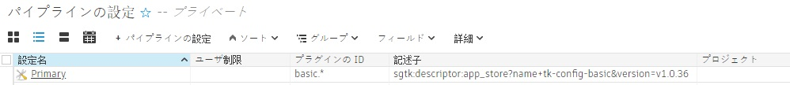
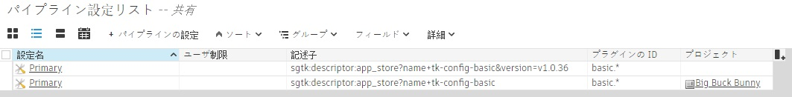

# オフラインでの使用と自動更新の無効化

- [自動更新](#auto-updates)
   - [自動更新の対象となる部分](#what-parts-auto-update)
   - [自動更新の対象ではない部分](#what-doesnt-auto-update)
- [統合オフラインを実行する](#running-the-integrations-offline)
   - [初期設定](#initial-setup)
   - [更新を管理する](#managing-updates)
- [自動更新を無効にする](#disabling-auto-updates)
   - [プロジェクトまたはサイト レベルで更新を無効にする](#disabling-updates-at-a-project-or-site-level)
   - [1 つ以外のすべてのプロジェクトの更新を無効にする](#disabling-updates-for-all-but-one-project)
   - [アップグレード](#upgrading)

## 自動更新
### 自動更新の対象となる部分

既定では、Shotgun Desktop は更新の有無を自動的に確認し、更新がある場合はローカル マシンにインストールします。

次の 2 つのコンポーネントの更新が検索されます。

- `tk-framework-desktopstartup`: Shotgun Desktop の起動を支援するフレームワーク。
- `tk-config-basic`: 既定のサイト設定。

この設定は、Shotgun Desktop で使用する必要があるアプリン、エンジン、フレームワークのバージョン、およびコア バージョンのマニフェストとして機能します。設定を更新すると、これらのコンポーネントも更新される可能性があります。検索された更新はダウンロードされ、ユーザのローカル キャッシュに保存されます。元の Shotgun Desktop インストール ファイルは変更されません。

アプリケーションとして機能する Shotgun Create には、Shotgun Desktop とは別の独自の更新メカニズムがあります。このメカニズムについては、ここでは説明しません。ただし、Shotgun Create に用意されている統合機能の動作は同様であり、`tk-config-basic` を自動更新して同じユーザ キャッシュに格納する動作も行います。

### 自動更新の対象ではない部分

- サイト設定を引き継いだ場合、`tk-config-basic` の新しい更新は検索されません。詳細については、[後述](#disabling-updates-at-a-project-or-site-level)します。

- 既定のサイト設定を使用していないプロジェクト(Toolkit の詳細設定ウィザードが実行されているプロジェクト)の設定は、自動更新されません。

- Shotgun Desktop にバンドルされた Python や Qt などのリソースは自動更新されません。これらのパーツを更新する必要がある場合は、新しい Shotgun Desktop インストーラがリリースされることがあります。

## 統合オフラインを実行する

### 初期設定

スタジオでインターネット アクセスが制限されている場合や、インターネットにアクセスできない場合は、必要なすべてのパーツがローカルにキャッシュされていることを確認する必要があります。Shotgun Create または Shotgun Desktop をダウンロードするには、インターネットに接続できるマシンが 1 台必要になります。

Shotgun Desktop には、基本的な統合の実行に必要なすべての依存関係が事前にパッケージ化されています。Shotgun Create にも依存関係がバンドルされていますが、「[更新を管理する](#managing-updates)」に記載されている手順に従うことも必要になります。

いずれかを起動すると自動的に更新が検索されますが、Shotgun App Store に接続できない場合は、ローカルに存在する最新のバージョンが実行されます。

インストーラにバンドルされたコンポーネントは最新でない可能性があるため、Shotgun Desktop をインストールした後に、以下の「[更新の管理](#managing-updates)」の手順に従うことをお勧めします。





### 更新を管理する

`tk-framework-desktopstartup` コンポーネントを更新するには、[最新バージョンをダウンロード](https://github.com/shotgunsoftware/tk-framework-desktopstartup/releases)し、ディスク上の場所を指すように環境変数 `SGTK_DESKTOP_STARTUP_LOCATION` を設定する必要があります(これは Shotgun Desktop にのみ適用されます)。

`tk-config-basic` コンポーネントの場合は、依存関係があるため、少し面倒です。

1. インターネットに接続されたワークステーションで Shotgun Desktop または Shotgun Create を実行します。これらを起動すると、最新のアップグレードが自動的にダウンロードされます。(このマシンで `SHOTGUN_DISABLE_APPSTORE_ACCESS` が設定されていないことを確認してください。)
2. バンドル キャッシュを、すべてのマシンがアクセスできる共有場所にコピーします。
3. オフライン マシンの `SHOTGUN_BUNDLE_CACHE_FALLBACK_PATHS` 環境変数がこの場所を指すように設定します。
4. オフライン マシンで Shotgun Desktop または Shotgun Create が起動すると、バンドル キャッシュにある利用可能な最新のアップグレードが取得されます。



## 自動更新を無効にする

### プロジェクトまたはサイト レベルで更新を無効にする



統合の自動更新を無効にするには、次の手順を実行します。

1. 引き続き使用するバージョンを決定します。統合リリースは[こちら](https://support.shotgunsoftware.com/hc/en-us/sections/115000020494-Integrations)にあります。
2. Shotgun で、プロジェクトまたはグローバル ページのいずれかにパイプライン設定エンティティを作成し、次のフィールドを入力します(この例では、v1.0.36 の統合を使用するように環境設定をロックしています)。

   1. 名前: `Primary`
   2. [プロジェクト]（Project）: すべてのプロジェクトで更新を無効にする場合は、空のままにします。特定のプロジェクトのみをロックする場合は、特定のプロジェクトを選択します。
   3. プラグインの ID: `basic.*`
   4. 記述子: `sgtk:descriptor:app_store?name=tk-config-basic&version=v1.0.36`

   
3. Shotgun Desktop を起動します。プロジェクト フィールドを空のままにした場合、Shotgun Desktop はこのバージョンを使用するように切り替わります(まだ切り替わっていない場合)。

   ](images/offline-and-disabled-auto-updates/shotgun-desktop-about.png)

   プロジェクトを設定した場合は、設定したプロジェクトのみが影響を受け、Shotgun Desktop の[バージョン情報]（About）ウィンドウは変更されません。
4. [オプション] `tk-framework-desktopstartup` のバージョンをロックするには、[最新バージョンをダウンロード](https://github.com/shotgunsoftware/tk-framework-desktopstartup/releases)し、ディスク上の場所を指すように環境変数 `SGTK_DESKTOP_STARTUP_LOCATION` を設定する必要があります(これは Shotgun Desktop にのみ適用されます)。

大部分の機能は、以前の手順でロックできる環境設定によってコントロールされます。ただし、「自動更新の対象となる部分」セクションに記載されているように、コンポーネントも更新され、環境設定とは別に処理されます。これは Shotgun Desktop にのみ適用されます。

#### 知っておきたい情報

- 環境設定のリリースを手動でダウンロードする必要はありません。Shotgun Desktop を起動するか、プロジェクトを開始すると、自動的に処理されます。
- `basic.*` は、基本設定のすべてのプラグインがこのオーバーライドを取得することを意味します。たとえば、Nuke と Maya の統合のみをフリーズする場合は、`basic.maya`、`basic.nuke` を指定します。
- テストするには、このパイプライン設定エンティティの複製を作成し、`User Restrictions` フィールドに自分のユーザ名を追加します。これにより、自分のみが使用できるようにエンティティが制限され、他のユーザには影響を与えなくなります。この複製した環境設定から Maya などのソフトウェアを起動して、予想される統合バージョンが実行されていることを確認することができます。
- プロジェクト フィールドを空白のままにすると、「サイト設定」が適用されます。Shotgun Desktop はプロジェクト外で動作するため、サイト設定が使用されます。Shotgun Desktop でプロジェクトを選択すると、プロジェクト設定もロードされます。

- Flame 統合のネームスペースは `basic.flame` であり、`basic.*` の一部であることが暗示されています。
   しかし Flame 統合は、実際には基本設定に含まれていません。そのため、プロジェクトに Flame を使用してこのオーバーライドを実装すると、Flame 統合が機能しなくなります。
   解決策は、Flame 専用の追加のパイプライン設定オーバーライドを作成することです。
   - 名前: `Primary`
   - プロジェクト: ロックするプロジェクト(すべてのプロジェクトの場合はなし)
   - プラグインの ID: `basic.flame`
   - 記述子: `sgtk:descriptor:app_store?name=tk-config-flameplugin`

### 1 つ以外のすべてのプロジェクトの更新を無効にする

上記の例の手順に従ってすべてのプロジェクトの更新を無効にした場合に、特定のプロジェクトの更新を有効にするには、次の操作を実行します。

1. 上記のセクションで説明したように、サイトの更新を無効にします。
2. 例外にするプロジェクトのパイプライン設定エンティティに、次のフィールド値を設定します。
   - 名前: `Primary`
   - プロジェクト: ロックしないプロジェクト
   - プラグインの ID: `basic.*`
   - 記述子: `sgtk:descriptor:app_store?name=tk-config-basic` [記述子]（Descriptor）フィールドでバージョン番号を省略すると、プロジェクトは基本設定の最新リリースをトラックします。

### アップグレード

設定を更新する場合は、すべてのユーザに展開する前に、新しいバージョンをテストしなければならないことがあります。

1. Shotgun でパイプラインの設定エンティティを右クリックし、**[選択した項目を複製]（Duplicate Selected）**を選択して複製します。
2. クローン作成した設定に「update test」という名前をつけて、自分を[ユーザ制限]（User Restrictions）フィールドに割り当てます。
3. このパイプライン設定を使用するようになります。
4. テストするバージョンを指すように記述子を変更します。
4. テストに参加させるユーザは、`User Restrictions` フィールドに追加して招待できます。
5. 問題なくテストが完了したら、そのバージョンを使用するようにメインのパイプライン設定を更新するだけです。
6. ユーザが Shotgun Desktop を再起動し、現在開いているソフトウェアと実行中の Shotgun の統合を再起動すると、更新が選択されます。
