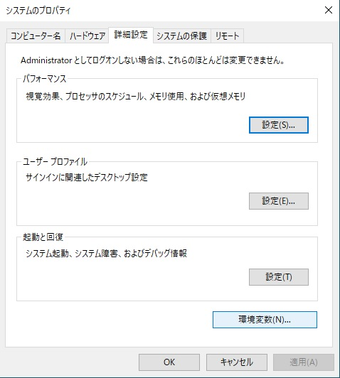

#  Desktop で Python 2 を既定の Python バージョンとして設定する

**Note:** Python 2 is getting removed by November 1st 2022. You can find the notification [here](https://community.shotgridsoftware.com/t/important-notice-upcoming-removal-of-python-2-7-and-3-7-interpreter-in-shotgrid-desktop/15166).

- [Windows](#windows)
- [MacOS](#macos)
- [CentOS 7](#centos-7)

## Windows

### Windows で `SHOTGUN_PYTHON_VERSION` 環境を手動で 2 に設定する

- Windows タスクバーで Windows アイコンを右クリックし、**[システム]**を選択して、**[コントロール パネル] > [システムとセキュリティ] > [システム]**の順にナビゲートします。


- ナビゲートしたら、**[システムの詳細設定]**を選択します。


- [システムのプロパティ]ダイアログ ボックスで**[環境変数]**を選択します。



- **[環境変数]**ウィンドウで**[新規...]**を選択します。


- **[変数名]**に `SHOTGUN_PYTHON_VERSION` と入力し、**[編数値]**を`2` に設定します。


-  Desktop アプリケーションを再起動します。これで、Python 2 を実行するように Python のバージョンが更新されました。


## MacOS

### MacOS で `SHOTGUN_PYTHON_VERSION` 環境を 3 に設定する

- `~/Library/LaunchAgents/` の下に `my.startup.plist` という名前のプロパティ ファイルを作成します

```
$ vi my.startup.plist
```

- `my.startup.plist` に以下を追加して、**保存**します。

```
<?xml version="1.0" encoding="UTF-8"?>
<!DOCTYPE plist PUBLIC "-//Apple//DTD PLIST 1.0//EN" "http://www.apple.com/DTDs/PropertyList-1.0.dtd">
<plist version="1.0">
<dict>
  <key>Label</key>
  <string>my.startup</string>
  <key>ProgramArguments</key>
  <array>
    <string>sh</string>
    <string>-c</string>
    <string>launchctl setenv SHOTGUN_PYTHON_VERSION 3</string>
  </array>
  <key>RunAtLoad</key>
  <true/>
</dict>
</plist>
```

- Mac を再起動すると、新しい環境変数が有効になります。

-  Desktop アプリケーションを再起動します。これで、Python 2 を実行するように Python のバージョンが更新されました。


## CentOS 7

### CentOS 7 で `SHOTGUN_PYTHON_VERSION` 環境を 2 に設定する

- `~/.bashrc` ファイルに以下を追加します。

```
export SHOTGUN_PYTHON_VERSION="2"
```

- 次のコマンドを実行して、OS を再起動します。

```
$ sudo reboot
```

-  Desktop アプリケーションを再起動します。これで、Python 3 を実行するように Python のバージョンが更新されました。


