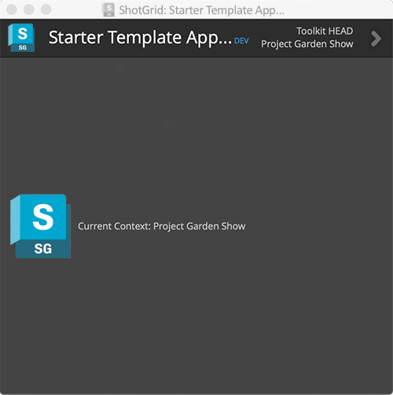
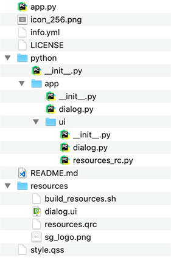

# 独自のアプリを開発する

## はじめに

このガイドでは、Toolkit アプリの概要と作成方法、およびアプリ開発に関する基本事項について説明します。Shotgun Pipeline Toolkit は Shotgun Software が管理するアプリとエンジンのコレクションであるだけでなく、カスタムのパイプライン ツールを迅速かつ簡単に作成するための開発プラットフォームも提供します。

- [Toolkit アプリとは何か?](#what-is-a-toolkit-app)
- [独自のアプリを作成する](#creating-your-own-app)

手順:
1. [開発サンドボックスを作成する](#part-1-creating-a-development-sandbox)
2. [スターター アプリ リポジトリのフォークまたはダウンロード](#part-2-forking-or-downloading-the-starter-app-repository)
3. [アプリを環境設定に追加する](#part-3-adding-the-app-to-your-config)
4. [アプリを開発する](#part-4-developing-the-app)
   - [テンプレート スターター アプリの構造](#anatomy-of-the-template-starter-app)
   - [環境設定](#configuration-settings)
   - [フレームワーク](#frameworks)
   - [変更を再ロードする](#reloading-your-changes)
5. [テスト](#part-5-testing)
6. [最初のリリースを準備する](#part-6-preparing-your-first-release)

追加情報:
- [既存のアプリを変更する](#modifying-an-existing-app)
   - [支援する](#contributing)

## Toolkit アプリとは何か?

Toolkit アプリは、次のように定義されます。

- Shotgun 統合の環境において、通常はエンドユーザによって実行されるツール。
- 通常、アプリにはユーザの操作をガイドするためのグラフィカル ユーザ インタフェースが備わっているが、必ずしも必要なわけではない。統合に登録されたコマンドとして使用可能なアプリもあり、ホスト ソフトウェアの Shotgun メニューからトリガできる。
- 他のプロセスやアプリと相互作用できる API/パブリック メソッドが含まれることがある。
- 複数のプラットフォームに対応することが可能で、ソフトウェアに依存しない。
- [環境](https://developer.shotgunsoftware.com/ja/487a9f2c/#%E7%92%B0%E5%A2%83%E3%81%AB%E3%81%A4%E3%81%84%E3%81%A6)に応じて異なる設定にすることができる。
- コンテキスト対応にすることができる。たとえば、ユーザが作業しているタスクをアプリが認識し、それに応じて動作するように設定できる。
- Toolkit エンジンからのみ実行できる。

Toolkit アプリは Toolkit エンジンによって初期化されます。[エンジン](https://developer.shotgunsoftware.com/tk-core/platform.html#engines)は特定のソフトウェア環境内で実行するように設計されていて、この環境から Toolkit アプリを実行するインタフェースが提供されます。エンジンを使用すると、アプリでさまざまなソフトウェア環境を処理するという複雑な作業が不要になります。つまり、アプリに必要なことは目的を達成するための機能を提供することであり、ウィンドウのペアレント化の処理、ユーザのコンテキストのトラッキング、自分自身を起動するためのショートカットなどを提供する必要はありません。

## 独自のアプリを作成する
Shotgun Software によって維持およびリリースされるすべてのアプリとエンジンはオープン ソースであり、[GitHub](https://github.com/shotgunsoftware) から入手できます。

このセクションでは、スターター テンプレートを使用して新しいアプリを作成する方法について説明します。
ユーザは GitHub と git のワークフローに精通していることが前提となりますが、ソース管理ソリューションとして git を使用していなくても、Toolkit の開発は可能です。


## パート 1: 開発サンドボックスを作成する
他の作業を開始する前に、[プロジェクト設定のクローンを作成して開発サンドボックスを設定する](../getting-started/installing_app.md#clone-the-pipeline-configuration-you-want-to-add-an-app-to)ことをお勧めします。
これにより、個別の設定が作成され、プロダクション環境の他のユーザに影響を与えることなく、コードを開発して変更をテストできるようになります。

## パート 2: スターター アプリ リポジトリのフォークまたはダウンロード
オートデスクは、独自のアプリを作成する際の第一歩として使用できる[テンプレート スターター アプリ](https://github.com/shotgunsoftware/tk-multi-starterapp)を提供しています。このアプリを使用すると、ユーザ用に設定されたすべての標準的なツールキット定型コード、および基本的なサンプル GUI が使用できるようになります。



このプラグインを使用するには、git リポジトリをフォークしてディスク上のローカル開発領域にクローンを作成します。この段階で git ソース コントロールを使用しない場合は、zip ファイルとして GitHub からファイルをダウンロードし、ローカルに解凍します(git リポジトリは後でいつでもセットアップできます)。いずれの場合も、目標となるのは、変更を開始できるよう、スターター アプリ コードのローカル コピーを作成することです。

## パート 3: アプリを環境設定に追加する
「[アプリを追加する](../getting-started/installing_app.md)」ガイドを参照することをお勧めします。このガイドには、環境設定にアプリを追加する詳細な方法が示されています。

アプリを環境設定に追加する場合は、アプリの使用場所を考慮する必要があります。たとえば、Nuke だけで使用する場合、複数の異なるソフトウェアで使用する場合、または Shotgun Desktop からスタンドアロンで使用する場合があります。アプリが依存するコンテキストについても考慮する必要があります。たとえば、ユーザが作業しているタスクがわかっている場合に限ってアプリを実行できるのか、または既知のプロジェクトに限定してアプリを実行できるのかを検討します。この情報がわかれば、アプリの設定を追加する必要がある YAML 環境ファイルおよびエンジンが決まります。

現時点で不明な場合は、まず、プロジェクト環境の `tk-shell` エンジンにアプリの設定を追加することをお勧めします。このようにすると、[IDE から実行](./sgtk-developer-bootstrapping.md)したり、[中央設定](https://developer.shotgunsoftware.com/tk-core/initializing.html#centralized-configurations)がある場合に tank コマンドを使用してコマンドラインから実行したりできます。これにより、開発にかかる時間が短縮されます。

最初は、アプリの場所として[開発記述子](https://developer.shotgunsoftware.com/tk-core/descriptor.html#pointing-to-a-path-on-disk)を使用します。

```yaml
tk-multi-starterapp:
  location:
    type: dev
    path: /path/to/source_code/tk-multi-starterapp
```
開発記述子は、Toolkit に対して、指定された場所のディスクから直接アプリ コードをロードするよう指示します。これは、コードを常に変更する必要がある開発に最適です。
後でプロダクション設定にアプリを追加する場合は、別の記述子を使用できます。

アプリの環境への追加が完了すると、アプリを起動することができるようになります。アプリの起動方法は、エンジン、およびエンジン内で定義された環境によって異なります。

## パート 4: アプリを開発する

これで、アプリの開発を開始する準備ができました。

### テンプレート スターター アプリの構造

[テンプレート スターター アプリ](https://github.com/shotgunsoftware/tk-multi-starterapp)には、以下の基本構造が含まれています。



- **app.py**: アプリのエントリ ポイントとメニュー登録は `app.py` ファイルにあります。通常は、ここでクラスを設定し、必要な初期化およびメニュー項目の登録を行います。
- **info.yml**: マニフェスト ファイルとも呼ばれます。このアプリをインストールするときに必要なさまざまな設定と、既定値(指定されている場合)がすべて定義されます。再利用可能なアプリが必要で、アプリ自体に値をハード コードしたくない場合には、それらの設定がしばしば役に立ちます。
- **python/app/dialog.py**: このフォルダには、メイン アプリ ウィンドウを生成するロジックやイベント コールバックなどが格納されます。
- **python/app/ui**: このフォルダには、自動的に生成された UI コードおよびリソース ファイルが格納されます。このフォルダを直接編集しないで、代わりに `resources` フォルダ内の Qt UI ファイルを編集してください。
- **resources/**: リソース フォルダにある `dialog.ui` ファイルは Qt Designer ファイルです。これを開いて使用することで、アプリのルック アンド フィールをすばやく設計および定義することができます。
   変更の後、`build_resources.sh` スクリプトを実行して UI ファイルを Python コードに変換し、`/python/app/ui/dialog.py` として保存する必要があります。
- **style.qss**: このファイルで UI の QSS (Qt スタイルシート)を定義できます。



### 環境設定
マニフェスト ファイル内に、アプリの設定を定義できる `configuration` セクションが含まれている必要があります。

マニフェスト ファイル内で設定を定義すると、YAML 環境ファイル内のアプリにさまざまな値を設定できます。これは、アプリが配置されている環境に応じて動作を変更する必要がある場合に便利です。

たとえば、ファイルを保存するときに使用するテンプレートを定義する設定が必要な場合があります。
```yaml
save_template:
    type: template
    default_value: "maya_asset_work"
    description: The template to use when building the path to save the file into
    allows_empty: False
```
この設定を作成すると、アプリ コード内にテンプレート名をハード コード化する必要がなくなり、代わりに `info.yml` 内で既定で定義された設定、または YAML 環境ファイルの設定でオーバーライドされた設定から[値を取得](https://developer.shotgunsoftware.com/tk-core/platform.html#sgtk.platform.Application.get_setting)できるようになります。

```python
template = app.get_setting("save_template")
```
つまり、アプリが実行されている環境に応じて、異なるテンプレートを使用するようにアプリを設定できます。

環境設定の詳細については、[リファレンス ドキュメント](https://developer.shotgunsoftware.com/tk-core/platform.html#the-configuration-section)を参照してください。

### フレームワーク

フレームワークを使用することがわかっている場合は、マニフェスト ファイルに追加できます。

たとえば、アプリで Qt ウィジェットと Shotgun ユーティリティ フレームワークを使用する場合は、`info.yml` に以下を追加します。

```python
# the frameworks required to run this app
frameworks:
    - {"name": "tk-framework-shotgunutils", "version": "v2.x.x"}
    - {"name": "tk-framework-qtwidgets", "version": "v1.x.x"}
```

#### フレームワークの必要最小バージョン
フレームワークに必要最低限のバージョンがある場合は、`info.yml` で minimum_version 設定を使用できます。

```python
# the frameworks required to run this app
frameworks:
    - {"name": "tk-framework-shotgunutils", "version": "v2.x.x"}
    - {"name": "tk-framework-qtwidgets", "version": "v1.x.x", "minimum_version": "v1.5.0"}
```

これにより、`tk-framework-qtwidgets` の `v1.5.0` がアプリで使用できるようになります。
使用できない場合、アプリは起動時にロードされず、コンソールにエラーが出力されます。
アプリが `tank updates` を使用して更新されると、必要最小限のバージョンを満たしていない設定済みのフレームワークはアプリとともに自動的に更新されます。

フレームワークとその効果的な利用の方法については、次のリンクを確認してください:

- [Qt ウィジェット フレームワーク](https://developer.shotgunsoftware.com/tk-framework-qtwidgets/)
- [Shotgun ユーティリティ フレームワーク](https://developer.shotgunsoftware.com/tk-framework-shotgunutils/)

### 変更を再ロードする

Maya などのソフトウェア内でアプリをテストする場合に、設定に 1 つまたは複数の開発項目を追加するとすぐに、Toolkit は Shotgun メニューに**[Reload and Restart]**オプションを追加します。![Shotgun メニューの[Reload and Restart]オプション](./images/reload-restart.png)

これをクリックすると、設定とコードが再ロードされ、エンジンが再起動されます。これによって、繰り返しの処理が高速化されます。すなわち、Maya を一度起動し、目的のコードまたは構成の変更を実行したら、**[Reload and Restart]**ボタンを押すだけで、変更が有効になります。



## パート 5: テスト
コードをテストする場合は、他のユーザを Shotgun の `PipelineConfiguration` エンティティの `User Restrictions` フィールドに追加することで、自分の開発サンドボックスに簡単に招待できます。
ユーザを追加するとすぐに、Shotgun Create 内のメニューに関する新しいエントリ、ブラウザ アクション、および Shotgun Desktop 内で設定を選択するオプションが表示されます。




## パート 6: 最初のリリースを準備する

[パート 3](#part-3---adding-the-app-to-your-config) では、開発記述子を使用してアプリを指すように設定しました。リリース済みのソフトウェアを安全かつ簡単にアップグレードできるようにするには、すべてのユーザがアプリにアクセスできること、およびバージョン管理が行われていることを確認する必要があります。

Shotgun に付属しているすべてのアプリは、Toolkit App Store を使用して更新とリリースをトラックし、次のようなロケーション タグを持ちます:

```yaml
location:
   name: tk-multi-setframerange
   type: app_store
   version: v0.1.7
```
これにより、Toolkit (たとえば、`tank updates` コマンド)は更新が利用可能になる時期を確認し、設定を非常に安全な方法で更新および維持することができます。
更新コマンドの実行中に新しいバージョンが利用可能になると、Toolkit はコードをダウンロードし、ディスク上のローカルな「バンドル キャッシュ」に配置し、ユーザがコードにアクセスできるようにします。

アプリのリリースを取得するオプションがいくつか用意されています。

- [git](https://developer.shotgunsoftware.com/tk-core/descriptor.html#tracking-against-tags-in-git) および [GitHub](https://developer.shotgunsoftware.com/tk-core/descriptor.html#tracking-against-releases-on-github)
- [Shotgun のアップロード](https://developer.shotgunsoftware.com/tk-core/descriptor.html#pointing-at-a-file-attachment-in-shotgun)
- [ローカル パス](https://developer.shotgunsoftware.com/tk-core/descriptor.html#pointing-to-a-path-on-disk)

プロダクション設定内でアプリを追加し、必要に応じて記述子を使用するように切り替えます。

### git ベースの記述子

git 記述子を使用する場合でも、変更が確実にトラックされるように、まずソース コントロールを使用することをお勧めします。

Toolkit では、git (http://git-scm.com/)をそのまま使用できます。設定で `tank updates` を実行している場合は、アプリ ストアの記述子の場合と同様に、git リポジトリ内で最新リリースを検索して設定を更新できます。

このための要件は、次のとおりです。

- git リポジトリにアプリが 1 つだけ含まれている必要があります
- git リポジトリの構造が[スターター アプリのリポジトリ](https://github.com/shotgunsoftware/tk-multi-starterapp)と同じである必要があります。
- タグを作成する場合は、[セマンティック バージョニング](https://semver.org/lang/ja/)を使用します。Toolkit はこれらのバージョン番号を使用して、どのバージョンが最新であるかを、規則 `vX.Y.Z` に従って判別します。

git で最初のタグ(例: `v1.0.0`)を作成した後で、タグを指す git 記述子を使用するように環境を設定できます。その後、`tank updates` を実行します。新しいタグが作成されると、アップグレードするかを尋ねるメッセージが表示されます。
これで、ワークフローは公式の App Store アプリで実行されるワークフローと同じになります。



## 既存のアプリを変更する
場合によっては、空のスターター テンプレートから開始するのではなく、Shotgun Software の標準アプリの 1 つなどの既存のアプリに、マイナー機能を追加する必要があります。
変更したバージョンのアプリを使用する場合は通常、ソース アプリを「トラック」し、定期的に変更とバグ修正を取得します。

このような開発を行うときは、親コードを選択し、変更のいくつかを適用して、パイプラインにリリースします。
リリースはアプリの基本バージョンと適用されたローカルの変更で効果的に構成されます。
既存のバージョン番号にバージョン サフィックスを追加することを推奨します。
これは Toolkit とシームレスに連携し、動作も比較的単純です。
次のワークフローに実行の手順を示します。

- 親アプリをフォークして、自分専用のリポジトリを作成します。フォークを使用してすべての git タグを取得します。
   最新のタグは `v0.2.12` と呼ばれ、マスター ブランチは基本的にこのタグのコンテンツと同じです。
- 変更を適用し、マスター ブランチにコミットします。これで、`v0.2.12` に変更が加えられた状態になります。
   これをプロダクション構成にリリースするときは、タグを作成する必要があります。タグに `v0.2.12.1` という名前を付け、コードが `v0.2.12` に基づいていること、そしてこれが最初のリリースであることを示します。
- 誰かが変更部分にバグを見つけました。バグを修正し、タグを付けて `v0.2.12.2` をリリースします。
- 親リポジトリではいくつかの重要なバグ修正がリリースされました。
   それらをリポジトリにプル ダウンします。親リポジトリで発生したリリースにより、現在の最新のタグは `v0.2.15` です。
   変更をマスターとマージして、テストします。これで、基本的に親アプリ `v0.2.15` が変更にマージされました。`v0.2.15.1` にタグを付けます。

上記のタグ付けスキームにより、Toolkit の更新が正しく実行され、フォーク内の各タグがどのコードに基づいているかを簡単に確認できるようになります。

### 支援する
プル リクエストを歓迎します。他のユーザにとっても有益と思われる変更を行った場合には、プル リクエストとしてフィードバックしていただくようお願いいたします。
フィードバックは、アプリのメイン バージョンに反映させていただく場合があります。
あるいは、[ロードマップ ページ](https://www.shotgunsoftware.com/roadmap/)に新しいアイデアに関する提案を追加してください。

コミュニティで共有するアプリを作成したら、[フォーラム](https://community.shotgunsoftware.com/)ですべてのユーザにお知らせください。
