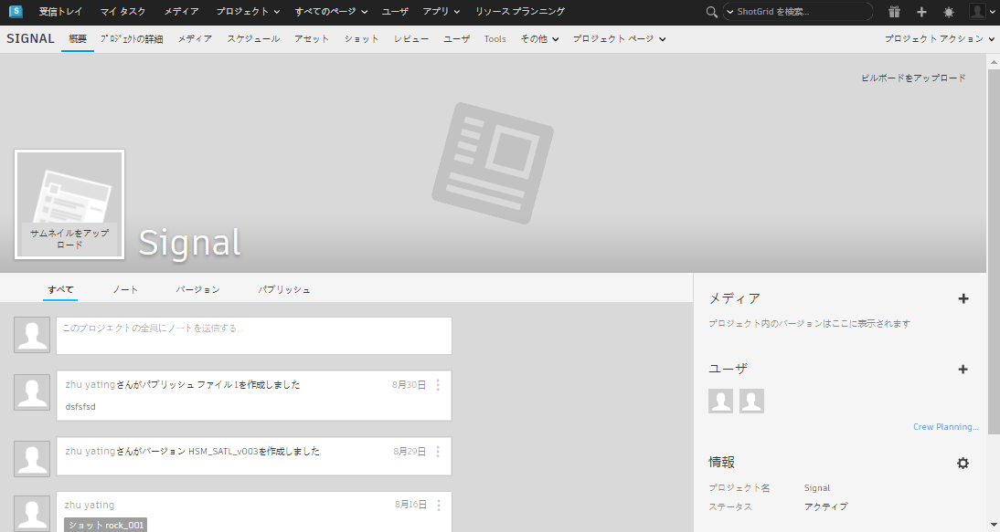

# 設定の基本操作

このガイドを読み終えると、プロジェクト情報を設定に追加するための基本的な知識を習得し、その設定をプロジェクトに関連付けて、パイプライン設定をカスタマイズするための準備を行えるようになります。

## このガイドについて

このガイドでは、 Desktop の**[Advanced Project Setup]ウィザード**を使用して、デジタル コンテンツ作成パイプラインの設定を作成する方法について説明します。短時間で設定ツールを習得し、ウィザードの使用方法を学習して、さらに知識を広げることできます。ウィザードを使用することにより、プロジェクトのパイプライン設定を作成でき、パイプラインの各ステップに対応するように編集、拡張する準備が整います。設定により、プロダクション パイプラインをサポートするために必要なユーザ インタフェース、 アプリ、およびさまざまなツールの特性がコントロールされます。ウィザードを使用することは、設定を拡張するための 1 つの方法にすぎません。ウィザードによってパイプラインの各ステップに具体的な設定が追加されるだけでなく、ソフトウェア アプリケーションとの統合も追加されます。このガイドでは、プロジェクトの設定のベースとして Toolkit の既定の設定を使用します。

このガイドでは、次のユーザを対象としています。

1. [Advanced Project Setup]ウィザードを使用したことがないユーザ
2.  の使用方法に関する基本知識を持っているユーザ
3.  Toolkit を新たに使用するユーザ

### このドキュメントの使い方

このガイドを使用してカスタマイズ可能なプロジェクトの設定を作成するには、以下が必要になります。

1. アクティブな  サイト。[こちらから  に登録](https://www.shotgridsoftware.com/signup/?utm_source=autodesk.com&utm_medium=referral&utm_campaign=creative-project-management)し、30 日間の無償体験版を取得して試してみることができます。
2.  Desktop。Desktop がインストールされていない場合は、[こちらのリンク](https://support.shotgunsoftware.com/hc/ja/articles/115000068574-Integrations-user-guide#Installation%20of%20Desktop)に従ってインストールを開始できます。
3. プロジェクト ファイルおよびパイプライン設定を保存できるファイルシステムへのアクセス権。ファイルシステム上に `Shotgun` というフォルダを作成し、その中に `projects` と `configs` という 2 つのフォルダを作成します。

## [Advanced Project Setup]ウィザードについて

 Desktop の[Advanced Project Setup]ウィザードは、既定の設定に基づいてパイプライン設定を生成します。既定の設定により、パイプライン プロセスをサポートするカスタマイズ可能な設定、アプリ、UI 要素を備えた、構築のための強固な基盤が提供されます。ユーザはプロジェクトのパイプラインに関するニーズに合わせて、このウィザードで作成される設定を編集したり、拡張したりできます。

既定の設定は、次のとおりです。
* ディスク上のファイルの配置場所を決定する、ファイルシステムの基本的なスキーマおよびテンプレート。
* ユーザのソフトウェア アプリケーション内から  およびパイプラインの機能を直接操作できる、サポート対象のすべての[ソフトウェア統合](https://support.shotgunsoftware.com/hc/ja/articles/219039798-Integrations-Apps-and-Engines)。

カスタマイズするには、想像力、賢さ、プログラミング上の知識の他に、 コミュニティ内の他のユーザが作成した作品から借用する能力が必要です。

### 設定を作成する

設定はプロジェクトごとに必要です。 Desktop を介してプロジェクトに初めてアクセスするときに、基本設定がダウンロードされて、設定されます。この基本設定により、ユーザがシステムにインストールしているサポート対象のコンテンツ作成ソフトウェアが自動的に検出され、その設定がプロジェクトに関連付けられます。サポート対象ソフトウェア アプリケーション内の統合は、パイプライン設定内の設定値によって管理されます。[Panel](https://support.shotgunsoftware.com/hc/ja/articles/219033098-Shotgun-Panel) アプリには  のプロジェクト情報が表示されるため、アーティストは作業セッションから移動しなくてもノートに返信し、バージョンを確認することができます。[Publisher](https://support.shotgunsoftware.com/hc/ja/articles/219032998-Publishing-your-work) アプリを使用すると、アーティストはチーム内の他のメンバーに自分の作品を公開することができます。また、[Loader](https://support.shotgunsoftware.com/hc/ja/articles/219033078-Load-Published-Files-) アプリを使用すると、アーティストはチームメイトがパブリッシュしたファイルをロードすることができます。基本設定には、ファイルシステムの管理に関する設定や、ディスク上のファイルおよびフォルダの命名方法を指定するためのテンプレートの開発は含まれていません。また、既定の設定を行ったときに追加された多数のアプリも含まれていません。基本設定は、設定ファイルを手動で編集しなくても Toolkit で実行できるシンプルな設定です。ウィザードを使用すると、基本設定が既定の設定に置き換わります。また、作業中のユーザをサポートするアプリおよびソフトウェアが幅広く統合されます。基本設定を編集することもできますが、プロジェクトを設定してカスタマイズするには、高度な設定を行うことが必要になります。

### 基本設定と既定の設定の違い

| 機能 | 基本設定 | 既定の設定 |
| ------- | ------------------- | --------------------- |
| ダウンロード | プロジェクトにアクセスしたときに自動的にダウンロードされる | [Advanced Project Setup]ウィザードで作成される |
| アクセシビリティ | システムの場所に格納される | 手動で編集可能なファイル形式 |
| 更新 | 自動的に更新 | 手動で更新 |
| ファイルシステムのサポート | ファイルシステム スキーマはサポートされない | フォルダ構造とファイルの命名基準をサポートするためのツールが付属 |
| ソフトウェア統合 | 3ds Max、Houdini、Maya、Nuke、Photoshop、Flame | 基本設定に加えて、Hiero、Motionbulder、Mari |
| Toolkit アプリ |   Panel、Publisher、Loader | 基本設定に加えて、Workfiles、Snapshot、Scene Breakdown、Nuke 書き込みノード、Houdini Mantra ノードなど |

このガイドでは、 Desktop のウィザードを使用し、既定の設定に基づいてプロジェクトのパイプライン設定を生成します。この設定を生成すると、独自のプロダクション パイプラインをサポートするために必要なカスタマイズを実行できるようになります。

## 実習を開始

### 既定の設定の作成準備を行う

**手順 1:**  で「the_other_side」という新しいプロジェクトを作成します。

**手順 2:**  Desktop アプリを起動し、ユーザ名およびパスワードを使用して  サイトからログインします。

**手順 3:** サムネイル イメージを選択して、ウィザードを実行するプロジェクトにナビゲートします。



### 既定の設定にアクセスする

プロジェクトにアクセスし、基本設定をダウンロードして設定しました。また、Publish アプリおよびサポート対象のソフトウェア パッケージが検出されて、 Desktop の**[Apps]**ペインに自動的に追加されました。

**手順 4:** プロジェクトがロードされたら、画面の右下にあるプロファイルの**アバター**を選択します。ポップアップメニューで、**[Advanced project setup...]**を選択して、ウィザードを開始します。

ダイアログ ボックスが開き、[ Default]が選択された状態で 4 つのオプションが表示されます。この時点で、プロジェクトのパイプライン設定のベースを既存のプロジェクトの設定にするのか、GIT リポジトリの設定にするのか、それともディスクのパスにするのかを選択できます。

この演習では**[ Default]** を選択します。このオプションを使用すると、 の既定の設定に基づいてプロジェクトのパイプライン設定が作成されます。

**手順 5:** **[Continue]**を選択します。

ダイアログ ボックスが開き、**[Default]**が選択された状態で 2 つのオプションが表示されます。この時点で、[Legacy Default]設定オプションを選択することができます。この設定は、まだ以前のバージョンの  を使用しているスタジオのために、以前のバージョンの Shotgun の設定を継承しています。この演習では[Default]を使用します。

**手順 6:** **[Continue]**を選択します。

### プロジェクト ファイルの保存場所を定義する

ダイアログ ボックスが開き、`Storage:` という単語の横にドロップダウン メニューが表示されます。

**手順 7:** このプロジェクトのプロジェクト データの保存場所を識別します。ダイアログ ボックスの上部にあるドロップダウンで**[+ New]**を選択し、フィールドに「**projects**」と入力します。

  Toolkit では、Linux、Mac、Windows の 3 つのオペレーティング システムをサポートしています。

**手順 8:** プロジェクト データを保存するのに利用するオペレーティング システムの横にあるフィールドを選択します。フォルダ アイコンを選択し、この演習の前にファイルシステム上に作成したプロジェクト フォルダにナビゲートします。

この設定の場合、 からアクセスできるのは、プロダクション データを保存するために識別されたフォルダに限定されます。この演習の準備中に、 のルート ディレクトリ内に `projects/` ディレクトリを追加しました。`projects/` ディレクトリには、プロジェクトに関連するローカルな情報が格納されます。

**手順 9:** **[Save]**を選択して、プロジェクト データの保存先としてプロジェクト フォルダを識別します。

オペレーティング システムのパスが自動的に更新されて、プロジェクト データの保存場所が識別されます。

**手順 10:** **[Continue]**を選択します。

### プロジェクト フォルダに名前を付ける

ダイアログ ボックスが表示され、プロジェクトの名前がテキスト フィールドに入力されます。この名前はプロジェクトの情報から自動的に入力され、パスは自動的に更新されます。

Toolkit は、2 つのいずれかの設定で機能します。パイプライン設定が  にアップロードされ、ユーザごとにローカルにキャッシュされる分散設定(Distributed Setup)と、ディスク上の共有場所に保管された単一の設定にユーザがアクセスする中央設定(Centralized Setup)です。この演習では分散設定を使用します。分散設定の詳細については、[こちら](https://developer.shotgridsoftware.com/tk-core/initializing.html#distributed-configurations)を参照してください。

最後の手順では、該当するフォルダ、ファイル、およびプロジェクトに固有の設定を作成するために必要なデータを生成します。

**手順 11:** 該当するオペレーティング システムの**[Browse...]**を選択し、この演習の準備中に作成した設定フォルダ `configs` にナビゲートして、プロジェクト名として「**the_other_side**」と入力します。プロジェクト設定が保存されるフォルダが作成されます。**[Run Setup]**を選択して、セットアップが完了するまで待ちます。

**手順 12:** **[Done]**を選択します。プロジェクト ウィンドウに入力するアイコンが表示されます。

**ヒント:** アプリをメニュー バーに固定すると、 Desktop にすばやくアクセスできるようになります。**アバター**を選択して、**[Pin to Menu]**を選択します。

これでプロジェクトの設定は完了です。指定した場所にプロジェクトの Toolkit パイプライン設定が保存され、カスタマイズを開始できるようになりました。

`configs` フォルダを調べると、いくつかのフォルダとファイルが配置されています。内容を調べてみましょう。

ここからの作業は、設定で実行できるすべての操作について楽しみながら学習することができます。次に、これから調べる高度なトピックをいくつか示します。

## 高度なトピック

  Toolkit では、さまざまな方法で設定の編集、クローン作成、またはやり直しを行うことができます。既存の設定を拡張することにより、作業時間を短縮し、ネットワーク内の他のユーザが作成したすべての便利なツールにアクセスできます。広大な [ のコミュニティ](https://groups.google.com/a/shotgunsoftware.com/forum/?fromgroups&hl=ja#!forum/shotgun-dev) を利用して、必要な設定を取得することができます。 のコミュニティは共有コミュニティです。そのため、他のユーザに対して親切に対応し、感謝を示し、あなたのジョブに役立つ設定を作成してくれたユーザに賞賛の念を示すことが大切です。そして「お返し」をすることを忘れてはいけません。それこそが  の仲間をサポートし、このコミュニティへの参加が特別なことであることを示す理由なのです。

次に、設定による楽しみ方の例をいくつかを示します。

### コマンド ラインを使用して既定の設定を作成する

いずれかのプロジェクト設定内で `tank` コマンドを使用すると、端末から管理コマンドを実行できます。各プロジェクトには専用の `tank` コマンドがあります。`tank setup_project` コマンドの機能は、[Advanced Setup Wizard]の機能と似ていて、既存のプロジェクトの設定や既定の設定に基づいて、プロジェクトで使用される編集可能な設定をディスク上に作成することができます。`tank setup_project` の実行方法については、[こちら](https://support.shotgunsoftware.com/hc/ja/articles/219033178#setup_project)を、`tank` コマンドの詳細については、[ こちら](https://support.shotgunsoftware.com/hc/ja/articles/219033178#Using%20the%20tank%20command)を参照してください。

### プロダクション中に設定を編集する

現在プロダクションで使用している設定を変更する必要があっても、アーティストが使用している間は編集したくない場合があります。 には、コマンドをいくつか実行するだけで既存の設定をコピーできる機能があります。この機能を使用すると、プロダクション環境に送信する前に変更内容について安全にテストすることができます。このプロセスを行うと、プロダクションの設定が新しい設定に置き換えられ、古い設定が自動的にバックアップされます。

設定のコピーを操作する必要があるのは、次の理由からです。

1. 設定を更新する
2. 実行する前にいくつかの変更をテストする
3. 一部のアプリをアップグレードまたは追加する
4. テスト後に開発を行って、展開する

設定のクローン作成方法、および設定管理に関するその他の基本情報については、「[
設定のステージングとロールアウト](https://support.shotgunsoftware.com/hc/ja/articles/219033168#Cloning%20your%20Configuration)」を参照してください。

### パイプライン設定のクラウドへの分散

このガイドでは、**中央設定**の作成方法について説明します。中央設定とは、ネットワーク上の共有場所に配置されていて、すべてのユーザがアクセスできるパイプライン設定の単一コピーのことです。従業員が複数の場所およびネットワークに分散している場合は、パイプライン設定の単一コピーを共有できないことがあります。Toolkit は**分散設定**オプションを提供することによってこのシナリオを可能にします。すなわち、パイプライン設定を  にアップロードして、ユーザがプロジェクトにアクセスするたびに設定がダウンロードされ、ローカルにキャッシュされます。分散設定の詳細については、[Core API 開発者向けドキュメント](https://developer.shotgridsoftware.com/tk-core/initializing.html#distributed-configurations)を参照してください。

### 複数のルート フォルダを操作する

理想的なのは、特定のタスクに合わせて施設を最適化することです。複数のルート フォルダを使用すると、1 台のサーバで日常業務を行い、もう 1 台のサーバでインタラクティブな処理を行うようビデオの再生を最適化することができます。Toolkit では複数のストレージのルートを操作し、上記のようなワークフローを容易に実行することができます。[単一ルート設定からマルチルート設定への変換方法](../../../quick-answers/administering/convert-from-single-root-to-multi.md)を確認してください。

これで、プロジェクトのパイプライン設定が作成されたので、編集してみましょう。詳細については、次のガイドの「[パイプライン設定の編集](editing_app_setting.md)」にアクセスしてください。
