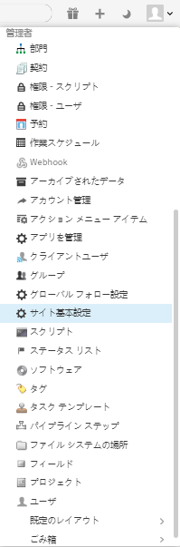
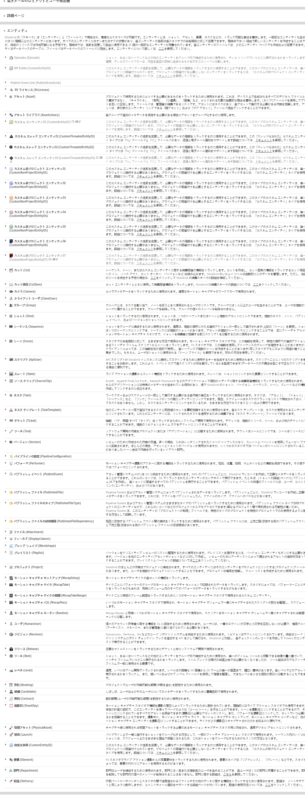
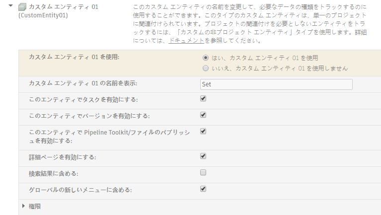
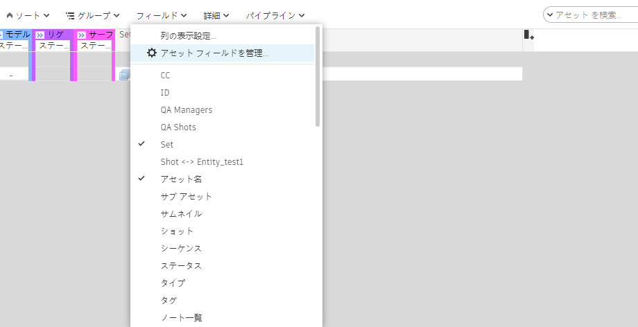
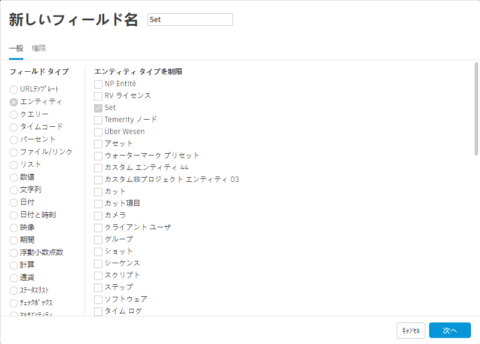
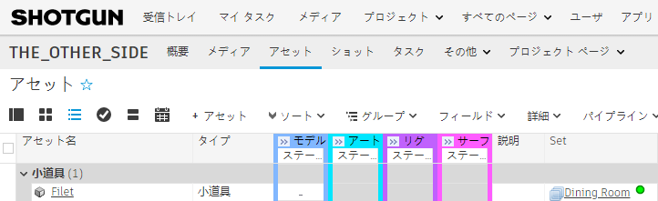
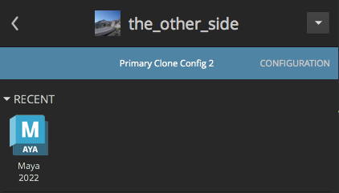
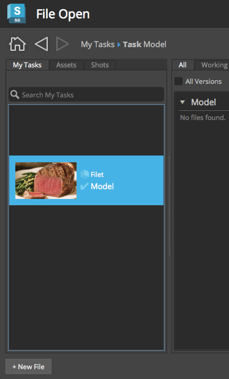
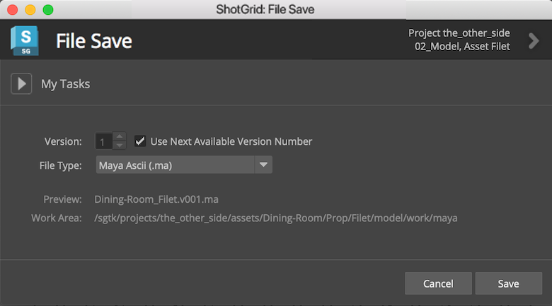

# 動的ファイルシステムの設定

このガイドでは、Toolkit パイプライン構成を変更してプロダクションのフォルダ構造とファイル命名をカスタマイズする方法について学びます。

## このガイドについて

パイプラインを管理する上で最も難しいことの 1 つは、作成される無数のファイルをトラックすることです。Toolkit のパイプラインはファイルシステム管理を自動化します。すなわち、 のデータおよび設定されたフォルダ構造に基づいてフォルダを作成し、標準の命名規則に従って正しい場所に自動的にファイルを書き込みます。そのためアーティストはコンテンツ作成に集中できます。パイプライン設定には、既定のフォルダのセットとファイル命名規則がありますが、プロダクションではそれらをカスタマイズすることがよくあります。このガイドは、それらのカスタマイズに必要な知識を提供します。

既定の設定では、アセットは `asset_type/asset/pipeline_step` のようなフォルダ構造で管理されます。このガイドでは、「Set」と呼ばれるカスタム エンティティを使用して、各アセットが使用されるプロダクション セット別にアセットを整理します。最初に  でカスタム エンティティを設定し、それを使用して特定のセット用に作成されたアセットを管理します。その結果、フォルダ構造は `set/asset_type/asset/pipeline_step` のようになります。

セットによってアセットを整理することの背景にある考え方を、例を挙げて説明してみましょう。たとえば、いくつかのシーンがガレージで発生し、別のシーンがダイニング ルームで発生するプロジェクトがあるとします。このセットアップでは、「wrench」、「oilcan」、「workbench」などのアセットのファイルは「garage」フォルダに整理され、「plate」、「winebottle」、または「tablecloth」は「dining_room」フォルダに整理されます。この例では、ダイニング ルームに肉汁たっぷりの「filet」アセットが適切に配置されていることを確認します。

さらに、プロジェクトのファイル命名テンプレートも編集し、アセットの Maya ワーク ファイルにセットがそれぞれの名前で含まれるようにします。動的に生成されるファイル名により、ダイニング ルームのファイルを他のセットで使用されるファイルと区別できるようになります。

### このガイドの次の 3 つの手順

*  で、「Set」とよばれる**カスタム エンティティ**を作成します。これは、アーティストが作成しているダイニング ルームの要素と関連付けるために使用します。
* フォルダの**スキーマ**を編集します。これによって、Toolkit はフォルダ構造内の現在のセットに基づいて動的に名前が付けられたフォルダを含めることができます。
* アセット ワーク ファイルの命名に使用される**テンプレート**を編集します。これによって、Toolkit はファイル名に関連付けられたセットの名前を含めることができます。

### 前提条件

このガイドを使用するには、以下が必要です。

1. アクティブな [](https://www.shotgridsoftware.com/signup/) サイト。少なくとも 1 つのアセットが作成されたプロジェクトが必要です。アセットにはモデル タスクが必要です。
2.  サイトを使用してアセットを管理する方法の基本的な理解。
3. システムにインストールされた [ Desktop](https://support.shotgunsoftware.com/hc/ja/articles/115000068574-Integrations-user-guide#Installation%20of%20Desktop)。
4. 指定したプロジェクトのクローン作成されたパイプライン設定、または「[設定の基本操作](./advanced_config.md)」ガイドを参照して、この演習で作成された設定のクローンを作成します。
5. YAML の基本的な知識。
6. パイプライン設定を保存するファイルシステムに最適になるように設定された読み取りおよび書き込み権限。
7. Toolkit がプロダクション ファイル システムに対して読み取りおよび書き込みを行えるように適切に設定された読み取りおよび書き込み権限。
8. Maya の有効なサブスクリプション。[Maya](https://www.autodesk.co.jp/products/maya/free-trial) の 30 日間無償体験版を入手してください。



### ファイル スキーマとテンプレートについて

Toolkit パイプライン設定のスキーマとテンプレートを使用すると、 データを利用してディスク上のプロダクション ファイルを管理できます。既定の設定のスキーマには、**Shot**、**Sequence**、**Asset**、**Asset Type** などのエンティティが含まれています。その他の **Level**、**Episode**、**Season** などのエンティティ、または今回使用する **Set** などのカスタム エンティティを追加できます。

Toolkit プラットフォームでは**スキーマ**を使用してフォルダ構造を動的に構築できます。これは、実際のプロダクション ファイルシステムを構築するときのテンプレートとして使用されるプロダクション フォルダ構造のミニチュア バージョンです。スキーマはフォルダの動的作成のための明示的なガイドで、YAML ファイルを使用して動的に作成されるフォルダのルールを定義します。既定の設定には、アセットとショットの両方のパイプラインのフォルダ作成をサポートする事前設定されたスキーマが含まれています。作成している新しい **Set** エンティティのサポートを追加するために、アセット フォルダ構造の作成をサポートするスキーマの部分 `/assets/<asset_type>/<asset>/<step>` を変更します。

**テンプレート**を使用すると、 のデータとスキーマ構造の情報を使用して作成したファイルに動的に名前を付けて保存することができます。既定の設定には、パイプラインのニーズに合わせて編集できる一連のスタータ テンプレートが用意されています。



## 実習を開始

スキーマとテンプレートをカスタマイズすることで、ダイニング ルームのセットの作成時に生成されるファイルを動的に管理できます。それらのファイルとはすなわち、食器一式、蒸し上がったフィレ ミニヨン、Penfolds Grange Hermitage 1951 のワイン、ポテト グラタン、レモン ガーリック風味のアスパラガスなどです。ダイニング ルームのセットで使用されるアセットは「Dining Room」という Set エンティティに関連付けられ、より簡単に管理できるようになります。Set は 既定の設定に標準装備されたエンティティ タイプではないため、[カスタム エンティティ](https://support.shotgunsoftware.com/hc/ja/articles/114094182834-Enabling-a-custom-entity)を有効にし、それに「Set」という名前を付けてからスキーマおよびテンプレートを拡張して使用する必要があります。

### カスタム エンティティを有効にする

**手順 1:** ブラウザで  サイトを開きます。アバターをクリックして、[管理者] (ADMIN)> [サイト基本設定](Site Preferences)の順にクリックします。結果のページで**[エンティティ] (Entities)**セクションを展開します。



 で利用可能なエンティティのタイプのリストが表示されます。下図のリストの一番上には、現在の  サイト用に構成されているいくつかのエンティティ タイプが示されています。これらのエンティティ タイプの下には、設定も有効化もされていないいくつかの**カスタム エンティティ**があります。

### カスタム エンティティ タイプをどれか選択して設定し、有効にします。



**手順 2:** 矢印を選択してグレー表示の無効なカスタム エンティティの設定を開きます。**[はい、カスタム エンティティを使用します...](Yes, use Custom Entity...)**の横のラジオ ボタンをオンにし、**[表示名](Display name)**を **Set** に変更し、ウィンドウの上部にスクロールして[変更を保存](Save Changes)を選択します。



これによって、カスタム エンティティが  でアクティブになり、表示名が *Set* になります。エンティティのシステム名は `CustomEntity01` のままなので、基本的にここではカスタム エンティティの別名を作成していることになります。この例では、`CustomEntity01` を使用していますが、別のカスタム エンティティを使用することもできます。



### アセットをセットに関連付けるデータ フィールドを追加します。

アセット エンティティにデータ フィールドを追加すると、アセットを新しいエンティティにリンクできます。アーティストがダイニング ルーム用に作成したアセットは、**Dining Room** セット エンティティに関連付けられます。

**手順 3:** ページ上部の**[プロジェクト] (Projects)**ドロップダウンを選択して、この実習に使用するプロジェクトを開きます。

**手順 4:** プロジェクト メニュー バーで**[アセット] (Assets)**を選択し、[アセット] (Assets)ページに移動します。[アセット] (Assets)メニューで、**[フィールド] (Fields)> [アセット フィールドの管理...](Manage Asset Fields...)**を選択します。



このアクションはアセット フィールド管理者を表示します。


**[+ 新しいフィールドを追加](+ Add a new field)**を選択します。

新しいフィールドのパラメータを選択します。

**[新しいフィールド名](New Field Name)**に「Set」と入力します。**[一般] (GENERAL)**メニューの**[フィールド タイプ](Field Type)**で、**[エンティティ] (Entity)**を選択し、**[タイプを制限](Restrict the type)**までスクロールダウンして、**Set** を選択します。**[次へ] (Next)**を選択します。



このガイドでは、**[現在のプロジェクトのみ](Only the current project)**に適用し、**[フィールドを作成](Create Field)**を選択します。

  は新しいフィールドを設定します。


変更が適用されたら、**[完了] (Done)**を選択します。

### **[ダイニング ルーム](Dining Room)**の Set エンティティを作成する

**手順 5:** アセットの新しい **Set** フィールドを選択して、「Dining Room」と入力します。すると、「**一致するものが見つかりません。「Dining Room」を作成**」というメッセージが表示されます。


**[「Dining Room」を作成]**を選択します。


**[セットを作成](Create Set)**を選択します。

アセットの Set フィールドに **Dining Room** と追加したことにより、Dining Room セット エンティティとの[関連付け](https://support.shotgunsoftware.com/hc/ja/articles/115000010973-Linking-a-custom-entity)が生成されます。



**手順 6:** **filet** アセットのモデル タスクを自分自身に割り当てて、テスト目的で簡単に見つけられるようにします。

### スキーマを設定する

これで、Set カスタム エンティティが有効になり、「Dining Room」と呼ばれる Set エンティティが作成され、Asset エンティティがダイニング ルームのセットにリンクされました。 サイトにすべての要素が配置されたので、フォルダ構造の変更を開始できます。アーティストがタスクでの作業を開始すると、Toolkit は関連付けられた  のデータを使用してファイルシステムに作成するフォルダを決定します。パイプライン設定のスキーマに基づいて、新しいフォルダが作成され、自動的に名前が付けられます。

次に、アーティストがプロダクション パイプラインを実行する際に Toolkit が動的に生成するフォルダ構造を定義します。これは、スキーマを編集することで実行されます。

{% include info title="注" content="アクティブなプロダクションの設定に影響を与えないように、*クローン作成*された設定でテストすることをお勧めします。クローン作成プロセスでは設定の*コピー*が作成され、安全な環境で編集してからライブ設定に変更をプッシュすることができます。設定のクローン作成の詳細については、『[設定のステージングとロールアウト](https://support.shotgunsoftware.com/hc/ja/articles/219033168-Configuration-staging-and-rollout#Cloning%20your%20Configuration)』ドキュメントを参照してください。" %}

**手順 7:** パイプライン設定に移動します。スキーマ フォルダ `<pipeline_configuration_root>/config/core/schema` にドリル ダウンして、`project` フォルダを開きます。


現在のスキーマは、次のようになります。

`<project>/assets/<asset_type>/<asset>/<step>`

このフォルダ構造の動的作成をサポートします。

`the_other_side/assets/prop/filet/model`

代わりに次のような構造にします。

`the_other_side/assets/Dining-Room/Prop/filet/model`

これを実現するには、スキーマを次のように設定します。

`<project>/assets/<CustomEntity01>/<asset_type>/<asset>/<step>`

Set エンティティは `CustomEntity01` として表されます。 で CustomEntity01 に Set という*表示名*を付けましたが、この構成では常にそのシステム名 `CustomEntity01` でこれを参照します。

### スキーマが YAML ファイルを使用する方法

スキーマには静的フォルダと動的フォルダを含めることができます。スキーマに「assets」という名前の静的フォルダがある場合、それはプロダクション ファイルシステム内の「assets」という名前の単一のフォルダに対応します。一方、スキーマには「asset」という名前の動的フォルダがあり、これはプロジェクト内の各アセットに対する単一のフォルダを表します。すべての動的フォルダには、その隣に、フォルダと同じ名前の YAML ファイル(たとえば `asset/` および `asset.yml`)があり、スキーマ フォルダに基づいてプロダクション フォルダを生成するためのルールが定義されています。

### Set エンティティの新しいフォルダと YAML ファイルを作成します。

スキーマには、 が追跡するさまざまなエンティティに関連するフォルダを含む `project` フォルダがあります。 が Set 内のアイテムをトラックできるようにするために、新しいアセット エンティティ CustomEntity01 を追加します。これらのアイテムはアセットなので、アセットの下のフォルダと YAML ファイルを編集します。

繰り返しますが、目標は `asset_type/asset/step` フォルダ構造から `set/asset_type/asset/step` に移動することです。そこで、スキーマ内のセットを表すフォルダを、対応する YAML ファイルと共に追加します。カスタム エンティティにはシステム名を使用する必要があるので、`CustomEntity01/` フォルダと `CustomEntity01.yml` を作成します。

**手順 8:** スキーマの `project/assets` フォルダ内に `CustomEntity01` フォルダを追加します。


**手順 9:** 以下の内容で、`CustomEntity01` フォルダの隣に `CustomEntity01.yml` という名前のファイルを作成します。

```yaml
type: "shotgun_entity"

name: "code"

entity_type: "CustomEntity01"

filters:
    - { "path": "project", "relation": "is", "values": [ "$project" ] }
```

YAML ファイルは、`CustomEntity01` フォルダに付ける名前を Toolkit に指示します。この場合は、タイプ `_entity` のフォルダを作成しています。これは、 クエリに対応していることを意味します。`entity_type` フィールドは  の `CustomEntity01` エンティティをクエリするように指示し、`name` フィールドはエンティティのどの*フィールド*をクエリするのかを指示します。この場合は `CustomEntity01` から `code` フィールドを取得します。

`filters` フィールドは、この動的フォルダを作成する必要があるケースを制限します。

**手順 10:** `asset_type/` と `asset_type.yml` を `CustomEntity01` フォルダに移動します。

フォルダ構造を `Dining-Room/Prop/filet` のようにしたいので、`asset_type` フォルダは階層内の `CustomEntity01` フォルダよりも*下に*にする必要があります。`asset_type/` と `asset_type.yml` を `CustomEntity01` フォルダに移動します。


### asset.yml ファイルを編集します。

`filters` フィールドは、特定の時点でどのエンティティにフォルダを作成するかを制限します。現在の状態では、`asset.yml` のフィルタ フィールドは次のようになります。

```yaml
filters:
    - { "path": "project", "relation": "is", "values": [ "$project" ] }
    - { "path": "sg_asset_type", "relation": "is", "values": [ "$asset_type"] }
```

アセットのフォルダを作成するときは、正しいプロジェクト フォルダと正しいasset_type フォルダが選択されていることを確認する必要があります。セットのフォルダを追加したので、3 番目のフィルタを追加します。追加しないと、次のようなフォルダとなり、これはもちろん正しくありません。

```
assets/Dining-Room/Prop/spoon
assets/Garage/Prop/spoon
assets/Classroom/Prop/spoon
```
これを防ぐために、3 番目のフィルタを追加します。これにより、アセットのフォルダは正しいセットのフォルダにのみ作成されるようになります。

**手順 11:** `asset.yml` の `filters` フィールドを次のように変更します。

```yaml
filters:
    - { "path": "project", "relation": "is", "values": [ "$project" ] }
    - { "path": "sg_asset_type", "relation": "is", "values": [ "$asset_type"] }
    - { "path": "sg_set", "relation": "is", "values": [ "$CustomEntity01" ] }
```


## フォルダ作成のテスト

これで、アセットを Set カスタム エンティティで整理するためにスキーマが正しく修正されました。それでは、テストしてみましょう。

フォルダは、Toolkit パイプライン ワークフローのいくつかの時点で作成されます。

* **アプリケーション ランチャー**： ユーザがタスクの DCC を起動するたびに、Toolkit はそのタスクのディレクトリを作成します(まだ作成されていない場合)。Toolkit ではまず最初に DCC の起動を行う傾向があるので、通常はこの方法でディレクトリが作成されます。これは、 の右クリック メニュー、または  Desktop あるいは Create アプリで実行できます。
* **  メニュー**: タスク用のフォルダを作成する最も直接的な方法は、 で右クリックして[フォルダを作成](Create Folders)メニュー項目を選択することです。
* **Toolkit API**: Toolkit API を介して直接ディレクトリ作成ロジックを起動できます。この方法によって、Toolkit をカスタム ランチャーにプラグインしたり、 で作成される Shot のディレクトリを自動的に作成するためのワークフローのイベント トリガとして使用することができます。
* **tank コマンド**:  のメニュー項目と同様、`tank folders` ターミナル コマンドからもタスク用のフォルダを作成できます。

`tank` コマンドでテストします。

**手順 12:** `filet` アセットで `tank folders` を実行します。ターミナルで、以下を実行します。

```
> cd <pipeline_configuration_root_folder>
>  ./tank Asset Filet folders
```

出力の要約:

```
----------------------------------------------------------------------
Command: Folders
----------------------------------------------------------------------

Creating folders, stand by...

The following items were processed:
 - /Users/michelle/Documents/Shotgun/projects/the_other_side
. . .
 - /Users/michelle/Documents/Shotgun/projects/the_other_side/assets/Dining-Room
 - /Users/michelle/Documents/Shotgun/projects/the_other_side/assets/Dining-Room/Prop
 - /Users/michelle/Documents/Shotgun/projects/the_other_side/assets/Dining-Room/Prop/Filet/
 - /Users/michelle/Documents/Shotgun/projects/the_other_side/assets/Dining-Room/Prop/Filet/model
 - /Users/michelle/Documents/Shotgun/projects/the_other_side/assets/Dining-Room/Prop/Filet/model/publish
. . .

In total, 23 folders were processed.
```

最終的な構造が期待した構造と一致し、Toolkit が非常にスマートになり、「Dining」と「Room」の間にダッシュが追加されています。

`/the_other_side/assets/Dining-Room/Prop/Filet/model`


### ファイルを読み書きするための Toolkit テンプレート

フォルダ構造を設定したので、次のステップで*テンプレート*を編集します。プロダクション ファイルに適切な名前を付け、作成後に正しいフォルダに配置します。

### Toolkit アプリがテンプレートを使用する方法

まず、 でアセットをセットに関連付ける方法を作成しました。すなわち CustomEntity01 がセットを表すようにして、Asset エンティティにアセットとセットの間のリンクを表すリンク フィールドを追加しました。アセットとセット間の関係を確立したら、その関連付けを使用するようにフォルダ スキーマを設定し、すべてのアセットの*フォルダ*をその関連付けられたセットのフォルダ内に配置します。次に、*ファイル*に動的に名前を付ける方法を作成し、Toolkitアプリ でファイルを自動的に管理できるようにします。

アーティストがプロジェクト内のタスクを実行し始めると、必要なフォルダ構造が生成されます。その後、Workfiles アプリの**[File Save]**アクションを開始すると、ファイルに自動的に名前が付けられます。Toolkit の Workfiles アプリを通じてアクセスされるテンプレートは、そのファイルに名前を付けるために使用されます。Nuke Write ノードや Houdini Mantra ノードなどのレンダリング アプリは、パブリッシュ ファイル用のパブリッシャー アプリと同様に、テンプレートを使用してレンダリングされたファイルに名前を付けて保存します。

Workfiles の**[File Open]**アクションを使用してファイルにアクセスすると、テンプレートを使用してロードする適切なファイルが検索されます。Publisher、Loader、および Nuke Studio Export の各アプリも、テンプレートを使用してファイルを検索および管理します。アーティストはファイル名や場所を気にする必要はありません。Toolkit がテンプレートおよび実行されているタスクに基づいてそれらをすべて管理します。

テンプレートは設定ファイル `/<pipeline_configuration_root>/config/core/templates.yml` によって管理されます。最後の 2 つのガイドでは、作業環境に固有の設定を管理および作成しました。スキーマとテンプレートの設定は `config/core` フォルダに格納されており、環境に固有のものではありません。すべてのテンプレートは単一のファイルに格納されますが、それらはさまざまな環境設定ファイルのアプリ設定で、このファイルから参照されます。たとえば、`template_work` は、ワークファイルに使用する `templates.yml` のテンプレートを指定する Workfiles アプリの設定です。ワークファイルが構成されている環境およびエンジンに応じて、この設定を使用して `maya_shot_work` テンプレートまたは `templates.yml` の `houdini_asset_work` テンプレートを参照することができます。

**手順 13:** パイプライン設定で `config/core/templates.yml` を開きます。

このファイルは 3 つのセクションに分かれています。

* **キー:** トークンのセット(`{version}`、`{Asset}` など)。テンプレートを構築するために使用されます。テンプレートが使用されると、実際の値に置き換えられます。各キーには、必須の名前とタイプ、およびオプションのパラメータがあります。
* **パス:** キーを使用してディスク上のフォルダおよびファイルへのパスを表す名前付き文字列。`paths` セクションのテンプレートは検証済みで、実際にディスク上に存在する必要があります。
* **文字列:** パス セクションと似ていますが、これらは任意のテキストのテンプレートです。パス セクションの項目は検証済みで、ディスク上の実際のパスと対応している必要がありますが、Toolkit ワークフローで参照するテキスト データを格納するために文字列を使用できます。

### Set エンティティのテンプレート キーを追加する

最初に行うことは、エンティティのシステム名を使用して、Set エンティティの新しいキーを定義することです。

**手順 14:** 適切なインデントを使用し、`templates.yml` の `keys` セクションに次の行を追加します。

```yaml
       CustomEntity01:
           type: str
```

### テンプレートを修正する

Toolkit がファイルを読み書きする場所はテンプレートが定義するので、ここで定義するパスがスキーマで定義されているフォルダ構造と一致することが重要です。最終的に、プロダクション ファイルは現在作成しているファイルシステムに配置されます。そこで、スキーマに定義した新しいフォルダ構造に合わせて、アセット関連のテンプレートをすべて変更します。

次に、Maya のアセット ステップで作業ファイルのテンプレートを変更し、ファイル名にそのセットも含めるようにします。既定の設定では、該当のテンプレートは `maya_asset_work` で、ここから開始します。



**手順 15:** `templates.yml` を開いて、`maya_asset_work` を検索します。

```yaml
   maya_asset_work:
        definition: '@asset_root/work/maya/{name}.v{version}.{maya_extension}'
```

`maya_asset_work` の `definition` 値は `@asset_root` で始まります。`@` 記号は、`@asset_root` の値が他の場所で定義されていることを意味します。



統合ごと、アプリごと、環境ごとに異なる設定を使用できるので、`templates.yml` 内のさまざまな場所でパスの最初の部分が使用される可能性があります。構成は、単一の変数を使用して共通のパス ルートを格納し、テンプレート内でその変数を参照できるように設定されます。共通ルートを参照できる場合は、パス生成設定の各インスタンスを変更する必要はありません。

既定の設定には、`@shot_root`、`@sequence_root`、および `@asset_root` の 3 つの共通ルート変数があります。`@asset_root` を変更します。この変更はすべてのアセット関連のテンプレートに影響します。

### ファイルシステム スキーマのパスと一致するようにテンプレートを編集します。

**手順 16:** `templates.yml` の `paths` セクションの上部にある `asset_root` を検索します。既定の設定では、次のようになります。

`asset_root: assets/{sg_asset_type}/{Asset}/{Step}`

スキーマの変更に一致するように `asset_root` パスに `CustomEntity01` を追加します。

`asset_root: assets/{CustomEntity01}/{sg_asset_type}/{Asset}/{Step}`

### ファイル名にセットを追加する

スキーマの変更を反映するようにファイルのフォルダ構造を変更したため、ファイルの読み込み/書き出しは適切な場所で行われます。では、Maya のアセット ワークファイル テンプレートの*ファイル名*を変更して、そのセットも含めるようにします。

`maya_asset_work` テンプレート定義をもう一度見つけます。現在の状態では、ファイル*名*は以下です。

`{name}.v{version}.{maya_extension}`

`{name}` テンプレート キーは、Workfiles アプリの[File Save]アクションでのユーザ入力を表す特別なキーです。ユーザの入力は含まれず、現在のセットとアセットだけで構成されるようにテンプレートを変更します。

**手順 17:** `maya_asset_work`テンプレート定義を次のように変更します。

```yaml
    maya_asset_work:
        definition: '@asset_root/work/maya/{CustomEntity01}_{Asset}.v{version}.{maya_extension}'
```

このアクションにより、ファイル名に Dining-Room エンティティの適切な名前を使用できます。結果は次のようになります。`Dining-Room_Filet.v1.mb`

`templates.yml` が変更され、プロダクション フォルダ構造に新しいセット フォルダが反映され、Maya のアセット タスクのワークファイルにセットの名前が含まれるようになりました。変更をテストしましょう。

### テストの実行

**手順 18:**  Desktop から Maya を起動します。



Maya で、**[] > [ファイルを開く](File Open)**に移動し、表示されるダイアログで、 で Set を指定したアセットのタスクを選択します。



**[+ 新しいファイル](+New File)**を選択します。

単純な 3D オブジェクトを作成するか、**[] > [ファイルを保存](Save File)**を使用してファイルを保存することができます。



成功しました!

テンプレートの新しい設定を使用して、**[File Save]**ダイアログボックスに**プレビュー：Dining-Room_scene.v001.ma**が表示されていることに注意してください。

**Work Area**: Workfiles がファイルを保存するパスとして **...//projects/the_other_side/assets/Dining-Room/Prop/Filet/model/work/maya** を表示します。

## 高度なトピック

### 例を拡張する

この例では 1 つのテンプレートを変更しましたが、ファイルシステムの設定については他にもさまざまな操作を実行できます。現実の例では、*すべての*アセット関連のファイルを同じファイル命名規則に従うように変更します。他のエンティティ(Season、Episode、Level など)に基づいて変更を加えたり、ユーザ フォルダを作成したり、正規表現で操作した  のデータに基づいてフォルダに名前を付けたりすることができます。Toolkit のすべてのフォルダおよびスキーマ オプションについては、『[ファイル システム設定リファレンス]( https://support.shotgunsoftware.com/hc/ja/articles/219039868 )』を参照してください。

### パス キャッシュ

フォルダ作成時に、ディスク上のフォルダと  エンティティの間にマッピングが作成されます。これらのマッピングは  の FilesystemLocation エンティティとして保存され、ユーザのマシンの SQLite データベースにキャッシュされます。パス キャッシュの機能とその使用方法の詳細については、[このドキュメント](../../../quick-answers/administering/what-is-path-cache.md)を参照してください。


### その他のリソース

* 『[ファイル システム設定リファレンス](https://support.shotgunsoftware.com/hc/ja/articles/219039868)』
* [Toolkit 設定紹介のウェビナー ビデオ](https://www.youtube.com/watch?v=7qZfy7KXXX0&t=1961s)

