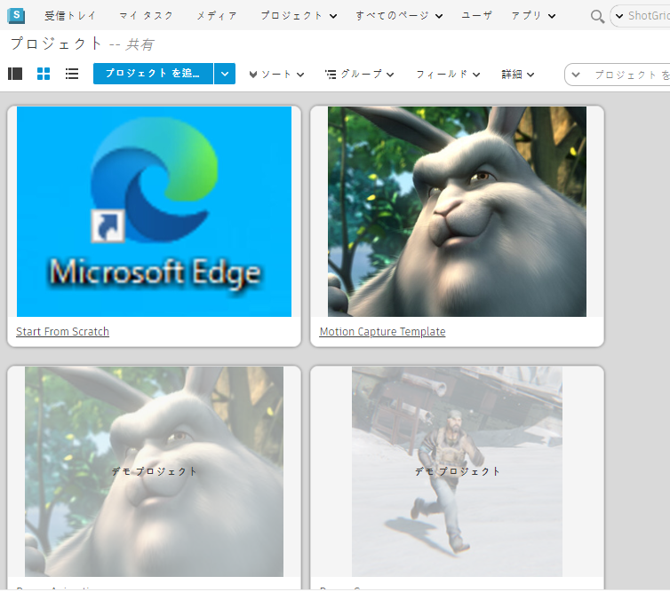

# パイプライン設定を編集する
このガイドを読み終えると、以下に関する基本的な知識を習得できます。

* 特定の Toolkit アプリの構成設定を見つける
* 設定を編集する
* 構成設定によって拡張できるその他の機能を調べる

## このガイドについて

このガイドでは、プロジェクト パイプラインの要求に応じて、既存のパイプライン設定内の設定を編集する方法について説明します。最初のガイドの「**設定の基本操作[](./advanced_config.md)**」では、パイプライン設定を編集するための準備方法について説明しました。プロジェクトに対して編集可能な設定を作成する方法を理解していない場合は、「**設定の基本操作**」を参照してから、先へ進んでください。

 Toolkit では、既定の設定を拡張することにより、パイプラインのワークフロー内のタスクをカスタマイズできます。カスタマイズの例としては、ユーザが Toolkit の機能を操作する方法を変更するために、いくつかのソフトウェア パッケージに含まれている Toolkit アプリのボタンを有効または無効に切り替えるだけという簡単なものがあります。Toolkit には独自の設定を行う機能があるため、カスタム ワークフローの作成、反復タスクや日常的なタスクの自動化、フックの変更、および Toolkit プラットフォーム上に構築されたカスタム ツールの追加といった作業を、スマートに、かつ短時間で行うことができます。ただし、Toolkit にアクセスするには  ソフトウェアの統合が必要であり、衣服を洗うなどの日常的なタスク向けのリリースはまだ実現していません。

このガイドの演習では、 ソフトウェア統合内のアクションをコントロールする構成設定の見つけ方、設定の配置場所、および設定の編集方法について説明します。具体的には、**[+New Task]**ボタンの動作を管理する Workfiles アプリの設定を編集することにより、アーティストが Maya 内のプロジェクトで作業しているときに新しいタスクを作成できないようにします。

## このドキュメントの使い方

このガイドを使用してパイプライン設定を編集するには、以下が必要です。

1. アクティブな [](https://www.shotgridsoftware.com/signup/?utm_source=autodesk.com&utm_medium=referral&utm_campaign=creative-project-management) サイト。
2. 1 つ以上のアセットを含むプロジェクト。最初のガイドで作成した the_other_side プロジェクトにアセットを追加できます。プロジェクトのアセットを作成する方法については、「[設定の基本操作](./advanced_config.md)」ガイドを確認してください。
3. 指定したプロジェクトのパイプライン設定、または「[設定の基本操作](./advanced_config.md)」ガイドを参照して、この演習で作成された設定を使用します。
4. パイプライン設定を保存するファイルシステムに最適になるように設定された読み取りおよび書き込み権限。
5.  システムにインストールされた  Desktop。
6. Maya の有効なサブスクリプション。Maya の 30 日間無償体験版は[こちら](https://www.autodesk.co.jp/products/maya/free-trial)から取得してください。



## Workfiles アプリについて

Workfiles アプリは、 ソフトウェア統合のファイル管理を行い、作業ファイルの参照、オープン、および保存機能へのアクセスをコントロールします。**[+New Task]**ボタンをクリックすると Workfiles アプリのアクションが実行され、 に移動しなくてもタスクを追加することができます。設定は環境単位のファイルに分割されています。これにより、ユーザはパイプライン内のステージごとに機能を管理して、ユーザがファイルを作成、命名、保存する、タスクを実行する、または特定の機能を実行するタイミングをコントロールすることができます。これは Workfiles アプリのすべての機能に関係し、任意のアプリまたはエンジンの設定を変更する場合にも適用されます。詳細については、このドキュメントの末尾にある「[高度なトピック](#advanced-topics)」を参照してください。

## 設定ファイルの概要

作業しているプロジェクトのパイプライン設定が保存されている場所を見つけるには、 のパイプライン設定リストを使用します。保存場所がわかっている場合は、<a href="#step5">手順 5</a> に進みます。

## パイプライン設定を見つける

**手順 1:** この演習で使用するプロジェクトを管理している ** サイト**を開きます。

**手順 2:** **[プロジェクト] (Projects)ページ**から ** サイト**を選択してプロジェクトにアクセスします。



**手順 3:** 右上にある**アバター**を選択して、**[管理者] (ADMIN)**メニューを表示し、下にスクロールして**[既定のレイアウト](Default Layouts)> [パイプラインの設定](Pipeline Configuration)> [パイプライン設定リスト](Pipeline Configuration List)**を選択します。


**手順 4:** **[パイプライン設定リスト](Pipeline Configuration List)**が表示されたら、列見出しの右端にある**[+]**記号を選択して、列をもう 1 つ追加します。ドロップダウン リストで、オペレーティング システムに該当するパスを選択します。


新しいフィールドにパスが表示されます。


**手順 5:** 端末またはファイル マネージャで、プロジェクトのパイプライン設定が保存されているフォルダを参照して、開きます。

Toolkit 設定のルート フォルダには、**cache**、**config**、および **install** の 3 つのサブフォルダがあります。**config** フォルダおよびその中のネストされたフォルダを開くと、サブフォルダとファイルがいくつか表示されます。


**env** フォルダには、アーティストの作業環境をサポートする統合の設定が保存されています。これらの環境を利用することにより、パイプラインのステージごとに設定をカスタマイズすることができます。既定の設定には事前に定義された環境セットが用意されていますが、使用しているパイプラインで詳細な環境セットが必要な場合は、これらを変更できます。

**手順 6:** **env** フォルダを開きます。

Toolkit は YAML ファイルを使用して機能を設定します。YAML が設定の言語として選択された理由は、Toolkit 内のファイルを、読み取りやすく、軽量で、カスタマイズが容易になる方法でフォーマットすることが可能だからです。YAML の詳細については、[こちら](https://yaml.org/) を参照してください。設定は、識別子、エンジン、アプリ、およびフレームワークを提供する、ネストされた YAML ファイルで構成されています。これは、影響を与えるアクションを制御するための特定のコード バンドルに導くための、ある種のロードマップです。

## 設定ファイルを編集する

  Toolkit を使用すると、さまざまなソフトウェア パッケージ内に統合されたアプリを変更できます。Workfiles アプリの機能の例としては、**[+New Task]** ボタンがあります。ユーザはこのボタンをクリックして、**[File Open]**ダイアログ ボックスに新しいタスクを追加できます。既定では、この機能はプロジェクトのすべてのフェーズで、すべてのユーザに対して有効になっています。ただし、スタジオでこの機能を制限したい場合があります。たとえば、特定の命名規則がある場合や、タスクの作成をプロジェクトのプロダクション管理チームに限定する場合などです。この場合は、アーティストが Maya で作業するパイプライン内のすべてのポイントで、**[+New Task]**ボタンを無効にします。

## Maya のプロジェクトに対して[+New Task]ボタンを無効にする

**手順 7:** ** Desktop** を開きます。

**手順 8:** 設定を編集するプロジェクトを選択します。


**手順 9:**  Desktop から Maya を起動します。


**** メニューが完全にロードされるまで待ちます。インターネット接続速度が遅い場合は、この間に設定を行いましょう。つまり、適度な量のクリームを入れて一杯の完璧なエスプレッソを作るようなものです。

Maya と  が完全にロードされると、**[File Open]**ダイアログ ボックスが自動的に開きます。 Desktop から Maya を起動すると、Maya は **project** 環境になり、Toolkit ワークフローの設定はファイル `config/env/project.yml` によって制御されます。既定の設定で識別される環境は、`project`、`sequence`、`shot`、`shot_step`、`asset`、`asset_step` です。

**手順 10:** **[File Open]**ダイアログ ボックスの左側のペインで**[Assets]**タブを選択します。検索結果に表示されたフォルダ内のいずれかのアセットを選択します。


**[+New Task]**ボタンが有効になります。

## [+New Task]ボタンをコントロールする設定を特定する

Toolkit のパイプライン設定は、パイプラインに対するユーザのニーズに合わせて環境をカスタマイズする場合に使用します。パイプライン設定では、プロジェクトのパイプラインに対するニーズに合わせて、既定の  の統合の設定を必要なだけオーバーライドできます。この構造により、設定は軽量化され、 の主要コード内の既定値と異なる設定のみを追加することができます。この演習では、Workfiles アプリの**[+New Task]**ボタンをオフにしますが、その前にこのボタンをコントロールする構成設定を特定する必要があります。

**手順 11:** **[Project (プロジェクト名)]**の横にある**[File Open]**ウィンドウの上部にある **[>]** を選択します。

この参照ボックスには、**[File Open]**ウィンドウの機能をコントロールする構成設定の詳細が表示されます。Toolkit の一部のアプリには、アプリに使用される設定と、既定の設定を表示する参照ボックスがあります。**[Location:]**に注目してください。識別子は **tk-multi-workfiles2** です。これは、Workfiles アプリを作成するコードのバンドルの識別子です。パイプライン設定を検索する場合、この名前でアプリの設定の配置場所を識別します。 の統合で使用可能な機能に関するすべての構成設定、アプリ、エンジンについては、「[アプリとエンジンの概要](https://support.shotgunsoftware.com/hc/ja/articles/219039798-Integrations-Apps-and-Engines)」ページを参照してください。


**[Configuration:]**見出しの下で、この特定の環境の設定を探します。




**[Setting allow_task_creation]**まで下にスクロールします。この設定の既定値は**[True]**です。この値の場合、ユーザは Maya プロジェクト環境内から新しいタスクを作成できます。


設定を検索する際に、考慮すべき点がいくつかあります。

* 実行しているソフトウェア アプリケーション。
* 作業を行っているファイル、および作業している環境。これはアプリの参照ボックスに表示されています。
* 特定の設定の名前。これはアプリの参照ボックス、または「[アプリとエンジンの概要](https://support.shotgunsoftware.com/hc/ja/articles/219039798-Integrations-Apps-and-Engines)」ページに表示されています。
* 拡張する YAML ファイル。設定の配置場所を示す識別子およびロードマップの詳細は、YAML ファイルに記述されています。
* YAML ファイル内の拡張する特定のブロック。これはロードマップで識別されています。
* YAML ファイル内で使用されている識別子および記号、
* および現在のプロジェクトの設定の保存場所(これが最も重要)。

設定は、パイプライン設定内の複数の場所で利用できます。配置場所を判別するには、設定を反映させるソフトウェア統合、および変更を反映させるパイプライン プロセス内の場所を考慮します。

## `allow_task_creation` の値の設定場所を特定する

**手順 12:** メインの Maya ウィンドウを前面に表示します。

**手順 13:** Maya ウィンドウの右上にある**[]**メニュー項目を特定します。


**ヒント:** メニューが表示されない場合は、一部のメニュー項目が非表示になっていることを示す**[>>]**が表示されています。**[>>]**を選択して  メニューを表示するか、Maya ウィンドウの幅を広げます。

**手順 14:** メニューの右上にある**[] > [Project the_other_side] > [Work Area Info...]**を選択します。


**[Work Area Info]**ダイアログ ボックスには、現在の作業領域の内容と詳細が表示されます。この情報には、ユーザが作業している環境、および設定が配置されてい環境設定ファイルのパスが含まれています。

**手順 15:** **[Your Current Work Area]**ダイアログ ボックスの下部にある**[Environment]**タブを選択します。

最初の項目は、使用されているエンジンを識別します。このエンジンは、特定のソフトウェア アプリケーションに  ツールを統合する機能を制御します。このエンジンには、各ソフトウェア統合に固有のロジックが保持されています。ウィンドウに表示される 2 番目の項目は、現在のプロジェクト環境の配置場所のパスを示します。


最後の 2 つのフォルダは `config/env/` と、その後の `project.yml` です。`project.yml` ファイルは、現在の環境の設定の保存場所を案内するロードマップの起点となります。

**手順 16:** お気に入りのテキスト エディタで `project.yml` を開きます。

```yaml
description: Apps and Engines when launching with a project only context.

################################################################################

includes:
- ./includes/frameworks.yml
- ./includes/settings/tk-3dsmaxplus.yml
- ./includes/settings/tk-desktop.yml
- ./includes/settings/tk-flame.yml
- ./includes/settings/tk-houdini.yml
- ./includes/settings/tk-mari.yml
- ./includes/settings/tk-maya.yml
- ./includes/settings/tk-motionbuilder.yml
- ./includes/settings/tk-nuke.yml
- ./includes/settings/tk-photoshopcc.yml
- ./includes/settings/tk-shell.yml
- ./includes/settings/tk-shotgun.yml

################################################################################
# configuration for all engines to load in a project context

engines:
  tk-3dsmaxplus: "@settings.tk-3dsmaxplus.project"
  tk-desktop: "@settings.tk-desktop.project"
  tk-flame: "@settings.tk-flame.project"
  tk-hiero: "@settings.tk-nuke.hiero.project"
  tk-houdini: "@settings.tk-houdini.project"
  tk-mari: "@settings.tk-mari.project"
  tk-maya: "@settings.tk-maya.project"
  tk-motionbuilder: "@settings.tk-motionbuilder.project"
  tk-nuke: "@settings.tk-nuke.project"
  tk-nukestudio: "@settings.tk-nuke.nukestudio.project"
  tk-photoshopcc: "@settings.tk-photoshopcc.project"
  tk-shell: "@settings.tk-shell.project"
  tk-shotgun: "@settings.tk-shotgun.project"

################################################################################
# reference all of the common frameworks

frameworks: "@frameworks"

```

<!---->

`project.yml` 内の説明の下に、`includes`、`engines`、および `frameworks` という 3 つのセクションがあります。`includes` セクションには、設定内の他の YAML ファイルを*参照*するファイル ポインタのリストが示されています。既定の設定のアーキテクチャでは、ファイルを常に軽量化するために、ファイルをネストし、ポインタを使用するという方法も採用しています。**includes** に沿ってファイルを順に移動していくと、探している構成設定にたどり着きます。これはロシアのマトリョーシカ人形と似ています。人形を開くと、その中に次の人形が入っています。このようにして、最終的に適切な構成設定が見つかります。

すべてのエンジンが `tk-<name of software application>` として識別されています。Maya の設定に反映させたいため、求めている識別子は `tk-maya` になります。

`project.yml` ファイルの `includes:` セクションの下で、`./includes/settings/tk-maya.yml` の行を探します。この行は、Maya エンジンの**設定**をコントロールする設定 `tk-maya` が、**includes** フォルダ内の **settings** フォルダ内でネストされていることを示します。

`engines:` セクションで `tk-maya` 値を探します。

`tk-maya: "@settings.tk-maya.project"`

`@` は、値が、インクルードされたファイルから取得されていることを示します。

`settings` および `project` の参照は、プロジェクトの設定であることを示します。これらは既定の設定内の命名規則であり、ユーザを案内するガイドとして役立ちます。

この行全体は、インクルードされたファイル内の `settings.tk-maya.project` ブロックを探して、Maya エンジン `tk-maya` の構成設定を探すようユーザに指示しています。

  Toolkit は YAML ファイル内で単純な用語を使用して、設定の名前や、設定に到達するためのパスを示します。Maya の**[File Open]**参照ボックスを調べて気づいたように、**[+New Task]**ボタンの実行方法をコントロールするコード バンドルは `tk-multi-workfiles2` で識別されます。Toolkit のバンドルは、YAML ファイル内でこれらの識別子を使用して参照されています。「tk-multi-workfiles2」は、Workfiles アプリのコード バンドルの識別子です。**[+New Task]**ボタンは、Workfiles アプリの機能です。

tk-maya.yml での Workfiles アプリの検索

**手順 17:** ファイル ブラウザ内で、**env/includes/settings** フォルダを参照して、`tk-maya.yml` を開きます。


**手順 18:** `project.yml` からのインクルードの内容に沿って、`tk-maya.yml` ファイル内で `settings.tk-maya.project` を検索します。特に行いたいのは、特定のプロジェクトのプロジェクト環境内で**[+New Task]**ボタンを無効にすることです。プロジェクト環境内で作業しながら、このプロジェクトの設定を操作し、場所の情報を取得しました。

```yaml
# project
settings.tk-maya.project:
  apps:
    tk-multi-about:
      location: "@apps.tk-multi-about.location"
    tk-multi-screeningroom: "@settings.tk-multi-screeningroom.rv"
    tk-multi-shotgunpanel: "@settings.tk-multi-shotgunpanel"
    tk-multi-workfiles2: "@settings.tk-multi-workfiles2.launch_at_startup"
  menu_favourites:
  - {app_instance: tk-multi-workfiles2, name: File Open...}
  location: "@engines.tk-maya.location"
```

<!---->

`settings.tk-maya.projects` の下に、`tk-multi-workfiles2` アプリの設定が次のように表示されています。

`tk-multi-workfiles2: "@settings.tk-multi-workfiles2.launch_at_startup"`

`@` 記号は、`tk-multi-workfiles2` の値がインクルードされたファイルから取得されていることを示します。`tk-maya.yml` の上部にある `includes` セクションに、以下のように表示されています。

```yaml
includes:
...
- ./tk-multi-workfiles2.yml
```

現在のファイル `config/env/includes/settings` と同じディレクトリ内にある `tk-multi-workfiles2.yml` ファイル内で `settings.tk-multi-workfiles2.launch_at_startup` を検索します。

**手順 19:** `tk-multi-workfiles2.yml` ファイルを開いて、`settings.tk-multi-workfiles2.launch_at_startup` を検索します。

```yaml
# launches at startup.
settings.tk-multi-workfiles2.launch_at_startup:
  launch_at_startup: true
  entities:
```

<!---->

Maya 参照ボックスが示すように、`allow_task_creation` 設定には `true` の既定値があります。ベスト プラクティスとして、パイプライン設定には既定の設定が反映されていません。これにより、**簡易**形式が可能になり、既定のコードと異なる設定のみが設定に追加されます。設定が明示的に指定されていない場合は、この設定にアクセスするすべての呼び出しが既定値を受け取ります。Toolkit が設定を読み取って環境を構築するときに、この環境内で実行されているアプリ、エンジン、およびフレームワークはこのプロジェクトのパイプライン構成設定を使用し、設定の内容に基づいてすべての既定の設定をオーバーライドします。

**手順 20:** `tk-multi-workfiles2.yml` の `settings.tk-multi-workfiles2.launch_at_startup:` の下に `allow_task_creation` を追加して、その値を `false` に設定します。

```yaml
# launches at startup.
settings.tk-multi-workfiles2.launch_at_startup:
  allow_task_creation: false
  launch_at_startup: true
  entities:
```

<!---->

**注:** Toolkit の既定の構成設定は、特定の設定を見つけやすいようにアルファベット順に編成されています。この規則に従うことにより、設定の内容が増えた場合でも作業を簡単に行うことができます。

**手順 21:** ファイルを保存します。

## 設定を再ロードする

**手順 22:** Maya の**[File Open]**ダイアログ ボックスで参照ボックスを開き、**[Reload Engines and Apps]**を選択します。


これにより、構成設定が再ロードされます。

## 変更を表示する

**手順 23:** **[File Open]**ダイアログ ボックスに移動して、アセットを選択します。


**[+New Task]**ボタンが表示されないことに注目してください。

これで、Workfiles アプリの構成設定を変更して、プロジェクト環境内のボタンの動作を変更できました。この設定はプロジェクト環境内で変更しただけなので、別の環境で作業を開始した場合は、**[+New Task]**ボタンの設定は引き続き有効になります。実際のプロダクションでも同様の変更を行うには、ここで行った変更をすべての環境に反映する必要があります。**

## 環境を変更する

**手順 24:** アセットの検索結果の下にあるフォルダを開いて、作業するアセットを選択します。


**手順 25:** **[+New File]**を選択します。

**[+New File]**を選択することにより、新しいアセットの作業が始まり、`asset_step`環境が Maya にロードされます。アーティストがアセット タスクを選択して、新しいファイルを作成するか、既存のファイルを開くと、`asset_step` 環境が自動的にロードされて、パイプラインのこのステージ用に設定されたツールおよび機能が表示されます。

## 作業している環境を見つける

**手順 26:** Maya メニューの右上で**[]**を選択します。


**[Art, Asset]**は、ユーザが作業中であること、およびユーザが作業している環境を示します。

**手順 27:** **[Art, Asset] > [Work Area Info...]**を選択して、現在の作業領域に含まれているパラメータを表示します。

**手順 28:** 下部にある**[Environment]**タブを選択します。


設定がパイプライン設定内のどこに配置されているのかを判別するために必要な情報が、環境ごとに表示されます。アーティストが新しいタスクを追加できないようにするには、アーティストが作業する環境ごとに**[+New Task]**ボタンを無効にする必要があります。各環境に上記と同じ手順を使用して、設定を適切に編集します。

注: 各環境は独立していて、プロジェクトには専用の設定があります。また、プロジェクトがロードされるときにソフトウェアの統合によってパイプライン設定から読み取られるのは、特定のソフトウェアの設定のみです。

これでパイプライン設定の編集と、アプリの設定の変更が完了しました。ここから先は、楽しみながら作業できます。 Toolkit 環境で実行できるすべての機能について学習しましょう。次に、これから調べる高度なトピックをいくつか示します。

## 高度なトピック

このガイドでは、単一のエンジン(`tk-maya`)および単一の環境(`project`)内のアプリの構成設定に単純な変更を加えました。また、Toolkit が環境別に整理されていることも学習しました。各環境はソフトウェアの実装ごとに一意であり、プロジェクトとタスクによって環境が絞り込まれるため、パイプライン内の定義されたポイントでアーティストが特定の機能を使用できるように設定することが可能です。このガイドで行った単純な変更を一般化して、Toolkit のパイプライン設定を詳細にカスタマイズすることができます。

### 他のエンジン

Workfiles アプリのシステム名は `tk-multi-workfiles2` です。名前内の `multi` は、このアプリが**マルチ アプリ**であることを意味します。マルチ アプリはソフトウェアに依存しています。マルチ アプリの機能および関数は、Maya、Nuke、Houdini、または他の任意のサポート対象アプリのいずれで実行されているかにかかわらず、同じです。すべてのソフトウェア パッケージで Workfiles 内のタスク作成を無効にする場合は、すべての**エンジン**(`tk-nuke`、`tk-houdini` など)にこのガイドの手順を実行します。

### 他の環境

プロジェクト環境でのタスク作成は無効になりましたが、実際のスタジオ環境では、アーティストが作業しているすべての環境でタスク作成を無効にしたい場合があります。そのためには、このガイドの手順に従いますが、`project.yml` から開始しないで、`asset_step.yml`、`shot_step.yml` などから開始します。

### カスタム環境を作成する

既定の設定には、`project`、`sequence`、`shot`、`shot_step`、`asset`、および `asset_step` という、パイプラインに関する一連の定義済みの手順が付属しています。ただし、スタジオによっては、パイプラインのステージごとに異なる構成設定が必要な場合があります(`asset_step_rig`、`asset_step_model`、`shot_step_anim`、`shot_step_light` など)。Toolkit はカスタム環境をサポートしています。詳細については、[『環境設定リファレンス』の「カスタム環境」セクション](../../../reference/pipeline-integrations/env-config-ref.md#custom-environments)を参照してください。

### ビデオのリソース

* [Toolkit 設定の概要](https://www.youtube.com/watch?v=7qZfy7KXXX0&t=1961s)(SIGGRAPH 2018 Developer Day で収録)
* [既定の設定の概要ウェビナー](https://www.youtube.com/watch?v=eKHaC1dZCeE)

アプリの構成設定の変更に関する学習は以上です。次は、[Toolkit の構成にアプリを追加](installing_app.md)してみましょう。
