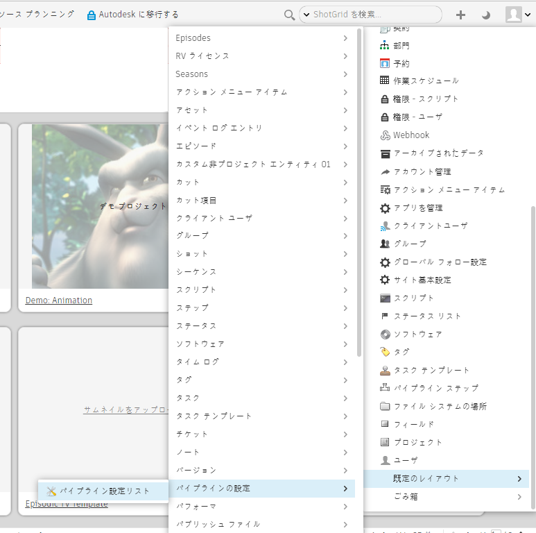
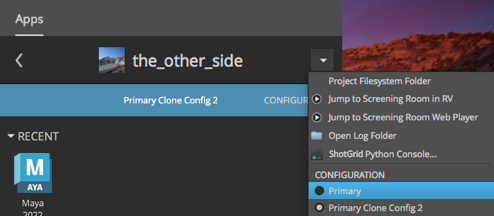
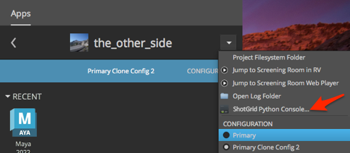

# アプリを追加する

このガイドを読み終えると、Toolkit の設定管理ツールに関する知識を短時間で得ることができます。次の内容について学習します。

* アクティブなパイプライン設定のコピーを安全に作成する
* 設定にアプリを追加する
* 特定の環境でこのアプリを使用するために必要な設定を追加する
* 変更をアクティブな設定にプッシュする

## このガイドについて

このガイドでは、既存のパイプライン設定に Shotgun Toolkit アプリを追加する方法について説明します。設定管理ツールに関する知識を短時間で得ることができます。

ここで追加するアプリは、Shotgun Python コンソール アプリです。Maya には独自の Python コンソールがありますが、Toolkit アプリには Maya コンソールにない機能がいくつか用意されています。

このガイドでは、「[パイプライン設定を編集する](./editing_app_setting.md)」ガイドで作成したパイプライン設定を利用します。 このガイドをまだ完了していない場合は、既存のパイプライン設定を使用してアプリを追加してください。

## このドキュメントの使い方

このガイドを使用して Toolkit アプリをインストールするには、以下が必要です。

1. アクティブな [Shotgun](https://www.shotgunsoftware.com/jp/signup/) サイト。
2. 指定したプロジェクトのパイプライン設定。この設定がない場合は、「[設定の基本操作](./advanced_config.md)」ガイドの手順を完了し、その演習で作成した設定を使用します。
3. パイプライン設定の保存先のファイルシステムに最適になるように設定された読み取りおよび書き込み権限。
4. システムにインストールされた Shotgun Desktop。
5. Maya の有効なサブスクリプション。Maya の 30 日間無償体験版は[こちら](https://www.autodesk.co.jp/products/maya/free-trial)から取得してください。



## Shotgun Toolkit アプリについて

### Toolkit アプリの仕組み

パイプライン設定で参照されているアプリは、さまざまな場所から取得できます。既定の設定の標準アプリは、Shotgun アプリ ストアから取得されています。パイプライン設定内のファイルを使って、Shotgun 統合からアプリにアクセスする方法を指定します。これはたとえば Toolkit に、「アドレス帳にある Python コンソール アプリのアドレスを調べることはできますか」と尋ねるようなものです。パイプライン設定ファイルは Toolkit に、特定のアプリで利用されているコードのバンドルの検索場所を指示します。

Toolkit アプリの「アドレス」は既定の設定の `config/env/includes/app_locations.yml` ファイルにリストされていて、コードの検索方法を指定します。これらの「アドレス」は[記述子](https://developer.shotgunsoftware.com/tk-core/descriptor.html)といいます。Shotgun の統合には、アプリのコード バンドルの検索方法だけでなく、アプリの使用環境も指示する必要があります。

以下に、アプリのインストール方法と、Shotgun の統合にアプリの使用場所を指示する方法について、概念を示します。また、設定を拡張し、記述子を検索するよう Toolkit に要求して、アプリの使用場所を Shotgun に指示する手順についても説明します。このガイドでは、次の手順について詳細に説明します。

1. 追加するアプリの記述子を判別します。
2. アプリの記述子の追加先となるアクティブなパイプライン設定をコピーします。
3. アプリの記述子が設定に含まれているかどうかを確認して、含まれていない場合は追加します。
4. YAML ファイルを正しくフォーマットします(インデントにはタブでなく、スペースを使用します)。
5. アプリの使用環境を判別します。
6. これらの環境内で、Shotgun にアプリの使用を許可する設定を追加します。
7. 新しい設定をテストします。
8. 拡張した設定を有効にします。

### Python コンソール アプリの場所の記述子を見つける

**手順 1:** 「[アプリとエンジンの概要](https://support.shotgunsoftware.com/hc/ja/articles/219039798#tk-maya)」ページを開いて、Maya の Shotgun Python コンソールの情報を検索します。タイトルを選択します。


こうすると、アドレス帳に必要なすべての情報を含む、[アプリの情報](https://support.shotgunsoftware.com/hc/ja/articles/219033108)が表示されます。


**システム名**は主要な識別子です(`tk-multi-pythonconsole`)。**最新バージョン**も必要です( v1.1.2)。

### Maya のプロジェクト環境内に Python コンソール アプリが含まれていないことを確認する

**手順 2:** Maya を起動し、Shotgun メニューを選択して(**[Shotgun] > [プロジェクト the_other_side]（Project the_other_side）**)、プロジェクト環境内にある、このプロジェクトで使用可能なアプリのリストを表示します。


## 設定を拡張する

プロダクションで使用している設定を編集するには、まずコピーを作成してから、そのコピーを編集します。この方法で編集すると、有効な設定に影響を与えることなく、テストのための安全なスペースを確保してから、設定を有効にすることができます。ステージング サンドボックスを作成すると、現在プロダクションで使用しているパイプライン設定のコピーを使用して再生できます。サンドボックス内で設定のコピーを変更し、変更内容をテストしてから、変更をプロダクションにプッシュして有効にします。

パイプライン設定のクローンを作成すると、コピーを作成し、コピーを使用して再生できるサンドボックスを構築してから、新しい設定を有効なプロダクションにプッシュするプロセスが自動化されます。

## アプリを追加するパイプライン設定のクローンを作成する

### [パイプラインの設定]（Pipeline Configuration）リストに移動します。

**手順 3**: Shotgun を開き、右上にある**[管理者]（Admin）メニュー（アバター） > [既定のレイアウト]（Default Layouts） > [パイプラインの設定]（Pipeline Configuration） > [パイプライン設定リスト]（Pipeline Configuration List）**を選択します。



この操作を行うと、Shotgun サイトのすべてのパイプライン設定の詳細なリストが表示されます。

**手順 4:** [パイプライン設定リスト]（Pipeline Configuration List）が表示されたら、列見出しの右端にある**[+]**記号を選択して、**[プロジェクト]（Projects）**列を追加します。


### プロジェクトの設定の配置場所を確認する

**手順 5:** オペレーティング システムに該当する**[パス]（Path）**フィールドを追加します。


設定ファイルのパスが表示されます。


**手順 6:** **[プライマリ]（Primary）**行項目の横にある空のスペース内で**右クリック**して、コンテキスト メニューから**[この設定のクローンを作成...]（Clone this Configuration…）**を選択します。


**手順 7:** [パイプライン設定リスト]（Pipeline Configuration List）内の設定およびディレクトリ内のファイルに、それぞれ「Primary Clone Config 2」および「the_other_side_clone2」という名前を付けます。**[OK]**をクリックします。


Shotgun によって設定内のすべてのファイルおよびフォルダがコピーされ、アプリのキャッシュが作成されるまで待ちます。この時間を利用して、エスプレッソの完璧なショットと一緒に、軽く、ふわっとした、口の中でとろけるクロワッサンを作成するアプリを使用しましょう。


完了すると、クローンが作成された設定の情報を使用して[パイプライン設定リスト]が更新され、ローカルな config フォルダに新しい設定が追加されます。



## クローン作成された設定にプロジェクトを関連付ける

**手順 8:** Shotgun Desktop を開いて、クローン作成した設定を作成する対象となったプロジェクトを選択します。右上にある**下矢印**を選択して、このプロジェクトに関連付けられた設定を表示し、直前に作成した**[Primary Clone Config 2]**を選択します。


これで、Shotgun Desktop がこのプロジェクトでクローン作成した設定を使用するようになりました。

## パイプライン設定を編集する

**手順 9:** クローン作成した設定を、ファイルシステム上の、この設定を作成するときに指定したパス内で検索します。`config/env/includes/app_locations.yml` ファイルを表示します。


`app_locations.yml` ファイルは既定の設定のアドレス帳です。このファイルには、アプリの記述子がリストされています。このファイルはアプリの配置場所を示しているため、ユーザはこのファイルを基にアプリの設定を作成することができます。

使用するアプリがアドレス帳で参照されていない場合は、Toolkit に検索場所を指示する必要があります。

## Toolkit にアプリの検索場所を指示する

**手順 10:** ファイル内で `pythonconsole` を検索します。プロジェクトで既定の設定を使用した場合は、Python コンソール アプリの記述子がこのファイル内にリストされます。この記述子は、作業開始時に調べた Maya アプリの[リスト](https://support.shotgunsoftware.com/hc/ja/articles/219039798-Integrations-Apps-and-Engines)内にある記述子と一致する必要があります。アプリのバージョンが、Maya アプリのリスト内にあったバージョンと一致することを確認します。

```yaml
apps.tk-multi-pythonconsole.location:
	type: app_store
	name: tk-multi-pythonconsole
	version: v1.1.2

```



すべてのアプリおよびエンジンに記述子があります。記述子の仕組みと `type:` の設定方法の詳細については、[Core API ドキュメントの記述子に関するセクション](https://developer.shotgunsoftware.com/tk-core/descriptor.html#descriptor-types)を参照してください。

## Toolkit に記述子を使用するよう指示する

Maya のプロジェクト環境内で作業している場合は、記述子を使用して Python コンソール アプリを特定し、このアプリを使用するよう Toolkit に指示する必要があります。

**手順 11:** クローン作成した設定内にある `config/env/project.yml` ファイルを開き、`tk-maya` エンジンの設定を検索します。

```yaml
# configuration for all engines to load in a project context

engines:
  tk-3dsmaxplus: "@settings.tk-3dsmaxplus.project"
  tk-desktop: "@settings.tk-desktop.project"
  tk-flame: "@settings.tk-flame.project"
  tk-hiero: "@settings.tk-nuke.hiero.project"
  tk-houdini: "@settings.tk-houdini.project"
  tk-mari: "@settings.tk-mari.project"
  tk-maya: "@settings.tk-maya.project"
  tk-motionbuilder: "@settings.tk-motionbuilder.project"
  tk-nuke: "@settings.tk-nuke.project"
  tk-nukestudio: "@settings.tk-nuke.nukestudio.project"
  tk-photoshopcc: "@settings.tk-photoshopcc.project"
  tk-shell: "@settings.tk-shell.project"
  tk-shotgun: "@settings.tk-shotgun.project"

```

`@settings` を使用する `tk-maya: “@settings.tk-maya.project”` 行は、設定がインクルードされたファイルに含まれていることを示します。`tk-maya` は Maya エンジンを識別し、`project` は環境を識別します。

### YAML ファイル

Shotgun Toolkit パイプライン設定は [YAML](https://yaml.org/spec/1.2/spec.html) ファイル内で単純な用語を使用して、アプリやエンジンの場所、およびこれらの設定を識別します。

この特定のブロックの各要素は、次のとおりです。

* `settings` は、既定の設定で、設定フォルダの参照として選択された内容を表します。
* `project` は、既定の設定で、プロジェクト環境の参照として選択された内容を表します。
* `tk-maya` は、Maya 用の Toolkit エンジンの識別子です。
* `@` は、設定値がインクルードされたファイルから取得されたことを示すために使用される Toolkit 用語です。

YAML ファイルは Shotgun の統合の窓口であり、パイプラインの要求を満たす作業環境を簡単に設定できるようにします。

### 設定における Toolkit バンドルの参照方法

Shotgun の統合のコードは、アプリ、エンジン、およびフレームワークのバンドルに整理されています。これらのバンドルは、`tk-maya`、`tk-multi-pythonconsole` のような記述子を使用して、Toolkit の YAML ファイル内で参照されています。YAML の各バンドルに対応するブロックには、識別されたバンドルへのアクセス方法や利用方法をコントロールする設定が含まれています。

## Python コンソールの設定の配置場所

既定の設定のこの特定のブロックに含まれている「tk-maya.project」は、プロジェクト環境内の Maya エンジンの識別子です。ここで目標とするのは、Python コンソール アプリのコード バンドルをプロジェクト環境内の Maya エンジンに追加することです。使用された用語を基に判断すると、`tk-maya.yml` が、プロジェクト環境の設定が配置されている YAML ファイルの名前であることは確実です。`tk-maya.yml` ファイル内の `settings.tk-maya.project`で `apps` を検索します。

**手順 13:** ファイルを検索するには、includes セクションの engines の上で `tk-maya.yml` を探します。

`./includes/settings/tk-maya.yml`

**手順 14:** クローン作成した設定内の `config/env/includes/settings/tk-maya.yml` をテキスト エディタで開き、`settings.tk-maya.project` を検索します。


**手順 15:** 次の行の下に場所の記述子を追加します。

```yaml
settings.tk-maya.project:
  apps:
```

`about` アプリの `tk-multi-about:` をガイドとして使用して、場所の記述子を追加し、ファイルを保存します。



```yaml
# project
settings.tk-maya.project:
  apps:
    tk-multi-about:
      location: "@apps.tk-multi-about.location"
    tk-multi-pythonconsole:
      location: "@apps.tk-multi-pythonconsole.location"
    tk-multi-screeningroom: "@settings.tk-multi-screeningroom.rv"
    tk-multi-shotgunpanel: "@settings.tk-multi-shotgunpanel"
    tk-multi-workfiles2: "@settings.tk-multi-workfiles2.launch_at_startup"
```

**Screening Room、Shotgun Panel、および Workfiles2** アプリの場所識別子は別のインクルードされたファイルにリストされていて、**About** アプリとアクセス方法が異なります。これらのアプリには追加設定があるため、情報整理しておくために、これらのアプリはインクルードされた設定フォルダに分割して配置されています。



## Maya で変更内容を表示する

**手順 16:** Shotgun Desktop を開いて、作業しているプロジェクトを選択し、クローン作成された設定を使用していることを確認します。

青いバーが表示され、プロジェクトの名前の下に、作成したクローンの名前が示されます。




**手順 17:** Desktop から Maya を起動して、メニュー **[Shotgun] > [プロジェクト]（Project） > […]**を選択します。

次の場合:

* 直前に編集した、クローン作成した設定を使用している場合
* クローン作成した設定が正しく拡張された場合
* 拡張したファイルを保存した場合
* プロジェクトにクローン作成した設定を関連付けるよう選択した場合
* Shotgun Desktop から Maya を再起動した場合

Maya で Python コンソール アプリを使用できるようになります。


## プロダクションに変更をプッシュする

Python コンソール アプリが正しく追加されたことを確認したら、変更を有効にすることができます。

**手順 18:** 端末を開いて、クローン作成した設定の保存場所を参照します。クローン作成した設定のルート フォルダから、次のコマンドを実行します。

Linux または Mac の場合:

`./tank push_configuration`

Windows の場合:

`tank.bat push_configuration`

プロンプトに従って、プロジェクトのプライマリ設定(変更のプッシュ先の設定)の ID を入力します。

```

$ ls
cache		config		install		tank		tank.bat
$ ./tank push_configuration

Welcome to the Shotgun Pipeline Toolkit!
For documentation, see https://support.shotgunsoftware.com
Starting Toolkit for your current path
'/Users/michelle/Documents/Shotgun/configs/the_other_side_clone2'
- The path is not associated with any Shotgun object.
- Falling back on default project settings.
- Running as user 'Michelle'
- Using configuration 'Primary Clone Config 2' and Core v0.18.159
- Setting the Context to Project the_other_side.
- Running command push_configuration...


----------------------------------------------------------------------
Command: Push configuration
----------------------------------------------------------------------

This command will push the configuration in the current pipeline configuration
('Primary Clone Config 2') to another pipeline configuration in the project.
By default, the data will be copied to the target config folder. If pass a
--symlink parameter, it will create a symlink instead.

Your existing configuration will be backed up.

The following pipeline configurations are available to push to:
 - [1] Primary (/Users/michelle/Documents/Shotgun/configs/the_other_side)

Please type in the id of the configuration to push to (ENTER to exit):

```

クローン作成した設定のプッシュ先に指定できるパイプライン設定のリストが表示されます。設定を更新しているプロジェクトのプライマリ パイプライン設定の ID を入力します。




ID を入力した後、Shotgun は以下の処理を行います。

* プライマリ設定をバックアップする
* クローン作成した設定をコピーする
* クローンされた設定のコピーにプロジェクトを関連付けて、クローンをそのまま残す
* プライマリ設定の保存場所を表示する
* ダウンロードしてキャッシュに入れなければならないアプリがあるかどうかを確認する

```
Please type in the id of the configuration to push to (ENTER to exit): 1
Hold on, pushing config…
Your old configuration has been backed up into the following folder:
/Users/michelle/Documents/Shotgun/configs/the_other_side/config.bak.20190118_111627
Checking if there are any apps that need downloading…

Push Complete!
```

## プライマリ設定で行った変更を表示する

**手順 19:** Shotgun Desktop の右上にある矢印をクリックして、**[CONFIGURATION]**リスト内の**[Primary]**を選択します。



**手順 20:** Desktop から Maya を起動して、メニュー**[Shotgun] > [プロジェクト]（Project） > […]**を参照して、Shotgun Python コンソールを検索します。


Python コンソール アプリが、選択されたプロジェクトのプロジェクト環境に追加されました。2 番目のガイドの「[設定を編集する](./editing_app_setting.md)」で、各環境は独立していて、プロジェクトには専用の設定があること、およびプロジェクトをロードするときに、ソフトウェアの統合によってパイプライン設定から設定が収集されることを説明しました。Python コンソールを環境内で使用できるように設定するには、`app_locations.yml` ファイル内で場所の記述子を参照するようこの環境に指示する必要があります。この場合、Python コンソール アプリを使用可能にするパイプラインの任意のポイントで、「Python コンソール アプリをここで使用する」ように設定する必要があります。

## 高度なトピック

### Shotgun 開発者のコミュニティ

Toolkit の素晴らしい点の 1 つに、Toolkit アプリを誰でも作成できることがあります。また、アプリの所有権を維持したり、[Shotgun コミュニティ](https://support.shotgunsoftware.com/hc/ja/articles/219039828)内でアプリを共有して Shotgun ツールに追加したりできます。非常に便利なアプリを作成したため、Shotgun コミュニティ ページで共有したい場合は、[support@shotgunsoftware.com](mailto:support@shotgunsoftware.com) にメールでお問い合わせください。

標準的な Toolkit アプリや、愛情のこもった Shotgun コミュニティで作成されたアプリについては、**[shotgun-dev Google グループ](https://groups.google.com/a/shotgunsoftware.com/forum/?fromgroups&hl=ja#!forum/shotgun-dev)**で活発に議論されています。Shotgun コミュニティの貢献度が高まるにつれて、知識やツールの基盤も拡大しています。

### 設定の拡張方法を調べる

プロジェクトで使用する設定を選択するときにおわかりになったように、Python コンソール アプリは Shotgun Desktop のドロップダウンから使用できます。



パイプラインに追加するアプリを使用している環境がある場合は、少し推理を働かせて、このアプリを設定に追加するのに必要な情報を見つけることができます。アプリが使用されている環境内の設定ファイルを調べると、アプリの場所の記述子および設定の追加方法がわかります。

Desktop アプリはプロジェクト環境内で開くため、`project.yml` ファイル内で `tk-desktop` を検索します。

`config/env/project.yml` を開きます。

{% include info title="注" content='engine ブロック内の `tk-desktop` は、インクルードされた内容を指します。

```yaml
includes:
  - ./includes/settings/tk-desktop.yml

engines:
  tk-desktop: "@settings.tk-desktop.project"
```

インクルードの内容に従って、`config/env/includes/settings/tk-desktop.yml` を開き、`settings.tk-desktop.project` ブロックを検索します。このブロック内に、次の行が含まれています。<br/><br/>

```yaml
apps:
  tk-multi-pythonconsole:
  location: "@apps.tk-multi-pythonconsole.location"
```

これらのブロックに従い、プロジェクトの手順中に Python コンソール アプリが Desktop エンジンに追加されます。

インクルードの内容に沿って `../includes/app_locations.yml` に進み、`apps.tk-multi-pythonconsole.location` を検索します。次のようになっています。<br/><br/>

```yaml
# pythonconsole
apps.tk-multi-pythonconsole.location:
  type: app_store
  name: tk-multi-pythonconsole
  version: v1.1.2
```' %}

すべてのアプリ、エンジン、およびフレームワークに、特定のバンドルのアクセス場所を Toolkit に指示するための場所の記述子が設定されています。多くのアプリ記述子が `app_locations.yml` ファイルに含まれていますが、Python コンソール アプリで確認したように、これらの記述子が必要な場所で参照されていない可能性があります。すべての標準アプリおよびエンジンは、「[アプリとエンジンの概要](https://support.shotgunsoftware.com/hc/ja/articles/219039798-Integrations-Apps-and-Engines)」ページにリストされています。

任意のアプリを Shotgun でサポートされている適切なソフトウェア統合に追加したり、独自のアプリケーションを Toolkit ツールに追加したりできます。サポートされているすべてのソフトウェア アプリケーションは、統合の「[アプリとエンジンの概要](https://support.shotgunsoftware.com/hc/ja/articles/219039798-Integrations-Apps-and-Engines)」ページにもリストされています。

探しているアプリが見つからない場合は、自分で作成できます。これを機会に、他の Shotgun ユーザにこの機能の必要性が広まる可能性があります。また、新しいアプリを共有することで、Shotgun コミュニティに恩返しができます。

次のガイドでは、[会社の構成方法に合わせて制作用フォルダの構成をカスタマイズする方法について学習します](./dynamic_filesystem_configuration.md)。


